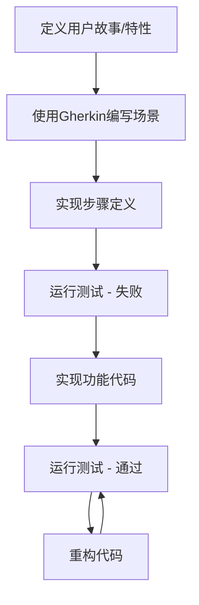

# JavaScript BDD行为驱动开发

## 什么是行为驱动开发(BDD)?

行为驱动开发(Behavior Driven Development, BDD)是一种敏捷软件开发技术，它鼓励开发者、QA和非技术人员或业务参与者之间的协作。BDD关注的是系统的行为而非实现细节，它使用自然语言描述应用程序的行为和期望的结果。

:::note
BDD是TDD(测试驱动开发)的扩展，但更加注重行为描述而非测试用例。
:::

BDD的核心理念是：

1. 从用户故事(User Story)出发，确定系统应有的行为
2. 使用通用语言描述这些行为，确保所有相关人员都能理解
3. 按照行为编写自动化测试
4. 实现功能代码以满足这些行为要求

## BDD的基本结构

BDD测试通常遵循"Given-When-Then"的结构:

- **Given**(给定): 设置测试的初始环境或前提条件
- **When**(当): 描述触发的动作或事件
- **Then**(那么): 验证预期的输出或结果

## JavaScript 中的BDD框架

在JavaScript中，最流行的BDD测试框架包括:

1. **Mocha** - 灵活的JavaScript测试框架
2. **Jasmine** - 完整的BDD测试框架
3. **Cucumber.js** - 支持使用Gherkin语言编写测试
4. **Jest** - Facebook出品的框架，支持BDD风格测试

## 使用Mocha和Chai进行BDD测试

让我们通过一个例子来了解如何使用Mocha(测试框架)和Chai(断言库)进行BDD风格的测试。

### 安装必要的依赖

```bash
npm install mocha chai --save-dev
```

### 创建待测试的功能

假设我们要开发一个简单的计算器模块:

```javascript
// calculator.js
class Calculator {
  add(a, b) {
    return a + b;
  }
  
  subtract(a, b) {
    return a - b;
  }
  
  multiply(a, b) {
    return a * b;
  }
  
  divide(a, b) {
    if (b === 0) {
      throw new Error('Cannot divide by zero');
    }
    return a / b;
  }
}

module.exports = Calculator;
```

### 编写BDD风格的测试

```javascript
// calculator.test.js
const { expect } = require('chai');
const Calculator = require('./calculator');

describe('Calculator', function() {
  // 在每个测试前创建计算器实例
  let calculator;
  
  beforeEach(function() {
    calculator = new Calculator();
  });
  
  describe('add method', function() {
    it('should add two positive numbers correctly', function() {
      // Given: 两个正数
      const a = 5;
      const b = 3;
      
      // When: 调用add方法
      const result = calculator.add(a, b);
      
      // Then: 结果应该是8
      expect(result).to.equal(8);
    });
    
    it('should handle negative numbers correctly', function() {
      expect(calculator.add(5, -3)).to.equal(2);
      expect(calculator.add(-5, -3)).to.equal(-8);
    });
  });
  
  describe('divide method', function() {
    it('should divide two numbers correctly', function() {
      expect(calculator.divide(10, 2)).to.equal(5);
    });
    
    it('should throw an error when dividing by zero', function() {
      expect(() => calculator.divide(5, 0)).to.throw('Cannot divide by zero');
    });
  });
});
```

### 运行测试

在package.json文件中添加测试脚本:

```json
{
  "scripts": {
    "test": "mocha *.test.js"
  }
}
```

然后运行测试:

```bash
npm test
```

输出结果类似:

```
  Calculator
    add method
      ✓ should add two positive numbers correctly
      ✓ should handle negative numbers correctly
    divide method
      ✓ should divide two numbers correctly
      ✓ should throw an error when dividing by zero

  4 passing (10ms)
```

## 使用Cucumber.js进行BDD测试

Cucumber允许我们使用Gherkin语法编写规范，更加接近自然语言描述。

### 安装依赖

```bash
npm install cucumber --save-dev
```

### 定义功能规范

创建一个`features/calculator.feature`文件:

```gherkin
Feature: Calculator
  As a math enthusiast
  I want to use a calculator
  So that I can perform basic arithmetic operations

  Scenario: Adding two numbers
    Given I have a calculator
    When I add 5 and 3
    Then the result should be 8

  Scenario: Dividing two numbers
    Given I have a calculator
    When I divide 10 by 2
    Then the result should be 5

  Scenario: Dividing by zero
    Given I have a calculator
    When I try to divide 5 by 0
    Then it should throw an error "Cannot divide by zero"
```

### 实现步骤定义

创建`features/step_definitions/calculator_steps.js`:

```javascript
const { Given, When, Then } = require('cucumber');
const { expect } = require('chai');
const Calculator = require('../../calculator');

let calculator;
let result;
let errorMessage;

Given('I have a calculator', function() {
  calculator = new Calculator();
});

When('I add {int} and {int}', function(a, b) {
  result = calculator.add(a, b);
});

When('I divide {int} by {int}', function(a, b) {
  result = calculator.divide(a, b);
});

When('I try to divide {int} by {int}', function(a, b) {
  try {
    calculator.divide(a, b);
  } catch (error) {
    errorMessage = error.message;
  }
});

Then('the result should be {int}', function(expected) {
  expect(result).to.equal(expected);
});

Then('it should throw an error {string}', function(expected) {
  expect(errorMessage).to.equal(expected);
});
```

### 运行Cucumber测试

在package.json文件中添加测试脚本:

```json
{
  "scripts": {
    "test:cucumber": "cucumber-js"
  }
}
```

然后运行:

```bash
npm run test:cucumber
```

## BDD的最佳实践

1. **关注行为而非实现** - 测试应该描述"做什么"而不是"怎么做"

2. **使用清晰的描述性语言** - 每个测试都应该清晰描述预期的行为

3. **保持测试独立** - 每个测试应该能够独立运行，不依赖其他测试的状态

4. **测试覆盖正常和异常情况** - 不仅测试正常流程，也要测试边界情况和异常情况

5. **使用钩子管理测试环境** - 使用`beforeEach`和`afterEach`等钩子函数设置和清理测试环境

## 实际案例：开发购物车功能

让我们通过一个实际的案例来展示BDD在前端开发中的应用。我们将开发一个简单的购物车功能。

### 需求描述

```gherkin
Feature: Shopping Cart
  As a shopper
  I want to be able to manage items in my cart
  So that I can purchase what I need

  Scenario: Adding item to an empty cart
    Given my cart is empty
    When I add a product with id "123", name "Laptop", and price 999.99
    Then my cart should contain 1 item
    And the total price should be 999.99

  Scenario: Adding multiple items to cart
    Given my cart is empty
    When I add a product with id "123", name "Laptop", and price 999.99
    And I add a product with id "456", name "Mouse", and price 19.99
    Then my cart should contain 2 items
    And the total price should be 1019.98

  Scenario: Removing item from cart
    Given my cart contains products:
      | id  | name    | price  |
      | 123 | Laptop  | 999.99 |
      | 456 | Mouse   | 19.99  |
    When I remove the product with id "123"
    Then my cart should contain 1 item
    And the total price should be 19.99
```

### 实现购物车模块

```javascript
// cart.js
class ShoppingCart {
  constructor() {
    this.items = [];
  }

  addItem(product) {
    this.items.push({
      id: product.id,
      name: product.name,
      price: product.price
    });
  }

  removeItem(productId) {
    const index = this.items.findIndex(item => item.id === productId);
    if (index !== -1) {
      this.items.splice(index, 1);
    }
  }

  getItemCount() {
    return this.items.length;
  }

  getTotalPrice() {
    return this.items.reduce((total, item) => total + item.price, 0);
  }
}

module.exports = ShoppingCart;
```

### 使用Mocha和Chai编写测试

```javascript
// cart.test.js
const { expect } = require('chai');
const ShoppingCart = require('./cart');

describe('Shopping Cart', function() {
  let cart;
  
  beforeEach(function() {
    cart = new ShoppingCart();
  });
  
  describe('when adding items', function() {
    it('should add an item to an empty cart', function() {
      // Given: an empty cart
      // When: adding a product
      cart.addItem({
        id: '123',
        name: 'Laptop',
        price: 999.99
      });
      
      // Then: cart should contain 1 item with correct total
      expect(cart.getItemCount()).to.equal(1);
      expect(cart.getTotalPrice()).to.equal(999.99);
    });
    
    it('should add multiple items to the cart', function() {
      // When: adding multiple products
      cart.addItem({
        id: '123',
        name: 'Laptop',
        price: 999.99
      });
      
      cart.addItem({
        id: '456',
        name: 'Mouse',
        price: 19.99
      });
      
      // Then: cart should contain 2 items with correct total
      expect(cart.getItemCount()).to.equal(2);
      expect(cart.getTotalPrice()).to.be.closeTo(1019.98, 0.001);
    });
  });
  
  describe('when removing items', function() {
    beforeEach(function() {
      // Given: a cart with products
      cart.addItem({
        id: '123',
        name: 'Laptop',
        price: 999.99
      });
      
      cart.addItem({
        id: '456',
        name: 'Mouse',
        price: 19.99
      });
    });
    
    it('should remove an item from the cart', function() {
      // When: removing a product
      cart.removeItem('123');
      
      // Then: cart should have 1 item with correct total
      expect(cart.getItemCount()).to.equal(1);
      expect(cart.getTotalPrice()).to.equal(19.99);
    });
  });
});
```

## BDD与前端框架整合

在现代前端开发中，BDD可以与流行的框架如React、Vue或Angular结合使用。例如与React结合:

### 安装测试工具

```bash
npm install jest @testing-library/react @testing-library/jest-dom --save-dev
```

### 创建一个简单的React组件

```jsx
// Counter.jsx
import React, { useState } from 'react';

function Counter() {
  const [count, setCount] = useState(0);
  
  return (
    <div>
      <h1>计数器: {count}</h1>
      <button onClick={() => setCount(count + 1)}>增加</button>
      <button onClick={() => setCount(count - 1)}>减少</button>
    </div>
  );
}

export default Counter;
```

### 使用BDD风格测试React组件

```jsx
// Counter.test.jsx
import React from 'react';
import { render, screen, fireEvent } from '@testing-library/react';
import '@testing-library/jest-dom';
import Counter from './Counter';

describe('Counter Component', () => {
  // Given: 组件被渲染
  beforeEach(() => {
    render(<Counter />);
  });

  it('should display initial count of 0', () => {
    // Then: 初始计数应该为0
    expect(screen.getByText('计数器: 0')).toBeInTheDocument();
  });

  it('should increment the count when increase button is clicked', () => {
    // When: 点击增加按钮
    fireEvent.click(screen.getByText('增加'));
    
    // Then: 计数应该变为1
    expect(screen.getByText('计数器: 1')).toBeInTheDocument();
  });

  it('should decrement the count when decrease button is clicked', () => {
    // When: 点击减少按钮
    fireEvent.click(screen.getByText('减少'));
    
    // Then: 计数应该变为-1
    expect(screen.getByText('计数器: -1')).toBeInTheDocument();
  });
});
```

## BDD工作流程图

以下是BDD工作流程的可视化表示:



## 总结

行为驱动开发(BDD)是一种有效的开发方法，它通过自然语言描述系统行为，促进团队各角色间的沟通。在JavaScript中，我们可以使用多种框架如Mocha、Jasmine、Cucumber等来实施BDD测试。

BDD的核心在于:
- 从用户行为和需求出发
- 使用通用语言描述系统行为
- 先编写测试，再实现功能
- 关注"做什么"而非"怎么做"

通过本文介绍的实例，你应该能够开始在JavaScript项目中应用BDD方法，提高代码质量和开发效率。

## 练习与资源

### 练习

1. 为之前实现的计算器添加更多功能(如平方根、取模等)并编写相应的BDD测试。
2. 创建一个简单的用户认证模块，使用BDD方法测试登录、注册和密码重置功能。
3. 选择一个你正在使用的前端框架，为一个表单组件编写BDD风格的测试。

### 扩展资源

- [Mocha官方文档](https://mochajs.org/)
- [Chai断言库文档](https://www.chaijs.com/)
- [Cucumber.js指南](https://cucumber.io/docs/guides/)
- [Jest测试框架](https://jestjs.io/docs/getting-started)
- 《BDD in Action》- John Ferguson Smart著
- [测试驱动开发与行为驱动开发实践](https://martinfowler.com/articles/practical-test-pyramid.html)

通过持续练习和深入学习，你将能够熟练应用BDD方法，提高代码质量并增强团队协作效率。