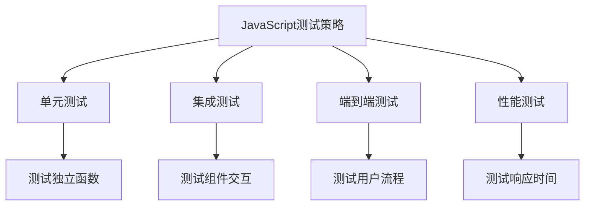

# JavaScript 测试最佳实践

---
title: JavaScript 测试最佳实践
description: 学习JavaScript测试的基础知识、框架选择和实施策略，掌握编写有效测试的最佳实践，提高代码质量和可靠性。
---

## 测试的重要性

在软件开发过程中，测试是确保代码质量和功能正确性的关键环节。对于JavaScript开发来说，良好的测试实践不仅能够捕获错误，还能促进更清晰、更模块化的代码设计。随着项目规模的扩大，测试的重要性会变得更加明显。

:::tip
良好的测试不仅能防止bug，还能增强你重构代码的信心！
:::

## JavaScript 测试的类型

了解不同类型的测试有助于我们构建全面的测试策略：

1. **单元测试** - 测试独立的代码单元（通常是函数）
2. **集成测试** - 测试多个单元如何协同工作
3. **端到端测试** - 测试整个应用程序流程
4. **性能测试** - 测试应用程序的响应时间和稳定性



## 常用的测试框架和工具

在开始测试之前，你需要选择适合的测试工具：

### 单元测试框架

- **Jest** - 由Facebook开发，配置简单，功能全面
- **Mocha** - 灵活的测试框架，需要与其他库配合使用
- **Jasmine** - 包含断言和模拟功能的独立测试框架

### 端到端测试工具

- **Cypress** - 现代化的端到端测试工具
- **Puppeteer** - 由Google开发的Node库，用于控制Chrome
- **Selenium** - 跨浏览器自动化测试工具

## 编写第一个单元测试

让我们从编写一个简单的单元测试开始，我们将使用Jest作为测试框架：

首先，假设我们有一个用于求和的简单函数：

```javascript
// math.js
function sum(a, b) {
  return a + b;
}

module.exports = { sum };
```

现在，我们为这个函数编写测试：

```javascript
// math.test.js
const { sum } = require('./math');

test('adds 1 + 2 to equal 3', () => {
  expect(sum(1, 2)).toBe(3);
});

test('adds -1 + 1 to equal 0', () => {
  expect(sum(-1, 1)).toBe(0);
});
```

运行测试后，你应该会看到如下输出：

```
PASS  ./math.test.js
  ✓ adds 1 + 2 to equal 3
  ✓ adds -1 + 1 to equal 0

Test Suites: 1 passed, 1 total
Tests:       2 passed, 2 total
```

## 测试最佳实践

### 1. 测试应该是独立且可重复的

每个测试应该能够独立运行，不依赖于其他测试或外部状态。

```javascript
// 不好的做法
let counter = 0;

test('incrementCounter increments the counter', () => {
  incrementCounter();
  expect(counter).toBe(1);
});

test('incrementCounter increments the counter again', () => {
  expect(counter).toBe(2); // 依赖于上一个测试的状态
});

// 好的做法
test('incrementCounter increments the counter', () => {
  const localCounter = 0;
  const newCounter = incrementCounter(localCounter);
  expect(newCounter).toBe(1);
});

test('incrementCounter increments any number', () => {
  const localCounter = 5;
  const newCounter = incrementCounter(localCounter);
  expect(newCounter).toBe(6);
});
```

### 2. 测试应该关注行为，而不是实现细节

```javascript
// 不好的做法
test('fetchUserData calls the API and processes the data', () => {
  const apiCallSpy = jest.spyOn(api, 'call');
  fetchUserData(123);
  expect(apiCallSpy).toHaveBeenCalledWith('/users/123');
  // 这个测试关注了太多实现细节
});

// 好的做法
test('fetchUserData returns user information', async () => {
  const userData = await fetchUserData(123);
  expect(userData).toHaveProperty('name');
  expect(userData).toHaveProperty('email');
  // 这个测试关注最终结果
});
```

### 3. 使用模拟(Mock)隔离外部依赖

当测试依赖外部服务（如API调用、数据库）时，使用模拟可以使测试更快、更可靠：

```javascript
test('getUserData fetches and returns user data', async () => {
  // 模拟fetch函数
  global.fetch = jest.fn(() =>
    Promise.resolve({
      json: () => Promise.resolve({ id: 1, name: 'John Doe' })
    })
  );

  const userData = await getUserData(1);
  expect(userData.name).toBe('John Doe');
  expect(global.fetch).toHaveBeenCalledWith('/api/users/1');
});
```

### 4. 测试边界情况和错误处理

良好的测试应该包括正常情况、边界情况和错误处理：

```javascript
// 测试函数：divideNumbers(a, b)
test('divides two numbers correctly', () => {
  expect(divideNumbers(10, 2)).toBe(5);
});

test('handles division by zero', () => {
  expect(() => divideNumbers(10, 0)).toThrow('Cannot divide by zero');
});

test('works with negative numbers', () => {
  expect(divideNumbers(-10, 2)).toBe(-5);
});
```

### 5. 组织测试以提高可读性

使用`describe`和`test`/`it`块组织测试，使其结构清晰：

```javascript
describe('Calculator', () => {
  describe('add method', () => {
    test('adds two positive numbers', () => {
      expect(calculator.add(1, 2)).toBe(3);
    });
    
    test('adds a positive and a negative number', () => {
      expect(calculator.add(5, -3)).toBe(2);
    });
  });
  
  describe('subtract method', () => {
    test('subtracts two positive numbers', () => {
      expect(calculator.subtract(5, 2)).toBe(3);
    });
    
    test('subtracts when the result is negative', () => {
      expect(calculator.subtract(2, 5)).toBe(-3);
    });
  });
});
```

## 实际案例：测试购物车功能

让我们通过一个实际的购物车功能来演示测试实践。

```javascript
// cart.js
class ShoppingCart {
  constructor() {
    this.items = [];
  }
  
  addItem(item) {
    const existingItem = this.items.find(i => i.id === item.id);
    
    if (existingItem) {
      existingItem.quantity += 1;
    } else {
      this.items.push({...item, quantity: 1});
    }
  }
  
  removeItem(itemId) {
    const index = this.items.findIndex(item => item.id === itemId);
    if (index !== -1) {
      this.items.splice(index, 1);
      return true;
    }
    return false;
  }
  
  getTotal() {
    return this.items.reduce((total, item) => {
      return total + (item.price * item.quantity);
    }, 0);
  }
}

module.exports = ShoppingCart;
```

现在，我们为这个购物车类编写测试：

```javascript
// cart.test.js
const ShoppingCart = require('./cart');

describe('ShoppingCart', () => {
  let cart;
  
  // 在每个测试前创建一个新的购物车实例
  beforeEach(() => {
    cart = new ShoppingCart();
  });
  
  describe('addItem', () => {
    test('adds a new item to the cart', () => {
      const item = { id: 1, name: 'Test Product', price: 10 };
      cart.addItem(item);
      
      expect(cart.items.length).toBe(1);
      expect(cart.items[0]).toEqual({...item, quantity: 1});
    });
    
    test('increments quantity when adding an existing item', () => {
      const item = { id: 1, name: 'Test Product', price: 10 };
      cart.addItem(item);
      cart.addItem(item);
      
      expect(cart.items.length).toBe(1);
      expect(cart.items[0].quantity).toBe(2);
    });
  });
  
  describe('removeItem', () => {
    test('removes an item from the cart', () => {
      const item = { id: 1, name: 'Test Product', price: 10 };
      cart.addItem(item);
      
      const result = cart.removeItem(1);
      
      expect(result).toBe(true);
      expect(cart.items.length).toBe(0);
    });
    
    test('returns false when trying to remove a non-existent item', () => {
      const result = cart.removeItem(999);
      
      expect(result).toBe(false);
    });
  });
  
  describe('getTotal', () => {
    test('calculates the total cost of items in the cart', () => {
      cart.addItem({ id: 1, name: 'Product 1', price: 10 });
      cart.addItem({ id: 2, name: 'Product 2', price: 15 });
      cart.addItem({ id: 1, name: 'Product 1', price: 10 }); // Add product 1 again
      
      // Product 1: $10 x 2 = $20
      // Product 2: $15 x 1 = $15
      // Total: $35
      expect(cart.getTotal()).toBe(35);
    });
    
    test('returns 0 for an empty cart', () => {
      expect(cart.getTotal()).toBe(0);
    });
  });
});
```

## 持续集成中的测试

随着项目规模的增长，将测试集成到持续集成(CI)流程中是一个好习惯：

1. **自动化测试流程** - 使用GitHub Actions、Jenkins等CI工具自动运行测试
2. **测试覆盖率报告** - 使用工具如Istanbul/nyc监控测试覆盖率
3. **定期运行测试** - 不仅在提交代码时，还应定期运行测试以确保持续质量

:::caution
测试覆盖率不等于测试质量。100%的覆盖率并不能保证没有bug，重要的是测试的相关性和全面性。
:::

## 总结与最佳实践

- **从简单开始** - 不必一开始就追求完美的测试覆盖率
- **测试驱动开发(TDD)** - 考虑先编写测试，再实现功能
- **关注关键功能** - 优先测试业务核心逻辑和容易出错的部分
- **避免测试实现细节** - 测试应该专注于函数/组件的行为
- **保持测试代码的质量** - 测试代码也是代码，同样需要维护
- **使用快照测试谨慎** - 快照测试容易更新但可能掩盖问题

## 练习与进一步学习

### 练习

1. 为一个简单的字符串处理函数编写测试（如：检查回文字符串）
2. 使用Jest的Mock功能模拟API调用
3. 为一个包含多个方法的类编写完整的测试套件

### 资源

- Jest官方文档：[https://jestjs.io/docs/getting-started](https://jestjs.io/docs/getting-started)
- Cypress官方文档：[https://docs.cypress.io](https://docs.cypress.io)
- 《JavaScript测试实战》（推荐书籍）
- TestingJavaScript.com（Kent C. Dodds的课程）

记住，测试是一项需要不断实践的技能。开始时可能感觉费时，但随着项目的增长，良好的测试实践将帮助你节省大量的调试时间，并提高代码质量。

祝你测试愉快！