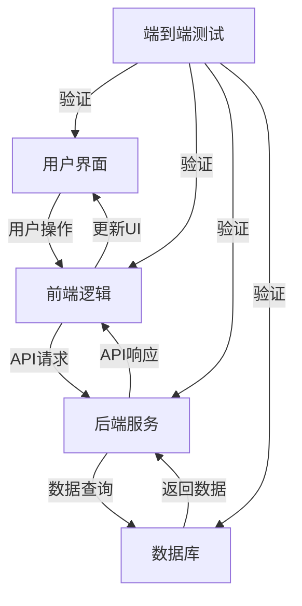

# JavaScript 端到端测试

## 什么是端到端测试？

端到端测试（End-to-End Testing，简称E2E测试）是一种测试方法，它验证应用程序从头到尾的整个流程是否按预期工作。在JavaScript应用中，端到端测试模拟真实用户行为，从用户界面开始，经过所有中间层，直到后端数据存储，然后再返回到用户界面。

:::note
端到端测试与单元测试和集成测试不同。单元测试关注单个函数或组件，集成测试关注几个组件之间的交互，而端到端测试则关注整个应用程序的工作流程。
:::



## 为什么需要端到端测试？

端到端测试在现代web开发中越来越重要，主要因为：

1. **模拟真实用户行为** - 验证用户实际使用的功能
2. **检测集成问题** - 发现各系统组件协同工作时的问题
3. **提高应用质量** - 确保关键业务流程正常运行
4. **减少生产环境bug** - 及早发现并修复问题

## 常用的JavaScript端到端测试工具

JavaScript生态系统中有多种端到端测试工具可供选择：

### 1. Cypress

Cypress是目前最流行的JavaScript端到端测试工具之一，它提供了简单的API和实时重载功能。

#### 安装Cypress

```bash
npm install cypress --save-dev
```

#### 基本Cypress测试示例

```javascript
describe('登录功能测试', () => {
  it('用户能成功登录', () => {
    // 访问登录页面
    cy.visit('/login');
    
    // 填写表单
    cy.get('input[name="username"]').type('testuser');
    cy.get('input[name="password"]').type('password123');
    
    // 点击登录按钮
    cy.get('button[type="submit"]').click();
    
    // 验证登录成功
    cy.url().should('include', '/dashboard');
    cy.contains('Welcome, testuser').should('be.visible');
  });
});
```

### 2. Playwright

Playwright是由Microsoft开发的更新的端到端测试工具，支持多种浏览器。

#### 安装Playwright

```bash
npm install @playwright/test --save-dev
npx playwright install
```

#### Playwright测试示例

```javascript
const { test, expect } = require('@playwright/test');

test('用户能成功登录', async ({ page }) => {
  // 访问登录页面
  await page.goto('/login');
  
  // 填写表单
  await page.fill('input[name="username"]', 'testuser');
  await page.fill('input[name="password"]', 'password123');
  
  // 点击登录按钮
  await page.click('button[type="submit"]');
  
  // 验证登录成功
  await expect(page).toHaveURL(/.*dashboard/);
  await expect(page.locator('text=Welcome, testuser')).toBeVisible();
});
```

### 3. Selenium WebDriver

Selenium是历史悠久的自动化测试工具，可以与JavaScript一起使用。

#### 安装Selenium

```bash
npm install selenium-webdriver --save-dev
```

#### Selenium测试示例

```javascript
const { Builder, By, until } = require('selenium-webdriver');

(async function loginTest() {
  let driver = await new Builder().forBrowser('chrome').build();
  try {
    // 访问登录页面
    await driver.get('http://localhost:3000/login');
    
    // 填写表单
    await driver.findElement(By.name('username')).sendKeys('testuser');
    await driver.findElement(By.name('password')).sendKeys('password123');
    
    // 点击登录按钮
    await driver.findElement(By.css('button[type="submit"]')).click();
    
    // 等待并验证登录成功
    await driver.wait(until.urlContains('dashboard'), 5000);
    let welcomeText = await driver.findElement(By.css('body')).getText();
    console.log(welcomeText.includes('Welcome, testuser') ? '测试通过!' : '测试失败!');
  } finally {
    await driver.quit();
  }
})();
```

## 端到端测试的最佳实践

要编写有效的端到端测试，请遵循这些最佳实践：

### 1. 测试关键用户流程

专注于测试用户经常使用的重要流程，如：
- 用户注册和登录
- 购物车和结账流程
- 搜索功能
- 表单提交

### 2. 保持测试独立性

每个测试应该是独立的，且不依赖于其他测试的执行结果。

```javascript
// 不好的做法 - 测试之间相互依赖
it('用户登录', () => { /* 登录测试 */ });
it('用户创建项目', () => { /* 依赖于已登录状态 */ });

// 好的做法 - 每个测试都是独立的
it('用户登录', () => { /* 登录测试 */ });
it('登录用户可以创建项目', () => {
  // 在这个测试中先登录，再测试创建项目
  // 登录步骤...
  // 创建项目步骤...
});
```

### 3. 使用页面对象模式

将页面元素和操作封装到可复用的"页面对象"中，使测试更易于维护。

```javascript
// 登录页面对象
class LoginPage {
  constructor() {
    this.usernameInput = 'input[name="username"]';
    this.passwordInput = 'input[name="password"]';
    this.loginButton = 'button[type="submit"]';
  }
  
  async visit() {
    await cy.visit('/login');
  }
  
  async login(username, password) {
    await cy.get(this.usernameInput).type(username);
    await cy.get(this.passwordInput).type(password);
    await cy.get(this.loginButton).click();
  }
}

// 使用页面对象
it('用户能成功登录', () => {
  const loginPage = new LoginPage();
  loginPage.visit();
  loginPage.login('testuser', 'password123');
  cy.url().should('include', '/dashboard');
});
```

### 4. 处理异步操作

端到端测试通常涉及异步操作，合理处理异步是确保测试稳定性的关键。

```javascript
// Cypress自动处理大多数异步操作
cy.get('button').click();
cy.contains('Success').should('be.visible');

// Playwright中处理异步
await page.click('button');
await expect(page.locator('text=Success')).toBeVisible();

// 处理不确定的等待时间
// Cypress
cy.get('.loading-indicator', { timeout: 10000 }).should('not.exist');
cy.get('.content').should('be.visible');

// Playwright
await page.waitForSelector('.loading-indicator', { state: 'hidden', timeout: 10000 });
await expect(page.locator('.content')).toBeVisible();
```

### 5. 准备和清理测试数据

在测试前准备所需的数据环境，测试后清理测试数据。

```javascript
describe('用户管理测试', () => {
  beforeEach(() => {
    // 准备测试数据
    cy.task('db:seed', { users: [{ username: 'testuser', password: 'password123' }] });
  });
  
  afterEach(() => {
    // 清理测试数据
    cy.task('db:clean', { collections: ['users'] });
  });
  
  it('管理员可以查看用户列表', () => {
    // 测试代码
  });
});
```

## 实际案例：电子商务网站端到端测试

让我们通过一个实际的案例来了解如何为电子商务网站编写端到端测试。这个测试将验证用户是否可以浏览商品、添加商品到购物车并完成结账流程。

### 使用Cypress实现电商网站测试

```javascript
describe('电子商务网站购物流程', () => {
  beforeEach(() => {
    // 访问首页
    cy.visit('/');
    
    // 确保数据库中有测试产品
    cy.task('db:seed', {
      products: [
        { id: 1, name: '测试商品1', price: 19.99 },
        { id: 2, name: '测试商品2', price: 29.99 }
      ]
    });
    
    // 登录测试账户
    cy.get('.login-link').click();
    cy.get('input[name="email"]').type('test@example.com');
    cy.get('input[name="password"]').type('password123');
    cy.get('button[type="submit"]').click();
    cy.contains('Welcome back').should('be.visible');
  });
  
  it('用户可以将商品添加到购物车并结账', () => {
    // 浏览商品列表
    cy.get('.product-card').should('have.length.at.least', 2);
    
    // 将第一个商品添加到购物车
    cy.get('.product-card').first().within(() => {
      cy.contains('测试商品1').should('be.visible');
      cy.get('.add-to-cart').click();
    });
    
    // 验证购物车更新
    cy.get('.cart-count').should('contain', '1');
    
    // 查看购物车
    cy.get('.cart-icon').click();
    cy.contains('购物车').should('be.visible');
    cy.contains('测试商品1').should('be.visible');
    cy.contains('19.99').should('be.visible');
    
    // 进入结账流程
    cy.contains('结账').click();
    
    // 填写配送信息
    cy.get('input[name="address"]').type('测试街道123号');
    cy.get('input[name="city"]').type('测试城市');
    cy.get('input[name="zip"]').type('123456');
    cy.contains('下一步').click();
    
    // 选择支付方式
    cy.get('#credit-card').check();
    cy.get('input[name="cardNumber"]').type('4111111111111111');
    cy.get('input[name="cardExpiry"]').type('12/25');
    cy.get('input[name="cardCvc"]').type('123');
    cy.contains('确认支付').click();
    
    // 验证订单确认
    cy.contains('订单确认').should('be.visible');
    cy.contains('感谢您的购买').should('be.visible');
    cy.contains('订单号:').should('be.visible');
    
    // 验证购物车已清空
    cy.get('.cart-count').should('contain', '0');
  });
});
```

## 端到端测试的挑战与解决方案

端到端测试虽然功能强大，但也面临一些常见挑战：

### 1. 测试速度慢

**解决方案**：
- 仅对关键业务流程进行端到端测试
- 使用测试数据预设，避免重复操作
- 在CI/CD管道中并行运行测试

### 2. 测试不稳定(Flaky Tests)

**解决方案**：
- 使用可靠的选择器（如数据属性）而非CSS类或位置
- 添加适当的等待和断言条件
- 实现重试机制

```javascript
// 使用数据属性作为选择器
cy.get('[data-test-id="login-button"]').click();

// 使用稳健的等待策略
cy.get('.results', { timeout: 10000 }).should('be.visible');
```

### 3. 测试环境管理

**解决方案**：
- 使用Docker容器化测试环境
- 使用测试数据库，避免影响生产数据
- 使用模拟服务(Mock Services)替代外部依赖

```javascript
// 使用测试前置钩子设置测试环境
before(() => {
  // 启动测试服务器
  cy.task('startServer');
  
  // 初始化测试数据库
  cy.task('resetDatabase');
  
  // 模拟外部API
  cy.intercept('GET', '/api/external-service', { fixture: 'externalData.json' });
});
```

## 总结

端到端测试是验证JavaScript应用整体功能的重要方法。通过模拟用户行为，我们可以确保应用各个部分协同工作，提供预期的用户体验。

本文我们学习了：
- 端到端测试的基本概念和重要性
- 主流JavaScript端到端测试工具（Cypress, Playwright, Selenium）的使用
- 编写有效端到端测试的最佳实践
- 实际电子商务网站的端到端测试案例
- 解决端到端测试中常见挑战的方法

记住，尽管端到端测试非常有价值，但它应该是更广泛测试策略的一部分，与单元测试和集成测试一起使用，确保应用的全面质量。

## 练习

1. 安装Cypress或Playwright，并为一个简单的登录页面编写端到端测试。
2. 对一个TODO应用编写端到端测试，测试添加、完成和删除任务的功能。
3. 尝试使用页面对象模式重构你的测试代码。
4. 实现一个包含异步操作的测试，如加载更多内容或等待API响应。
5. 编写一个针对表单验证的端到端测试，测试各种错误情况和成功提交。

## 额外资源

- [Cypress官方文档](https://docs.cypress.io)
- [Playwright官方文档](https://playwright.dev/docs/intro)
- [端到端测试最佳实践指南](https://testingjavascript.com)
- [测试金字塔概念](https://martinfowler.com/articles/practical-test-pyramid.html)

通过端到端测试，你可以确保你的JavaScript应用不仅仅是单个组件工作良好，而是整个系统能够协同工作，为用户提供流畅的体验。