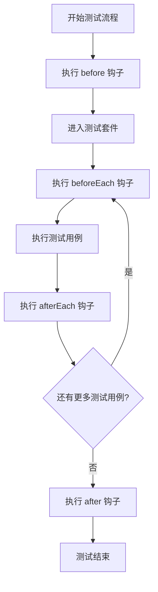

# JavaScript Mocha框架

## 什么是Mocha？

Mocha是一个功能丰富的JavaScript测试框架，运行在Node.js和浏览器环境中，使异步测试变得简单而有趣。作为一个灵活的测试框架，Mocha允许开发者使用任何断言库，并且提供了清晰、准确的测试报告。

:::tip
Mocha的名字来源于摩卡咖啡（Mocha coffee），这也是为什么其logo是一个咖啡杯！
:::

## 为什么要使用Mocha？

- **灵活性**：可以与任何断言库配合使用
- **可读性**：测试输出清晰易读
- **异步支持**：优雅地处理异步测试
- **丰富的报告**：提供多种格式的测试报告
- **社区支持**：广泛的社区支持和文档

## 安装Mocha

要开始使用Mocha，你需要先安装它。在已有的Node.js项目中，使用npm安装：

```bash
npm install mocha --save-dev
```

或者使用yarn：

```bash
yarn add mocha --dev
```

## Mocha基础

### 创建第一个测试

在项目根目录下创建一个`test`文件夹，并在其中创建一个测试文件，例如`test.js`：

```javascript
// test/test.js
const assert = require('assert');

describe('基础测试', function() {
  it('应该返回2当1+1时', function() {
    assert.equal(1 + 1, 2);
  });
});
```

### 运行测试

在`package.json`文件中添加测试脚本：

```json
{
  "scripts": {
    "test": "mocha"
  }
}
```

然后运行：

```bash
npm test
```

你将看到类似以下输出：

```
基础测试
  ✓ 应该返回2当1+1时

1 passing (5ms)
```

## Mocha的测试结构

### describe 和 it

- **describe**：描述一组相关测试的块（测试套件）
- **it**：描述单个测试用例

```javascript
describe('计算器函数', function() {
  describe('加法功能', function() {
    it('应该能正确相加两个正数', function() {
      assert.equal(1 + 1, 2);
    });
    
    it('应该能处理负数', function() {
      assert.equal(1 + (-1), 0);
    });
  });
  
  describe('减法功能', function() {
    it('应该能正确相减两个数', function() {
      assert.equal(5 - 2, 3);
    });
  });
});
```

### 钩子函数

Mocha提供了几个钩子函数，用于设置测试环境：

- **before**：在所有测试之前运行一次
- **after**：在所有测试之后运行一次
- **beforeEach**：在每个测试之前运行
- **afterEach**：在每个测试之后运行

```javascript
describe('测试钩子', function() {
  before(function() {
    console.log('在所有测试之前运行一次');
  });

  beforeEach(function() {
    console.log('在每个测试之前运行');
  });

  afterEach(function() {
    console.log('在每个测试之后运行');
  });

  after(function() {
    console.log('在所有测试之后运行一次');
  });

  it('测试1', function() {
    assert.equal(1, 1);
  });

  it('测试2', function() {
    assert.equal(2, 2);
  });
});
```

## 异步测试

Mocha支持多种异步测试方法：

### 使用回调

```javascript
describe('异步测试 - 回调', function() {
  it('应该在1秒后完成', function(done) {
    setTimeout(function() {
      assert.equal(1, 1);
      done(); // 调用done表示测试完成
    }, 1000);
  });
});
```

### 使用Promise

```javascript
describe('异步测试 - Promise', function() {
  it('应该等待Promise解决', function() {
    return new Promise(function(resolve) {
      setTimeout(function() {
        assert.equal(1, 1);
        resolve();
      }, 1000);
    });
  });
});
```

### 使用async/await

```javascript
describe('异步测试 - async/await', function() {
  it('应该等待异步函数完成', async function() {
    const result = await new Promise(function(resolve) {
      setTimeout(function() {
        resolve(1 + 1);
      }, 1000);
    });
    assert.equal(result, 2);
  });
});
```

## 使用断言库

Mocha本身不包含断言功能，而是允许你使用任何断言库。以下是几个常用选择：

### Node.js内置assert模块

```javascript
const assert = require('assert');

describe('使用Node.js断言', function() {
  it('应该相等', function() {
    assert.equal(1 + 1, 2);
  });
  
  it('应该深度相等', function() {
    assert.deepEqual({ a: 1 }, { a: 1 });
  });
});
```

### Chai断言库

首先安装Chai：

```bash
npm install chai --save-dev
```

然后在测试中使用：

```javascript
const { expect } = require('chai');

describe('使用Chai断言', function() {
  it('应该相等', function() {
    expect(1 + 1).to.equal(2);
  });
  
  it('应该包含特定属性', function() {
    expect({ name: 'mocha', type: 'test' }).to.have.property('name').equal('mocha');
  });
  
  it('应该检查数组包含项', function() {
    expect([1, 2, 3]).to.include(2);
  });
});
```

## 实际案例：测试一个计算器模块

假设我们有一个简单的计算器模块：

```javascript
// calculator.js
function add(a, b) {
  return a + b;
}

function subtract(a, b) {
  return a - b;
}

function multiply(a, b) {
  return a * b;
}

function divide(a, b) {
  if (b === 0) {
    throw new Error('不能除以零');
  }
  return a / b;
}

module.exports = {
  add,
  subtract,
  multiply,
  divide
};
```

现在，我们来为这个计算器模块编写测试：

```javascript
// test/calculator.test.js
const { expect } = require('chai');
const calculator = require('../calculator');

describe('计算器模块', function() {
  describe('加法功能', function() {
    it('应该正确相加两个正数', function() {
      expect(calculator.add(2, 3)).to.equal(5);
    });
    
    it('应该处理负数', function() {
      expect(calculator.add(2, -3)).to.equal(-1);
    });
    
    it('应该处理小数', function() {
      expect(calculator.add(0.1, 0.2)).to.be.closeTo(0.3, 0.0001);
    });
  });
  
  describe('减法功能', function() {
    it('应该正确相减两个数', function() {
      expect(calculator.subtract(5, 2)).to.equal(3);
    });
  });
  
  describe('乘法功能', function() {
    it('应该正确相乘两个数', function() {
      expect(calculator.multiply(2, 3)).to.equal(6);
    });
    
    it('与0相乘应该等于0', function() {
      expect(calculator.multiply(5, 0)).to.equal(0);
    });
  });
  
  describe('除法功能', function() {
    it('应该正确相除两个数', function() {
      expect(calculator.divide(6, 2)).to.equal(3);
    });
    
    it('除以0应该抛出错误', function() {
      expect(() => calculator.divide(5, 0)).to.throw('不能除以零');
    });
  });
});
```

## 测试覆盖率

要查看测试覆盖率，可以使用Istanbul（nyc）工具：

```bash
npm install nyc --save-dev
```

更新`package.json`：

```json
{
  "scripts": {
    "test": "mocha",
    "coverage": "nyc mocha"
  }
}
```

运行覆盖率测试：

```bash
npm run coverage
```

这将显示代码的测试覆盖率报告，包括行覆盖率、函数覆盖率、分支覆盖率等。

## Mocha配置选项

你可以在项目根目录创建一个`.mocharc.js`或`.mocharc.json`文件来配置Mocha：

```javascript
// .mocharc.js
module.exports = {
  timeout: 5000,         // 测试超时时间（毫秒）
  ui: 'bdd',             // 界面风格
  reporter: 'spec',      // 报告格式
  recursive: true,       // 递归搜索测试文件
  'watch-files': ['src/**/*.js', 'test/**/*.js'], // 监视文件变化
  'watch-ignore': ['node_modules']  // 忽略监视的目录
};
```

:::caution
配置文件需要放在项目根目录下，否则Mocha可能无法识别。
:::

## 常见测试模式

### 测试异常

```javascript
it('应该抛出错误当参数无效时', function() {
  expect(() => {
    // 一些应该抛出错误的代码
    throw new Error('无效参数');
  }).to.throw('无效参数');
});
```

### 跳过测试

```javascript
describe('功能模块', function() {
  it('应该通过这个测试', function() {
    // ...
  });
  
  it.skip('暂时跳过这个测试', function() {
    // 这个测试将被跳过
  });
  
  // 或者
  it('另一个跳过的测试', function() {
    this.skip(); // 在测试内部跳过
    // ...
  });
});
```

### 只运行特定测试

```javascript
describe('功能模块', function() {
  it.only('只运行这个测试', function() {
    // 只有这个测试会运行
  });
  
  it('这个测试不会运行', function() {
    // ...
  });
});
```

## 测试运行的生命周期图表

以下是Mocha测试执行的生命周期图表：



## 总结

Mocha是一个强大而灵活的JavaScript测试框架，适用于Node.js和浏览器环境。通过本教程，我们学习了：

- Mocha的基本概念和安装方法
- 如何编写基本测试及使用测试套件组织测试
- 异步测试的多种方法
- 钩子函数的使用
- 如何与断言库配合使用
- 实际项目中的测试案例
- 测试覆盖率和配置选项

掌握Mocha测试框架是提高代码质量和可维护性的重要步骤，也是前端开发必备技能之一。

## 学习资源和练习

### 练习任务

1. 创建一个简单的字符串处理库（包括反转字符串、计算字符数等功能），并为其编写完整的Mocha测试。
2. 为一个异步API调用函数编写测试，使用不同的异步测试方法（回调、Promise、async/await）。
3. 尝试使用不同的断言库（assert、chai、expect.js）重写同一个测试套件，比较它们的差异。

### 额外资源

- [Mocha官方文档](https://mochajs.org/)
- [Chai断言库文档](https://www.chaijs.com/)
- [测试驱动开发(TDD)介绍](https://www.agilealliance.org/glossary/tdd/)

通过实践和深入学习，你将能够编写高质量的测试，确保你的JavaScript代码稳定可靠。