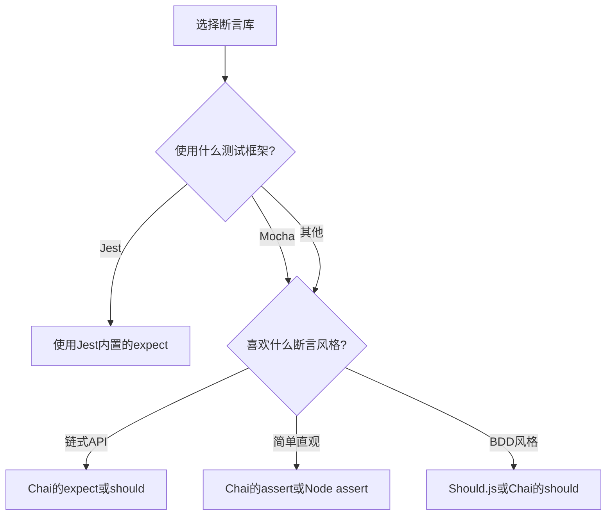

# JavaScript 断言库

## 什么是断言库？

在JavaScript测试中，断言库是一组工具函数，用于验证代码的行为是否符合预期。断言（Assertion）本质上是一种表达式，用来检查代码在运行时的状态是否符合测试的预期结果。当断言失败时，通常会抛出异常，并显示相应的错误信息，帮助开发者快速定位问题。

:::note 断言的基本思想
断言的核心理念是：**验证预期结果与实际结果是否一致**。如果不一致，测试失败；如果一致，测试通过。
:::

## 常用JavaScript断言库

JavaScript生态系统中有多种断言库，以下是几个最流行的：

1. **Node.js内置 Assert**：Node.js环境自带的断言模块
2. **Chai**：表达性强、支持多种风格的断言库
3. **Jest Expect**：Jest测试框架内置的断言API
4. **Should.js**：提供BDD风格语法的断言库
5. **Unexpected**：可扩展的断言库

## Node.js内置 Assert

Node.js提供了内置的`assert`模块，它是最基础的断言库。

```javascript
const assert = require('assert');

// 基本断言
assert.strictEqual(1, 1); // 通过
assert.strictEqual(1, '1'); // 失败，类型不同

// 深度相等检查
assert.deepStrictEqual({ a: 1 }, { a: 1 }); // 通过
assert.deepStrictEqual({ a: 1 }, { a: '1' }); // 失败

// 异常检查
assert.throws(() => {
  throw new Error('错误信息');
}, /错误信息/); // 通过，错误信息匹配正则表达式
```

### 优缺点

**优点**：
- 无需额外安装，Node.js自带
- 简单直接的API

**缺点**：
- 错误信息不够直观
- API相对有限
- 不适合浏览器环境

## Chai断言库

Chai是最流行的JavaScript断言库之一，它提供了三种不同的断言风格：

1. **Should**风格
2. **Expect**风格
3. **Assert**风格

### 安装Chai

```bash
npm install chai --save-dev
```

### Expect风格示例

```javascript
const { expect } = require('chai');

// 基本断言
expect(1).to.equal(1);
expect('hello').to.be.a('string');
expect([1, 2, 3]).to.have.lengthOf(3);

// 链式调用
expect({ foo: 'bar' }).to.be.an('object').that.has.property('foo').equal('bar');

// 异步测试
return Promise.resolve(42).then((value) => {
  expect(value).to.equal(42);
});
```

### Should风格示例

```javascript
const should = require('chai').should();

// 基本断言
(1).should.equal(1);
'hello'.should.be.a('string');
[1, 2, 3].should.have.lengthOf(3);

// 链式调用
({ foo: 'bar' }).should.be.an('object').that.has.property('foo').equal('bar');
```

### Assert风格示例

```javascript
const { assert } = require('chai');

// 基本断言
assert.equal(1, 1, '数字相等');
assert.typeOf('hello', 'string', '应该是字符串类型');
assert.lengthOf([1, 2, 3], 3, '数组长度应为3');

// 对象断言
assert.propertyVal({ foo: 'bar' }, 'foo', 'bar', '属性值应为bar');
```

## Jest Expect

如果你使用Jest测试框架，它内置了强大的`expect`断言API。

```javascript
// 基本断言
expect(1 + 1).toBe(2);
expect('hello').toHaveLength(5);

// 对象匹配
expect({ name: 'John', age: 30 }).toEqual({ name: 'John', age: 30 });
expect({ name: 'John', age: 30 }).toMatchObject({ name: 'John' });

// 数组断言
expect([1, 2, 3]).toContain(2);
expect([{ a: 1 }, { b: 2 }]).toContainEqual({ a: 1 });

// 异步测试
return expect(Promise.resolve('value')).resolves.toBe('value');
```

Jest的断言API还支持快照测试、模拟函数（mock）测试等高级功能。

## 断言库的实际应用场景

### 场景一：单元测试

```javascript
// 测试一个简单的加法函数
function add(a, b) {
  return a + b;
}

const { expect } = require('chai');

describe('加法函数测试', () => {
  it('应该正确计算两个正数', () => {
    expect(add(2, 3)).to.equal(5);
  });

  it('应该正确处理负数', () => {
    expect(add(-1, -2)).to.equal(-3);
    expect(add(-1, 5)).to.equal(4);
  });

  it('应该正确处理小数', () => {
    expect(add(0.1, 0.2)).to.be.closeTo(0.3, 0.0001); // 处理浮点数精度问题
  });
});
```

### 场景二：API测试

```javascript
// 使用chai和axios进行API测试
const axios = require('axios');
const { expect } = require('chai');

describe('用户API测试', async () => {
  it('应该返回用户列表', async () => {
    const response = await axios.get('https://api.example.com/users');
    
    expect(response.status).to.equal(200);
    expect(response.data).to.be.an('array');
    expect(response.data[0]).to.have.property('id');
    expect(response.data[0]).to.have.property('name');
  });
  
  it('创建用户应该正常工作', async () => {
    const newUser = { name: 'John', email: 'john@example.com' };
    const response = await axios.post('https://api.example.com/users', newUser);
    
    expect(response.status).to.equal(201);
    expect(response.data).to.include(newUser);
    expect(response.data).to.have.property('id');
  });
});
```

### 场景三：组件测试（React + Jest）

```javascript
import React from 'react';
import { render, screen } from '@testing-library/react';
import UserProfile from './UserProfile';

test('用户资料组件应该正确渲染用户信息', () => {
  const user = { name: 'Alice', email: 'alice@example.com' };
  
  render(<UserProfile user={user} />);
  
  expect(screen.getByText('Alice')).toBeInTheDocument();
  expect(screen.getByText('alice@example.com')).toBeInTheDocument();
});
```

## 断言库选择指南

如何选择适合你项目的断言库？考虑以下几点：



### 选择建议：

1. **如果使用Jest**：直接使用其内置的`expect`
2. **如果使用Mocha**：搭配Chai使用
3. **如果喜欢更语义化的断言**：选择Chai的`expect`或`should`风格
4. **如果追求简单**：使用Node.js的内置`assert`
5. **如果项目很大或特殊**：考虑可扩展性更强的断言库

## 断言库的最佳实践

1. **保持断言具体且聚焦**：每个测试应该只验证一个行为
2. **提供有意义的错误信息**：多数断言函数支持自定义错误消息
3. **避免测试实现细节**：关注函数行为而非实现方式
4. **使用适当的匹配器**：使用专门的匹配器如`approximately`、`closeTo`来处理浮点数
5. **组织良好的测试套件**：将相关测试组织在一起

## 总结

断言库是JavaScript测试不可或缺的工具，它们提供了验证代码行为的机制。选择适合你的项目和团队偏好的断言库，可以显著提高测试效率和代码可靠性。初学者可以从Node.js的内置assert或Chai的expect风格开始，逐渐熟悉各种断言概念和技巧。

:::tip 学习提示
不要只停留在了解断言API上，重要的是理解断言背后的测试理念：验证预期与实际是否匹配。
:::

## 练习

1. 使用Node.js内置assert模块编写测试，验证一个字符串反转函数的正确性
2. 使用Chai的expect风格测试一个简单的购物车计算总价的函数
3. 如果你使用Jest，尝试编写测试来验证一个异步函数的行为
4. 创建自己的小项目，编写至少5个不同种类的断言来测试项目功能

## 附加资源

- [Chai官方文档](https://www.chaijs.com/)
- [Jest断言文档](https://jestjs.io/docs/expect)
- [Node.js Assert模块文档](https://nodejs.org/api/assert.html)
- [JavaScript测试最佳实践](https://github.com/goldbergyoni/javascript-testing-best-practices)

掌握断言库的使用将帮助你编写更可靠的测试，为你的JavaScript应用保驾护航！