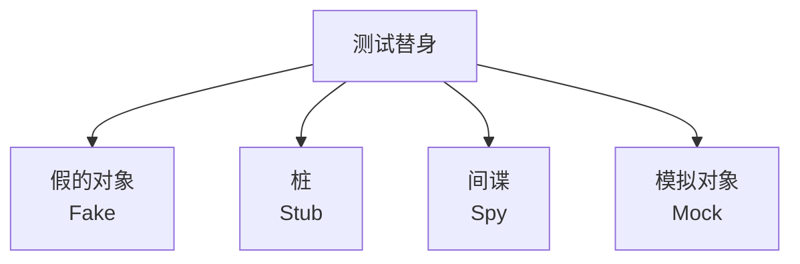

# JavaScript 测试替身

在软件测试中，我们经常需要对代码进行隔离测试。然而，有时我们的代码依赖于一些难以在测试环境中使用的组件，比如数据库、网络请求或者第三方服务。这时，测试替身（Test Doubles）就派上用场了。

## 什么是测试替身？

测试替身是在测试过程中，用来替代真实依赖的对象。它们可以帮助我们：

- 加速测试执行（无需等待真实API响应）
- 避免不确定性（如网络问题）
- 模拟难以触发的场景（如服务器错误）
- 验证代码与依赖之间的交互

:::tip
测试替身的概念类似于电影中的特技替身，代替主角完成特定动作，但不需要具备主角的所有能力。
:::

## 常见的测试替身类型

JavaScript测试中常用的测试替身主要有四种：



让我们逐一了解这些测试替身：

### 1. 假的对象（Fake）

假的对象是对真实对象的轻量级实现，有自己的业务逻辑，但通常采用更简单的方式实现。

**示例：内存数据库替代真实数据库**

```javascript
// 真实的用户数据库类
class UserDatabase {
  async findUserById(id) {
    // 实际实现会连接数据库
    return await db.query(`SELECT * FROM users WHERE id=${id}`);
  }
}

// 假的用户数据库类（用于测试）
class FakeUserDatabase {
  constructor() {
    this.users = [
      { id: 1, name: "Alice", email: "alice@example.com" },
      { id: 2, name: "Bob", email: "bob@example.com" }
    ];
  }

  async findUserById(id) {
    // 使用内存数据模拟数据库查询
    const user = this.users.find(user => user.id === id);
    return Promise.resolve(user);
  }
}

// 在测试中使用
const userDb = new FakeUserDatabase();
const result = await userDb.findUserById(1);
console.log(result); // { id: 1, name: "Alice", email: "alice@example.com" }
```

### 2. 桩（Stub）

桩是预编程的替身，返回预定义的响应，不包含业务逻辑。桩主要用于控制被测代码的间接输入。

**示例：模拟API调用返回固定数据**

```javascript
// 需要测试的函数
async function getUserInfo(api, userId) {
  const user = await api.fetchUser(userId);
  return `${user.name} (${user.email})`;
}

// 测试代码
describe('getUserInfo', () => {
  it('should format user info correctly', async () => {
    // 创建API桩
    const apiStub = {
      fetchUser: async () => ({ name: "Alice", email: "alice@example.com" })
    };
    
    const result = await getUserInfo(apiStub, 123);
    expect(result).toBe("Alice (alice@example.com)");
  });
});
```

### 3. 间谍（Spy）

间谍不仅可以像桩一样返回预定义的值，还可以记录函数被调用的方式、次数和传递的参数。间谍可以给真实对象"装上监听器"。

**示例：监听函数调用**

```javascript
// 使用Jest进行测试
describe('购物车测试', () => {
  it('添加商品时应调用保存方法', () => {
    // 创建间谍
    const localStorage = {
      saveCart: jest.fn()
    };

    // 购物车类
    class ShoppingCart {
      constructor(storage) {
        this.storage = storage;
        this.items = [];
      }

      addItem(item) {
        this.items.push(item);
        this.storage.saveCart(this.items);
      }
    }

    const cart = new ShoppingCart(localStorage);
    cart.addItem({ id: 1, name: "书本", price: 29.99 });

    // 验证saveCart被调用
    expect(localStorage.saveCart).toHaveBeenCalledTimes(1);
    // 验证调用参数
    expect(localStorage.saveCart).toHaveBeenCalledWith([
      { id: 1, name: "书本", price: 29.99 }
    ]);
  });
});
```

### 4. 模拟对象（Mock）

模拟对象是预编程的对象，具有预期行为和校验功能。它们不仅可以返回预设的值，还可以预设期望和验证。相比间谍，模拟对象更侧重于行为验证。

**示例：模拟支付处理**

```javascript
// 使用Jest进行测试
describe('订单处理', () => {
  it('成功支付后应更新订单状态并发送确认邮件', async () => {
    // 创建模拟对象
    const paymentProcessor = {
      processPayment: jest.fn().mockResolvedValue({ success: true })
    };
    
    const orderRepository = {
      updateStatus: jest.fn()
    };
    
    const emailService = {
      sendConfirmation: jest.fn()
    };

    // 订单服务
    class OrderService {
      constructor(payment, repository, email) {
        this.payment = payment;
        this.repository = repository;
        this.email = email;
      }

      async checkout(orderId, paymentDetails) {
        const result = await this.payment.processPayment(paymentDetails);
        
        if (result.success) {
          await this.repository.updateStatus(orderId, 'PAID');
          await this.email.sendConfirmation(orderId);
          return true;
        }
        
        return false;
      }
    }

    const orderService = new OrderService(
      paymentProcessor, 
      orderRepository, 
      emailService
    );

    // 执行测试
    const result = await orderService.checkout(
      '12345', 
      { cardNumber: '4111111111111111' }
    );

    // 验证结果
    expect(result).toBe(true);
    expect(paymentProcessor.processPayment).toHaveBeenCalledWith(
      { cardNumber: '4111111111111111' }
    );
    expect(orderRepository.updateStatus).toHaveBeenCalledWith('12345', 'PAID');
    expect(emailService.sendConfirmation).toHaveBeenCalledWith('12345');
  });
});
```

## 何时使用各种测试替身？

选择合适的测试替身取决于你的测试目的：

| 测试替身类型 | 何时使用 |
|------------|---------|
| 假的对象 (Fake) | 当需要一个简化版但行为相似的实现 |
| 桩 (Stub) | 当需要控制依赖的返回值 |
| 间谍 (Spy) | 当需要验证函数调用情况但不想改变其行为 |
| 模拟对象 (Mock) | 当需要验证特定交互行为和顺序 |

## 常用测试替身库

在JavaScript中，有几个流行的库可以帮助创建测试替身：

- **Jest**：内置模拟功能，提供`jest.fn()`、`jest.mock()`等API
- **Sinon.js**：专门的模拟库，提供stub、spy和mock功能
- **testdouble.js**：另一个替代Sinon的模拟库

## 实际应用案例

### 案例一：测试依赖第三方API的天气应用

假设我们有一个天气应用需要从第三方API获取数据：

```javascript
// weatherService.js
class WeatherService {
  constructor(apiClient) {
    this.apiClient = apiClient;
  }

  async getWeatherForCity(city) {
    try {
      const response = await this.apiClient.get(`/weather?city=${city}`);
      return {
        city: response.data.city,
        temperature: response.data.temp,
        description: response.data.conditions,
        formatted: `${response.data.city}: ${response.data.temp}°C, ${response.data.conditions}`
      };
    } catch (error) {
      return { error: "无法获取天气数据" };
    }
  }
}

// 测试代码
describe('WeatherService', () => {
  it('should format weather data correctly', async () => {
    // 创建API客户端的桩
    const apiClientStub = {
      get: jest.fn().mockResolvedValue({
        data: {
          city: "北京",
          temp: 22,
          conditions: "晴朗"
        }
      })
    };

    const weatherService = new WeatherService(apiClientStub);
    const result = await weatherService.getWeatherForCity("北京");

    expect(result.formatted).toBe("北京: 22°C, 晴朗");
    expect(apiClientStub.get).toHaveBeenCalledWith("/weather?city=北京");
  });

  it('should handle API errors gracefully', async () => {
    // 创建会抛出错误的API客户端桩
    const apiClientStub = {
      get: jest.fn().mockRejectedValue(new Error("Network error"))
    };

    const weatherService = new WeatherService(apiClientStub);
    const result = await weatherService.getWeatherForCity("上海");

    expect(result).toEqual({ error: "无法获取天气数据" });
  });
});
```

### 案例二：使用间谍验证用户认证逻辑

```javascript
// 用户认证服务
class AuthService {
  constructor(userRepository, emailService) {
    this.userRepository = userRepository;
    this.emailService = emailService;
  }

  async login(username, password) {
    const user = await this.userRepository.findByUsername(username);
    
    if (!user) {
      return { success: false, message: "用户不存在" };
    }
    
    if (user.password !== password) { // 简化版，实际应使用加密
      return { success: false, message: "密码错误" };
    }
    
    await this.emailService.sendLoginAlert(user.email);
    return {
      success: true,
      user: { id: user.id, username: user.username, email: user.email }
    };
  }
}

// 测试代码
describe('AuthService', () => {
  it('should send alert email on successful login', async () => {
    // 创建存储库桩
    const userRepositoryStub = {
      findByUsername: jest.fn().mockResolvedValue({
        id: 1,
        username: "alice",
        password: "password123", // 简化版
        email: "alice@example.com"
      })
    };
    
    // 创建邮件服务间谍
    const emailServiceSpy = {
      sendLoginAlert: jest.fn().mockResolvedValue(undefined)
    };
    
    const authService = new AuthService(userRepositoryStub, emailServiceSpy);
    const result = await authService.login("alice", "password123");
    
    expect(result.success).toBe(true);
    // 验证邮件服务被正确调用
    expect(emailServiceSpy.sendLoginAlert).toHaveBeenCalledWith("alice@example.com");
  });
});
```

## 最佳实践

使用测试替身时，请遵循以下最佳实践：

1. **只替换必要的部分**：尽量减少测试替身的使用，只模拟难以测试的部分。
2. **保持接口一致**：测试替身应与真实对象有相同的接口。
3. **不要过度指定**：只验证对测试重要的方面，避免过度指定实现细节。
4. **使用依赖注入**：设计代码时使用依赖注入，使替换依赖更容易。
5. **避免模拟未拥有的代码**：尽量不要模拟不属于你的代码库的部分。

:::caution
过度使用测试替身可能导致测试与实现过度耦合，使得重构变得困难。测试应该验证行为而非实现细节。
:::

## 总结

测试替身是JavaScript测试中非常强大的工具，它们帮助我们：

- 隔离被测试代码
- 加速测试执行
- 模拟难以触发的场景
- 避免测试中的不确定性

通过合理使用假的对象(Fake)、桩(Stub)、间谍(Spy)和模拟对象(Mock)，我们可以编写更加健壮、可靠且快速的测试代码。

## 练习

1. 创建一个需要从API获取用户数据的简单组件，使用不同的测试替身对其进行测试。
2. 实现一个购物车类，该类需要与本地存储和支付服务交互，并使用测试替身测试其行为。
3. 实践使用Jest模拟计时器(jest.useFakeTimers())测试包含setTimeout或setInterval的代码。

## 额外资源

- [Jest 官方文档](https://jestjs.io/docs/mock-functions)
- [Sinon.js 文档](https://sinonjs.org/)
- [《测试驱动开发》by Kent Beck](https://book.douban.com/subject/1230036/)
- [《JavaScript 测试最佳实践》](https://github.com/goldbergyoni/javascript-testing-best-practices)

通过掌握测试替身技术，你将能够写出更健壮、更可靠的测试代码，从而提高整体代码质量！