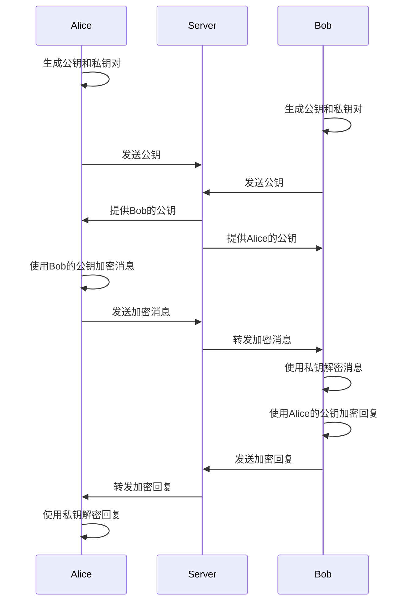

# JavaScript 密码学基础

在当今网络安全至关重要的时代，作为前端开发者，了解密码学基础知识对于构建安全的Web应用至关重要。本文将介绍JavaScript密码学的基本概念、常用API以及在实际项目中的应用。

## 什么是密码学？

密码学是研究如何安全地传输和存储数据的科学，主要包括以下核心概念：

1. **加密与解密**：将明文转换为密文，以及将密文恢复为明文的过程
2. **哈希**：将任意长度的输入转换为固定长度输出的单向函数
3. **数字签名**：验证消息完整性和来源的方法
4. **密钥管理**：安全地生成、存储和使用密钥

## JavaScript 中的密码学API

在现代浏览器中，我们可以使用Web Crypto API来执行密码学操作，这是一个强大且安全的原生API。

### Web Crypto API简介

Web Crypto API提供了低级别的密码学功能，通过`window.crypto`对象暴露出来：

```javascript
// 检查浏览器是否支持Web Crypto API
if (window.crypto && window.crypto.subtle) {
  console.log("Web Crypto API可用");
} else {
  console.log("您的浏览器不支持Web Crypto API");
}
```

:::caution
Web Crypto API只能在安全上下文（HTTPS或localhost）中使用。在不安全的HTTP环境下，`crypto.subtle`将不可用。
:::

## 常用密码学操作

### 1. 生成随机数据

生成加密安全的随机数据是许多密码学应用的基础：

```javascript
// 生成16字节的随机数据（例如用于加密密钥或初始化向量）
const randomBuffer = new Uint8Array(16);
window.crypto.getRandomValues(randomBuffer);

console.log("随机数据:", Array.from(randomBuffer).map(b => b.toString(16).padStart(2, '0')).join(''));
// 输出示例：91a3b8e24c5d6f7890123e4f5d6c7b8a
```

### 2. 哈希函数

哈希函数用于生成数据的"指纹"，广泛应用于密码存储、数据完整性验证等场景。

```javascript
async function calculateSHA256(message) {
  // 将字符串转换为ArrayBuffer
  const encoder = new TextEncoder();
  const data = encoder.encode(message);
  
  // 使用SHA-256算法计算哈希
  const hashBuffer = await window.crypto.subtle.digest('SHA-256', data);
  
  // 将ArrayBuffer转换为十六进制字符串
  const hashArray = Array.from(new Uint8Array(hashBuffer));
  const hashHex = hashArray.map(b => b.toString(16).padStart(2, '0')).join('');
  
  return hashHex;
}

// 使用示例
calculateSHA256('Hello, World!').then(hash => {
  console.log('SHA-256哈希结果:', hash);
  // 输出：dffd6021bb2bd5b0af676290809ec3a53191dd81c7f70a4b28688a362182986f
});
```

### 3. 对称加密

对称加密使用相同的密钥进行加密和解密，适用于需要高性能的场景。

```javascript
async function encryptAES(plaintext, password) {
  // 从密码生成密钥
  const encoder = new TextEncoder();
  const passwordData = encoder.encode(password);
  const salt = crypto.getRandomValues(new Uint8Array(16));
  
  // 使用PBKDF2派生密钥
  const keyMaterial = await window.crypto.subtle.importKey(
    'raw',
    passwordData,
    { name: 'PBKDF2' },
    false,
    ['deriveBits', 'deriveKey']
  );
  
  const key = await window.crypto.subtle.deriveKey(
    {
      name: 'PBKDF2',
      salt,
      iterations: 100000,
      hash: 'SHA-256'
    },
    keyMaterial,
    { name: 'AES-GCM', length: 256 },
    false,
    ['encrypt', 'decrypt']
  );
  
  // 加密数据
  const iv = crypto.getRandomValues(new Uint8Array(12));
  const data = encoder.encode(plaintext);
  
  const encryptedContent = await window.crypto.subtle.encrypt(
    {
      name: 'AES-GCM',
      iv
    },
    key,
    data
  );
  
  // 将所有内容组合成一个结果
  const result = new Uint8Array(salt.length + iv.length + encryptedContent.byteLength);
  result.set(salt, 0);
  result.set(iv, salt.length);
  result.set(new Uint8Array(encryptedContent), salt.length + iv.length);
  
  return btoa(String.fromCharCode.apply(null, result));
}

async function decryptAES(encryptedData, password) {
  // 解码Base64
  const binaryString = atob(encryptedData);
  const bytes = new Uint8Array(binaryString.length);
  for (let i = 0; i < binaryString.length; i++) {
    bytes[i] = binaryString.charCodeAt(i);
  }
  
  // 提取salt、iv和加密内容
  const salt = bytes.slice(0, 16);
  const iv = bytes.slice(16, 28);
  const encryptedContent = bytes.slice(28);
  
  // 从密码生成密钥
  const encoder = new TextEncoder();
  const passwordData = encoder.encode(password);
  
  const keyMaterial = await window.crypto.subtle.importKey(
    'raw',
    passwordData,
    { name: 'PBKDF2' },
    false,
    ['deriveBits', 'deriveKey']
  );
  
  const key = await window.crypto.subtle.deriveKey(
    {
      name: 'PBKDF2',
      salt,
      iterations: 100000,
      hash: 'SHA-256'
    },
    keyMaterial,
    { name: 'AES-GCM', length: 256 },
    false,
    ['encrypt', 'decrypt']
  );
  
  // 解密
  const decryptedContent = await window.crypto.subtle.decrypt(
    {
      name: 'AES-GCM',
      iv
    },
    key,
    encryptedContent
  );
  
  return new TextDecoder().decode(decryptedContent);
}

// 使用示例
const message = "这是一条需要加密的敏感信息";
const password = "强密码123!@#";

encryptAES(message, password).then(encrypted => {
  console.log("加密结果:", encrypted);
  
  decryptAES(encrypted, password).then(decrypted => {
    console.log("解密结果:", decrypted);
    // 输出: 这是一条需要加密的敏感信息
  });
});
```

### 4. 非对称加密

非对称加密使用一对密钥——公钥和私钥，广泛应用于安全通信和数字签名。

```javascript
async function generateRSAKeyPair() {
  const keyPair = await window.crypto.subtle.generateKey(
    {
      name: "RSA-OAEP",
      modulusLength: 2048,
      publicExponent: new Uint8Array([1, 0, 1]),
      hash: "SHA-256",
    },
    true,
    ["encrypt", "decrypt"]
  );
  
  // 导出公钥
  const publicKey = await window.crypto.subtle.exportKey(
    "spki",
    keyPair.publicKey
  );
  
  // 导出私钥
  const privateKey = await window.crypto.subtle.exportKey(
    "pkcs8",
    keyPair.privateKey
  );
  
  // 转换为Base64格式
  const publicKeyBase64 = btoa(
    String.fromCharCode.apply(null, new Uint8Array(publicKey))
  );
  const privateKeyBase64 = btoa(
    String.fromCharCode.apply(null, new Uint8Array(privateKey))
  );
  
  return { publicKey: publicKeyBase64, privateKey: privateKeyBase64 };
}

// 使用生成的密钥对
generateRSAKeyPair().then(keys => {
  console.log("公钥:", keys.publicKey.substring(0, 50) + "...");
  console.log("私钥:", keys.privateKey.substring(0, 50) + "...");
});
```

## 实际应用场景

### 1. 安全的表单提交

在提交敏感数据（如密码）时，可以在客户端进行哈希处理：

```javascript
// 安全的登录表单处理
document.getElementById('loginForm').addEventListener('submit', async function(e) {
  e.preventDefault();
  
  const username = document.getElementById('username').value;
  const password = document.getElementById('password').value;
  
  // 计算密码哈希（实际应用中应加入盐值并使用更安全的方法）
  const passwordHash = await calculateSHA256(password);
  
  // 发送到服务器的数据
  const data = {
    username: username,
    passwordHash: passwordHash
  };
  
  // 发送请求
  fetch('/api/login', {
    method: 'POST',
    headers: { 'Content-Type': 'application/json' },
    body: JSON.stringify(data)
  })
  .then(response => response.json())
  .then(data => console.log('登录结果:', data))
  .catch(error => console.error('错误:', error));
});
```

:::warning
虽然客户端哈希可以防止密码明文传输，但不应替代HTTPS。此外，服务器端仍需进行适当的密码哈希和存储。
:::

### 2. 本地数据加密存储

当需要安全地在本地存储敏感数据时，可以使用密码学API进行加密：

```javascript
// 安全地存储用户笔记
async function saveEncryptedNote(note, masterPassword) {
  try {
    // 加密笔记内容
    const encryptedData = await encryptAES(note, masterPassword);
    
    // 存储加密后的数据
    localStorage.setItem('secureNote', encryptedData);
    return true;
  } catch (error) {
    console.error('保存加密笔记失败:', error);
    return false;
  }
}

async function loadEncryptedNote(masterPassword) {
  try {
    const encryptedData = localStorage.getItem('secureNote');
    if (!encryptedData) return null;
    
    // 解密数据
    const note = await decryptAES(encryptedData, masterPassword);
    return note;
  } catch (error) {
    console.error('读取加密笔记失败:', error);
    return null;
  }
}

// 使用示例
document.getElementById('saveButton').addEventListener('click', function() {
  const noteContent = document.getElementById('noteInput').value;
  const password = document.getElementById('passwordInput').value;
  
  saveEncryptedNote(noteContent, password).then(success => {
    if (success) {
      alert('笔记已安全保存!');
    } else {
      alert('保存失败!');
    }
  });
});
```

### 3. 端到端加密消息传输

在聊天应用或安全通信系统中，可以实现端到端加密：



## 密码学的最佳实践

1. **不要编写自己的加密算法**：始终使用经过验证的标准库和API。
2. **不要在客户端存储敏感密钥**：JavaScript代码是可见的，不应存储敏感密钥。
3. **使用HTTPS**：确保所有网络通信都通过HTTPS进行。
4. **不要依赖客户端安全**：永远不要假设客户端验证是足够的，服务器端也必须进行验证。
5. **使用适当的密钥长度和算法**：根据安全需求选择合适的算法和密钥长度。

:::tip
记住：JavaScript密码学应该作为深度防御策略的一部分，而不是唯一的安全措施。
:::

## 总结

JavaScript密码学为Web应用提供了重要的安全功能，从简单的数据哈希到复杂的加密系统。通过Web Crypto API，现代浏览器提供了强大的密码学工具，使开发者能够构建更加安全的应用程序。

然而，重要的是要记住，密码学只是安全策略的一部分，它应该与其他安全措施（如HTTPS、安全的后端设计和适当的用户权限控制）结合使用。

## 练习与资源

### 练习：

1. 创建一个简单的密码管理器，能够安全地存储和检索凭据。
2. 构建一个端到端加密的消息应用程序的原型。
3. 实现一个文件加密系统，可以加密上传到服务器的文件。

### 进一步学习资源：

- [MDN Web Docs: Web Crypto API](https://developer.mozilla.org/zh-CN/docs/Web/API/Web_Crypto_API)
- [OWASP Cryptographic Storage Cheat Sheet](https://cheatsheetseries.owasp.org/cheatsheets/Cryptographic_Storage_Cheat_Sheet.html)
- [Crypto101](https://www.crypto101.io/) - 密码学入门课程
- [JavaScript 加密库 - CryptoJS](https://github.com/brix/crypto-js)

通过理解和应用这些密码学基础知识，你将能够更好地保护你的Web应用程序和用户数据免受各种安全威胁。