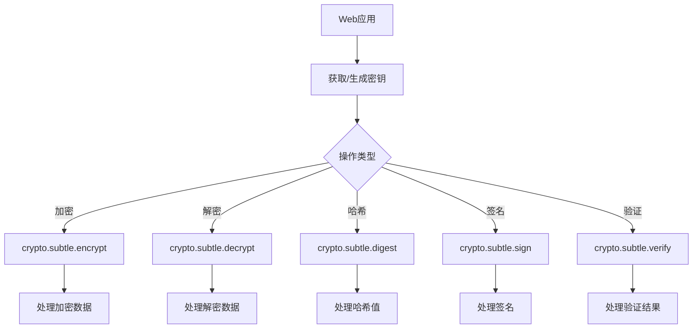

# JavaScript Web加密API

## 介绍

在Web应用程序中处理敏感信息时，加密是保障数据安全的重要手段。JavaScript的Web Crypto API提供了一套标准化的接口，让开发者能够在浏览器环境中执行各种加密操作，如哈希计算、数据加密与解密、数字签名等，而无需依赖第三方库。

Web Crypto API由两个主要部分组成：

1. **`crypto`对象** - 提供基本的随机数生成功能
2. **`crypto.subtle`对象** - 提供更高级的加密功能

:::note
Web Crypto API只能在安全上下文（HTTPS或localhost）中使用全部功能，这是为了防止中间人攻击。
:::

## 基础知识：随机数生成

安全的随机数对于加密操作至关重要。Web Crypto API提供了`getRandomValues()`方法生成加密安全的随机值：

```javascript
// 生成16字节的随机数
function generateRandomBytes() {
  const array = new Uint8Array(16);
  window.crypto.getRandomValues(array);
  return array;
}

// 示例使用
const randomBytes = generateRandomBytes();
console.log('随机字节:', Array.from(randomBytes).map(b => b.toString(16).padStart(2, '0')).join(''));
// 输出示例: 随机字节: f718a613d9f04e850909e489320230ab
```

## 哈希函数

哈希函数可以将任意大小的数据映射为固定大小的值，广泛用于数据完整性检查、密码存储等场景。

### 支持的哈希算法

- SHA-1 (不推荐用于安全场景)
- SHA-256
- SHA-384
- SHA-512

### 计算数据哈希

```javascript
async function calculateHash(message, algorithm = 'SHA-256') {
  // 将字符串转换为ArrayBuffer
  const msgUint8 = new TextEncoder().encode(message);
  
  // 计算哈希值
  const hashBuffer = await crypto.subtle.digest(algorithm, msgUint8);
  
  // 将ArrayBuffer转换为十六进制字符串
  const hashArray = Array.from(new Uint8Array(hashBuffer));
  const hashHex = hashArray.map(b => b.toString(16).padStart(2, '0')).join('');
  
  return hashHex;
}

// 使用示例
async function demoHash() {
  const message = "Hello, Crypto API!";
  const hash = await calculateHash(message);
  console.log(`原始消息: ${message}`);
  console.log(`SHA-256哈希: ${hash}`);
  // 输出示例: SHA-256哈希: a1b2c3d4e5f6...
}

demoHash();
```

## 加密与解密

Web Crypto API支持多种对称和非对称加密算法，让我们可以安全地加密敏感数据。

### 支持的加密算法

- **对称加密**：AES-CTR、AES-CBC、AES-GCM
- **非对称加密**：RSA-OAEP

### AES-GCM加密示例

```javascript
async function encryptData(plaintext, key) {
  // 生成随机初始向量
  const iv = window.crypto.getRandomValues(new Uint8Array(12));
  
  // 将明文转换为ArrayBuffer
  const encodedText = new TextEncoder().encode(plaintext);
  
  // 加密数据
  const ciphertext = await window.crypto.subtle.encrypt(
    {
      name: "AES-GCM",
      iv: iv
    },
    key,
    encodedText
  );
  
  // 将IV和密文合并
  const result = {
    ciphertext: ciphertext,
    iv: iv
  };
  
  return result;
}

async function decryptData(ciphertext, iv, key) {
  // 解密数据
  const decrypted = await window.crypto.subtle.decrypt(
    {
      name: "AES-GCM",
      iv: iv
    },
    key,
    ciphertext
  );
  
  // 将ArrayBuffer转换回字符串
  const decodedText = new TextDecoder().decode(decrypted);
  return decodedText;
}

// 使用示例
async function demoEncryptionDecryption() {
  try {
    // 生成AES密钥
    const key = await window.crypto.subtle.generateKey(
      {
        name: "AES-GCM",
        length: 256
      },
      true,
      ["encrypt", "decrypt"]
    );
    
    const message = "这是一条需要加密的敏感信息!";
    console.log(`原始消息: ${message}`);
    
    // 加密
    const encrypted = await encryptData(message, key);
    console.log("加密成功!");
    
    // 解密
    const decrypted = await decryptData(encrypted.ciphertext, encrypted.iv, key);
    console.log(`解密结果: ${decrypted}`);
  } catch (error) {
    console.error("加密/解密过程出错:", error);
  }
}

demoEncryptionDecryption();
```

## 密钥生成和管理

安全地生成和管理密钥是加密系统的核心。Web Crypto API提供了多种用于创建和导入/导出密钥的方法。

### 生成RSA密钥对

```javascript
async function generateRSAKeyPair() {
  const keyPair = await window.crypto.subtle.generateKey(
    {
      name: "RSA-OAEP",
      // 模数长度
      modulusLength: 2048,
      // 公开指数
      publicExponent: new Uint8Array([1, 0, 1]),
      hash: "SHA-256",
    },
    true, // 是否可导出
    ["encrypt", "decrypt"] // 密钥用途
  );
  
  return keyPair;
}

// 导出公钥(适合分享)
async function exportPublicKey(key) {
  const exported = await window.crypto.subtle.exportKey(
    "spki", // SubjectPublicKeyInfo格式
    key
  );
  
  // 将ArrayBuffer转换为Base64字符串
  const exportedAsString = arrayBufferToBase64(exported);
  return exportedAsString;
}

// 辅助函数: ArrayBuffer转Base64
function arrayBufferToBase64(buffer) {
  const binary = String.fromCharCode.apply(null, new Uint8Array(buffer));
  return window.btoa(binary);
}
```

## 数字签名

数字签名用于验证消息的完整性和来源。发送者使用私钥创建签名，接收者使用公钥验证签名。

### 创建和验证数字签名

```javascript
async function signData(data, privateKey) {
  // 将数据转换为ArrayBuffer
  const encodedData = new TextEncoder().encode(data);
  
  // 创建签名
  const signature = await window.crypto.subtle.sign(
    {
      name: "RSASSA-PKCS1-v1_5",
    },
    privateKey,
    encodedData
  );
  
  return signature;
}

async function verifySignature(data, signature, publicKey) {
  // 将数据转换为ArrayBuffer
  const encodedData = new TextEncoder().encode(data);
  
  // 验证签名
  const isValid = await window.crypto.subtle.verify(
    {
      name: "RSASSA-PKCS1-v1_5",
    },
    publicKey,
    signature,
    encodedData
  );
  
  return isValid;
}

// 使用示例
async function demoSignature() {
  try {
    // 生成RSA密钥对
    const keyPair = await window.crypto.subtle.generateKey(
      {
        name: "RSASSA-PKCS1-v1_5",
        modulusLength: 2048,
        publicExponent: new Uint8Array([1, 0, 1]),
        hash: "SHA-256",
      },
      true,
      ["sign", "verify"]
    );
    
    const message = "这是需要签名的消息";
    
    // 签名
    const signature = await signData(message, keyPair.privateKey);
    console.log("签名已创建");
    
    // 验证
    const isValid = await verifySignature(message, signature, keyPair.publicKey);
    console.log(`签名验证${isValid ? '成功' : '失败'}`);
    
    // 验证被篡改的消息
    const tamperedMessage = message + " (被篡改)";
    const isValidTampered = await verifySignature(tamperedMessage, signature, keyPair.publicKey);
    console.log(`篡改消息验证${isValidTampered ? '成功' : '失败'}`);
  } catch (error) {
    console.error("签名/验证过程出错:", error);
  }
}

demoSignature();
```

## 实际应用场景

Web Crypto API在各种安全应用程序中都有重要作用。以下是一些常见应用场景：

### 1. 端到端加密的聊天应用

```javascript
// 简化的端到端加密通信流程

// 初始化 - 每个用户生成自己的密钥对
async function initializeE2ECommunication() {
  // 生成密钥对
  const keyPair = await generateRSAKeyPair();
  
  // 导出公钥(可以分享给其他用户)
  const publicKeyString = await exportPublicKey(keyPair.publicKey);
  
  return {
    privateKey: keyPair.privateKey,
    publicKey: keyPair.publicKey,
    publicKeyString: publicKeyString
  };
}

// 发送加密消息
async function sendEncryptedMessage(message, recipientPublicKey) {
  // 生成一次性对称密钥(会话密钥)
  const sessionKey = await window.crypto.subtle.generateKey(
    {
      name: "AES-GCM",
      length: 256
    },
    true,
    ["encrypt", "decrypt"]
  );
  
  // 用会话密钥加密消息
  const encryptedMessage = await encryptData(message, sessionKey);
  
  // 导出会话密钥
  const rawSessionKey = await window.crypto.subtle.exportKey(
    "raw",
    sessionKey
  );
  
  // 用接收者公钥加密会话密钥
  const encryptedSessionKey = await window.crypto.subtle.encrypt(
    {
      name: "RSA-OAEP"
    },
    recipientPublicKey,
    rawSessionKey
  );
  
  // 返回需要传输的数据
  return {
    encryptedMessage: encryptedMessage,
    encryptedSessionKey: encryptedSessionKey
  };
}
```

### 2. 基于Web的密码管理器

```javascript
// 使用主密码派生密钥
async function deriveKeyFromPassword(password, salt) {
  // 将密码转换为原始字节
  const passwordBytes = new TextEncoder().encode(password);
  
  // 从密码导入原始密钥
  const baseKey = await window.crypto.subtle.importKey(
    "raw",
    passwordBytes,
    "PBKDF2",
    false,
    ["deriveBits", "deriveKey"]
  );
  
  // 使用PBKDF2派生加密密钥
  const derivedKey = await window.crypto.subtle.deriveKey(
    {
      name: "PBKDF2",
      salt: salt,
      iterations: 100000,
      hash: "SHA-256"
    },
    baseKey,
    { name: "AES-GCM", length: 256 },
    true,
    ["encrypt", "decrypt"]
  );
  
  return derivedKey;
}

// 安全存储密码
async function storePassword(site, username, password, masterKey) {
  // 将站点凭据转换为JSON
  const credentials = JSON.stringify({
    site: site,
    username: username,
    password: password
  });
  
  // 加密凭据
  const encrypted = await encryptData(credentials, masterKey);
  
  // 转换为可存储的格式
  const storedData = {
    iv: Array.from(encrypted.iv),
    ciphertext: Array.from(new Uint8Array(encrypted.ciphertext))
  };
  
  // 将数据存储在本地(实际应用可能使用IndexedDB或其他存储方式)
  localStorage.setItem(`pwd_${site}`, JSON.stringify(storedData));
}
```

### 3. 安全的表单提交流程

```javascript
// 服务器端应提供API公钥
const serverPublicKeyJwk = {
  // 这里是服务器提供的JWK格式公钥
  kty: "RSA",
  e: "AQAB",
  n: "..."
};

// 表单提交前加密敏感数据
async function secureFormSubmission(formData) {
  try {
    // 导入服务器公钥
    const serverPublicKey = await window.crypto.subtle.importKey(
      "jwk",
      serverPublicKeyJwk,
      {
        name: "RSA-OAEP",
        hash: "SHA-256"
      },
      true,
      ["encrypt"]
    );
    
    // 将表单数据转为JSON
    const formDataString = JSON.stringify(formData);
    
    // 加密表单数据
    const encodedData = new TextEncoder().encode(formDataString);
    const encryptedData = await window.crypto.subtle.encrypt(
      {
        name: "RSA-OAEP"
      },
      serverPublicKey,
      encodedData
    );
    
    // 转换为Base64进行传输
    const encryptedBase64 = arrayBufferToBase64(encryptedData);
    
    // 发送到服务器
    const response = await fetch('/api/submit-secure-form', {
      method: 'POST',
      headers: {
        'Content-Type': 'application/json'
      },
      body: JSON.stringify({
        encryptedData: encryptedBase64
      })
    });
    
    return response.ok;
  } catch (error) {
    console.error('安全提交失败:', error);
    return false;
  }
}
```

## Web Crypto API流程图

以下是一个简化的Web Crypto API工作流程图:



## 总结与注意事项

Web Crypto API为前端开发者提供了强大的加密工具，使我们能够在浏览器中实现各种安全功能：

1. **随机数生成** - 使用`crypto.getRandomValues()`生成密码学安全的随机数
2. **哈希计算** - 支持SHA-1、SHA-256、SHA-384和SHA-512
3. **加密/解密** - 支持对称(AES)和非对称(RSA)加密
4. **数字签名** - 验证数据完整性和来源
5. **密钥生成与管理** - 创建、导入、导出各种格式的密钥

:::warning
Web Crypto API功能强大，但不能防止所有安全威胁。浏览器环境中的JavaScript依然面临各种风险，例如XSS攻击可能会暴露敏感数据或密钥。
:::

### 最佳实践

1. 只在HTTPS环境中使用Web Crypto API
2. 永远不要在客户端存储敏感的私钥
3. 使用足够长度的密钥(RSA至少2048位，AES至少256位)
4. 加密算法选择:
   - 对称加密推荐AES-GCM
   - 非对称加密推荐RSA-OAEP
   - 数字签名推荐RSASSA-PKCS1-v1_5或ECDSA
5. 定期轮换密钥，不要长期使用同一密钥

## 练习与资源

### 练习题

1. 创建一个简单的密码强度检测器，使用Web Crypto API计算用户输入密码的哈希值，并检测密码强度。
2. 实现一个本地笔记应用，允许用户使用密码加密和解密笔记内容。
3. 创建一个小型聊天应用原型，实现端到端加密通信的前端部分。

### 推荐资源

- [MDN Web Crypto API文档](https://developer.mozilla.org/en-US/docs/Web/API/Web_Crypto_API)
- [Chrome开发者工具中的安全面板](https://developers.google.com/web/tools/chrome-devtools/security)
- [W3C Web Crypto API规范](https://www.w3.org/TR/WebCryptoAPI/)
- [JavaScript Crypto库Libsodium](https://github.com/jedisct1/libsodium.js)

通过学习和实践Web Crypto API，你可以为你的Web应用程序添加强大的安全功能，保护用户的敏感数据不被未授权访问。