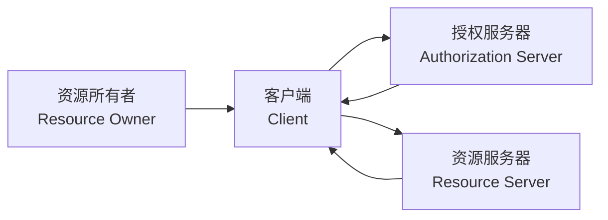
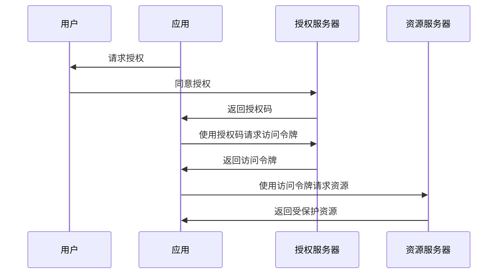

# JavaScript OAuth认证

## 什么是OAuth认证？

OAuth（开放授权）是一种广泛应用的授权框架，允许第三方应用在不需要用户密码的情况下，获取对用户资源的有限访问权限。通俗地说，它就像一种"代客泊车服务"—— 你可以把车钥匙（部分访问权限）交给服务员（第三方应用），但服务员只能在特定范围内使用你的车，而不能获取你的家门钥匙。

:::note
OAuth2.0 是目前广泛使用的版本，本文主要介绍OAuth2.0的实现方式。
:::

## 为什么需要OAuth认证？

在传统的认证模式下，第三方应用需要存储用户的用户名和密码才能访问资源，这带来了严重的安全隐患：

1. 用户密码被过多应用存储，增加泄露风险
2. 应用获得了过多权限，无法精细控制
3. 用户无法撤销单个应用的访问权限，只能更改密码

OAuth解决了这些问题，使得用户可以授权第三方应用访问特定资源，而无需分享密码。

## OAuth 2.0 的基本角色



- **资源所有者**：通常是用户，拥有被保护资源的实体
- **客户端**：请求访问受保护资源的应用程序（如第三方网站或移动应用）
- **授权服务器**：验证资源所有者身份并颁发访问令牌
- **资源服务器**：托管受保护资源，能够接收并验证访问令牌

## OAuth 2.0 认证流程

OAuth 2.0提供了多种授权流程，最常见的是"授权码流程"（Authorization Code Flow）：



## 在JavaScript中实现OAuth 2.0

### 1. 注册应用

在使用OAuth之前，你需要在服务提供商（如Google、Facebook、GitHub等）注册你的应用并获取：

- 客户端ID（Client ID）
- 客户端密钥（Client Secret）
- 重定向URI（Redirect URI）

### 2. 前端实现授权请求

以下是一个使用OAuth 2.0进行GitHub登录的简单实现：

```javascript
// 初始化OAuth参数
const clientId = 'your-client-id';
const redirectUri = 'https://your-app.com/callback';
const scope = 'user:email'; // 所需权限范围

// 构建授权URL
function getAuthUrl() {
  const authUrl = 'https://github.com/login/oauth/authorize' +
    `?client_id=${clientId}` +
    `&redirect_uri=${encodeURIComponent(redirectUri)}` +
    `&scope=${encodeURIComponent(scope)}` +
    '&state=random_state_string'; // 防止CSRF攻击的状态参数
  
  return authUrl;
}

// 创建登录按钮并绑定事件
document.getElementById('github-login').addEventListener('click', () => {
  // 重定向到授权URL
  window.location.href = getAuthUrl();
});
```

### 3. 处理回调并获取访问令牌

用户授权后，授权服务器会将用户重定向回你的应用，并附带授权码：

```javascript
// 在回调页面解析URL参数
const urlParams = new URLSearchParams(window.location.search);
const code = urlParams.get('code');
const state = urlParams.get('state');

// 验证state参数以防止CSRF攻击
if (state !== 'random_state_string') {
  console.error('State validation failed');
  // 处理错误...
  return;
}

// 使用授权码获取访问令牌
// 注意：这一步通常在服务器端完成，以保护client_secret
async function getAccessToken(authorizationCode) {
  try {
    const response = await fetch('https://your-backend.com/get-token', {
      method: 'POST',
      headers: {
        'Content-Type': 'application/json'
      },
      body: JSON.stringify({ code: authorizationCode })
    });
    
    const data = await response.json();
    return data.access_token;
  } catch (error) {
    console.error('Error getting access token:', error);
    throw error;
  }
}

// 如果有授权码，则获取访问令牌
if (code) {
  getAccessToken(code)
    .then(token => {
      // 存储访问令牌
      localStorage.setItem('access_token', token);
      // 使用令牌获取用户信息或其他资源
      fetchUserProfile(token);
    })
    .catch(error => {
      console.error('Authentication failed:', error);
    });
}
```

:::caution
永远不要在前端请求中包含客户端密钥（Client Secret）！这应该在后端服务器中处理。
:::

### 4. 后端处理令牌请求

在服务器端（如Node.js）处理令牌请求：

```javascript
// 使用Express框架的示例
const express = require('express');
const axios = require('axios');
const app = express();

app.use(express.json());

app.post('/get-token', async (req, res) => {
  const { code } = req.body;
  
  try {
    const tokenResponse = await axios({
      method: 'post',
      url: 'https://github.com/login/oauth/access_token',
      headers: {
        'Accept': 'application/json'
      },
      data: {
        client_id: process.env.GITHUB_CLIENT_ID,
        client_secret: process.env.GITHUB_CLIENT_SECRET,
        code: code,
        redirect_uri: 'https://your-app.com/callback'
      }
    });
    
    // 将访问令牌返回给前端
    res.json(tokenResponse.data);
    
  } catch (error) {
    console.error('Error exchanging code for token:', error);
    res.status(500).json({ error: 'Failed to obtain access token' });
  }
});

app.listen(3000, () => {
  console.log('Server running on port 3000');
});
```

### 5. 使用访问令牌请求资源

获取访问令牌后，你可以使用它来请求受保护的资源：

```javascript
async function fetchUserProfile(accessToken) {
  try {
    const response = await fetch('https://api.github.com/user', {
      headers: {
        'Authorization': `Bearer ${accessToken}`
      }
    });
    
    if (!response.ok) {
      throw new Error(`HTTP error! Status: ${response.status}`);
    }
    
    const userData = await response.json();
    console.log('User profile:', userData);
    
    // 更新UI显示用户信息
    document.getElementById('username').textContent = userData.login;
    document.getElementById('avatar').src = userData.avatar_url;
    
  } catch (error) {
    console.error('Error fetching user data:', error);
  }
}
```

## 实际案例：使用OAuth实现"使用Google登录"功能

以下是一个完整的"使用Google登录"功能实现：

1. 在Google Cloud Console创建项目并配置OAuth同意屏幕
2. 获取客户端ID和客户端密钥
3. 实现前端登录按钮和处理函数：

```html
<!DOCTYPE html>
<html>
<head>
  <title>Google OAuth示例</title>
</head>
<body>
  <h1>OAuth 2.0演示</h1>
  <button id="google-login">使用Google登录</button>
  
  <div id="user-info" style="display: none;">
    <h2>欢迎回来！</h2>
    
    <p>姓名: <span id="user-name"></span></p>
    <p>邮箱: <span id="user-email"></span></p>
    <button id="logout">退出登录</button>
  </div>

  <script>
    // OAuth配置
    const clientId = 'YOUR_GOOGLE_CLIENT_ID';
    const redirectUri = 'http://localhost:3000/callback';
    
    // 构建授权URL
    function buildAuthUrl() {
      return 'https://accounts.google.com/o/oauth2/v2/auth' +
        `?client_id=${clientId}` +
        `&redirect_uri=${encodeURIComponent(redirectUri)}` +
        '&response_type=code' +
        '&scope=openid%20profile%20email' +
        `&state=${generateRandomState()}`;
    }
    
    // 生成随机state参数
    function generateRandomState() {
      const state = Math.random().toString(36).substring(2);
      localStorage.setItem('oauth_state', state);
      return state;
    }
    
    // 登录按钮点击处理
    document.getElementById('google-login').addEventListener('click', () => {
      window.location.href = buildAuthUrl();
    });
    
    // 检查URL参数中是否有授权码
    const urlParams = new URLSearchParams(window.location.search);
    const code = urlParams.get('code');
    const state = urlParams.get('state');
    
    if (code && state) {
      // 验证state参数
      const storedState = localStorage.getItem('oauth_state');
      if (state !== storedState) {
        alert('安全验证失败！可能存在CSRF攻击');
      } else {
        // 使用授权码获取访问令牌(调用后端API)
        fetch('/api/auth/google', {
          method: 'POST',
          headers: {
            'Content-Type': 'application/json'
          },
          body: JSON.stringify({ code })
        })
        .then(response => response.json())
        .then(data => {
          if (data.access_token) {
            // 存储令牌
            localStorage.setItem('access_token', data.access_token);
            // 获取用户信息
            fetchUserInfo(data.access_token);
            // 清除URL参数
            window.history.replaceState({}, document.title, '/');
          }
        })
        .catch(error => {
          console.error('Authentication error:', error);
          alert('登录失败，请重试');
        });
      }
    }
    
    // 获取用户信息
    function fetchUserInfo(token) {
      fetch('https://www.googleapis.com/oauth2/v3/userinfo', {
        headers: { 'Authorization': `Bearer ${token}` }
      })
      .then(response => response.json())
      .then(data => {
        // 显示用户信息
        document.getElementById('user-avatar').src = data.picture;
        document.getElementById('user-name').textContent = data.name;
        document.getElementById('user-email').textContent = data.email;
        document.getElementById('user-info').style.display = 'block';
        document.getElementById('google-login').style.display = 'none';
      })
      .catch(error => {
        console.error('Error fetching user info:', error);
      });
    }
    
    // 退出登录
    document.getElementById('logout').addEventListener('click', () => {
      localStorage.removeItem('access_token');
      document.getElementById('user-info').style.display = 'none';
      document.getElementById('google-login').style.display = 'block';
    });
    
    // 检查是否已登录
    const storedToken = localStorage.getItem('access_token');
    if (storedToken) {
      fetchUserInfo(storedToken);
    }
  </script>
</body>
</html>
```

对应的后端代码（Node.js + Express）：

```javascript
const express = require('express');
const axios = require('axios');
require('dotenv').config();

const app = express();
app.use(express.json());
app.use(express.static('public'));

// 处理Google OAuth回调
app.post('/api/auth/google', async (req, res) => {
  const { code } = req.body;
  
  try {
    // 使用授权码获取令牌
    const tokenResponse = await axios({
      method: 'post',
      url: 'https://oauth2.googleapis.com/token',
      data: {
        client_id: process.env.GOOGLE_CLIENT_ID,
        client_secret: process.env.GOOGLE_CLIENT_SECRET,
        code,
        redirect_uri: 'http://localhost:3000/callback',
        grant_type: 'authorization_code'
      }
    });
    
    // 返回访问令牌给前端
    res.json({
      access_token: tokenResponse.data.access_token,
      expires_in: tokenResponse.data.expires_in
    });
    
  } catch (error) {
    console.error('Token exchange error:', error.response?.data || error.message);
    res.status(500).json({ error: 'Failed to obtain access token' });
  }
});

app.listen(3000, () => {
  console.log('Server running on http://localhost:3000');
});
```

## OAuth安全最佳实践

实现OAuth认证时，请遵循以下安全最佳实践：

1. **始终使用HTTPS**：所有OAuth相关请求都应通过HTTPS进行
2. **验证state参数**：使用随机生成的state参数防止CSRF攻击
3. **保护客户端密钥**：永远不要在前端代码中暴露客户端密钥
4. **验证令牌**：在使用访问令牌前验证其有效性
5. **限制权限范围**：仅请求所需的最小权限范围
6. **实现PKCE**：对于单页应用和移动应用，使用PKCE（Proof Key for Code Exchange）扩展增强安全性
7. **处理令牌过期**：实现刷新令牌机制，妥善处理访问令牌过期情况

:::warning
OAuth认证过程中的安全性至关重要。任何安全措施的缺失都可能导致用户账户被盗用或敏感数据泄露。
:::

## 总结

OAuth 2.0是现代Web应用中实现安全授权的重要机制，通过它可以：

- 允许用户授权第三方应用访问其资源，无需共享密码
- 限制第三方应用的访问权限范围
- 随时撤销特定应用的访问权限
- 提供更安全、更灵活的认证和授权解决方案

正确实现的OAuth认证流程可以显著提高应用的安全性和用户体验。随着越来越多的服务提供商支持OAuth，掌握这一技术已成为前端开发者的必备技能。

## 扩展学习资源

- [OAuth 2.0官方文档](https://oauth.net/2/)
- [RFC 6749 - OAuth 2.0授权框架](https://datatracker.ietf.org/doc/html/rfc6749)
- [Google OAuth 2.0开发者文档](https://developers.google.com/identity/protocols/oauth2)
- [Auth0 OAuth 2.0指南](https://auth0.com/docs/protocols/oauth2)

## 练习

1. 使用提供的示例代码，实现一个基于GitHub OAuth的登录功能
2. 修改示例代码，添加令牌刷新机制
3. 实现"使用Facebook登录"功能
4. 为单页应用(SPA)实现带PKCE的OAuth 2.0流程
5. 创建一个能够同时支持多种OAuth提供商（如Google、GitHub、Facebook等）的认证系统

通过这些练习，你将全面掌握OAuth在JavaScript应用中的实现方法和最佳实践。