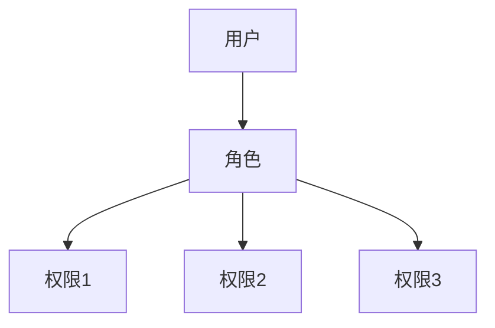

# JavaScript 权限管理

## 什么是JavaScript权限管理？

JavaScript权限管理是指在Web应用程序中控制用户或脚本可以执行的操作范围的机制。由于JavaScript在浏览器中运行，它需要一套完善的权限控制系统来确保安全性，防止恶意代码执行未经授权的操作。

:::note
JavaScript本身的安全模型基于"同源策略"(Same-Origin Policy)，这是浏览器强制实施的最基本权限管理机制。
:::

## JavaScript 权限管理的重要性

在现代Web应用中，权限管理对于保护用户数据和系统资源至关重要：

1. **防止未授权访问** - 确保用户只能访问他们有权限的功能和数据
2. **保护敏感操作** - 限制高风险操作如支付、用户管理等功能
3. **减少攻击面** - 通过限制JavaScript的能力，降低潜在安全风险
4. **提升用户体验** - 根据用户角色显示不同功能，简化界面

## JavaScript 权限管理的基本概念

### 同源策略

同源策略是浏览器实施的最基本安全机制，限制了来自不同源的脚本如何与另一个源的资源交互。

```javascript
// 假设当前页面是 https://example.com/page1.html

// 同源请求 - 允许
fetch('https://example.com/api/data')
  .then(response => response.json())
  .then(data => console.log('数据获取成功:', data));

// 非同源请求 - 默认被阻止
fetch('https://different-domain.com/api/data')
  .then(response => response.json())
  .catch(error => console.error('跨域请求失败:', error));
```

:::tip
两个URL具有相同的源，需要满足协议(http/https)、主机名(域名)和端口号都相同。
:::

### 基于角色的权限控制(RBAC)

在Web应用中，基于角色的权限控制是最常见的权限管理模式。



### 前端权限实现方法

#### 1. 基于路由的权限控制

```javascript
// 使用React Router实现的简单权限路由示例
import { BrowserRouter, Route, Redirect } from 'react-router-dom';

// 检查用户是否有权限访问
function hasPermission(requiredPermission) {
  const userPermissions = getUserPermissionsFromStore(); // 获取用户权限
  return userPermissions.includes(requiredPermission);
}

// 受保护的路由组件
function ProtectedRoute({ component: Component, permission, ...rest }) {
  return (
    <Route
      {...rest}
      render={(props) =>
        hasPermission(permission) ? (
          <Component {...props} />
        ) : (
          <Redirect to="/unauthorized" />
        )
      }
    />
  );
}

// 应用路由配置
function AppRouter() {
  return (
    <BrowserRouter>
      <Route path="/login" component={LoginPage} />
      <Route path="/public" component={PublicPage} />
      <ProtectedRoute path="/admin" component={AdminDashboard} permission="ADMIN" />
      <ProtectedRoute path="/reports" component={ReportsPage} permission="VIEW_REPORTS" />
      <Route path="/unauthorized" component={UnauthorizedPage} />
    </BrowserRouter>
  );
}
```

#### 2. 基于UI元素的权限控制

```javascript
// 权限控制组件示例
function PermissionGuard({ permission, fallback = null, children }) {
  const hasAccess = usePermission(permission);
  
  if (!hasAccess) {
    return fallback;
  }
  
  return children;
}

// 在UI中使用
function Dashboard() {
  return (
    <div>
      <h1>Dashboard</h1>
      
      {/* 所有用户可见 */}
      <UserProfile />
      
      {/* 只有具有EDIT_USERS权限的用户可见 */}
      <PermissionGuard permission="EDIT_USERS">
        <UserManagement />
      </PermissionGuard>
      
      {/* 只有管理员可见，其他用户看到提示信息 */}
      <PermissionGuard 
        permission="ADMIN" 
        fallback={<p>需要管理员权限查看此内容</p>}
      >
        <AdminPanel />
      </PermissionGuard>
    </div>
  );
}
```

## 权限管理的最佳实践

### 1. 前后端结合验证

:::caution
永远不要只依赖前端权限验证！前端权限控制只是为了改善用户体验，所有敏感操作必须在服务器端再次验证权限。
:::

```javascript
// 前端权限检查示例
async function deleteUser(userId) {
  // 前端权限检查
  if (!hasPermission('DELETE_USER')) {
    showError('您没有删除用户的权限');
    return;
  }
  
  try {
    // 请求后端API (后端会再次验证权限)
    const response = await fetch(`/api/users/${userId}`, {
      method: 'DELETE',
      headers: {
        'Authorization': `Bearer ${getAuthToken()}`
      }
    });
    
    if (!response.ok) {
      const error = await response.json();
      throw new Error(error.message);
    }
    
    showSuccess('用户删除成功');
  } catch (error) {
    showError(`操作失败: ${error.message}`);
  }
}
```

### 2. 使用Token存储权限信息

JWT (JSON Web Token) 是现代Web应用常用的权限管理技术。

```javascript
// JWT解码示例 (实际使用可以采用jwt-decode等库)
function decodeJWT(token) {
  const base64Url = token.split('.')[1];
  const base64 = base64Url.replace(/-/g, '+').replace(/_/g, '/');
  const jsonPayload = decodeURIComponent(
    atob(base64).split('').map(function(c) {
      return '%' + ('00' + c.charCodeAt(0).toString(16)).slice(-2);
    }).join('')
  );

  return JSON.parse(jsonPayload);
}

// 从JWT中获取权限
function getUserPermissions() {
  const token = localStorage.getItem('auth_token');
  if (!token) return [];
  
  try {
    const decoded = decodeJWT(token);
    return decoded.permissions || [];
  } catch (e) {
    console.error('Invalid token:', e);
    return [];
  }
}
```

### 3. 权限状态管理

在大型应用中，使用状态管理库来集中管理权限状态是好的做法。

```javascript
// 使用Redux管理权限状态示例
// actions.js
export const setUserPermissions = (permissions) => ({
  type: 'SET_USER_PERMISSIONS',
  permissions
});

// reducer.js
const initialState = {
  permissions: [],
  isAdmin: false
};

export function authReducer(state = initialState, action) {
  switch (action.type) {
    case 'SET_USER_PERMISSIONS':
      return {
        ...state,
        permissions: action.permissions,
        isAdmin: action.permissions.includes('ADMIN')
      };
    default:
      return state;
  }
}

// 在组件中使用
function AdminButton({ onClick }) {
  const { permissions } = useSelector(state => state.auth);
  const hasAdminAccess = permissions.includes('ADMIN');
  
  if (!hasAdminAccess) {
    return null;
  }
  
  return <button onClick={onClick}>管理员功能</button>;
}
```

## 实际案例：电子商务网站的权限管理

考虑一个电子商务网站的权限管理实现：

```javascript
// 定义角色和权限
const ROLES = {
  GUEST: 'guest',
  CUSTOMER: 'customer',
  SELLER: 'seller',
  ADMIN: 'admin'
};

const PERMISSIONS = {
  VIEW_PRODUCTS: 'view_products',
  PLACE_ORDER: 'place_order',
  MANAGE_OWN_PRODUCTS: 'manage_own_products',
  MANAGE_ALL_PRODUCTS: 'manage_all_products',
  MANAGE_USERS: 'manage_users'
};

// 角色-权限映射
const rolePermissions = {
  [ROLES.GUEST]: [
    PERMISSIONS.VIEW_PRODUCTS
  ],
  [ROLES.CUSTOMER]: [
    PERMISSIONS.VIEW_PRODUCTS,
    PERMISSIONS.PLACE_ORDER
  ],
  [ROLES.SELLER]: [
    PERMISSIONS.VIEW_PRODUCTS,
    PERMISSIONS.PLACE_ORDER,
    PERMISSIONS.MANAGE_OWN_PRODUCTS
  ],
  [ROLES.ADMIN]: [
    PERMISSIONS.VIEW_PRODUCTS,
    PERMISSIONS.PLACE_ORDER,
    PERMISSIONS.MANAGE_OWN_PRODUCTS,
    PERMISSIONS.MANAGE_ALL_PRODUCTS,
    PERMISSIONS.MANAGE_USERS
  ]
};

// 权限检查钩子
function useHasPermission() {
  const { user } = useAuth();
  
  return (requiredPermission) => {
    if (!user || !user.role) {
      return false;
    }
    
    const userPermissions = rolePermissions[user.role] || [];
    return userPermissions.includes(requiredPermission);
  };
}

// 在组件中使用
function ProductManagement() {
  const hasPermission = useHasPermission();
  const { user } = useAuth();
  
  if (!hasPermission(PERMISSIONS.MANAGE_OWN_PRODUCTS)) {
    return <AccessDenied />;
  }
  
  return (
    <div>
      <h1>产品管理</h1>
      
      {/* 卖家只能管理自己的产品 */}
      <ProductList sellerId={user.role === ROLES.SELLER ? user.id : undefined} />
      
      {/* 只有管理员可以删除产品 */}
      {hasPermission(PERMISSIONS.MANAGE_ALL_PRODUCTS) && (
        <button onClick={handleBulkDelete}>批量删除</button>
      )}
    </div>
  );
}
```

## JavaScript 权限管理的常见挑战与解决方案

### 挑战1：前端权限可被绕过

由于前端代码运行在用户的浏览器中，恶意用户可以通过浏览器开发工具修改DOM或JavaScript代码，绕过前端权限检查。

**解决方案**：
- 所有权限检查必须在服务器端再次执行
- 使用HTTPS防止中间人攻击
- 实施请求签名验证重要操作

### 挑战2：权限过期问题

令牌或会话可能过期，但前端UI未及时更新。

**解决方案**：
```javascript
// 全局请求拦截器示例 (使用axios)
axios.interceptors.response.use(
  response => response,
  error => {
    // 处理401错误
    if (error.response && error.response.status === 401) {
      // 清除过期的认证信息
      authStore.logout();
      // 重定向到登录页面
      router.push('/login');
    }
    return Promise.reject(error);
  }
);
```

### 挑战3：复杂业务场景下的细粒度权限

在复杂应用中，可能需要基于数据所有权或其他条件的权限控制。

**解决方案**：实现条件权限检查函数

```javascript
// 条件权限检查
function checkPermission(permission, context) {
  const { user } = useAuth();
  
  // 基本权限检查
  const hasBasePermission = user.permissions.includes(permission);
  if (!hasBasePermission) return false;
  
  // 条件权限检查
  switch (permission) {
    case 'edit_document':
      // 只能编辑自己创建的文档或共享给自己的文档
      return context.document.creatorId === user.id || 
             context.document.sharedWith.includes(user.id);
             
    case 'approve_expense':
      // 只能审批特定金额以下的支出
      const approvalLimit = user.role === 'manager' ? 10000 : 1000;
      return context.expense.amount <= approvalLimit;
      
    default:
      return true;
  }
}
```

## 权限管理的新趋势

### 基于能力的安全模型

传统RBAC(基于角色的访问控制)正逐渐向CBAC(基于能力的访问控制)转变，使权限更加灵活。

```javascript
// 基于能力的令牌示例
const userCapabilities = {
  "document:123": ["read", "write", "share"],
  "document:456": ["read"],
  "admin:dashboard": ["view"],
  "api:users": ["list", "create"]
};

function hasCapability(resource, action) {
  if (!userCapabilities[resource]) return false;
  return userCapabilities[resource].includes(action);
}

// 使用示例
if (hasCapability("document:123", "write")) {
  // 允许编辑文档123
}
```

### 权限策略即代码

将权限逻辑作为可测试、可版本化的代码。

```javascript
// 策略即代码示例
const policies = {
  canEditDocument: (user, document) => {
    // 文档创建者可以编辑
    if (document.createdBy === user.id) return true;
    
    // 文档协作者可以编辑
    if (document.collaborators.includes(user.id)) return true;
    
    // 管理员可以编辑任何文档
    if (user.roles.includes('admin')) return true;
    
    return false;
  },
  
  canDeleteDocument: (user, document) => {
    // 只有创建者和管理员可以删除
    return document.createdBy === user.id || user.roles.includes('admin');
  }
};

// 使用策略
function EditButton({ document }) {
  const { user } = useAuth();
  const canEdit = policies.canEditDocument(user, document);
  
  if (!canEdit) return null;
  
  return <button onClick={handleEdit}>编辑文档</button>;
}
```

## 总结

JavaScript权限管理是Web应用安全的关键组成部分。对于初学者而言，应牢记以下几点：

1. 前端权限控制主要为了改善用户体验，而非替代服务端安全验证
2. 同源策略是浏览器提供的基础安全机制
3. 权限验证应同时在前端和后端实施
4. 基于角色(RBAC)的权限模型适合大多数Web应用
5. 使用JWT等标准token格式存储和传递权限信息
6. 权限管理不只是技术问题，还涉及业务规则的理解与实施

通过合理实施JavaScript权限管理，可以在保障应用安全的同时，为不同角色用户提供最佳的用户体验。

## 练习与资源

### 练习

1. 实现一个简单的权限管理系统，包含用户登录、角色分配和基于角色的UI显示控制
2. 使用JWT实现一个权限管理示例，解析令牌并根据权限显示不同功能
3. 为一个简单的博客系统设计权限结构，确保只有作者和管理员可以编辑文章

### 扩展资源

- [OWASP - 开放Web应用安全项目](https://owasp.org/)
- [Auth0 - 现代认证与授权服务](https://auth0.com/docs)
- [使用JWT实现权限控制](https://jwt.io/introduction/)
- [前端权限管理最佳实践](https://www.smashingmagazine.com/2020/07/frontend-permissions-role-based-access-control/)

:::tip
权限管理是一个复杂而重要的主题。这篇文章只是介绍了基础概念，在实际项目中，应该根据具体需求和安全要求设计更完善的权限系统。
:::