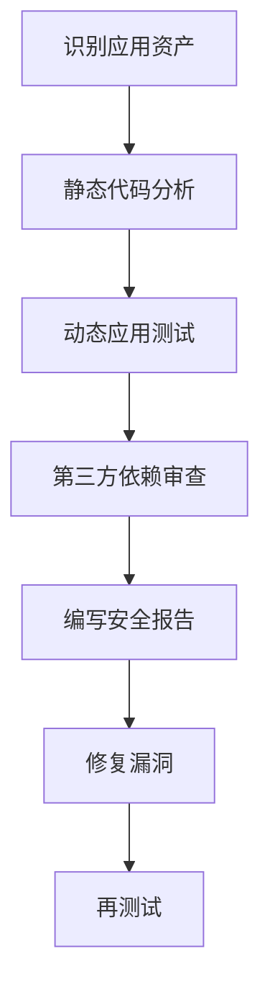

# JavaScript 安全审计

在现代 Web 开发中，JavaScript 已经成为不可或缺的一部分。随着其应用范围的扩大，JavaScript 相关的安全问题也日益突出。进行 JavaScript 安全审计是确保 Web 应用安全的重要步骤。本文将介绍 JavaScript 安全审计的基础知识，常见威胁以及审计方法。

## 什么是 JavaScript 安全审计？

JavaScript 安全审计是一个系统性的过程，通过检查 JavaScript 代码和相关应用来识别潜在的安全漏洞。这个过程不仅包括代码审查，还包括运行时行为分析，以确保应用不会被恶意攻击者利用。

:::note 安全审计的重要性
根据 OWASP（开放 Web 应用安全项目）的数据，XSS（跨站脚本攻击）和注入攻击仍然是最常见的 Web 应用安全威胁，而这些威胁通常与 JavaScript 密切相关。
:::

## JavaScript 常见安全威胁

### 1. 跨站脚本攻击 (XSS)

XSS 是最常见的 JavaScript 安全威胁之一，攻击者通过在目标网站上注入恶意脚本来执行。

#### 示例：反射型 XSS

```javascript
// 不安全的代码
function showGreeting() {
    const name = new URLSearchParams(window.location.search).get('name');
    document.getElementById('greeting').innerHTML = 'Hello, ' + name;
}
```

如果 URL 中包含 `?name=<script>alert('XSS')</script>`，则会执行恶意脚本。

#### 安全修复方式：

```javascript
// 安全的代码
function showGreeting() {
    const name = new URLSearchParams(window.location.search).get('name');
    const sanitizedName = document.createTextNode(name).textContent;
    document.getElementById('greeting').innerHTML = 'Hello, ' + sanitizedName;
}
```

### 2. 原型污染

JavaScript 的原型继承机制可能被攻击者利用，通过污染对象原型来执行恶意代码。

```javascript
// 不安全的深度合并函数
function deepMerge(target, source) {
    for (let key in source) {
        if (source[key] && typeof source[key] === 'object') {
            if (!target[key]) target[key] = {};
            deepMerge(target[key], source[key]);
        } else {
            target[key] = source[key];
        }
    }
    return target;
}

// 恶意输入可能导致原型污染
const userInput = JSON.parse('{"__proto__": {"polluted": true}}');
const obj = {};
deepMerge(obj, userInput);
console.log({}.polluted); // true - 所有对象现在都被污染了
```

#### 安全修复方式：

```javascript
function safeDeepMerge(target, source) {
    for (let key in source) {
        // 检查是否是自身属性而非原型属性
        if (Object.prototype.hasOwnProperty.call(source, key)) {
            if (key === '__proto__' || key === 'constructor') continue;
            
            if (source[key] && typeof source[key] === 'object') {
                if (!target[key]) target[key] = {};
                safeDeepMerge(target[key], source[key]);
            } else {
                target[key] = source[key];
            }
        }
    }
    return target;
}
```

### 3. 跨站请求伪造 (CSRF)

CSRF 攻击利用已认证用户的身份，在用户不知情的情况下执行未授权操作。

```javascript
// 容易遭受 CSRF 攻击的代码
function transferMoney() {
    const amount = document.getElementById('amount').value;
    const to = document.getElementById('recipient').value;
    
    fetch('/api/transfer', {
        method: 'POST',
        body: JSON.stringify({ amount, to }),
        credentials: 'include' // 包含用户 cookies
    });
}
```

#### 安全修复方式：

```javascript
function transferMoney() {
    const amount = document.getElementById('amount').value;
    const to = document.getElementById('recipient').value;
    const csrfToken = document.getElementById('csrf-token').value;
    
    fetch('/api/transfer', {
        method: 'POST',
        headers: {
            'Content-Type': 'application/json',
            'X-CSRF-Token': csrfToken
        },
        body: JSON.stringify({ amount, to }),
        credentials: 'include'
    });
}
```

## 安全审计流程

以下是进行 JavaScript 安全审计的基本流程：



### 1. 静态代码分析

静态代码分析通过检查源代码来识别潜在的安全漏洞，而无需实际运行代码。

#### 常用工具：

- ESLint 安全规则
- SonarQube
- Snyk Code

#### ESLint 安全配置示例：

```javascript
// .eslintrc.js
module.exports = {
  plugins: ['security'],
  extends: ['plugin:security/recommended'],
  rules: {
    'security/detect-eval-with-expression': 'error',
    'security/detect-non-literal-regexp': 'error',
    'security/detect-no-csrf-before-method-override': 'error',
    'security/detect-object-injection': 'error'
  }
};
```

### 2. 动态应用测试

动态应用测试通过在运行时分析应用行为来发现安全漏洞。

#### 常用工具：

- OWASP ZAP (Zed Attack Proxy)
- Burp Suite
- DOMPurify (用于运行时 HTML 净化)

#### DOMPurify 使用示例：

```javascript
// 引入 DOMPurify
import DOMPurify from 'dompurify';

// 净化用户输入
function displayUserContent(content) {
    const clean = DOMPurify.sanitize(content, {
        ALLOWED_TAGS: ['b', 'i', 'em', 'strong', 'a'],
        ALLOWED_ATTR: ['href']
    });
    document.getElementById('content').innerHTML = clean;
}
```

### 3. 第三方依赖审查

检查项目中使用的第三方库和框架是否存在已知漏洞。

#### 常用工具：

- npm audit
- Snyk
- OWASP Dependency-Check

#### npm audit 使用示例：

```bash
# 检查项目依赖中的安全漏洞
npm audit

# 自动修复可修复的漏洞
npm audit fix

# 生成详细报告
npm audit --json > audit-report.json
```

## 实际案例：线上购物网站安全审计

让我们通过一个线上购物网站的例子，了解如何应用 JavaScript 安全审计。

### 问题场景

某电商网站的商品评论功能允许用户提交包含 HTML 的评论，以支持基本格式化。然而，这为 XSS 攻击创造了机会。

### 问题代码

```javascript
// products.js
function addComment(productId, comment) {
    const commentDiv = document.createElement('div');
    commentDiv.innerHTML = comment; // 危险：直接插入用户输入
    document.getElementById('comments-' + productId).appendChild(commentDiv);
    
    // 将评论保存到数据库
    saveToDatabase(productId, comment);
}
```

### 安全审计发现

1. **XSS 漏洞**：直接将未经过滤的用户输入插入 DOM
2. **缺少输入验证**：没有验证或净化用户输入
3. **潜在的 DOM 注入**：productId 参数也没有经过验证

### 修复方案

```javascript
// products.js - 安全版本
function addComment(productId, comment) {
    // 验证 productId 是数字
    if (!/^\d+$/.test(productId)) {
        console.error('无效的产品 ID');
        return;
    }
    
    // 使用 DOMPurify 净化评论内容
    const sanitizedComment = DOMPurify.sanitize(comment, {
        ALLOWED_TAGS: ['b', 'i', 'em', 'strong'],
        ALLOWED_ATTR: []
    });
    
    const commentDiv = document.createElement('div');
    commentDiv.innerHTML = sanitizedComment;
    
    const commentsContainer = document.getElementById('comments-' + productId);
    if (commentsContainer) {
        commentsContainer.appendChild(commentDiv);
        
        // 将净化后的评论保存到数据库
        saveToDatabase(productId, sanitizedComment);
    }
}
```

## JavaScript 安全审计清单

以下是进行 JavaScript 安全审计时的基本检查清单：

1. **输入验证和输出编码**
   - 是否验证所有用户输入？
   - 在显示用户输入之前是否进行适当编码？

2. **第三方库和依赖**
   - 是否定期更新第三方依赖？
   - 是否使用 npm audit 检查依赖中的漏洞？

3. **敏感数据处理**
   - 是否在客户端存储敏感信息？
   - 是否加密存储的敏感数据？

4. **认证和会话管理**
   - 是否有适当的 CSRF 保护措施？
   - 是否安全地处理 cookies 和 JWT？

5. **代码质量**
   - 是否避免使用危险函数（如 eval）？
   - 是否有适当的错误处理机制？

:::tip 实用建议
定期进行安全审计是一个好习惯。即使是小型项目，每季度进行一次安全审核也能及时发现并修复潜在问题。
:::

## 总结

JavaScript 安全审计是保障 Web 应用安全的关键环节。通过系统的审计流程，开发者可以识别和修复潜在的安全漏洞，防止恶意攻击者利用这些漏洞。在审计过程中，应该关注常见的安全威胁，如 XSS、原型污染和 CSRF，同时利用静态分析工具、动态测试工具和第三方依赖检查工具来提高审计效率和准确性。

安全不是一次性工作，而是一个持续的过程。随着应用的发展和新威胁的出现，定期进行安全审计并更新安全措施是非常必要的。

## 练习与资源

### 练习

1. 找出以下代码中的安全漏洞，并提出修复方案：

```javascript
function searchUsers(query) {
    const results = [];
    const regex = new RegExp(query);
    
    for (let user of users) {
        if (regex.test(user.name)) {
            results.push(user);
        }
    }
    
    document.getElementById('search-results').innerHTML = 
        results.map(user => `<div>${user.name}</div>`).join('');
}
```

2. 编写一个安全的表单提交函数，包括 CSRF 保护和输入验证。

### 推荐资源

- [OWASP JavaScript 安全指南](https://owasp.org/www-project-secure-coding-practices-quick-reference-guide/)
- [Mozilla 开发者网络 (MDN) 的 Web 安全文档](https://developer.mozilla.org/en-US/docs/Web/Security)
- [Snyk - 开源安全平台](https://snyk.io/)
- [JavaScript 安全最佳实践](https://cheatsheetseries.owasp.org/cheatsheets/JavaScript_Security_Cheat_Sheet.html)

通过以上资源和练习，你将能够更深入地了解 JavaScript 安全审计的概念和实践方法，构建更安全的 Web 应用程序。