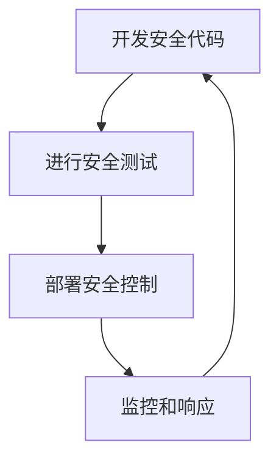

# JavaScript 安全最佳实践

## 介绍

在Web开发中，JavaScript安全是一个至关重要的话题。随着Web应用程序变得越来越复杂，确保JavaScript代码的安全性变得尤为重要。不安全的JavaScript代码可能导致各种安全漏洞，如跨站脚本攻击(XSS)、跨站请求伪造(CSRF)、注入攻击等，这些都可能使您的网站和用户面临风险。

本文将介绍JavaScript安全编程的基本概念和最佳实践，帮助您编写更安全的JavaScript代码，从而保护您的应用程序和用户数据。

## 理解JavaScript安全风险

在深入了解安全最佳实践之前，让我们先了解一些常见的JavaScript安全风险：

### 1. 跨站脚本(XSS)攻击

XSS攻击发生在攻击者能够将恶意JavaScript代码注入到您的网页中时。当用户访问受感染的页面时，恶意代码会在用户的浏览器中执行。

**示例**：

```javascript
// 不安全的代码 - 直接将用户输入插入到DOM中
function displayComment(comment) {
  document.getElementById('comments').innerHTML += comment;
}

// 用户输入: <script>stealCookies()</script>
```

这段代码直接将用户的评论插入到页面中，如果用户输入包含`<script>`标签，那么这些脚本将被执行。

### 2. 跨站请求伪造(CSRF)攻击

CSRF攻击发生在攻击者诱导用户执行他们不打算执行的操作时。

### 3. 原型污染

原型污染是一种攻击，攻击者可以操作JavaScript对象的原型，从而影响应用程序的行为。

## JavaScript 安全最佳实践

### 1. 输入验证与输出编码

始终验证并清理用户输入，并在显示之前对输出进行编码。

**输入验证示例**：

```javascript
// 验证用户名只包含字母和数字
function isValidUsername(username) {
  return /^[a-zA-Z0-9]+$/.test(username);
}

// 使用方法
if (isValidUsername(userInput)) {
  // 处理有效输入
} else {
  // 拒绝无效输入
}
```

**输出编码示例**：

```javascript
// 使用文本节点而不是innerHTML来防止XSS
function safeDisplayComment(comment) {
  const commentNode = document.createTextNode(comment);
  document.getElementById('comments').appendChild(commentNode);
}

// 或者使用专门的编码库
function escapeHTML(str) {
    return str.replace(/[&<>'"]/g, 
        tag => ({
            '&': '&amp;',
            '<': '&lt;',
            '>': '&gt;',
            "'": '&#39;',
            '"': '&quot;'
        }[tag]));
}

document.getElementById('comments').innerHTML = escapeHTML(userInput);
```

### 2. 内容安全策略(CSP)

使用内容安全策略来限制可以加载和执行的资源。

```html
<meta http-equiv="Content-Security-Policy" content="default-src 'self'; script-src 'self'">
```

这个策略限制了页面只能从同一来源加载资源。

### 3. 使用HTTPS

始终通过HTTPS提供您的JavaScript文件，以防止中间人攻击。

### 4. 避免使用eval()和Function构造函数

`eval()`和`Function`构造函数可以将字符串作为代码执行，这是非常危险的。

```javascript
// 不好的做法
eval(userInput); // 永远不要这样做！

// 不好的做法
new Function(userInput)(); // 同样危险！
```

### 5. 实施CSRF保护

使用CSRF令牌和同源检查来防止CSRF攻击。

```javascript
// 在AJAX请求中包含CSRF令牌
const csrfToken = document.querySelector('meta[name="csrf-token"]').getAttribute('content');

fetch('/api/data', {
  method: 'POST',
  headers: {
    'Content-Type': 'application/json',
    'CSRF-Token': csrfToken
  },
  body: JSON.stringify(data)
});
```

### 6. 安全地处理JSON

使用`JSON.parse()`而不是`eval()`来解析JSON。

```javascript
// 好的做法
const data = JSON.parse(jsonString);

// 不好的做法
const data = eval('(' + jsonString + ')'); // 避免这样做
```

### 7. 防止原型污染

使用`Object.create(null)`创建没有原型的对象，或使用`Object.freeze(Object.prototype)`来防止原型被修改。

```javascript
// 使用无原型对象
const safeObject = Object.create(null);

// 冻结原型
Object.freeze(Object.prototype);
```

### 8. 使用安全的第三方库

始终使用最新版本的第三方库，并从可信来源获取。使用npm包时，注意检查其安全性。

```bash
# 使用npm audit检查依赖中的安全漏洞
npm audit
```

### 9. 实现正确的错误处理

不要向用户显示详细的错误信息，这可能会泄露系统信息。

```javascript
try {
  // 代码可能抛出错误
} catch (error) {
  // 不要直接显示错误给用户
  console.error(error); // 记录错误以供调试
  showUserFriendlyMessage("发生了一个错误，请稍后再试。");
}
```

## 实际案例：安全的表单处理

下面是一个处理用户评论的安全实现示例：

```javascript
document.getElementById('commentForm').addEventListener('submit', function(event) {
  event.preventDefault();
  
  const commentInput = document.getElementById('commentInput').value;
  
  // 1. 输入验证
  if (!commentInput || commentInput.length > 500) {
    showError("评论不能为空且不能超过500个字符");
    return;
  }
  
  // 2. CSRF保护
  const csrfToken = document.querySelector('meta[name="csrf-token"]').getAttribute('content');
  
  // 3. 安全的AJAX请求
  fetch('/api/comments', {
    method: 'POST',
    headers: {
      'Content-Type': 'application/json',
      'CSRF-Token': csrfToken
    },
    body: JSON.stringify({ comment: commentInput })
  })
  .then(response => response.json())
  .then(data => {
    // 4. 安全地显示评论 - 使用文本节点
    const commentElement = document.createElement('div');
    commentElement.className = 'comment';
    
    const commentText = document.createTextNode(data.comment);
    commentElement.appendChild(commentText);
    
    document.getElementById('commentsList').appendChild(commentElement);
    
    // 清空输入
    document.getElementById('commentInput').value = '';
  })
  .catch(error => {
    console.error('Error:', error);
    showUserFriendlyMessage("提交评论时出错，请稍后再试。");
  });
});

function showError(message) {
  const errorElement = document.getElementById('errorMessage');
  errorElement.textContent = message;
  errorElement.style.display = 'block';
}

function showUserFriendlyMessage(message) {
  alert(message);
}
```

这个例子展示了如何安全地处理用户输入并防止XSS和CSRF攻击。

## 安全实践流程

以下是确保JavaScript应用安全的总体流程：



## 总结

JavaScript安全是Web开发中一个至关重要的方面。通过遵循本文提到的最佳实践，您可以大大降低应用程序的安全风险：

1. 始终验证并净化用户输入
2. 在输出时使用适当的编码
3. 实施内容安全策略
4. 避免使用eval()和Function构造函数
5. 使用HTTPS
6. 实施CSRF保护
7. 安全地处理JSON
8. 防止原型污染
9. 使用安全的第三方库
10. 实现正确的错误处理

记住，安全不是一次性的工作，而是一个持续的过程。随着新的威胁出现，您需要不断更新您的安全实践。

:::tip 实践建议
定期进行安全审核，使用自动化工具扫描代码中的安全漏洞，并及时更新您使用的所有库和框架。
:::

## 附加资源

- [OWASP (Open Web Application Security Project)](https://owasp.org/)
- [Mozilla的Web安全指南](https://developer.mozilla.org/en-US/docs/Web/Security)
- [Content Security Policy (CSP)](https://developer.mozilla.org/en-US/docs/Web/HTTP/CSP)

## 练习

1. 创建一个表单，安全地处理用户输入并显示在页面上。确保它能防止XSS攻击。
2. 审查您现有的代码，寻找潜在的安全漏洞，并应用本文提到的最佳实践来修复它们。
3. 实现一个基本的CSP策略，并测试它是否能够有效地阻止不安全的资源加载。

掌握JavaScript安全最佳实践将帮助您成为一个更全面、更负责任的开发者，同时保护您的应用程序和用户免受潜在的安全威胁。