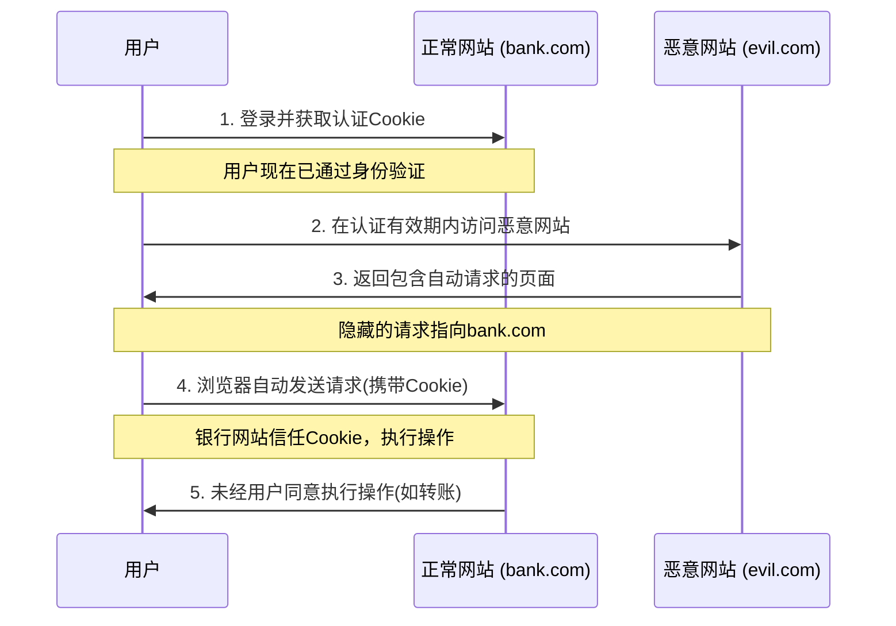

# JavaScript CSRF攻击

## 什么是CSRF攻击?

CSRF(Cross-Site Request Forgery，跨站请求伪造)是一种常见的web安全漏洞，攻击者通过诱导已经通过身份验证的用户执行非本意的操作。简单来说，CSRF攻击利用的是网站对用户浏览器的信任，而不是直接窃取用户的数据。

:::warning
CSRF攻击可能导致未经授权的资金转账、个人资料更改或商品购买等严重后果，所有web开发者都应了解并防范此类攻击。
:::

## CSRF攻击的工作原理

CSRF攻击的基本流程如下：



## CSRF攻击示例

### 示例1：简单的GET请求攻击

假设银行网站有一个转账API，通过GET请求执行：

```
https://bank.com/transfer?to=alice&amount=1000
```

攻击者可以创建一个包含以下HTML的恶意网页：

```html

```

当用户访问恶意网页时，浏览器会自动加载"图像"，从而向银行网站发送转账请求，且请求中会携带用户的认证Cookie。

### 示例2：POST请求攻击

对于需要POST请求的操作，攻击者可以设计一个自动提交的表单：

```html
<body onload="document.getElementById('csrf-form').submit()">
  <form id="csrf-form" action="https://bank.com/transfer" method="POST">
    <input type="hidden" name="to" value="attacker" />
    <input type="hidden" name="amount" value="1000" />
  </form>
</body>
```

## CSRF攻击的防御措施

### 1. CSRF Token

这是最常用的防御机制。服务器生成一个随机且不可预测的令牌，并将其嵌入表单中：

```javascript
// 服务器端代码生成CSRF token (Node.js示例)
const crypto = require('crypto');
const csrfToken = crypto.randomBytes(16).toString('hex');
session.csrfToken = csrfToken; // 存储在用户会话中
```

```html
<!-- 前端表单包含CSRF token -->
<form action="/transfer" method="post">
  <input type="hidden" name="_csrf" value="a1b2c3d4e5f6g7h8i9j0" />
  <input type="text" name="to" placeholder="接收方" />
  <input type="number" name="amount" placeholder="金额" />
  <button type="submit">转账</button>
</form>
```

服务器收到请求后，会验证请求中的令牌是否与会话中存储的一致。

### 2. SameSite Cookie属性

现代浏览器支持为Cookie设置SameSite属性，限制Cookie在跨站请求中的发送：

```javascript
// 设置SameSite属性为Strict
document.cookie = "sessionId=abc123; SameSite=Strict";

// 设置SameSite属性为Lax (Chrome默认值)
document.cookie = "sessionId=abc123; SameSite=Lax";

// 显式允许跨站发送
document.cookie = "sessionId=abc123; SameSite=None; Secure";
```

### 3. 自定义请求头

利用AJAX请求可以设置自定义头，而表单提交无法设置：

```javascript
// 客户端添加自定义请求头
fetch('/api/transfer', {
  method: 'POST',
  headers: {
    'Content-Type': 'application/json',
    'X-Requested-With': 'XMLHttpRequest' // 自定义头
  },
  body: JSON.stringify({to: 'alice', amount: 1000})
});
```

服务端检查此头的存在：

```javascript
// 服务器端检查自定义头
if (req.headers['x-requested-with'] !== 'XMLHttpRequest') {
  return res.status(403).send('CSRF保护：请求被拒绝');
}
```

### 4. 验证码和二次确认

对于敏感操作，可以要求用户输入验证码或进行二次确认，这些步骤很难被自动化执行。

## 实际案例分析

### 2008年网络银行CSRF漏洞

2008年，一家知名的网上银行被发现存在CSRF漏洞。攻击者只需诱导银行客户访问特制网页，就能在不知情的情况下发起资金转账。该银行的转账功能仅依赖Cookie验证用户身份，没有实施CSRF防御措施。

**原有的转账处理代码**:

```javascript
// 未受保护的API端点
app.post('/api/transfer', (req, res) => {
  // 仅检查用户是否已登录，通过session cookie
  if (req.session.loggedIn) {
    const { toAccount, amount } = req.body;
    // 执行转账操作
    performTransfer(req.session.userId, toAccount, amount);
    res.send('转账成功');
  } else {
    res.status(401).send('未授权');
  }
});
```

**修复后的代码**:

```javascript
// 添加CSRF保护的API端点
app.post('/api/transfer', (req, res) => {
  // 检查用户是否已登录
  if (!req.session.loggedIn) {
    return res.status(401).send('未授权');
  }
  
  // 验证CSRF Token
  if (req.body._csrf !== req.session.csrfToken) {
    return res.status(403).send('CSRF验证失败');
  }
  
  const { toAccount, amount } = req.body;
  // 执行转账操作
  performTransfer(req.session.userId, toAccount, amount);
  res.send('转账成功');
});
```

## 如何在你的应用中实现CSRF保护

### 使用Express框架的示例

```javascript
const express = require('express');
const session = require('express-session');
const csrf = require('csurf');
const app = express();

// 设置会话中间件
app.use(session({
  secret: 'your-secret-key',
  resave: false,
  saveUninitialized: false,
  cookie: {
    secure: true, // 在生产环境使用HTTPS
    httpOnly: true, // 防止客户端JavaScript访问
    sameSite: 'strict' // CSRF保护
  }
}));

// 添加CSRF中间件
const csrfProtection = csrf({ cookie: false }); // 使用session而非cookie存储token

// 应用CSRF保护到所有POST路由
app.post('*', csrfProtection, (req, res, next) => {
  next();
});

// 提供token给前端
app.get('/form', csrfProtection, (req, res) => {
  res.render('form', { csrfToken: req.csrfToken() });
});

// 处理表单提交
app.post('/submit', csrfProtection, (req, res) => {
  // 自动验证CSRF token
  // 处理表单数据...
  res.send('表单提交成功');
});
```

### 前端React组件示例

```jsx
import { useState, useEffect } from 'react';

function TransferForm() {
  const [csrfToken, setCsrfToken] = useState('');
  const [recipient, setRecipient] = useState('');
  const [amount, setAmount] = useState('');
  
  // 获取CSRF令牌
  useEffect(() => {
    fetch('/api/csrf-token')
      .then(response => response.json())
      .then(data => setCsrfToken(data.csrfToken));
  }, []);
  
  const handleSubmit = (e) => {
    e.preventDefault();
    fetch('/api/transfer', {
      method: 'POST',
      headers: {
        'Content-Type': 'application/json'
      },
      body: JSON.stringify({
        _csrf: csrfToken,
        to: recipient,
        amount: Number(amount)
      })
    })
    .then(response => response.json())
    .then(data => alert(data.message));
  };
  
  return (
    <form onSubmit={handleSubmit}>
      <input type="hidden" name="_csrf" value={csrfToken} />
      
      <div>
        <label htmlFor="recipient">收款人:</label>
        <input 
          id="recipient"
          value={recipient} 
          onChange={(e) => setRecipient(e.target.value)} 
        />
      </div>
      
      <div>
        <label htmlFor="amount">金额:</label>
        <input 
          id="amount"
          type="number" 
          value={amount} 
          onChange={(e) => setAmount(e.target.value)} 
        />
      </div>
      
      <button type="submit">转账</button>
    </form>
  );
}
```

## 总结

CSRF攻击利用用户在目标网站的已认证会话，通过欺骗用户的浏览器向该网站发送未经授权的请求。防御CSRF攻击的主要措施包括：

1. 使用CSRF令牌验证请求来源
2. 设置合适的SameSite Cookie属性
3. 添加自定义请求头
4. 对敏感操作实施二次验证

作为开发者，请记住所有涉及状态更改的请求（尤其是POST、PUT、DELETE请求）都应实施CSRF保护。安全不是一次性工作，而是持续的过程，定期审查和更新你的安全措施是至关重要的。

## 练习与资源

### 练习

1. 创建一个简单的表单，实现CSRF令牌保护
2. 分析现有项目，识别可能存在CSRF漏洞的功能点
3. 修改Cookie设置，添加适当的SameSite属性

### 进一步学习的资源

- OWASP CSRF防护备忘单: [https://cheatsheetseries.owasp.org/cheatsheets/Cross-Site_Request_Forgery_Prevention_Cheat_Sheet.html](https://cheatsheetseries.owasp.org/cheatsheets/Cross-Site_Request_Forgery_Prevention_Cheat_Sheet.html)
- MDN Web文档关于SameSite Cookie的解释: [https://developer.mozilla.org/zh-CN/docs/Web/HTTP/Headers/Set-Cookie/SameSite](https://developer.mozilla.org/zh-CN/docs/Web/HTTP/Headers/Set-Cookie/SameSite)
- 常见框架的CSRF保护实现
  - Express.js的csurf中间件
  - Django的CSRF保护机制
  - Spring Security的CSRF保护

:::tip
安全学习是一个持续过程。保持关注最新的安全实践和漏洞，参与社区讨论，是提高应用安全性的重要途径。
:::