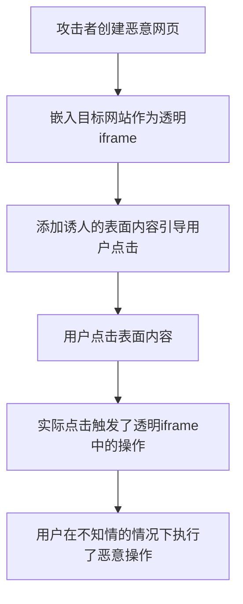

# JavaScript 点击劫持

## 什么是点击劫持？

点击劫持（Clickjacking）是一种通过视觉欺骗手段诱使用户点击看似无害但实际上是隐藏恶意操作的界面元素的攻击方式。攻击者通过将透明或不透明的层叠在用户希望点击的内容上，从而使用户在不知情的情况下触发隐藏操作。

:::caution 安全警告
点击劫持是一种常见的网络攻击方式，可能导致用户账户被盗、信息泄露或执行未授权操作。
:::

## 点击劫持的工作原理

点击劫持的核心技术是使用 `iframe` 嵌入目标网站，然后通过精心设计的 CSS 和定位技术使其透明或部分可见，同时将用户的注意力引导到表面的内容上。



## 点击劫持的实际例子

让我们来看一个简单的点击劫持示例：

```html
<!DOCTYPE html>
<html>
<head>
    <title>赢取免费礼品!</title>
    <style>
        #target_website {
            position: absolute;
            width: 500px;
            height: 500px;
            opacity: 0.00001;
            z-index: 2;
        }
        #decoy_content {
            position: absolute;
            width: 300px;
            height: 400px;
            z-index: 1;
            padding-top: 50px;
            text-align: center;
        }
        #click_button {
            margin-top: 70px;
            padding: 20px;
            font-size: 30px;
            background-color: red;
            color: white;
            border-radius: 10px;
            cursor: pointer;
        }
    </style>
</head>
<body>
    <iframe id="target_website" src="https://example.com/settings/delete-account"></iframe>
    
    <div id="decoy_content">
        <h1>点击领取您的免费礼品!</h1>
        <div id="click_button">立即领取!</div>
    </div>
</body>
</html>
```

在这个例子中：

1. 攻击者创建了一个看似提供免费礼品的网页
2. 实际上页面中嵌入了一个几乎透明的 iframe，链接到某网站的删除账户页面
3. 当用户点击"立即领取!"按钮时，实际上他们点击的是 iframe 中的"删除账户"按钮
4. 用户在不知情的情况下执行了删除自己账户的操作

## 常见的点击劫持攻击场景

1. **社交媒体攻击**：诱导用户无意间点击"分享"、"点赞"或"关注"按钮
2. **账户操作攻击**：诱导用户更改账户设置、删除账户或添加新的授权用户
3. **购物欺诈**：诱导用户点击购买按钮或更改配送地址
4. **机密信息泄露**：诱导用户点击允许访问私人信息的按钮

## 如何防御点击劫持攻击

### 1. X-Frame-Options HTTP 响应头

这是最常用的防御方法之一，通过设置 HTTP 响应头来控制页面是否可以被嵌入 iframe 中。

```javascript
// 在服务器端设置 HTTP 响应头
// 防止网页被嵌入到任何 iframe 中
response.setHeader("X-Frame-Options", "DENY");

// 仅允许同源页面嵌入
response.setHeader("X-Frame-Options", "SAMEORIGIN");

// 仅允许特定来源嵌入
response.setHeader("X-Frame-Options", "ALLOW-FROM https://trusted-site.com");
```

### 2. Content-Security-Policy (CSP)

CSP 是一种更现代化的方法，提供了更灵活的控制。

```javascript
// 使用 CSP 防止网页被嵌入
response.setHeader(
  "Content-Security-Policy", 
  "frame-ancestors 'none'"
);

// 仅允许同源嵌入
response.setHeader(
  "Content-Security-Policy", 
  "frame-ancestors 'self'"
);

// 允许特定源嵌入
response.setHeader(
  "Content-Security-Policy", 
  "frame-ancestors trusted-site.com another-site.com"
);
```

### 3. JavaScript 帧破坏技术

如果无法控制服务器响应头，可以使用 JavaScript 防止页面被嵌入到 iframe 中。

```javascript
// 检测当前页面是否被嵌入
if (window !== window.top) {
  // 如果页面被嵌入，则尝试在顶层窗口中打开
  window.top.location = window.location;
}
```

### 4. X-Frame-Options 和 CSP 结合使用

为了最大限度地保护网站，建议同时使用 X-Frame-Options 和 Content-Security-Policy。

```javascript
response.setHeader("X-Frame-Options", "SAMEORIGIN");
response.setHeader(
  "Content-Security-Policy", 
  "frame-ancestors 'self'"
);
```

## 为网站实现点击劫持防护的实用步骤

### 步骤 1: 评估您的网站需要的保护级别

考虑您的网站功能和敏感操作：
- 如果网站包含用户账户、支付功能或敏感信息，则需要最严格的防护
- 如果网站是纯内容展示，可能只需要基本防护

### 步骤 2: 实现服务器端防护

在 Node.js Express 应用中添加响应头:

```javascript
const express = require('express');
const app = express();

// 设置安全响应头的中间件
app.use((req, res, next) => {
  // 防止页面被嵌入到 iframe 中
  res.setHeader("X-Frame-Options", "SAMEORIGIN");
  
  // CSP 作为更强大的保护
  res.setHeader(
    "Content-Security-Policy", 
    "frame-ancestors 'self'"
  );
  
  next();
});

app.get('/', (req, res) => {
  res.send('Hello, secure world!');
});

app.listen(3000, () => {
  console.log('Server running on port 3000');
});
```

### 步骤 3: 添加客户端防护(作为备用)

在您的主 HTML 文件的 `<head>` 部分添加:

```html
<script>
  // 防止网站被嵌入到其他网站
  if (window !== window.top) {
    window.top.location = window.location;
  }
</script>
```

### 步骤 4: 定期测试您的防护措施

创建一个简单的测试页面，尝试将您的网站嵌入 iframe 中，确保防护措施有效。

```html
<!DOCTYPE html>
<html>
<head>
    <title>点击劫持测试</title>
</head>
<body>
    <h1>测试嵌入</h1>
    <iframe src="https://your-website.com" width="500" height="500"></iframe>
</body>
</html>
```

如果您的防护措施生效，iframe 将显示错误或者重定向到您的网站。

## 现实中的点击劫持案例

### Twitter点击劫持漏洞 (2009)

2009年，Twitter遭受了一次著名的点击劫持攻击。攻击者创建了一个"不要点击这里"按钮的网页，透明的Twitter关注按钮被置于其下。当用户好奇点击按钮时，实际上是点击了Twitter的"关注"按钮。这导致成千上万用户在不知情的情况下关注了特定账户。

### Adobe Flash点击劫持 (2008)

研究人员发现了Adobe Flash的一个漏洞，攻击者可以通过点击劫持技术访问用户电脑上的摄像头和麦克风。攻击者创建了一个游戏页面，诱导用户点击透明的Adobe Flash设置按钮，从而获取摄像头访问权限。

:::warning 重要提示
这些案例强调了点击劫持不仅仅影响网页操作，还可能危及用户设备安全和隐私。
:::

## 总结

点击劫持是一种巧妙但危险的Web攻击技术，通过视觉欺骗诱导用户执行未知操作。关键防御措施包括:

- 使用 X-Frame-Options HTTP 头部限制 iframe 嵌入
- 实现内容安全策略(CSP)
- 使用 JavaScript 帧破坏技术作为额外保护
- 结合多层防御策略确保最大安全性

理解点击劫持的工作原理和防御措施对于开发安全的Web应用程序至关重要，可以有效保护用户免受此类攻击。

## 练习

1. 创建一个简单的HTML页面，实现基本的点击劫持演示(仅用于教育目的)
2. 为同一页面实现防点击劫持措施，然后测试其效果
3. 使用浏览器开发工具检查知名网站的HTTP响应头，看它们是否实现了点击劫持保护

## 附加资源

- [OWASP点击劫持详解](https://owasp.org/www-community/attacks/Clickjacking)
- [MDN Web文档: Content-Security-Policy](https://developer.mozilla.org/en-US/docs/Web/HTTP/Headers/Content-Security-Policy)
- [MDN Web文档: X-Frame-Options](https://developer.mozilla.org/en-US/docs/Web/HTTP/Headers/X-Frame-Options)

通过理解并实施这些防护措施，你可以显著提高你的网站安全性，保护用户免受点击劫持攻击的威胁。