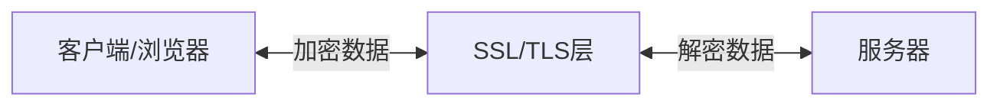

# JavaScript HTTPS

## 什么是HTTPS？

HTTPS（Hypertext Transfer Protocol Secure）是HTTP协议的安全版本，它通过SSL/TLS协议加密HTTP请求和响应，确保数据在客户端和服务器之间的传输过程中的安全性和完整性。

:::tip
HTTPS = HTTP + SSL/TLS 加密层
:::

在现代Web开发中，HTTPS已经成为标准实践，特别是当你的网站处理用户数据、认证信息或任何敏感信息时。



## 为什么JavaScript开发者需要了解HTTPS

作为JavaScript开发者，了解HTTPS的工作原理和最佳实践至关重要，原因如下：

1. **安全API访问**：许多现代API和浏览器功能要求使用HTTPS
2. **保护用户数据**：防止数据在传输过程中被窃取或篡改
3. **建立用户信任**：浏览器会对HTTP网站显示"不安全"警告
4. **提升SEO排名**：搜索引擎优先考虑HTTPS网站
5. **启用现代Web功能**：许多先进功能（如Service Workers）要求HTTPS环境

## JavaScript 中的HTTPS相关特性

### 1. 混合内容问题

当HTTPS网页加载HTTP资源（如图片、脚本或样式表）时，就会出现混合内容问题。现代浏览器会阻止这种混合内容，从而可能破坏网站功能。

:::warning
混合内容会导致安全警告，降低用户信任度，并可能阻止某些内容加载。
:::

**检测并解决混合内容**：

```javascript
// 检查页面是否通过HTTPS加载
function isSecureContext() {
  return window.location.protocol === 'https:';
}

// 将不安全资源转换为安全资源
function secureUrl(url) {
  if (isSecureContext() && url.startsWith('http:')) {
    return url.replace('http:', 'https:');
  }
  return url;
}

// 使用示例
const imageUrl = secureUrl('http://example.com/image.jpg');
document.getElementById('myImage').src = imageUrl;
```

### 2. 内容安全策略 (CSP)

内容安全策略是一种安全机制，可以帮助防止跨站脚本攻击（XSS）和数据注入攻击。通过CSP，你可以指定浏览器只执行来自可信来源的脚本。

**设置CSP的方法**：

1. 通过HTTP头部（由服务器设置）：

```
Content-Security-Policy: default-src https:; script-src 'self' https://trusted-cdn.com;
```

2. 通过`<meta>`标签（在HTML中设置）：

```html
<meta http-equiv="Content-Security-Policy" 
      content="default-src https:; script-src 'self' https://trusted-cdn.com;">
```

### 3. 使用Fetch API进行安全请求

`fetch()` API是现代JavaScript中进行网络请求的标准方式。在HTTPS环境下，它提供了额外的安全特性：

```javascript
// 基本的安全fetch请求
fetch('https://api.example.com/data', {
  method: 'POST',
  headers: {
    'Content-Type': 'application/json'
  },
  body: JSON.stringify({ username: 'user1', queryType: 'secure-data' }),
  credentials: 'same-origin' // 控制如何发送凭据（cookie）
})
.then(response => {
  if (!response.ok) {
    throw new Error('Network response was not ok');
  }
  return response.json();
})
.then(data => console.log('Success:', data))
.catch(error => console.error('Error:', error));
```

:::note
在HTTPS环境中，使用`credentials: 'include'`可以安全地发送跨域cookie，这在HTTP环境中是有风险的。
:::

### 4. 安全WebSockets

WebSockets提供全双工通信渠道，HTTPS环境使用安全的WebSocket连接（wss://）：

```javascript
// 创建一个安全的WebSocket连接
const socket = new WebSocket('wss://secure-socket-server.example.com');

socket.onopen = function(event) {
  console.log('连接已建立');
  socket.send(JSON.stringify({
    type: 'authentication',
    token: 'user-auth-token'
  }));
};

socket.onmessage = function(event) {
  const data = JSON.parse(event.data);
  console.log('收到消息:', data);
};

socket.onclose = function(event) {
  console.log('连接已关闭:', event.code, event.reason);
};

socket.onerror = function(error) {
  console.error('WebSocket错误:', error);
};
```

## HTTPS的实际应用场景

### 场景1：创建安全的登录表单

登录表单处理敏感信息，必须在HTTPS环境下运行：

```javascript
document.getElementById('loginForm').addEventListener('submit', function(event) {
  event.preventDefault();
  
  // 首先检查是否在HTTPS环境
  if (window.location.protocol !== 'https:') {
    alert('登录必须在安全连接下进行！');
    return;
  }
  
  const username = document.getElementById('username').value;
  const password = document.getElementById('password').value;
  
  fetch('https://api.example.com/login', {
    method: 'POST',
    headers: {
      'Content-Type': 'application/json'
    },
    body: JSON.stringify({ username, password }),
    credentials: 'same-origin'
  })
  .then(response => response.json())
  .then(data => {
    if (data.success) {
      sessionStorage.setItem('authToken', data.token);
      window.location.href = '/dashboard';
    } else {
      document.getElementById('errorMessage').textContent = '用户名或密码不正确';
    }
  })
  .catch(error => {
    document.getElementById('errorMessage').textContent = '登录失败，请稍后再试';
    console.error('登录错误:', error);
  });
});
```

### 场景2：支付处理系统

电子商务网站中处理支付信息需要HTTPS提供的安全性：

```javascript
class SecurePaymentProcessor {
  constructor() {
    // 确保在HTTPS环境下运行
    if (window.location.protocol !== 'https:') {
      throw new Error('支付处理必须在HTTPS环境下运行！');
    }
    
    this.paymentApiUrl = 'https://payment-gateway.example.com/process';
  }
  
  async processPayment(paymentDetails) {
    try {
      const response = await fetch(this.paymentApiUrl, {
        method: 'POST',
        headers: {
          'Content-Type': 'application/json',
          'Authorization': `Bearer ${this.getAuthToken()}`
        },
        body: JSON.stringify(paymentDetails)
      });
      
      const result = await response.json();
      
      if (result.status === 'success') {
        return {
          success: true,
          transactionId: result.transactionId
        };
      } else {
        return {
          success: false,
          error: result.errorMessage
        };
      }
    } catch (error) {
      console.error('支付处理错误:', error);
      return {
        success: false,
        error: '支付处理失败，请稍后再试'
      };
    }
  }
  
  getAuthToken() {
    return sessionStorage.getItem('paymentToken');
  }
}

// 使用示例
const paymentProcessor = new SecurePaymentProcessor();
document.getElementById('paymentForm').addEventListener('submit', async function(event) {
  event.preventDefault();
  
  const paymentDetails = {
    cardNumber: document.getElementById('cardNumber').value,
    expiryDate: document.getElementById('expiryDate').value,
    cvv: document.getElementById('cvv').value,
    amount: document.getElementById('amount').value
  };
  
  const result = await paymentProcessor.processPayment(paymentDetails);
  
  if (result.success) {
    showSuccessMessage(`支付成功！交易ID: ${result.transactionId}`);
  } else {
    showErrorMessage(`支付失败: ${result.error}`);
  }
});
```

## HTTPS的开发和调试

### 本地开发环境设置HTTPS

在本地开发环境中使用HTTPS可以帮助你测试需要安全上下文的功能：

#### 使用Node.js创建本地HTTPS服务器：

```javascript
const https = require('https');
const fs = require('fs');
const express = require('express');

const app = express();

// 静态文件服务
app.use(express.static('public'));
app.use(express.json());

// 简单的API端点
app.get('/api/data', (req, res) => {
  res.json({ message: '这是来自安全API的数据' });
});

// HTTPS选项 - 使用自签名证书
const options = {
  key: fs.readFileSync('localhost-key.pem'),
  cert: fs.readFileSync('localhost-cert.pem')
};

// 创建HTTPS服务器
https.createServer(options, app).listen(3000, () => {
  console.log('HTTPS服务器运行在 https://localhost:3000/');
});
```

### 使用现代工具创建开发证书

可以使用`mkcert`工具为本地开发创建可信证书：

```bash
# 安装mkcert (MacOS示例)
brew install mkcert
mkcert -install
mkcert localhost 127.0.0.1 ::1
```

:::tip
使用`mkcert`创建的证书在开发机器上会被视为可信，避免了开发时的证书警告问题。
:::

## 最佳实践

1. **始终使用HTTPS**：即使是开发环境也应使用HTTPS，这样可以尽早发现相关问题

2. **设置严格的内容安全策略**：限制资源加载来源，减少XSS风险

3. **启用HSTS**：HTTP严格传输安全(HSTS)可防止协议降级攻击

4. **确保所有资源通过HTTPS加载**：防止混合内容警告

5. **适当设置cookie安全标志**：
   ```javascript
   document.cookie = "sessionId=abc123; Secure; SameSite=Strict; HttpOnly";
   ```

6. **实现子资源完整性(SRI)**：
   ```html
   <script src="https://cdn.example.com/script.js" 
           integrity="sha384-oqVuAfXRKap7fdgcCY5uykM6+R9GqQ8K/uxy9rx7HNQlGYl1kPzQho1wx4JwY8wC" 
           crossorigin="anonymous"></script>
   ```

7. **使用HTTPS请求的现代功能**：如Service Workers，只能在HTTPS环境下工作

## 总结

HTTPS对于现代JavaScript开发至关重要，它不仅提供了数据传输的安全性和完整性，还是许多现代Web功能的前提条件。了解如何在JavaScript应用中正确使用HTTPS将帮助你构建更安全、更现代的Web应用。

作为前端开发者，虽然HTTPS的服务器配置通常由后端团队处理，但了解其工作原理、相关的JavaScript API以及最佳实践，可以帮助你避免常见的安全陷阱，并创建更安全的应用程序。

## 实践练习

1. 创建一个本地HTTPS开发环境，并测试一个需要安全上下文的API（如地理位置API）。

2. 分析一个现有网站，查找并修复混合内容问题。

3. 为你的项目实现一个基本的内容安全策略，并测试其有效性。

4. 创建一个使用安全WebSocket连接的简单聊天应用程序。

## 延伸阅读

- [MDN Web Docs: HTTPS](https://developer.mozilla.org/zh-CN/docs/Web/HTTP/HTTPS)
- [内容安全策略 (CSP)](https://developer.mozilla.org/zh-CN/docs/Web/HTTP/CSP)
- [混合内容](https://developer.mozilla.org/zh-CN/docs/Web/Security/Mixed_content)
- [HTTP严格传输安全 (HSTS)](https://developer.mozilla.org/zh-CN/docs/Web/HTTP/Headers/Strict-Transport-Security)