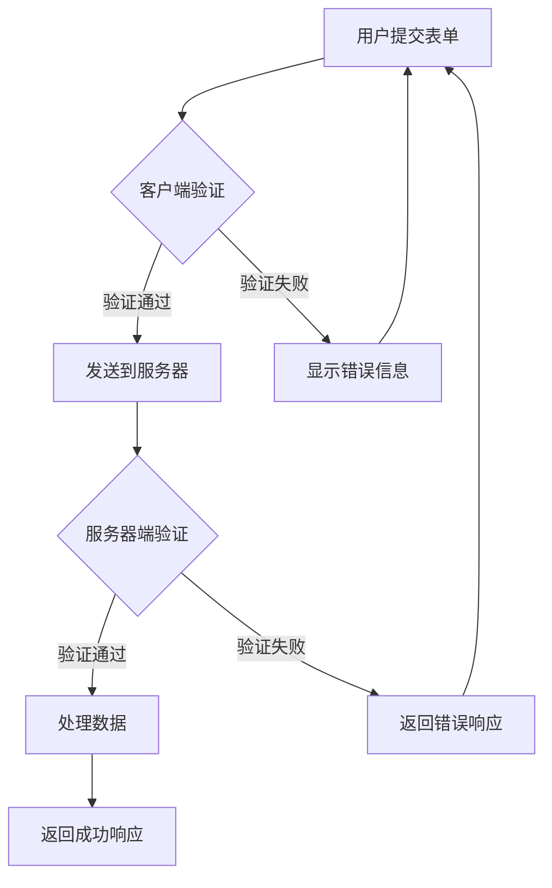

# JavaScript 输入验证

## 什么是输入验证？

输入验证是检查用户提供的数据是否符合预期格式和内容的过程。在Web开发中，这是一项至关重要的安全措施，可以防止恶意用户利用输入漏洞进行攻击，同时也能提升用户体验，即时为用户提供反馈。

:::tip
良好的输入验证不仅可以提高应用程序的安全性，还可以改善用户体验，减少服务器处理无效数据的负担。
:::

## 为什么输入验证很重要？

1. **安全性** - 防止跨站脚本攻击(XSS)、SQL注入等安全威胁
2. **数据完整性** - 确保接收到的数据格式正确且有效
3. **用户体验** - 即时向用户提供反馈，减少表单提交后的错误
4. **减轻服务器负担** - 在客户端过滤掉明显无效的数据

## 输入验证的类型

### 1. 客户端验证

在用户的浏览器中进行初步验证，可以提供即时反馈，但不能被完全信任（用户可能会绕过）。

```javascript
// 客户端验证示例
function validateEmail(email) {
  const re = /^[^\s@]+@[^\s@]+\.[^\s@]+$/;
  return re.test(email);
}

const emailInput = document.getElementById('email');
const errorMsg = document.getElementById('error-message');

emailInput.addEventListener('blur', function() {
  if (!validateEmail(this.value)) {
    errorMsg.textContent = '请输入有效的电子邮件地址';
    emailInput.classList.add('error');
  } else {
    errorMsg.textContent = '';
    emailInput.classList.remove('error');
  }
});
```

### 2. 服务器端验证

在服务器上进行最终验证，这是必不可少的安全层，无法被用户绕过。

```javascript
// 服务器端验证示例 (Node.js)
app.post('/register', (req, res) => {
  const email = req.body.email;
  
  // 服务器端验证
  if (!validateEmail(email)) {
    return res.status(400).json({ error: '无效的电子邮件地址' });
  }
  
  // 继续处理有效数据...
});
```

:::caution
永远不要只依赖客户端验证！客户端验证是为了用户体验，服务器端验证是为了安全性。
:::

## 常见的验证技术

### 1. 正则表达式验证

正则表达式是进行文本模式匹配的强大工具，特别适合验证特定格式的输入。

```javascript
// 常用正则表达式示例
const patterns = {
  email: /^[^\s@]+@[^\s@]+\.[^\s@]+$/,
  phone: /^\d{11}$/,  // 简单的11位手机号码验证（中国）
  password: /^(?=.*[A-Za-z])(?=.*\d)[A-Za-z\d]{8,}$/  // 至少8位，包含字母和数字
};

function validate(value, type) {
  return patterns[type].test(value);
}

console.log(validate('test@example.com', 'email'));  // 输出: true
console.log(validate('12345', 'password'));  // 输出: false
```

### 2. 内置表单验证

HTML5提供了内置的表单验证属性，如`required`、`pattern`、`min`、`max`等。

```html
<form>
  <input type="email" id="email" required />
  <input type="password" id="password" minlength="8" required />
  <input type="number" id="age" min="18" max="100" />
  <button type="submit">提交</button>
</form>
```

### 3. 验证库

对于复杂的验证需求，可以使用成熟的验证库，如Joi、Yup或validator.js。

```javascript
// 使用validator.js示例
import validator from 'validator';

const isValid = validator.isEmail('test@example.com');
console.log(isValid);  // 输出: true
```

## 防止常见的安全漏洞

### XSS (跨站脚本攻击) 防护

XSS攻击发生在恶意用户将JavaScript代码注入到您的网站时。您应该始终验证和转义用户输入。

```javascript
// 不安全的方式
document.getElementById('output').innerHTML = userInput;

// 安全的方式
function escapeHTML(unsafeText) {
  return unsafeText
    .replace(/&/g, '&amp;')
    .replace(/</g, '&lt;')
    .replace(/>/g, '&gt;')
    .replace(/"/g, '&quot;')
    .replace(/'/g, '&#039;');
}

document.getElementById('output').innerHTML = escapeHTML(userInput);
```

### SQL注入防护

当在构建SQL查询时使用未验证的用户输入，可能导致SQL注入攻击。始终使用参数化查询或ORM。

```javascript
// 不安全的方式 (Node.js + MySQL)
const query = `SELECT * FROM users WHERE username = '${userInput}'`;

// 安全的方式
const query = `SELECT * FROM users WHERE username = ?`;
connection.query(query, [userInput], function(err, results) {
  // 处理结果
});
```

## 实际案例：注册表单验证

以下是一个完整的注册表单验证例子：

```html
<!DOCTYPE html>
<html lang="zh">
<head>
  <meta charset="UTF-8">
  <title>注册表单</title>
  <style>
    .error { color: red; }
    .valid { border-color: green; }
    .invalid { border-color: red; }
  </style>
</head>
<body>
  <form id="registrationForm">
    <div>
      <label for="username">用户名:</label>
      <input type="text" id="username" required minlength="4">
      <span id="username-error" class="error"></span>
    </div>
    <div>
      <label for="email">电子邮件:</label>
      <input type="email" id="email" required>
      <span id="email-error" class="error"></span>
    </div>
    <div>
      <label for="password">密码:</label>
      <input type="password" id="password" required minlength="8">
      <span id="password-error" class="error"></span>
    </div>
    <div>
      <label for="confirmPassword">确认密码:</label>
      <input type="password" id="confirmPassword" required>
      <span id="confirm-error" class="error"></span>
    </div>
    <button type="submit">注册</button>
  </form>

  <script>
    document.getElementById('registrationForm').addEventListener('submit', function(e) {
      e.preventDefault();
      
      // 获取表单字段
      const username = document.getElementById('username');
      const email = document.getElementById('email');
      const password = document.getElementById('password');
      const confirmPassword = document.getElementById('confirmPassword');
      
      // 清除所有错误消息
      clearErrors();
      
      // 验证用户名
      if (username.value.length < 4) {
        showError('username-error', '用户名至少需要4个字符');
        markInvalid(username);
        return;
      }
      
      // 验证电子邮件
      const emailPattern = /^[^\s@]+@[^\s@]+\.[^\s@]+$/;
      if (!emailPattern.test(email.value)) {
        showError('email-error', '请提供有效的电子邮件地址');
        markInvalid(email);
        return;
      }
      
      // 验证密码强度
      const passwordPattern = /^(?=.*[A-Za-z])(?=.*\d)[A-Za-z\d]{8,}$/;
      if (!passwordPattern.test(password.value)) {
        showError('password-error', '密码至少需要8个字符，并包含字母和数字');
        markInvalid(password);
        return;
      }
      
      // 验证密码匹配
      if (password.value !== confirmPassword.value) {
        showError('confirm-error', '两次输入的密码不匹配');
        markInvalid(confirmPassword);
        return;
      }
      
      // 如果所有验证通过，则提交表单
      alert('注册成功!');
      // 在实际应用中，您会在这里发送AJAX请求到服务器
    });
    
    function showError(id, message) {
      document.getElementById(id).textContent = message;
    }
    
    function clearErrors() {
      const errors = document.querySelectorAll('.error');
      errors.forEach(error => error.textContent = '');
      
      const inputs = document.querySelectorAll('input');
      inputs.forEach(input => {
        input.classList.remove('invalid');
        input.classList.remove('valid');
      });
    }
    
    function markInvalid(input) {
      input.classList.add('invalid');
      input.classList.remove('valid');
    }
    
    // 实时验证
    const inputs = document.querySelectorAll('input');
    inputs.forEach(input => {
      input.addEventListener('blur', function() {
        if (this.checkValidity()) {
          this.classList.add('valid');
          this.classList.remove('invalid');
        } else {
          this.classList.add('invalid');
          this.classList.remove('valid');
        }
      });
    });
  </script>
</body>
</html>
```

## 最佳实践

1. **分层验证** - 同时在客户端和服务器端进行验证
2. **明确的错误消息** - 提供清晰的错误信息，但不要泄露敏感信息
3. **实时反馈** - 当用户离开输入字段时立即验证
4. **白名单而非黑名单** - 指定允许什么内容，而不是禁止什么内容
5. **不信任用户输入** - 始终假设用户输入可能是恶意的
6. **规范化输入** - 在验证前对输入进行标准化处理

## 验证流程图



## 总结

输入验证是Web安全的基础，它能帮助防止各种常见的Web攻击，同时提高用户体验。一个完整的验证策略应该包括：

1. 客户端验证用于提供即时用户反馈
2. 服务器端验证作为安全的最后防线
3. 适当的错误处理和用户反馈
4. 防XSS和SQL注入的数据清理

无论应用程序的大小如何，都不应忽视输入验证。它是构建安全、健壮Web应用程序的基本要素。

## 练习

1. 创建一个信用卡号验证函数，使用Luhn算法验证信用卡号的有效性。
2. 实现一个表单，包含电子邮件、密码和确认密码字段，并添加适当的验证。
3. 研究如何使用一个验证库（如Yup或Joi）来验证复杂的表单数据。

## 附加资源

- [MDN Web Docs: 客户端表单验证](https://developer.mozilla.org/zh-CN/docs/Learn/Forms/Form_validation)
- [OWASP: 输入验证备忘单](https://cheatsheetseries.owasp.org/cheatsheets/Input_Validation_Cheat_Sheet.html)
- [正则表达式测试工具](https://regex101.com/)
- [validator.js GitHub仓库](https://github.com/validatorjs/validator.js)

:::note
记住：输入验证是防御性编程的一部分，但它应该与其他安全措施（如HTTPS、CSRF保护、适当的访问控制等）结合使用，以创建全面的安全策略。
:::