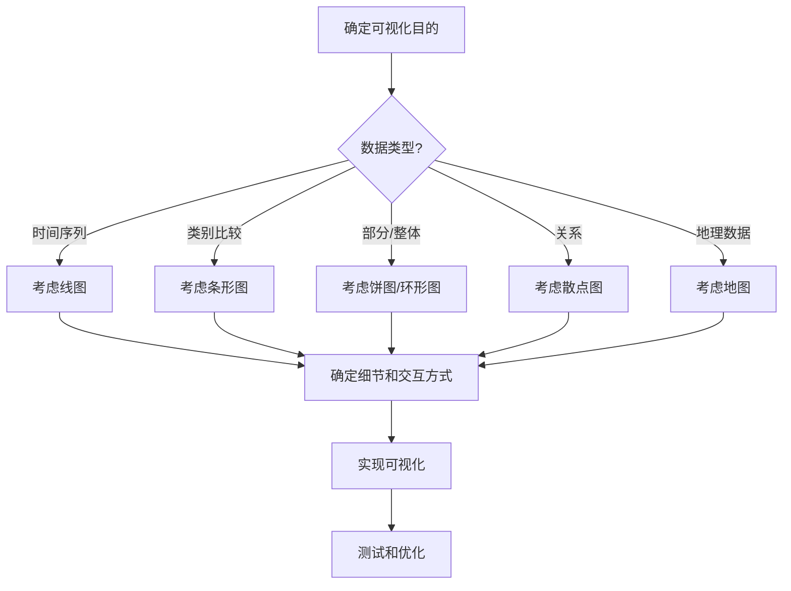

# JavaScript 数据可视化基础

## 什么是数据可视化？

数据可视化是将数据以图形化方式呈现的过程，使人们能够更容易理解和分析数据中的模式、趋势和关系。在当今信息爆炸的时代，数据可视化已成为理解复杂数据集的重要工具。

JavaScript作为网络的编程语言，提供了强大的数据可视化能力，使开发者能够在网页上创建交互式、动态的数据展示。

:::tip 为什么学习JavaScript数据可视化？
- 增强数据分析能力
- 创建交互式网页应用
- 提高用户体验
- 在职场中获得竞争优势
:::

## 数据可视化的基本元素

在深入学习JavaScript数据可视化之前，我们需要了解一些基本元素：

1. **数据**：可视化的原材料
2. **视觉编码**：如何将数据映射到视觉属性（位置、大小、颜色等）
3. **标记**：用于表示数据的视觉元素（线条、条形、圆形等）
4. **交互**：允许用户探索和操作可视化效果的机制

## JavaScript 数据可视化库概览

JavaScript有许多强大的数据可视化库，以下是一些最流行的：

1. **D3.js** - 最强大和灵活的数据可视化库
2. **Chart.js** - 简单易用的图表库
3. **Plotly.js** - 高级交互式图表
4. **Highcharts** - 商业级别的图表库
5. **Leaflet** - 交互式地图

在本教程中，我们将重点介绍Chart.js，因为它对初学者非常友好，同时提供了丰富的功能。

## 使用Chart.js创建你的第一个图表

### 第一步：设置环境

首先，我们需要在HTML页面中引入Chart.js库：

```html
<!DOCTYPE html>
<html>
<head>
  <title>我的第一个Chart.js图表</title>
  <script src="https://cdn.jsdelivr.net/npm/chart.js"></script>
</head>
<body>
  <div style="width: 600px; height: 400px">
    <canvas id="myChart"></canvas>
  </div>
  <script>
    // 我们的JavaScript代码将放在这里
  </script>
</body>
</html>
```

### 第二步：准备数据

数据可视化的核心是数据。让我们创建一些简单的数据：

```javascript
const data = {
  labels: ['一月', '二月', '三月', '四月', '五月', '六月'],
  datasets: [{
    label: '2023年月销售额（万元）',
    data: [12, 19, 3, 5, 2, 3],
    backgroundColor: [
      'rgba(255, 99, 132, 0.2)',
      'rgba(54, 162, 235, 0.2)',
      'rgba(255, 206, 86, 0.2)',
      'rgba(75, 192, 192, 0.2)',
      'rgba(153, 102, 255, 0.2)',
      'rgba(255, 159, 64, 0.2)'
    ],
    borderColor: [
      'rgba(255, 99, 132, 1)',
      'rgba(54, 162, 235, 1)',
      'rgba(255, 206, 86, 1)',
      'rgba(75, 192, 192, 1)',
      'rgba(153, 102, 255, 1)',
      'rgba(255, 159, 64, 1)'
    ],
    borderWidth: 1
  }]
};
```

### 第三步：创建图表

现在我们可以使用Chart.js创建一个条形图：

```javascript
const ctx = document.getElementById('myChart').getContext('2d');
const myChart = new Chart(ctx, {
  type: 'bar',
  data: data,
  options: {
    responsive: true,
    scales: {
      y: {
        beginAtZero: true
      }
    }
  }
});
```

这段代码会创建一个基本的条形图，展示每个月的销售数据。

## 图表类型及其应用场景

Chart.js支持多种图表类型，每种类型适合不同的数据展示需求：

### 线图（Line）

适合展示连续数据的趋势，如股票价格或温度变化。

```javascript
const lineChart = new Chart(ctx, {
  type: 'line',
  data: {
    labels: ['一月', '二月', '三月', '四月', '五月', '六月'],
    datasets: [{
      label: '月度网站访问量',
      data: [65, 59, 80, 81, 56, 55],
      fill: false,
      borderColor: 'rgb(75, 192, 192)',
      tension: 0.1
    }]
  }
});
```

### 饼图（Pie）

适合展示部分与整体的关系，如市场份额或预算分配。

```javascript
const pieChart = new Chart(ctx, {
  type: 'pie',
  data: {
    labels: ['红色', '蓝色', '黄色', '绿色', '紫色', '橙色'],
    datasets: [{
      label: '颜色偏好',
      data: [12, 19, 3, 5, 2, 3],
      backgroundColor: [
        'rgba(255, 99, 132, 0.8)',
        'rgba(54, 162, 235, 0.8)',
        'rgba(255, 206, 86, 0.8)',
        'rgba(75, 192, 192, 0.8)',
        'rgba(153, 102, 255, 0.8)',
        'rgba(255, 159, 64, 0.8)'
      ]
    }]
  }
});
```

### 雷达图（Radar）

适合比较多个变量在不同类别上的表现，如产品特性评分。

```javascript
const radarChart = new Chart(ctx, {
  type: 'radar',
  data: {
    labels: ['吃饭', '喝水', '锻炼', '睡觉', '编程', '阅读'],
    datasets: [{
      label: '我的日常活动',
      data: [65, 59, 90, 81, 56, 55],
      fill: true,
      backgroundColor: 'rgba(255, 99, 132, 0.2)',
      borderColor: 'rgb(255, 99, 132)',
      pointBackgroundColor: 'rgb(255, 99, 132)',
      pointBorderColor: '#fff'
    }]
  },
  options: {
    scales: {
      r: {
        angleLines: {
          display: false
        }
      }
    }
  }
});
```

## 交互式数据可视化

JavaScript的一个强大功能是能够创建交互式可视化。以下是一些方法：

### 添加工具提示（Tooltip）

```javascript
const chart = new Chart(ctx, {
  type: 'bar',
  data: data,
  options: {
    plugins: {
      tooltip: {
        callbacks: {
          label: function(context) {
            return `销售额: ${context.raw}万元`;
          }
        }
      }
    }
  }
});
```

### 添加点击事件

```javascript
const canvas = document.getElementById('myChart');
canvas.onclick = function(evt) {
  const activePoints = myChart.getElementsAtEventForMode(evt, 'nearest', { intersect: true }, true);
  
  if (activePoints.length > 0) {
    const firstPoint = activePoints[0];
    const label = myChart.data.labels[firstPoint.index];
    const value = myChart.data.datasets[firstPoint.datasetIndex].data[firstPoint.index];
    alert(`您点击了 ${label}: ${value}万元`);
  }
};
```

## 实际案例：销售数据仪表板

让我们创建一个简单的销售数据仪表板，展示月度销售趋势和产品类别分布：

```html
<!DOCTYPE html>
<html>
<head>
  <title>销售数据仪表板</title>
  <script src="https://cdn.jsdelivr.net/npm/chart.js"></script>
  <style>
    .chart-container {
      display: flex;
      justify-content: space-around;
      flex-wrap: wrap;
      margin-top: 50px;
    }
    .chart {
      width: 45%;
      min-width: 300px;
      margin-bottom: 30px;
    }
  </style>
</head>
<body>
  <h1 style="text-align: center;">2023年销售数据仪表板</h1>
  <div class="chart-container">
    <div class="chart">
      <canvas id="salesTrend"></canvas>
    </div>
    <div class="chart">
      <canvas id="categoryDistribution"></canvas>
    </div>
  </div>

  <script>
    // 月度销售趋势图
    const trendCtx = document.getElementById('salesTrend').getContext('2d');
    new Chart(trendCtx, {
      type: 'line',
      data: {
        labels: ['一月', '二月', '三月', '四月', '五月', '六月'],
        datasets: [{
          label: '月度销售额（万元）',
          data: [65, 59, 80, 81, 56, 85],
          fill: false,
          borderColor: 'rgb(75, 192, 192)',
          tension: 0.1
        }]
      },
      options: {
        responsive: true,
        plugins: {
          title: {
            display: true,
            text: '月度销售趋势'
          }
        }
      }
    });

    // 产品类别分布图
    const catCtx = document.getElementById('categoryDistribution').getContext('2d');
    new Chart(catCtx, {
      type: 'doughnut',
      data: {
        labels: ['电子产品', '服装', '食品', '家具', '图书'],
        datasets: [{
          label: '类别销售额',
          data: [35, 25, 22, 10, 8],
          backgroundColor: [
            'rgba(255, 99, 132, 0.8)',
            'rgba(54, 162, 235, 0.8)',
            'rgba(255, 206, 86, 0.8)',
            'rgba(75, 192, 192, 0.8)',
            'rgba(153, 102, 255, 0.8)'
          ]
        }]
      },
      options: {
        responsive: true,
        plugins: {
          title: {
            display: true,
            text: '产品类别销售分布'
          }
        }
      }
    });
  </script>
</body>
</html>
```

这个例子创建了一个包含两个图表的仪表板：一个展示月度销售趋势的线图和一个展示产品类别分布的环形图。

## 数据可视化的最佳实践

### 1. 选择正确的图表类型

根据你要传达的信息选择合适的图表：
- 趋势 → 线图
- 比较不同类别 → 条形图
- 部分与整体关系 → 饼图或环形图
- 分布 → 散点图或直方图

### 2. 保持简洁清晰

避免图表杂乱（chartjunk）：
- 移除不必要的元素
- 限制颜色的使用
- 确保标签清晰可读

### 3. 提供上下文

确保你的可视化包含足够的上下文信息：
- 清晰的标题和标签
- 数据来源
- 时间范围

### 4. 考虑用户体验

- 添加交互元素，让用户能够探索数据
- 确保可视化在不同设备上都能正常显示
- 考虑无障碍设计（如色盲友好的色彩选择）

## 数据可视化的决策流程

以下是一个简单的决策流程图，帮助你选择合适的可视化方法：



## 总结

JavaScript数据可视化是一个强大的工具，可以帮助我们理解和传达数据中的见解。在本教程中，我们：

1. 了解了数据可视化的基本概念
2. 探索了JavaScript数据可视化库，特别是Chart.js
3. 学习了如何创建各种类型的图表
4. 掌握了添加交互性的方法
5. 实现了一个实际的销售数据仪表板
6. 了解了数据可视化的最佳实践

数据可视化是一项既需要技术技能，也需要设计感的工作。随着实践的增加，你将能够创建既美观又有洞察力的可视化效果。

## 练习与进阶学习

### 练习

1. 修改本教程中的条形图，使其显示过去12个月的数据
2. 创建一个包含两个数据集的线图，比较两年的销售数据
3. 设计一个交互式饼图，点击各个部分时显示详细信息

### 进阶学习资源

- **D3.js** - 更高级、更灵活的数据可视化库
- **数据可视化设计原则** - 学习如何设计更有效的可视化
- **大型数据集的可视化技术** - 处理和可视化大规模数据

:::caution 注意事项
数据可视化不仅仅是技术实现，还涉及数据理解、设计思维和用户体验。随着学习的深入，请关注这些方面，创建真正有价值的可视化作品。
:::

希望这个教程能够帮助你开始JavaScript数据可视化的旅程！记住，最好的学习方式是通过实践，所以立即开始创建你自己的可视化项目吧。