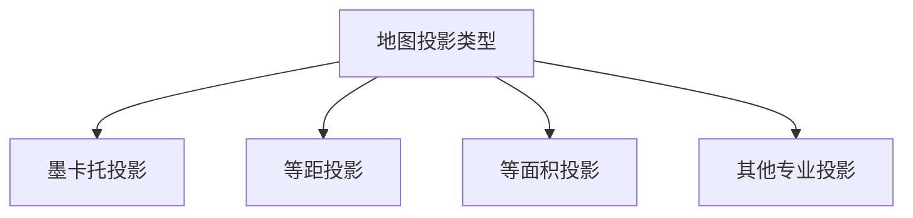

# JavaScript 地图可视化

## 介绍

地图可视化是数据可视化中一个重要的分支，它允许我们以地理位置为基础展示和分析数据。在网页应用中，JavaScript提供了丰富的工具和库来创建交互式地图可视化，帮助用户理解地理空间数据和模式。

地图可视化常用于：
- 展示地理分布数据（如人口密度、天气状况）
- 创建位置标记和热力图
- 路线规划和导航
- 区域划分和数据对比

本教程将带你了解JavaScript地图可视化的基础知识，常用的库以及如何创建你自己的交互式地图。

## 地图可视化基础概念

在深入学习前，我们先了解一些基础概念：

### 1. 地图投影

地图投影是将球形地球表面转换到平面上的方法。不同的投影有不同的属性和用途：



### 2. 地理坐标系统

最常用的是经度(longitude)和纬度(latitude)：
- 经度：表示东西方向的位置，范围从-180度到180度
- 纬度：表示南北方向的位置，范围从-90度到90度

### 3. GeoJSON

GeoJSON是一种基于JSON的格式，用于表示地理特征。它可以描述点、线、面等地理实体。

```javascript
// 点的GeoJSON示例
const point = {
  "type": "Point",
  "coordinates": [121.4737, 31.2304]  // 上海坐标 [经度, 纬度]
};
```

## 常用的JavaScript地图可视化库

### 1. Leaflet.js

Leaflet是一个轻量级的开源JavaScript库，用于创建移动友好的交互式地图。

#### 基本用法：

```html
<!DOCTYPE html>
<html>
<head>
  <title>Leaflet示例</title>
  <link rel="stylesheet" href="https://unpkg.com/leaflet@1.7.1/dist/leaflet.css" />
  <script src="https://unpkg.com/leaflet@1.7.1/dist/leaflet.js"></script>
  <style>
    #map { height: 400px; }
  </style>
</head>
<body>
  <div id="map"></div>
  <script>
    // 初始化地图
    const map = L.map('map').setView([39.9042, 116.4074], 12);
    
    // 添加瓦片图层
    L.tileLayer('https://{s}.tile.openstreetmap.org/{z}/{x}/{y}.png', {
      attribution: '&copy; <a href="https://www.openstreetmap.org/copyright">OpenStreetMap</a> contributors'
    }).addTo(map);
    
    // 添加标记
    L.marker([39.9042, 116.4074])
      .addTo(map)
      .bindPopup('北京市中心')
      .openPopup();
  </script>
</body>
</html>
```

### 2. Mapbox GL JS

Mapbox GL JS是一个JavaScript库，用于创建交互式、可自定义的地图。它使用WebGL技术进行渲染，提供高性能的地图体验。

#### 基本用法：

```html
<!DOCTYPE html>
<html>
<head>
  <title>Mapbox GL JS示例</title>
  <link href="https://api.mapbox.com/mapbox-gl-js/v2.9.1/mapbox-gl.css" rel="stylesheet" />
  <script src="https://api.mapbox.com/mapbox-gl-js/v2.9.1/mapbox-gl.js"></script>
  <style>
    #map { height: 400px; }
  </style>
</head>
<body>
  <div id="map"></div>
  <script>
    mapboxgl.accessToken = 'YOUR_MAPBOX_ACCESS_TOKEN';
    const map = new mapboxgl.Map({
      container: 'map',
      style: 'mapbox://styles/mapbox/streets-v11',
      center: [116.4074, 39.9042], // 北京坐标 [经度, 纬度]
      zoom: 12
    });
    
    // 添加导航控件
    map.addControl(new mapboxgl.NavigationControl());
    
    // 添加标记
    new mapboxgl.Marker()
      .setLngLat([116.4074, 39.9042])
      .setPopup(new mapboxgl.Popup().setHTML("<h3>北京市中心</h3>"))
      .addTo(map);
  </script>
</body>
</html>
```

:::note
使用Mapbox GL JS需要注册一个Mapbox账号并获取访问令牌（access token）。
:::

### 3. D3.js

D3.js是一个强大的数据可视化库，也可以用来创建地图可视化。

#### 基本用法：

```html
<!DOCTYPE html>
<html>
<head>
  <title>D3.js地图示例</title>
  <script src="https://d3js.org/d3.v7.min.js"></script>
  <script src="https://d3js.org/topojson.v3.min.js"></script>
</head>
<body>
  <svg id="map" width="800" height="600"></svg>
  <script>
    // 设置投影
    const projection = d3.geoMercator()
      .center([104.0, 37.5])
      .scale(600)
      .translate([400, 300]);
    
    // 创建路径生成器
    const path = d3.geoPath().projection(projection);
    
    // 加载地图数据并渲染
    d3.json("https://cdn.jsdelivr.net/npm/china-geojson@1.0.0/geojson/china.json")
      .then(function(geojson) {
        d3.select("#map")
          .selectAll("path")
          .data(geojson.features)
          .enter()
          .append("path")
          .attr("d", path)
          .attr("fill", "#ccc")
          .attr("stroke", "#333")
          .attr("stroke-width", 0.5);
    });
  </script>
</body>
</html>
```

## 地图可视化进阶技术

### 1. 热力图

热力图是一种使用颜色变化来表示数据密度的可视化方法。

```javascript
// 使用Leaflet.heat插件创建热力图的例子
const heatData = [
  [39.9, 116.4, 0.8], // 纬度, 经度, 强度
  [39.92, 116.42, 0.6],
  [39.94, 116.38, 0.4],
  // 更多数据点...
];

L.heatLayer(heatData, {
  radius: 25,
  blur: 15,
  maxZoom: 10
}).addTo(map);
```

### 2. 区域着色

根据数据值对地图区域进行颜色编码，常用于展示统计数据。

```javascript
// D3.js区域着色示例
const colorScale = d3.scaleQuantize()
  .domain([0, 100])
  .range(d3.schemeBlues[9]);

d3.select("#map")
  .selectAll("path")
  .data(geojson.features)
  .enter()
  .append("path")
  .attr("d", path)
  .attr("fill", d => colorScale(d.properties.value))
  .attr("stroke", "#333")
  .attr("stroke-width", 0.5);
```

### 3. 地图标记聚类

当地图上有大量标记时，聚类可以提高可读性和性能。

```javascript
// 使用Leaflet.markercluster插件
const markers = L.markerClusterGroup();

for (let i = 0; i < points.length; i++) {
  const marker = L.marker([points[i].lat, points[i].lng]);
  markers.addLayer(marker);
}

map.addLayer(markers);
```

## 实际案例：新冠疫情地图

让我们创建一个简单的新冠疫情地图，展示不同国家的感染病例。

```html
<!DOCTYPE html>
<html>
<head>
  <title>COVID-19全球疫情地图</title>
  <link rel="stylesheet" href="https://unpkg.com/leaflet@1.7.1/dist/leaflet.css" />
  <script src="https://unpkg.com/leaflet@1.7.1/dist/leaflet.js"></script>
  <style>
    #covid-map { height: 600px; width: 100%; }
    .info { padding: 6px 8px; background: white; box-shadow: 0 0 15px rgba(0,0,0,0.2); border-radius: 5px; }
    .legend { color: #555; line-height: 18px; }
    .legend i { width: 18px; height: 18px; float: left; margin-right: 8px; opacity: 0.7; }
  </style>
</head>
<body>
  <h1>COVID-19全球疫情地图</h1>
  <div id="covid-map"></div>
  
  <script>
    // 初始化地图
    const map = L.map('covid-map').setView([30, 0], 2);
    
    L.tileLayer('https://{s}.tile.openstreetmap.org/{z}/{x}/{y}.png', {
      attribution: '&copy; <a href="https://www.openstreetmap.org/copyright">OpenStreetMap</a> contributors'
    }).addTo(map);
    
    // 加载示例数据（实际应用中应该从API获取）
    const covidData = [
      { country: "中国", lat: 35.8617, lng: 104.1954, cases: 95000 },
      { country: "美国", lat: 37.0902, lng: -95.7129, cases: 33000000 },
      { country: "印度", lat: 20.5937, lng: 78.9629, cases: 29000000 },
      { country: "巴西", lat: -14.2350, lng: -51.9253, cases: 17000000 },
      { country: "法国", lat: 46.2276, lng: 2.2137, cases: 5800000 }
    ];
    
    // 创建圆圈大小函数
    function getRadius(cases) {
      return Math.sqrt(cases) * 0.03;
    }
    
    // 添加圆圈标记
    covidData.forEach(item => {
      const circle = L.circle([item.lat, item.lng], {
        color: 'red',
        fillColor: '#f03',
        fillOpacity: 0.5,
        radius: getRadius(item.cases) * 1000
      }).addTo(map);
      
      circle.bindPopup(`<b>${item.country}</b><br>确诊病例: ${item.cases.toLocaleString()}`);
    });
    
    // 添加图例
    const legend = L.control({position: 'bottomright'});
    legend.onAdd = function (map) {
      const div = L.DomUtil.create('div', 'info legend');
      const grades = [10000, 100000, 1000000, 10000000];
      
      div.innerHTML = '<h4>确诊病例</h4>';
      
      for (let i = 0; i < grades.length; i++) {
        div.innerHTML +=
          '<i style="background: #f03; border-radius: 50%; width: ' + getRadius(grades[i]) * 2 + 
          'px; height: ' + getRadius(grades[i]) * 2 + 'px;"></i> ' +
          grades[i].toLocaleString() + (grades[i + 1] ? '&ndash;' + grades[i + 1].toLocaleString() + '<br>' : '+');
      }
      
      return div;
    };
    legend.addTo(map);
  </script>
</body>
</html>
```

这个例子展示了一个简单的COVID-19全球疫情地图，使用圆圈大小来表示各国的确诊病例数。在实际项目中，你可以通过API获取实时数据来更新地图。

## 地图数据源

创建地图可视化时，你需要地图数据。以下是一些常用的地图数据源：

1. **OpenStreetMap** - 免费的开源地图数据
2. **Natural Earth** - 公共领域地图数据集，适合小比例尺地图
3. **GADM** - 全球行政区划数据库
4. **各国官方地理信息系统(GIS)部门** - 提供高精度地图数据

## 性能优化技巧

处理大量地理数据时，性能优化非常重要：

1. **数据简化** - 使用工具如Mapshaper简化复杂的地理形状
2. **数据分块** - 只加载当前视图所需的数据
3. **使用WebGL渲染** - 如Mapbox GL JS可以利用GPU加速
4. **标记聚类** - 当有大量标记时使用聚类技术

## 总结

JavaScript地图可视化是一个强大的工具，可以帮助你以直观的方式展示地理数据。本教程介绍了：

- 地图可视化的基本概念
- 常用的JavaScript地图库（Leaflet.js、Mapbox GL JS、D3.js）
- 进阶技术（热力图、区域着色、标记聚类）
- 实际应用案例

通过结合这些工具和技术，你可以创建既美观又实用的交互式地图可视化。

## 练习与挑战

1. 尝试使用本教程中的一个库创建你所在城市的地图，并标记几个你喜欢的地点。
2. 获取一些人口数据，创建一个展示人口密度的区域着色地图。
3. 实现一个带有路线规划功能的地图应用。
4. 创建一个地图，展示实时天气数据。

## 延伸阅读资源

- [Leaflet.js文档](https://leafletjs.com/reference-1.7.1.html)
- [Mapbox GL JS文档](https://docs.mapbox.com/mapbox-gl-js/api/)
- [D3.js地理教程](https://d3indepth.com/geographic/)
- [GeoJSON规范](https://geojson.org/)
- 《Interactive Data Visualization for the Web》by Scott Murray

随着你对地图可视化的深入学习，你将能够创建更复杂、更有交互性的地图应用，帮助用户更好地理解地理数据和模式。