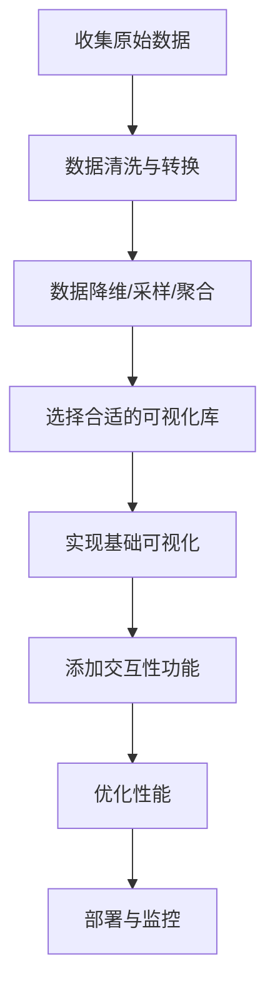

# JavaScript 大数据可视化

## 什么是大数据可视化？

大数据可视化是指通过图形化的方式展现复杂、庞大的数据集，使数据更直观、更易于理解和分析。在当今数据爆炸的时代，JavaScript凭借其在前端的强大能力，成为了大数据可视化的重要工具。

:::tip 为什么数据可视化重要？
数据可视化能够帮助我们发现数据中隐藏的模式、趋势和异常，从而做出更明智的决策。一张图胜过千言万语！
:::

## 大数据可视化的挑战

处理大数据集进行可视化面临着几个主要挑战：

1. **数据量大**：可能需要处理数百万甚至数十亿条记录
2. **性能问题**：浏览器渲染大量数据点可能导致卡顿
3. **交互性**：需要在大数据集上实现流畅的交互体验
4. **数据处理**：需要进行数据清洗、聚合和转换

## JavaScript 大数据可视化基础

### 数据处理技巧

在可视化大数据之前，首先需要处理数据。以下是一些常用技巧：

#### 1. 数据采样

当数据点过多时，可以采用采样技术：

```javascript
function sampleData(data, sampleSize) {
  const result = [];
  const step = Math.floor(data.length / sampleSize);
  
  for (let i = 0; i < data.length; i += step) {
    result.push(data[i]);
  }
  
  return result;
}

// 使用示例
const bigData = [...]; // 假设有100,000个数据点
const sampledData = sampleData(bigData, 1000); // 降至1,000个点
```

#### 2. 数据聚合

将数据点分组或聚合以减少数据量：

```javascript
function aggregateData(data, keyFunction, valueFunction) {
  const aggregated = {};
  
  data.forEach(item => {
    const key = keyFunction(item);
    if (!aggregated[key]) {
      aggregated[key] = 0;
    }
    aggregated[key] += valueFunction(item);
  });
  
  return Object.entries(aggregated).map(([key, value]) => ({key, value}));
}

// 使用示例 - 按月份聚合销售数据
const sales = [
  {date: '2023-01-15', amount: 120},
  {date: '2023-01-22', amount: 80},
  {date: '2023-02-10', amount: 200},
  // 更多数据...
];

const monthlySales = aggregateData(
  sales,
  item => item.date.substring(0, 7), // 按年月分组
  item => item.amount // 汇总金额
);

console.log(monthlySales);
// 输出: [{key: '2023-01', value: 200}, {key: '2023-02', value: 200}, ...]
```

### 使用Web Workers处理大数据

Web Workers允许在后台线程处理数据，避免阻塞主线程：

```javascript
// main.js
const worker = new Worker('data-processor.js');

worker.postMessage({
  action: 'process',
  data: largeDataset
});

worker.onmessage = function(e) {
  const processedData = e.data;
  // 使用处理后的数据进行可视化
  createVisualization(processedData);
};
```

```javascript
// data-processor.js
onmessage = function(e) {
  if (e.data.action === 'process') {
    const result = processData(e.data.data);
    postMessage(result);
  }
};

function processData(data) {
  // 执行数据处理操作
  // 例如：过滤、转换、聚合等
  return transformedData;
}
```

## 主流JavaScript大数据可视化库

### D3.js - 数据驱动文档

D3.js是最强大的JavaScript可视化库之一，特别适合自定义可视化：

```javascript
// 使用D3处理大数据并创建散点图
d3.csv("large_dataset.csv").then(data => {
  // 数据预处理
  const processedData = data
    .filter(d => d.value > 0)
    .map(d => ({
      x: +d.x,
      y: +d.y,
      category: d.category
    }));
    
  // 采样（如果数据量过大）
  const sampledData = processedData.length > 10000 
    ? sampleData(processedData, 10000) 
    : processedData;
    
  // 创建散点图
  const svg = d3.select("#visualization")
    .append("svg")
    .attr("width", width)
    .attr("height", height);
    
  svg.selectAll("circle")
    .data(sampledData)
    .enter()
    .append("circle")
    .attr("cx", d => xScale(d.x))
    .attr("cy", d => yScale(d.y))
    .attr("r", 3)
    .attr("fill", d => colorScale(d.category));
});
```

### ECharts - 企业级图表库

ECharts是百度开发的图表库，特别适合处理大数据集：

```javascript
// 初始化ECharts实例
const chart = echarts.init(document.getElementById('chart-container'));

// 配置图表选项
const option = {
  dataset: {
    source: largeDataset // 大型数据集
  },
  series: [{
    type: 'scatter',
    progressive: 200, // 渐进渲染，每次渲染200个点
    progressiveThreshold: 3000, // 超过3000个点时启用渐进渲染
    dimensions: ['x', 'y', 'value'],
    encode: {
      x: 'x',
      y: 'y',
      tooltip: ['x', 'y', 'value']
    }
  }],
  // 其他配置...
};

// 应用配置
chart.setOption(option);
```

:::note ECharts的渐进渲染
ECharts提供了渐进渲染（progressive rendering）功能，特别适合大数据集可视化，可以避免浏览器卡顿。
:::

### Plotly.js - 交互式图表库

Plotly.js提供了许多适合大数据可视化的功能：

```javascript
// 创建热力图展示大数据
Plotly.newPlot('heatmap-container', [{
  z: largeMatrix, // 大型二维数据矩阵
  type: 'heatmap',
  colorscale: 'Viridis',
  zsmooth: 'best' // 平滑插值
}], {
  title: '大数据热力图',
  width: 800,
  height: 600
});
```

### deck.gl - WebGL驱动的大数据可视化

deck.gl是Uber开发的WebGL可视化库，专为大数据集而设计：

```javascript
// 使用deck.gl绘制百万级数据点
const deck = new Deck({
  initialViewState: {
    longitude: -122.41669,
    latitude: 37.7853,
    zoom: 13,
    pitch: 0,
    bearing: 0
  },
  controller: true,
  layers: [
    new ScatterplotLayer({
      id: 'scatter-plot',
      data: millionsOfPoints, // 百万级数据点
      radiusScale: 10,
      getPosition: d => [d.longitude, d.latitude],
      getFillColor: d => [255, d.value * 255, 0],
      getRadius: 10,
      pickable: true
    })
  ],
  getTooltip: ({object}) => object && `Value: ${object.value}`
});
```

## 优化大数据可视化性能

### 1. 数据索引和快速查找

```javascript
// 创建数据索引以加快查询
function createIndex(data, keyFunc) {
  const index = new Map();
  
  data.forEach((item, i) => {
    const key = keyFunc(item);
    if (!index.has(key)) {
      index.set(key, []);
    }
    index.get(key).push(i);
  });
  
  return index;
}

// 使用示例
const userIndex = createIndex(users, user => user.country);
// 快速获取特定国家的用户
const usUsersIndices = userIndex.get('US'); 
const usUsers = usUsersIndices.map(i => users[i]);
```

### 2. 视口渲染(Viewport Rendering)

只渲染用户当前可见的数据点：

```javascript
function getVisiblePoints(allPoints, viewport) {
  return allPoints.filter(point => {
    return point.x >= viewport.left &&
           point.x <= viewport.right &&
           point.y >= viewport.top &&
           point.y <= viewport.bottom;
  });
}

// 监听滚动事件，更新可见区域
window.addEventListener('scroll', () => {
  const viewport = {
    left: window.scrollX,
    top: window.scrollY,
    right: window.scrollX + window.innerWidth,
    bottom: window.scrollY + window.innerHeight
  };
  
  const visiblePoints = getVisiblePoints(allDataPoints, viewport);
  renderPoints(visiblePoints);
});
```

### 3. 使用Canvas而非SVG

对于非常大的数据集，Canvas通常比SVG性能更好：

```javascript
function renderPointsOnCanvas(points, canvas) {
  const ctx = canvas.getContext('2d');
  ctx.clearRect(0, 0, canvas.width, canvas.height);
  
  points.forEach(point => {
    ctx.beginPath();
    ctx.arc(point.x, point.y, point.radius || 3, 0, 2 * Math.PI);
    ctx.fillStyle = point.color || 'blue';
    ctx.fill();
  });
}

// 使用
const canvas = document.getElementById('visualization');
renderPointsOnCanvas(largeDataset, canvas);
```

## 实际应用案例

### 案例1: 城市交通流量可视化

使用大数据可视化技术展示城市交通流量：

```javascript
// 使用deck.gl绘制城市交通流
const layers = [
  new HexagonLayer({
    id: 'hexagon-layer',
    data: trafficData, // 包含经纬度和交通量的大型数据集
    pickable: true,
    extruded: true,
    radius: 100,
    elevationScale: 4,
    getPosition: d => [d.longitude, d.latitude],
    getElevationWeight: d => d.traffic_volume,
    getColorWeight: d => d.traffic_speed
  })
];

new Deck({
  initialViewState: {
    longitude: -122.4,
    latitude: 37.74,
    zoom: 11,
    pitch: 30,
    bearing: 0
  },
  controller: true,
  layers
});
```

### 案例2: 社交网络关系图

可视化大型社交网络的关系：

```javascript
// 使用ECharts绘制大型社交网络关系图
const option = {
  series: [{
    type: 'graph',
    layout: 'force',
    data: networkNodes,
    links: networkLinks,
    categories: nodeCategories,
    roam: true,
    label: {
      position: 'right'
    },
    force: {
      repulsion: 100
    },
    // 使用渐进渲染
    progressive: 300,
    progressiveThreshold: 1000
  }]
};

chart.setOption(option);
```

### 案例3: 金融数据趋势分析

展示股市大数据和趋势：

```javascript
// 使用D3.js展示股票数据趋势
// 首先对数据进行降采样
const sampledStockData = sampleData(stockData, 1000);

// 创建时间序列图
const x = d3.scaleTime()
  .domain(d3.extent(sampledStockData, d => d.date))
  .range([0, width]);

const y = d3.scaleLinear()
  .domain([0, d3.max(sampledStockData, d => d.price)])
  .range([height, 0]);

// 创建线条
const line = d3.line()
  .x(d => x(d.date))
  .y(d => y(d.price))
  .curve(d3.curveBasis); // 使用曲线平滑

// 绘制图表
svg.append("path")
  .datum(sampledStockData)
  .attr("fill", "none")
  .attr("stroke", "steelblue")
  .attr("stroke-width", 1.5)
  .attr("d", line);

// 添加交互式工具提示
const tooltip = d3.select("body").append("div")
  .attr("class", "tooltip")
  .style("opacity", 0);

// 添加一层透明的覆盖层来捕获鼠标事件
const bisect = d3.bisector(d => d.date).left;

svg.append("rect")
  .attr("width", width)
  .attr("height", height)
  .style("fill", "none")
  .style("pointer-events", "all")
  .on("mousemove", function(event) {
    const x0 = x.invert(d3.pointer(event)[0]);
    const i = bisect(sampledStockData, x0, 1);
    const d0 = sampledStockData[i - 1];
    const d1 = sampledStockData[i];
    const d = x0 - d0.date > d1.date - x0 ? d1 : d0;
    
    tooltip.transition()
      .duration(100)
      .style("opacity", .9);
    tooltip.html(`日期: ${d.date.toLocaleDateString()}<br/>价格: $${d.price.toFixed(2)}`)
      .style("left", (event.pageX + 10) + "px")
      .style("top", (event.pageY - 28) + "px");
  })
  .on("mouseout", function() {
    tooltip.transition()
      .duration(500)
      .style("opacity", 0);
  });
```

## 大数据可视化工作流程

处理大数据可视化时，建议遵循以下工作流程：



## 总结

JavaScript大数据可视化是一个强大而复杂的领域，通过本文介绍的技术和库，你已经具备了实现高效大数据可视化的基础知识。记住以下关键点：

1. 处理大数据集时，优先考虑数据预处理（采样、聚合等）
2. 善用Web Workers进行后台数据处理
3. 选择适合你项目需求的可视化库（D3.js、ECharts、Plotly.js、deck.gl等）
4. 实施性能优化策略，如视口渲染、数据索引等
5. 关注用户体验，确保大数据可视化的交互流畅性

:::caution 提示
大数据可视化项目通常需要在性能和功能之间做出平衡。始终确保核心功能流畅运行，然后逐步添加更多交互特性。
:::

## 练习与资源

### 练习：

1. **基础练习**：使用任一可视化库，对包含10,000个点的散点图数据进行可视化。
2. **中级练习**：实现数据采样和聚合功能，处理包含100,000个点的数据集。
3. **高级练习**：创建一个实时更新的大数据可视化仪表板，包含多个图表和交互过滤功能。

### 进一步学习资源：

1. D3.js官方文档: https://d3js.org/
2. ECharts官方教程: https://echarts.apache.org/
3. Observable数据可视化合集
4. Deck.gl文档与示例
5. 《Interactive Data Visualization for the Web》by Scott Murray

开始你的JavaScript大数据可视化之旅吧！随着你的实践和深入学习，你将能够创建出令人印象深刻的数据可视化项目。