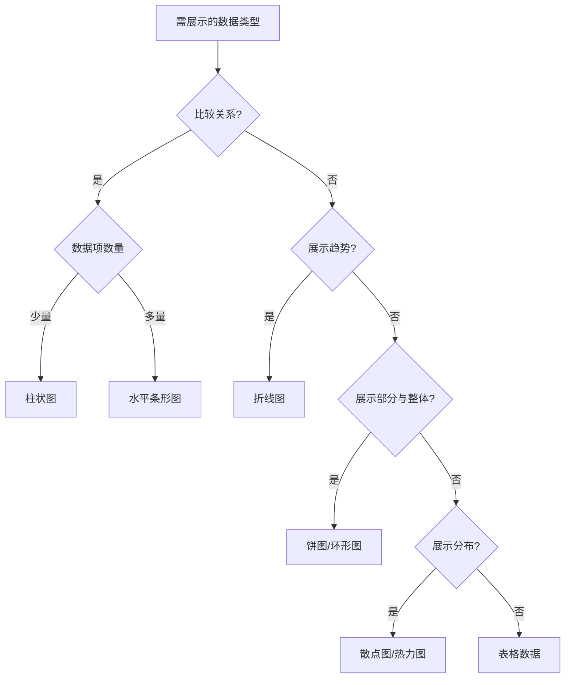

# JavaScript 可视化最佳实践

## 引言

数据可视化是将复杂数据转化为直观图形的过程，帮助用户更容易理解和分析信息。JavaScript凭借其强大的前端能力，已成为数据可视化的首选语言之一。本文将介绍JavaScript数据可视化的最佳实践，帮助初学者避开常见陷阱，创建出高效、易用且美观的可视化作品。

:::note 什么是数据可视化？
数据可视化是将数据以图形方式呈现，目的是通过视觉元素（如图表、图形和地图）清晰传达复杂信息，突出模式和趋势。
:::

## 准备工作：选择合适的库

在开始之前，选择适合项目需求的可视化库至关重要：

- **D3.js** - 功能最强大，灵活性最高，但学习曲线较陡
- **Chart.js** - 轻量级，适合创建常见图表类型
- **Plotly.js** - 交互性强，支持科学绘图
- **ECharts** - 丰富的图表类型，适合商业应用
- **Three.js** - 3D可视化专用

:::tip 初学者推荐
如果你是初学者，建议从Chart.js开始学习，它的API简单直观，足以满足大多数基础需求，同时学习曲线平缓。
:::

## 最佳实践一：数据处理先行

### 保持数据结构清晰

在创建可视化前，确保你的数据格式合适且一致。

```javascript
// 不推荐：混乱的数据结构
const messyData = [
  { name: "Jan", sales: 120 },
  { month: "Feb", revenue: 150 },
  { name: "Mar", value: 180 }
];

// 推荐：一致的数据结构
const cleanData = [
  { month: "Jan", sales: 120 },
  { month: "Feb", sales: 150 },
  { month: "Mar", sales: 180 }
];
```

### 数据预处理

在将数据传给可视化组件前，进行必要的计算和转换。

```javascript
// 数据预处理示例
function preprocessData(rawData) {
  return rawData.map(item => ({
    month: item.month,
    sales: item.sales,
    growth: item.sales > 100 ? "高" : "低"
  }));
}

const processedData = preprocessData(cleanData);
```

## 最佳实践二：响应式设计

创建能够适应不同屏幕尺寸的可视化图表。

### 使用相对单位

```javascript
// Chart.js 响应式配置
const chart = new Chart(ctx, {
  // 图表配置...
  options: {
    responsive: true,
    maintainAspectRatio: false
  }
});
```

### 监听窗口变化

```javascript
// 监听窗口大小变化并重新渲染图表
window.addEventListener('resize', () => {
  chart.resize();
});
```

## 最佳实践三：添加适当交互

交互性能大大提升用户体验。

### 悬停提示

```javascript
// Chart.js 工具提示配置
const chart = new Chart(ctx, {
  // 图表配置...
  options: {
    tooltips: {
      enabled: true,
      mode: 'index',
      intersect: false,
      callbacks: {
        label: function(tooltipItem, data) {
          return '销售额: ' + tooltipItem.yLabel + '万元';
        }
      }
    }
  }
});
```

### 图表交互

```javascript
// D3.js 交互示例
d3.select("svg")
  .selectAll("rect")
  .data(data)
  .enter()
  .append("rect")
  // 其他属性...
  .on("mouseover", function() {
    d3.select(this).attr("opacity", 0.7);
  })
  .on("mouseout", function() {
    d3.select(this).attr("opacity", 1);
  });
```

## 最佳实践四：可访问性设计

确保你的可视化对所有用户都是可访问的。

### 使用适当的颜色对比度

```javascript
// 良好对比度的配色方案
const accessibleColors = [
  '#003f5c', '#2f4b7c', '#665191', '#a05195', 
  '#d45087', '#f95d6a', '#ff7c43', '#ffa600'
];

// Chart.js 使用这些颜色
const chart = new Chart(ctx, {
  data: {
    datasets: [{
      backgroundColor: accessibleColors,
      // 其他配置...
    }]
  }
});
```

### 添加替代文本

```javascript
// 创建可访问的图表说明
document.getElementById('chart-container').setAttribute('aria-label', 
  '2023年季度销售图表，显示第四季度销售额达到峰值200万元');
```

## 最佳实践五：性能优化

大数据集的可视化可能会导致性能问题。

### 数据抽样

```javascript
// 大数据集抽样
function sampleData(data, sampleSize) {
  const step = Math.floor(data.length / sampleSize) || 1;
  const sampledData = [];
  
  for (let i = 0; i < data.length; i += step) {
    sampledData.push(data[i]);
  }
  
  return sampledData;
}

// 使用抽样后的数据
const hugeData = Array.from({ length: 10000 }, (_, i) => ({ 
  x: i, 
  y: Math.random() * 100 
}));
const sampledData = sampleData(hugeData, 100);
```

### 使用Canvas而非SVG处理大数据集

```javascript
// Chart.js已默认使用Canvas
// D3可以选择使用Canvas
const canvas = document.createElement('canvas');
const context = canvas.getContext('2d');

// 使用Canvas绘制大量数据点
sampledData.forEach(point => {
  context.fillRect(point.x, point.y, 2, 2);
});
```

## 实际案例：销售数据可视化

让我们通过一个实际案例，展示如何应用上述最佳实践创建销售数据可视化。

```javascript
// 步骤1：准备数据
const salesData = [
  { month: '一月', sales: 120, target: 100 },
  { month: '二月', sales: 150, target: 120 },
  { month: '三月', sales: 180, target: 140 },
  { month: '四月', sales: 110, target: 160 },
  { month: '五月', sales: 230, target: 180 },
  { month: '六月', sales: 280, target: 200 }
];

// 步骤2：创建图表
function createSalesChart() {
  const ctx = document.getElementById('salesChart').getContext('2d');
  
  return new Chart(ctx, {
    type: 'bar',
    data: {
      labels: salesData.map(d => d.month),
      datasets: [
        {
          label: '实际销售额',
          data: salesData.map(d => d.sales),
          backgroundColor: 'rgba(54, 162, 235, 0.5)',
          borderColor: 'rgb(54, 162, 235)',
          borderWidth: 1
        },
        {
          label: '销售目标',
          data: salesData.map(d => d.target),
          type: 'line',
          borderColor: 'rgb(255, 99, 132)',
          backgroundColor: 'rgba(0, 0, 0, 0)'
        }
      ]
    },
    options: {
      responsive: true,
      plugins: {
        title: {
          display: true,
          text: '2023上半年销售情况'
        },
        tooltip: {
          mode: 'index',
          intersect: false
        }
      },
      scales: {
        y: {
          beginAtZero: true,
          title: {
            display: true,
            text: '销售额（万元）'
          }
        }
      }
    }
  });
}

// 步骤3：初始化并处理响应式
let salesChart;
document.addEventListener('DOMContentLoaded', () => {
  salesChart = createSalesChart();
  
  window.addEventListener('resize', () => {
    salesChart.resize();
  });
});
```

## 最佳实践六：合理使用动画

动画可以增加吸引力，但过度使用会分散注意力。

```javascript
// Chart.js优化动画
const chart = new Chart(ctx, {
  // 图表配置...
  options: {
    animation: {
      duration: 1000, // 1秒
      easing: 'easeOutQuart',
      onProgress: function(animation) {
        // 动画进度中可执行的操作
      },
      onComplete: function() {
        // 动画完成后可执行的操作
      }
    }
  }
});
```

## 最佳实践七：提供清晰的图表标题和说明

确保每个可视化都有明确的标题、坐标轴标签和图例。

```javascript
// Chart.js标题和标签
const chart = new Chart(ctx, {
  // 图表配置...
  options: {
    plugins: {
      title: {
        display: true,
        text: '2022-2023年季度销售对比',
        font: {
          size: 18
        }
      },
      legend: {
        position: 'bottom',
        labels: {
          boxWidth: 15
        }
      }
    },
    scales: {
      x: {
        title: {
          display: true,
          text: '季度'
        }
      },
      y: {
        title: {
          display: true,
          text: '销售额（万元）'
        }
      }
    }
  }
});
```

## 最佳实践八：使用适当的图表类型

为数据选择最合适的图表类型。



选择图表类型的基本原则：
- 比较数值：柱状图、条形图
- 显示趋势：折线图
- 展示比例：饼图、环形图（但避免过多分类）
- 显示关系：散点图、气泡图
- 展示地理数据：地图可视化

## 实现过程及常见问题

### 常见问题与解决方案

1. **图表不显示**
   ```javascript
   // 检查DOM元素是否正确获取
   console.log(document.getElementById('chartContainer'));
   
   // 确保数据格式正确
   console.log(data);
   ```

2. **图表响应式失效**
   ```javascript
   // 确保容器有合适的样式
   #chartContainer {
     width: 100%;
     height: 400px;
     position: relative;
   }
   ```

3. **性能问题**
   
   当处理超过1000个数据点时，使用以下技巧：
   ```javascript
   // 1. 使用更高效的库（如Chart.js而非重量级D3）
   // 2. 数据抽样或聚合
   // 3. 分页或延迟加载技术
   ```

## 总结

JavaScript数据可视化的最佳实践可总结为：

1. **选择合适的工具和库** - 根据项目需求选择恰当的可视化库
2. **数据处理先行** - 清理并预处理数据
3. **设计响应式可视化** - 确保在各种设备上都能良好显示
4. **添加适当交互** - 增加用户体验但不过度
5. **考虑可访问性** - 为所有用户设计，包括色盲用户
6. **优化性能** - 处理大数据集时采取措施
7. **合理使用动画** - 有目的地添加动画
8. **提供清晰标注** - 添加标题、标签和图例
9. **选择正确的图表类型** - 根据数据特性和传达目标选择

掌握这些最佳实践，你将能够创建既美观又有效的数据可视化，帮助用户深入理解和分析数据。

## 练习与拓展资源

### 练习

1. 使用Chart.js创建一个包含月度温度数据的折线图，确保具有响应式设计。
2. 尝试使用D3.js创建一个交互式柱状图，当用户点击柱子时显示详细信息。
3. 创建一个销售数据仪表板，包含至少三种不同类型的图表。

### 拓展资源

- [Chart.js官方文档](https://www.chartjs.org/docs/latest/)
- [D3.js官方教程](https://d3js.org/)
- [Observable - 数据可视化实例集](https://observablehq.com/)
- 《Interactive Data Visualization for the Web》by Scott Murray - 学习D3.js的经典书籍
- 《Visualize This》by Nathan Yau - 数据可视化设计指南

:::caution 避免误区
记住：最好的可视化不一定是最复杂或最华丽的，而是能最有效传达数据故事的那一个。保持简洁，聚焦于数据本身的价值。
:::

通过不断实践和应用这些最佳实践，你将逐步掌握创建有效JavaScript数据可视化的技能。