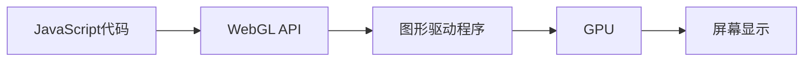

# JavaScript WebGL基础

## WebGL是什么？

WebGL(Web Graphics Library)是一种JavaScript API，用于在网页浏览器中渲染交互式3D和2D图形，而无需使用插件。WebGL基于OpenGL ES 2.0，通过HTML5 Canvas元素提供硬件加速的图形渲染能力。

:::note 背景知识
WebGL最初由Mozilla研究人员在2006年提出，2011年正式发布1.0版本。当前最新的WebGL 2.0基于OpenGL ES 3.0，提供了更多高级功能。
:::

## WebGL的工作原理

WebGL直接与GPU通信，允许开发者利用图形处理器的并行计算能力进行高效渲染。WebGL的渲染管线可以简化为以下步骤：



WebGL程序主要由两种着色器组成：

1. **顶点着色器(Vertex Shader)**: 处理顶点位置、颜色等属性
2. **片元着色器(Fragment Shader)**: 处理像素级的渲染，如颜色、纹理等

## 开始使用WebGL

### 设置WebGL上下文

首先需要获取Canvas元素并创建WebGL上下文：

```javascript
// 获取Canvas元素
const canvas = document.getElementById('webgl-canvas');

// 获取WebGL上下文
const gl = canvas.getContext('webgl') || canvas.getContext('experimental-webgl');

if (!gl) {
  alert('您的浏览器不支持WebGL');
}
```

### 基本概念

#### 1. 着色器程序

着色器使用GLSL(OpenGL Shading Language)编写，需要在JavaScript中编译并链接：

```javascript
// 创建顶点着色器
const vertexShaderSource = `
  attribute vec4 aPosition;
  void main() {
    gl_Position = aPosition;
  }
`;
const vertexShader = gl.createShader(gl.VERTEX_SHADER);
gl.shaderSource(vertexShader, vertexShaderSource);
gl.compileShader(vertexShader);

// 创建片元着色器
const fragmentShaderSource = `
  precision mediump float;
  void main() {
    gl_FragColor = vec4(1.0, 0.0, 0.0, 1.0); // 红色
  }
`;
const fragmentShader = gl.createShader(gl.FRAGMENT_SHADER);
gl.shaderSource(fragmentShader, fragmentShaderSource);
gl.compileShader(fragmentShader);

// 创建着色器程序
const program = gl.createProgram();
gl.attachShader(program, vertexShader);
gl.attachShader(program, fragmentShader);
gl.linkProgram(program);
gl.useProgram(program);
```

#### 2. 缓冲区

缓冲区用于存储顶点数据：

```javascript
// 定义一个三角形的顶点
const vertices = new Float32Array([
   0.0,  0.5,  0.0,  // 顶部点
  -0.5, -0.5,  0.0,  // 左下点
   0.5, -0.5,  0.0   // 右下点
]);

// 创建缓冲区
const vertexBuffer = gl.createBuffer();
gl.bindBuffer(gl.ARRAY_BUFFER, vertexBuffer);
gl.bufferData(gl.ARRAY_BUFFER, vertices, gl.STATIC_DRAW);

// 获取顶点着色器中的属性位置
const positionAttributeLocation = gl.getAttribLocation(program, 'aPosition');
gl.enableVertexAttribArray(positionAttributeLocation);
gl.vertexAttribPointer(positionAttributeLocation, 3, gl.FLOAT, false, 0, 0);
```

#### 3. 渲染

设置视口并执行绘制命令：

```javascript
// 设置视口
gl.viewport(0, 0, canvas.width, canvas.height);

// 清除画布
gl.clearColor(0.0, 0.0, 0.0, 1.0); // 黑色背景
gl.clear(gl.COLOR_BUFFER_BIT);

// 绘制三角形
gl.drawArrays(gl.TRIANGLES, 0, 3);
```

## 完整的WebGL三角形示例

下面是一个完整的示例，展示如何使用WebGL绘制一个彩色三角形：

```html
<!DOCTYPE html>
<html>
<head>
  <title>WebGL 基础三角形</title>
  <style>
    canvas { border: 1px solid black; }
  </style>
</head>
<body>
  <canvas id="webgl-canvas" width="400" height="300"></canvas>
  
  <script>
    // 初始化WebGL上下文
    const canvas = document.getElementById('webgl-canvas');
    const gl = canvas.getContext('webgl');
    
    if (!gl) {
      alert('您的浏览器不支持WebGL');
      throw new Error('WebGL不可用');
    }
    
    // 顶点着色器
    const vertexShaderSource = `
      attribute vec4 aPosition;
      attribute vec4 aColor;
      varying vec4 vColor;
      
      void main() {
        gl_Position = aPosition;
        vColor = aColor;
      }
    `;
    
    // 片元着色器
    const fragmentShaderSource = `
      precision mediump float;
      varying vec4 vColor;
      
      void main() {
        gl_FragColor = vColor;
      }
    `;
    
    // 创建顶点着色器
    const vertexShader = gl.createShader(gl.VERTEX_SHADER);
    gl.shaderSource(vertexShader, vertexShaderSource);
    gl.compileShader(vertexShader);
    
    // 检查编译状态
    if (!gl.getShaderParameter(vertexShader, gl.COMPILE_STATUS)) {
      console.error('顶点着色器编译失败:', gl.getShaderInfoLog(vertexShader));
      gl.deleteShader(vertexShader);
      throw new Error('顶点着色器编译失败');
    }
    
    // 创建片元着色器
    const fragmentShader = gl.createShader(gl.FRAGMENT_SHADER);
    gl.shaderSource(fragmentShader, fragmentShaderSource);
    gl.compileShader(fragmentShader);
    
    // 检查编译状态
    if (!gl.getShaderParameter(fragmentShader, gl.COMPILE_STATUS)) {
      console.error('片元着色器编译失败:', gl.getShaderInfoLog(fragmentShader));
      gl.deleteShader(fragmentShader);
      throw new Error('片元着色器编译失败');
    }
    
    // 创建程序
    const program = gl.createProgram();
    gl.attachShader(program, vertexShader);
    gl.attachShader(program, fragmentShader);
    gl.linkProgram(program);
    
    // 检查链接状态
    if (!gl.getProgramParameter(program, gl.LINK_STATUS)) {
      console.error('程序链接失败:', gl.getProgramInfoLog(program));
      gl.deleteProgram(program);
      throw new Error('程序链接失败');
    }
    
    gl.useProgram(program);
    
    // 创建顶点数据
    const positions = new Float32Array([
      0.0, 0.5, 0.0,    // 顶部点
      -0.5, -0.5, 0.0,  // 左下点
      0.5, -0.5, 0.0    // 右下点
    ]);
    
    const colors = new Float32Array([
      1.0, 0.0, 0.0, 1.0,  // 红色
      0.0, 1.0, 0.0, 1.0,  // 绿色
      0.0, 0.0, 1.0, 1.0   // 蓝色
    ]);
    
    // 创建位置缓冲区
    const positionBuffer = gl.createBuffer();
    gl.bindBuffer(gl.ARRAY_BUFFER, positionBuffer);
    gl.bufferData(gl.ARRAY_BUFFER, positions, gl.STATIC_DRAW);
    
    // 设置位置属性
    const positionAttributeLocation = gl.getAttribLocation(program, 'aPosition');
    gl.enableVertexAttribArray(positionAttributeLocation);
    gl.vertexAttribPointer(positionAttributeLocation, 3, gl.FLOAT, false, 0, 0);
    
    // 创建颜色缓冲区
    const colorBuffer = gl.createBuffer();
    gl.bindBuffer(gl.ARRAY_BUFFER, colorBuffer);
    gl.bufferData(gl.ARRAY_BUFFER, colors, gl.STATIC_DRAW);
    
    // 设置颜色属性
    const colorAttributeLocation = gl.getAttribLocation(program, 'aColor');
    gl.enableVertexAttribArray(colorAttributeLocation);
    gl.vertexAttribPointer(colorAttributeLocation, 4, gl.FLOAT, false, 0, 0);
    
    // 设置视口并清除
    gl.viewport(0, 0, canvas.width, canvas.height);
    gl.clearColor(0.0, 0.0, 0.0, 1.0);
    gl.clear(gl.COLOR_BUFFER_BIT);
    
    // 绘制三角形
    gl.drawArrays(gl.TRIANGLES, 0, 3);
  </script>
</body>
</html>
```

运行此代码后，您将看到一个彩色三角形，顶部为红色，左下角为绿色，右下角为蓝色，颜色在三角形内部平滑过渡。

## 3D变换

要实现3D效果，需要添加矩阵变换。以下是一个旋转立方体的简化示例：

```javascript
// 在顶点着色器中添加矩阵变换
const vertexShaderSource = `
  attribute vec4 aPosition;
  uniform mat4 uModelViewMatrix;
  uniform mat4 uProjectionMatrix;
  
  void main() {
    gl_Position = uProjectionMatrix * uModelViewMatrix * aPosition;
  }
`;

// 计算透视投影矩阵
function perspective(fieldOfViewInRadians, aspect, near, far) {
  // 实现透视投影矩阵计算...
}

// 创建模型视图矩阵
const modelViewMatrix = mat4.create();
mat4.translate(modelViewMatrix, modelViewMatrix, [0.0, 0.0, -6.0]);
mat4.rotate(modelViewMatrix, modelViewMatrix, rotation, [0, 1, 0]);

// 创建投影矩阵
const projectionMatrix = perspective(45 * Math.PI / 180, canvas.width / canvas.height, 0.1, 100.0);

// 将矩阵传递给着色器
const modelViewMatrixLocation = gl.getUniformLocation(program, 'uModelViewMatrix');
const projectionMatrixLocation = gl.getUniformLocation(program, 'uProjectionMatrix');

gl.uniformMatrix4fv(modelViewMatrixLocation, false, modelViewMatrix);
gl.uniformMatrix4fv(projectionMatrixLocation, false, projectionMatrix);
```

:::tip 矩阵操作
在实际应用中，我们通常使用库如 [gl-matrix](http://glmatrix.net/) 来进行矩阵操作，它提供了创建和操作各种矩阵的便捷方法。
:::

## 纹理映射

纹理让我们可以在3D物体表面添加图像：

```javascript
// 加载纹理
function loadTexture(url) {
  const texture = gl.createTexture();
  const image = new Image();
  
  image.onload = function() {
    gl.bindTexture(gl.TEXTURE_2D, texture);
    gl.texImage2D(gl.TEXTURE_2D, 0, gl.RGBA, gl.RGBA, gl.UNSIGNED_BYTE, image);
    
    // 检查图像是否为2的幂
    if (isPowerOf2(image.width) && isPowerOf2(image.height)) {
      gl.generateMipmap(gl.TEXTURE_2D);
    } else {
      gl.texParameteri(gl.TEXTURE_2D, gl.TEXTURE_WRAP_S, gl.CLAMP_TO_EDGE);
      gl.texParameteri(gl.TEXTURE_2D, gl.TEXTURE_WRAP_T, gl.CLAMP_TO_EDGE);
      gl.texParameteri(gl.TEXTURE_2D, gl.TEXTURE_MIN_FILTER, gl.LINEAR);
    }
  };
  
  image.src = url;
  return texture;
}

function isPowerOf2(value) {
  return (value & (value - 1)) == 0;
}

// 使用纹理
const texture = loadTexture('texture.png');
```

## 实际应用案例：交互式3D地球

以下是一个更复杂的WebGL应用示例概述，展示如何创建一个可旋转的3D地球：

1. 加载地球表面纹理图像
2. 创建球体几何体
3. 实现鼠标拖动旋转功能
4. 添加光照效果增强立体感

```javascript
// 以下是实现的核心逻辑框架，完整代码较长

// 1. 初始化WebGL上下文
const canvas = document.getElementById('webgl-canvas');
const gl = canvas.getContext('webgl');

// 2. 创建和编译着色器（支持光照）
// ...顶点和片元着色器代码...

// 3. 创建球体几何体
function createSphere(radius, latBands, longBands) {
  // 创建球体顶点和索引...
}

// 4. 加载地球纹理
const earthTexture = loadTexture('earth.jpg');

// 5. 实现鼠标拖动旋转
let rotation = [0, 0];
let isDragging = false;
let lastMousePosition = [0, 0];

canvas.addEventListener('mousedown', (e) => {
  isDragging = true;
  lastMousePosition = [e.clientX, e.clientY];
});

canvas.addEventListener('mousemove', (e) => {
  if (isDragging) {
    const deltaX = e.clientX - lastMousePosition[0];
    const deltaY = e.clientY - lastMousePosition[1];
    
    rotation[0] += deltaY * 0.01;
    rotation[1] += deltaX * 0.01;
    
    lastMousePosition = [e.clientX, e.clientY];
    render(); // 重新渲染
  }
});

canvas.addEventListener('mouseup', () => {
  isDragging = false;
});

// 6. 渲染函数
function render() {
  // 使用rotation更新模型视图矩阵
  // 绘制地球...
}

// 7. 启动渲染循环
function animate() {
  // 如果没有拖动，缓慢自转
  if (!isDragging) {
    rotation[1] += 0.005;
    render();
  }
  requestAnimationFrame(animate);
}
animate();
```

这个例子展示了如何结合多种WebGL技术创建一个交互式3D应用。

## WebGL优化技巧

在WebGL应用中，性能优化非常重要：

1. **减少绘制调用**：合并几何体减少`drawArrays`或`drawElements`调用
2. **使用索引缓冲区**：通过`gl.ELEMENT_ARRAY_BUFFER`和`drawElements`重用顶点
3. **实现视锥体剔除**：只渲染视野内的物体
4. **着色器优化**：简化着色器，避免复杂计算
5. **纹理压缩**：使用较小的纹理或WebGL支持的压缩格式
6. **使用VAOs**（顶点数组对象）：在WebGL2中可用，减少状态设置开销

## 总结

WebGL是一项强大的技术，可以在网页上创建复杂的3D图形和动画。本文介绍了WebGL的基本概念和工作原理：

- WebGL上下文的设置
- 着色器程序的创建和编译
- 缓冲区和属性的使用
- 3D变换和矩阵操作
- 纹理映射
- 实际应用案例

虽然WebGL有一定的学习曲线，但掌握基础知识后，您可以创建丰富的图形应用，从数据可视化到游戏开发，应用范围非常广泛。

## 练习和资源

### 练习

1. 修改三角形示例，尝试绘制不同的形状（如矩形、五角星等）
2. 为三角形添加动画，让它旋转起来
3. 尝试加载自定义纹理并应用到图形上
4. 实现简单的3D几何体，如立方体或球体

### 进阶资源

- [WebGL官方网站](https://www.khronos.org/webgl/)
- [MDN WebGL教程](https://developer.mozilla.org/en-US/docs/Web/API/WebGL_API)
- [WebGL基础](https://webglfundamentals.org/)
- [The Book of Shaders](https://thebookofshaders.com/) - 学习GLSL着色器语言
- [three.js](https://threejs.org/) - 基于WebGL的3D库，简化WebGL开发

通过持续学习和实践，您可以掌握WebGL并创建惊艳的3D网页内容！