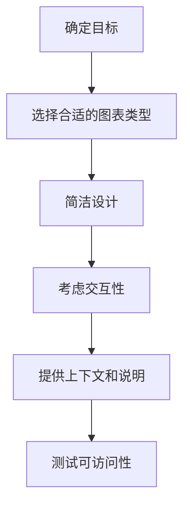

# JavaScript D3.js基础

## 什么是D3.js？

D3.js（Data-Driven Documents）是一个使用JavaScript进行数据可视化的强大库，它允许你将数据绑定到DOM（文档对象模型）上，然后利用数据驱动转换文档。与其他图表库不同，D3不提供现成的图表类型，而是提供了强大的工具帮助你创建和自定义任何类型的数据可视化。

:::note 关键特性
- **数据驱动**：根据数据操作文档
- **灵活性**：完全控制可视化的外观和行为
- **交互性**：支持动画和用户交互
- **兼容性**：使用SVG、Canvas和HTML
:::

## 安装与设置

### 方法1：通过CDN引入

最简单的方式是通过CDN引入D3.js：

```html
<!DOCTYPE html>
<html>
<head>
    <meta charset="utf-8">
    <title>D3.js 入门</title>
    <script src="https://d3js.org/d3.v7.min.js"></script>
</head>
<body>
    <div id="visualization"></div>
    <script>
        // 这里放置D3代码
    </script>
</body>
</html>
```

### 方法2：通过NPM安装

如果你在使用现代JavaScript开发环境，可以通过NPM安装D3：

```bash
npm install d3
```

然后在代码中导入：

```javascript
import * as d3 from 'd3';
// 或者只导入需要的模块
import { select, scaleLinear, axisBottom } from 'd3';
```

## D3基本概念

### 选择与操作DOM元素

D3提供了类似jQuery的选择器方法来操作DOM元素：

```javascript
// 选择第一个匹配的元素
const div = d3.select('#visualization');

// 选择所有匹配的元素
const paragraphs = d3.selectAll('p');

// 修改元素属性和样式
div.style('color', 'blue')
   .attr('class', 'container')
   .text('Hello D3!');
```

### 数据绑定：D3的核心

D3的强大之处在于其数据绑定机制。通过`.data()`方法，可以将数据绑定到DOM元素：

```javascript
const dataset = [5, 10, 15, 20, 25];

d3.select('body')
  .selectAll('p')
  .data(dataset)      // 绑定数据
  .enter()            // 获取未创建元素的占位符
  .append('p')        // 为每个数据点创建一个p元素
  .text(d => `这个段落的值是 ${d}`); // 使用数据值设置文本
```

输出结果：
```
这个段落的值是 5
这个段落的值是 10
这个段落的值是 15
这个段落的值是 20
这个段落的值是 25
```

### 数据绑定的关键方法

- **`.data()`**: 将数据绑定到选定的元素
- **`.enter()`**: 创建没有足够元素对应的数据占位符
- **`.exit()`**: 处理没有对应数据的多余元素
- **`.join()`**: 简化enter/update/exit模式（D3 v5+）

## 创建第一个可视化：简单条形图

让我们创建一个简单的水平条形图：

```javascript
// 数据集
const dataset = [5, 10, 15, 20, 25];

// 设置画布尺寸
const width = 400;
const height = 200;
const barHeight = 30;

// 创建比例尺
const xScale = d3.scaleLinear()
    .domain([0, d3.max(dataset)])
    .range([0, width]);

// 创建SVG元素
const svg = d3.select('#visualization')
    .append('svg')
    .attr('width', width)
    .attr('height', height * 1.2);

// 创建条形
svg.selectAll('rect')
    .data(dataset)
    .enter()
    .append('rect')
    .attr('y', (d, i) => i * (barHeight + 5))
    .attr('width', d => xScale(d))
    .attr('height', barHeight)
    .attr('fill', 'steelblue');

// 添加文本标签
svg.selectAll('text')
    .data(dataset)
    .enter()
    .append('text')
    .text(d => d)
    .attr('x', d => xScale(d) + 3)
    .attr('y', (d, i) => i * (barHeight + 5) + barHeight / 2)
    .attr('dominant-baseline', 'middle')
    .attr('font-family', 'sans-serif');
```

这段代码创建了一个简单的水平条形图，每个条形的长度对应数据值，并在条形图上添加了数值标签。

## 比例尺（Scales）

比例尺是D3中的重要概念，它们将数据值映射到视觉属性（如位置、颜色或大小）：

```javascript
// 线性比例尺 - 用于连续数据到连续范围的映射
const xScale = d3.scaleLinear()
    .domain([0, 100])    // 输入范围
    .range([0, 500]);    // 输出范围

// 颜色比例尺
const colorScale = d3.scaleOrdinal()
    .domain(['苹果', '橙子', '香蕉'])
    .range(['red', 'orange', 'yellow']);

// 使用比例尺
console.log(xScale(50));          // 输出 250
console.log(colorScale('苹果'));   // 输出 'red'
```

## 坐标轴

D3可以轻松创建坐标轴：

```javascript
// 添加X轴
svg.append('g')
    .attr('transform', `translate(0, ${height - 20})`)
    .call(d3.axisBottom(xScale));

// 添加Y轴
const yScale = d3.scaleLinear()
    .domain([0, d3.max(dataset)])
    .range([height - 20, 0]);

svg.append('g')
    .attr('transform', 'translate(40, 0)')
    .call(d3.axisLeft(yScale));
```

## 实际案例：创建交互式柱状图

以下是一个更完整的例子，展示如何创建一个交互式柱状图：

```javascript
// 模拟数据
const dataset = [
    { category: 'A', value: 12 },
    { category: 'B', value: 31 },
    { category: 'C', value: 22 },
    { category: 'D', value: 17 },
    { category: 'E', value: 25 }
];

// 设置画布尺寸和边距
const margin = { top: 20, right: 20, bottom: 40, left: 40 };
const width = 500 - margin.left - margin.right;
const height = 300 - margin.top - margin.bottom;

// 创建SVG元素
const svg = d3.select('#visualization')
    .append('svg')
    .attr('width', width + margin.left + margin.right)
    .attr('height', height + margin.top + margin.bottom)
    .append('g')
    .attr('transform', `translate(${margin.left},${margin.top})`);

// 创建X轴比例尺（分类型）
const xScale = d3.scaleBand()
    .domain(dataset.map(d => d.category))
    .range([0, width])
    .padding(0.2);

// 创建Y轴比例尺（线性）
const yScale = d3.scaleLinear()
    .domain([0, d3.max(dataset, d => d.value)])
    .range([height, 0]);

// 添加X轴
svg.append('g')
    .attr('transform', `translate(0,${height})`)
    .call(d3.axisBottom(xScale))
    .append('text')
    .attr('x', width / 2)
    .attr('y', 35)
    .attr('fill', 'black')
    .attr('text-anchor', 'middle')
    .text('类别');

// 添加Y轴
svg.append('g')
    .call(d3.axisLeft(yScale))
    .append('text')
    .attr('transform', 'rotate(-90)')
    .attr('y', -35)
    .attr('x', -height / 2)
    .attr('fill', 'black')
    .attr('text-anchor', 'middle')
    .text('值');

// 创建柱状图
svg.selectAll('.bar')
    .data(dataset)
    .enter()
    .append('rect')
    .attr('class', 'bar')
    .attr('x', d => xScale(d.category))
    .attr('y', d => yScale(d.value))
    .attr('width', xScale.bandwidth())
    .attr('height', d => height - yScale(d.value))
    .attr('fill', 'steelblue')
    // 添加交互性
    .on('mouseover', function(event, d) {
        d3.select(this)
            .attr('fill', 'orange');
        
        svg.append('text')
            .attr('id', 'tooltip')
            .attr('x', xScale(d.category) + xScale.bandwidth() / 2)
            .attr('y', yScale(d.value) - 5)
            .attr('text-anchor', 'middle')
            .attr('font-family', 'sans-serif')
            .attr('font-size', '12px')
            .attr('font-weight', 'bold')
            .text(d.value);
    })
    .on('mouseout', function() {
        d3.select(this)
            .attr('fill', 'steelblue');
        d3.select('#tooltip').remove();
    });
```

:::tip 交互要点
上面的代码为每个柱子添加了鼠标悬停效果：
1. 当鼠标悬停在柱子上时，柱子会变为橙色，并显示具体数值
2. 当鼠标移开时，柱子恢复原来的颜色，数值提示消失
:::

## 数据更新与动画

D3的优势之一是对数据更新和动画的支持：

```javascript
// 更新函数
function updateChart(newData) {
    // 更新Y轴比例尺
    yScale.domain([0, d3.max(newData, d => d.value)]);
    
    // 更新Y轴（带动画）
    svg.select('.y-axis')
        .transition()
        .duration(1000)
        .call(d3.axisLeft(yScale));
    
    // 更新柱状图（带动画）
    svg.selectAll('.bar')
        .data(newData)
        .transition()
        .duration(1000)
        .attr('y', d => yScale(d.value))
        .attr('height', d => height - yScale(d.value));
}

// 假设有一个按钮触发数据更新
document.getElementById('updateBtn').addEventListener('click', function() {
    // 随机生成新数据
    const newData = dataset.map(item => ({
        category: item.category,
        value: Math.floor(Math.random() * 40) + 5
    }));
    
    updateChart(newData);
});
```

## D3与其他库的集成

D3可以与其他库结合使用，例如React、Vue或Angular：

```jsx
// React组件中使用D3示例
import React, { useRef, useEffect } from 'react';
import * as d3 from 'd3';

function BarChart({ data }) {
    const svgRef = useRef();
    
    useEffect(() => {
        // 在组件挂载或数据变化时重新渲染图表
        if (data && svgRef.current) {
            const svg = d3.select(svgRef.current);
            svg.selectAll('*').remove(); // 清除旧内容
            
            // D3代码绘制图表
            // ...
        }
    }, [data]);
    
    return <svg ref={svgRef} width="500" height="300"></svg>;
}
```

## 数据可视化最佳实践

在使用D3.js创建可视化时，请记住以下最佳实践：



1. **了解你的数据** - 在开始可视化之前，确保你理解数据的特性和关系
2. **选择合适的可视化** - 不同的数据关系需要不同的可视化方法
3. **简洁设计** - 避免视觉混乱，只显示必要的元素
4. **考虑交互性** - 适当添加交互元素可以增强用户体验
5. **提供上下文** - 确保包含标题、标签和必要的解释
6. **注意无障碍设计** - 考虑色盲用户和屏幕阅读器用户

## 总结

在本教程中，我们学习了D3.js的基础知识，包括：

- D3基本概念和安装方法
- 选择与操作DOM元素
- 数据绑定机制
- 创建简单的可视化
- 使用比例尺和坐标轴
- 制作交互式图表
- 数据更新和动画
- 与其他库的集成
- 数据可视化最佳实践

D3.js是一个功能强大且灵活的工具，通过它，你可以创建几乎任何类型的数据可视化。随着你的经验增长，你将能够构建越来越复杂和引人注目的可视化项目。

## 练习

1. 创建一个简单的饼图，显示一组分类数据的百分比分布
2. 为柱状图添加工具提示（tooltip）功能，显示详细信息
3. 尝试创建一个简单的线图，展示随时间变化的数据
4. 为可视化添加动画效果，如条形图的渐入
5. 通过添加按钮实现不同数据集之间的切换

## 推荐资源

- [D3.js 官方文档](https://d3js.org)
- [D3 图库](https://observablehq.com/@d3/gallery)
- 《Interactive Data Visualization for the Web》by Scott Murray
- [D3 Tutorials](https://github.com/d3/d3/wiki/Tutorials)
- [Observable](https://observablehq.com) - 交互式笔记本平台，可探索D3.js示例

祝你在数据可视化之旅中取得成功！