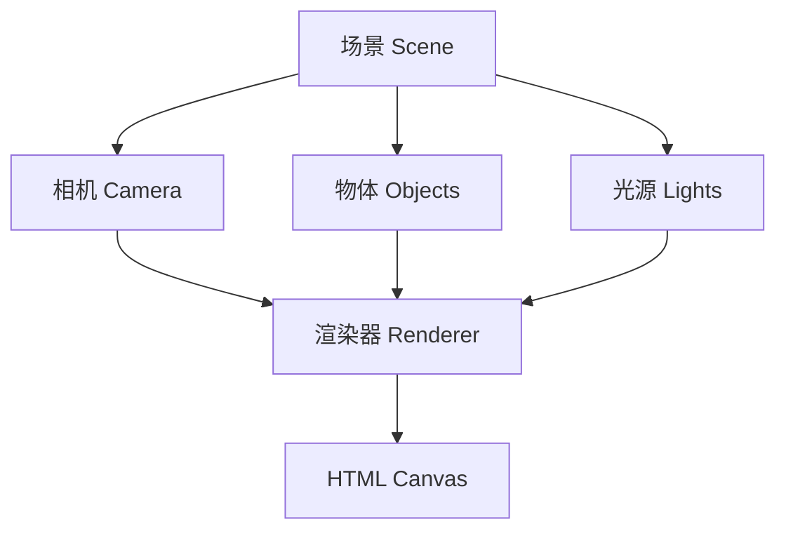

# JavaScript Three.js基础

---
title: JavaScript Three.js基础
description: 探索Three.js的基础概念，学习如何在Web中创建令人惊艳的3D图形和交互式体验。本教程为初学者提供全面的Three.js入门指南。
---

## 什么是Three.js？

Three.js是一个JavaScript 3D库，它使开发者能够在网页浏览器中创建和显示动画3D计算机图形。Three.js使用WebGL作为其渲染引擎，WebGL是一种JavaScript API，用于在浏览器中无插件地渲染交互式3D和2D图形。

:::info
Three.js由Ricardo Cabello（也被称为Mr.doob）于2010年创建，现在已经成为web上最流行的3D库之一。
:::

Three.js大大简化了WebGL的复杂性，使得创建3D图形成为可能，而无需直接处理底层的WebGL API。

## 为什么使用Three.js？

- **简单易用**：相比原生WebGL，Three.js提供了更高级的抽象
- **功能强大**：支持多种3D模型格式、动画、光照、材质等
- **社区活跃**：拥有庞大的社区和丰富的文档资源
- **性能优秀**：经过优化的渲染引擎确保高性能
- **跨浏览器兼容**：在大多数现代浏览器中都能正常工作

## 开始使用Three.js

### 设置开发环境

首先，我们需要引入Three.js库。有两种主要方法：

**1. 通过CDN引入:**

```html
<!DOCTYPE html>
<html>
<head>
    <title>My First Three.js App</title>
    <style>
        body { margin: 0; }
        canvas { display: block; }
    </style>
</head>
<body>
    <script src="https://cdn.jsdelivr.net/npm/three@0.132.2/build/three.min.js"></script>
    <script>
        // 我们的Three.js代码将放在这里
    </script>
</body>
</html>
```

**2. 通过npm安装:**

```bash
npm install three
```

然后在你的JavaScript文件中引入：

```javascript
import * as THREE from 'three';
```

## Three.js的核心概念

Three.js基于几个核心概念，理解这些概念对于创建3D场景至关重要。



### 1. 场景 (Scene)

场景是所有3D对象的容器，它定义了空间中哪些对象会被渲染。

```javascript
const scene = new THREE.Scene();
```

### 2. 相机 (Camera)

相机定义了观察场景的视角。Three.js提供多种相机类型，最常用的是透视相机（PerspectiveCamera）。

```javascript
// 参数：视野角度(FOV)，长宽比，近裁剪面，远裁剪面
const camera = new THREE.PerspectiveCamera(75, window.innerWidth / window.innerHeight, 0.1, 1000);
camera.position.z = 5; // 设置相机位置
```

### 3. 渲染器 (Renderer)

渲染器负责将场景和相机结合起来，在canvas元素上绘制出最终的图像。

```javascript
const renderer = new THREE.WebGLRenderer();
renderer.setSize(window.innerWidth, window.innerHeight);
document.body.appendChild(renderer.domElement);
```

### 4. 几何体 (Geometry)

几何体定义了3D对象的顶点和面。Three.js提供了多种内置几何体。

```javascript
const geometry = new THREE.BoxGeometry(1, 1, 1); // 创建一个立方体几何体
```

### 5. 材质 (Material)

材质定义了物体的外观，包括颜色、纹理等。

```javascript
const material = new THREE.MeshBasicMaterial({ color: 0x00ff00 }); // 绿色材质
```

### 6. 网格 (Mesh)

网格是将几何体和材质结合起来的对象，它代表了3D场景中的一个具体物体。

```javascript
const cube = new THREE.Mesh(geometry, material);
scene.add(cube); // 将网格添加到场景中
```

## 创建你的第一个Three.js应用

下面是一个完整的示例，创建一个旋转的彩色立方体：

```html
<!DOCTYPE html>
<html>
<head>
    <title>My First Three.js App</title>
    <style>
        body { margin: 0; }
        canvas { display: block; }
    </style>
</head>
<body>
    <script src="https://cdn.jsdelivr.net/npm/three@0.132.2/build/three.min.js"></script>
    <script>
        // 创建场景
        const scene = new THREE.Scene();
        
        // 创建相机
        const camera = new THREE.PerspectiveCamera(75, window.innerWidth / window.innerHeight, 0.1, 1000);
        camera.position.z = 5;
        
        // 创建渲染器
        const renderer = new THREE.WebGLRenderer();
        renderer.setSize(window.innerWidth, window.innerHeight);
        document.body.appendChild(renderer.domElement);
        
        // 创建几何体和材质
        const geometry = new THREE.BoxGeometry(1, 1, 1);
        const material = new THREE.MeshPhongMaterial({ color: 0x00ff00 });
        
        // 创建立方体网格
        const cube = new THREE.Mesh(geometry, material);
        scene.add(cube);
        
        // 添加光源
        const light = new THREE.DirectionalLight(0xffffff, 1);
        light.position.set(1, 1, 1);
        scene.add(light);
        
        const ambientLight = new THREE.AmbientLight(0x404040);
        scene.add(ambientLight);
        
        // 动画循环
        function animate() {
            requestAnimationFrame(animate);
            
            // 旋转立方体
            cube.rotation.x += 0.01;
            cube.rotation.y += 0.01;
            
            // 渲染场景
            renderer.render(scene, camera);
        }
        
        animate();
        
        // 响应窗口大小变化
        window.addEventListener('resize', () => {
            camera.aspect = window.innerWidth / window.innerHeight;
            camera.updateProjectionMatrix();
            renderer.setSize(window.innerWidth, window.innerHeight);
        });
    </script>
</body>
</html>
```

运行这段代码，你会看到一个绿色的立方体在屏幕中央缓慢旋转。

## 添加光源和阴影

为了使场景更加真实，我们需要添加光源。Three.js提供了多种光源类型：

### 环境光 (AmbientLight)

环境光会均匀地照亮场景中的所有物体，没有特定方向。

```javascript
const ambientLight = new THREE.AmbientLight(0x404040); // 软灰色光
scene.add(ambientLight);
```

### 平行光 (DirectionalLight)

平行光是从特定方向发射的光，类似于太阳光。

```javascript
const directionalLight = new THREE.DirectionalLight(0xffffff, 1); // 白色光，强度为1
directionalLight.position.set(1, 1, 1); // 设置光源方向
scene.add(directionalLight);
```

### 点光源 (PointLight)

点光源从一个点向所有方向发射光线。

```javascript
const pointLight = new THREE.PointLight(0xff0000, 1, 100); // 红色光，强度为1，距离为100
pointLight.position.set(10, 10, 10);
scene.add(pointLight);
```

### 聚光灯 (SpotLight)

聚光灯是从一个点发射的锥形光束。

```javascript
const spotLight = new THREE.SpotLight(0xffffff);
spotLight.position.set(100, 1000, 100);
scene.add(spotLight);
```

## 添加纹理

纹理可以让你的3D对象表面呈现图像。

```javascript
// 创建纹理加载器
const textureLoader = new THREE.TextureLoader();

// 加载纹理
const texture = textureLoader.load('texture.jpg');

// 创建使用纹理的材质
const material = new THREE.MeshStandardMaterial({ 
    map: texture 
});

// 创建网格
const cube = new THREE.Mesh(geometry, material);
scene.add(cube);
```

## 添加交互控制

要添加鼠标交互控制，我们可以使用OrbitControls插件：

```html
<script src="https://cdn.jsdelivr.net/npm/three@0.132.2/examples/js/controls/OrbitControls.js"></script>
```

然后在JavaScript中：

```javascript
const controls = new THREE.OrbitControls(camera, renderer.domElement);
controls.enableDamping = true; // 添加阻尼效果
controls.dampingFactor = 0.05;

function animate() {
    requestAnimationFrame(animate);
    controls.update(); // 更新控制器
    renderer.render(scene, camera);
}
```

## 实际案例：交互式3D地球

下面是一个更复杂的例子，创建一个可旋转的3D地球：

```javascript
// 创建场景、相机和渲染器
const scene = new THREE.Scene();
const camera = new THREE.PerspectiveCamera(75, window.innerWidth / window.innerHeight, 0.1, 1000);
camera.position.z = 3;

const renderer = new THREE.WebGLRenderer({ antialias: true });
renderer.setSize(window.innerWidth, window.innerHeight);
document.body.appendChild(renderer.domElement);

// 创建地球
const geometry = new THREE.SphereGeometry(1, 32, 32);
const textureLoader = new THREE.TextureLoader();
const earthTexture = textureLoader.load('earth_texture.jpg');
const earthBumpMap = textureLoader.load('earth_bumpmap.jpg');
const earthSpecular = textureLoader.load('earth_specular.jpg');

const material = new THREE.MeshPhongMaterial({
    map: earthTexture,
    bumpMap: earthBumpMap,
    bumpScale: 0.05,
    specularMap: earthSpecular,
    specular: new THREE.Color(0x333333)
});

const earth = new THREE.Mesh(geometry, material);
scene.add(earth);

// 添加星空背景
const starsGeometry = new THREE.SphereGeometry(90, 32, 32);
const starsMaterial = new THREE.MeshBasicMaterial({
    map: textureLoader.load('stars.jpg'),
    side: THREE.BackSide
});
const starsMesh = new THREE.Mesh(starsGeometry, starsMaterial);
scene.add(starsMesh);

// 添加光源
const ambientLight = new THREE.AmbientLight(0x404040);
scene.add(ambientLight);

const directionalLight = new THREE.DirectionalLight(0xffffff, 1);
directionalLight.position.set(5, 3, 5);
scene.add(directionalLight);

// 添加轨道控制
const controls = new THREE.OrbitControls(camera, renderer.domElement);
controls.enableDamping = true;
controls.dampingFactor = 0.05;

// 动画函数
function animate() {
    requestAnimationFrame(animate);
    
    // 地球自转
    earth.rotation.y += 0.001;
    
    controls.update();
    renderer.render(scene, camera);
}

animate();

// 响应窗口大小变化
window.addEventListener('resize', () => {
    camera.aspect = window.innerWidth / window.innerHeight;
    camera.updateProjectionMatrix();
    renderer.setSize(window.innerWidth, window.innerHeight);
});
```

:::note
这个例子中我们使用了不同的材质贴图来增强地球的真实感：颜色贴图（map）、凹凸贴图（bumpMap）和高光贴图（specularMap）。
:::

## 总结

通过本教程，我们学习了Three.js的基础知识，包括：

1. Three.js的核心概念：场景、相机、渲染器、几何体、材质和网格
2. 如何创建一个基本的3D场景
3. 如何添加光源和阴影
4. 如何应用纹理
5. 如何添加交互控制
6. 如何创建一个实际的3D应用（旋转地球）

Three.js是一个强大的库，这只是冰山一角。随着你的学习深入，你可以创建更复杂的3D场景、动画和交互体验。

## 扩展练习

1. **修改立方体例子**：尝试更改立方体的颜色、大小或者替换为其他几何体（如球体、圆锥等）。
2. **添加多个对象**：向场景中添加多个不同的3D对象，并给它们设置不同的材质和位置。
3. **实现鼠标交互**：实现点击3D对象时改变其颜色或大小的功能。
4. **加载3D模型**：尝试使用Three.js的GLTFLoader加载外部3D模型。

## 进一步学习资源

- [Three.js官方文档](https://threejs.org/docs/)
- [Three.js示例](https://threejs.org/examples/)
- [Three.js基础教程](https://threejsfundamentals.org/)
- [Bruno Simon的Three.js Journey课程](https://threejs-journey.com/)

继续探索这个令人兴奋的3D世界，你会发现Three.js的无限可能性！