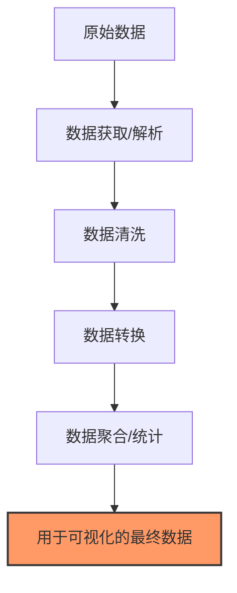

# JavaScript 数据处理

## 引言

在创建数据可视化之前，我们首先需要理解如何处理原始数据。JavaScript提供了丰富的工具和技术来清洗、转换、筛选和聚合数据，为后续的可视化做好准备。本文将介绍JavaScript中处理数据的基本概念和技术，帮助你为数据可视化打下坚实基础。

:::note 学习目标
- 了解JavaScript中的数据类型和数据结构
- 掌握数据获取和解析的方法
- 学习数据转换、筛选和聚合技术
- 理解数据规范化和数据清洗的重要性
:::

## JavaScript 中的数据类型与数据结构

在处理数据之前，我们需要了解JavaScript中的基本数据类型和数据结构。

### 基本数据类型

JavaScript有以下几种基本数据类型：

- **Number**：用于表示数值，如`42`或`3.14`
- **String**：用于表示文本数据，如`"Hello World"`
- **Boolean**：表示逻辑值，只有`true`或`false`
- **Null**：表示空值
- **Undefined**：表示未定义
- **Symbol**：ES6新增的类型，表示唯一的标识符
- **BigInt**：用于表示任意精度的整数

### 复合数据结构

处理数据时，我们通常会用到以下数据结构：

- **对象(Object)**：键值对的集合
- **数组(Array)**：有序列表
- **Map**：键值对集合，比对象更适合频繁添加和删除键
- **Set**：值的集合，每个值只能出现一次

## 数据获取与解析

在实际应用中，数据通常来自外部源，如API、文件或数据库。JavaScript提供了多种方法来获取和解析这些数据。

### 使用Fetch API获取数据

Fetch API是现代浏览器提供的获取资源的接口，它返回一个Promise。

```javascript
// 从API获取数据
fetch('https://api.example.com/data')
  .then(response => response.json())
  .then(data => {
    console.log(data);
    // 处理数据...
  })
  .catch(error => console.error('获取数据时出错：', error));
```

### 解析不同格式的数据

#### JSON数据

JSON (JavaScript Object Notation) 是最常见的数据格式，可以直接使用`JSON.parse()`和`JSON.stringify()`方法进行解析和序列化。

```javascript
// 解析JSON字符串
const jsonString = '{"name":"John","age":30,"city":"New York"}';
const jsonData = JSON.parse(jsonString);
console.log(jsonData.name); // 输出: John

// 将对象转换为JSON字符串
const person = {name: "Alice", age: 25, city: "Boston"};
const personJson = JSON.stringify(person);
console.log(personJson); // 输出: {"name":"Alice","age":25,"city":"Boston"}
```

#### CSV数据

处理CSV（逗号分隔值）数据需要手动解析或使用第三方库。

```javascript
// 手动解析简单的CSV数据
function parseCSV(csv) {
  const lines = csv.split('\n');
  const headers = lines[0].split(',');
  const result = [];
  
  for (let i = 1; i < lines.length; i++) {
    if (lines[i].trim() === '') continue;
    const obj = {};
    const currentLine = lines[i].split(',');
    
    for (let j = 0; j < headers.length; j++) {
      obj[headers[j]] = currentLine[j];
    }
    
    result.push(obj);
  }
  
  return result;
}

const csvData = `name,age,city
John,30,New York
Alice,25,Boston`;

const parsedData = parseCSV(csvData);
console.log(parsedData);
/* 输出:
[
  { name: 'John', age: '30', city: 'New York' },
  { name: 'Alice', age: '25', city: 'Boston' }
]
*/
```

## 数据转换与操作

获取数据后，我们通常需要对其进行转换和操作，以便更好地进行可视化。

### 数组方法

JavaScript数组提供了丰富的方法来转换和操作数据：

#### 1. map - 转换数组中的每个元素

```javascript
// 将数组中的所有数字转换为平方值
const numbers = [1, 2, 3, 4, 5];
const squares = numbers.map(num => num * num);
console.log(squares); // 输出: [1, 4, 9, 16, 25]
```

#### 2. filter - 筛选符合条件的元素

```javascript
// 获取所有偶数
const numbers = [1, 2, 3, 4, 5, 6];
const evenNumbers = numbers.filter(num => num % 2 === 0);
console.log(evenNumbers); // 输出: [2, 4, 6]
```

#### 3. reduce - 将数组归约为单个值

```javascript
// 计算所有数字的总和
const numbers = [1, 2, 3, 4, 5];
const sum = numbers.reduce((total, current) => total + current, 0);
console.log(sum); // 输出: 15
```

#### 4. sort - 排序数组元素

```javascript
// 按照数值大小排序
const numbers = [5, 2, 8, 1, 4];
numbers.sort((a, b) => a - b);
console.log(numbers); // 输出: [1, 2, 4, 5, 8]
```

### 对象操作

对象是组织数据的另一种重要方式，以下是一些常用的对象操作方法：

```javascript
// 获取对象的所有键
const person = {name: "John", age: 30, city: "New York"};
const keys = Object.keys(person);
console.log(keys); // 输出: ["name", "age", "city"]

// 获取对象的所有值
const values = Object.values(person);
console.log(values); // 输出: ["John", 30, "New York"]

// 获取对象的键值对
const entries = Object.entries(person);
console.log(entries); 
// 输出: [["name", "John"], ["age", 30], ["city", "New York"]]
```

## 数据聚合与统计

数据聚合和统计是数据处理的重要部分，它们帮助我们理解数据趋势和模式。

### 分组数据

```javascript
// 按城市分组人员
const people = [
  {name: "John", age: 30, city: "New York"},
  {name: "Alice", age: 25, city: "Boston"},
  {name: "Bob", age: 35, city: "New York"},
  {name: "Carol", age: 28, city: "Boston"}
];

const peopleByCity = people.reduce((acc, person) => {
  // 如果当前城市还没有数组，则创建一个
  if (!acc[person.city]) {
    acc[person.city] = [];
  }
  // 将当前人员添加到对应城市的数组中
  acc[person.city].push(person);
  return acc;
}, {});

console.log(peopleByCity);
/* 输出:
{
  "New York": [
    {name: "John", age: 30, city: "New York"},
    {name: "Bob", age: 35, city: "New York"}
  ],
  "Boston": [
    {name: "Alice", age: 25, city: "Boston"},
    {name: "Carol", age: 28, city: "Boston"}
  ]
}
*/
```

### 计算统计数据

```javascript
// 计算平均年龄
const people = [
  {name: "John", age: 30},
  {name: "Alice", age: 25},
  {name: "Bob", age: 35},
  {name: "Carol", age: 28}
];

const totalAge = people.reduce((sum, person) => sum + person.age, 0);
const averageAge = totalAge / people.length;

console.log(`平均年龄: ${averageAge}`); // 输出: 平均年龄: 29.5
```

## 数据清洗与规范化

在处理真实世界的数据时，数据清洗是不可避免的步骤，因为原始数据通常包含错误、缺失或不一致的数据。

### 处理缺失值

```javascript
// 处理缺失值，用默认值替换null和undefined
const users = [
  {id: 1, name: "John", email: "john@example.com"},
  {id: 2, name: "Alice", email: null},
  {id: 3, name: "Bob"},
  {id: 4, name: "Carol", email: "carol@example.com"}
];

const cleanUsers = users.map(user => ({
  id: user.id,
  name: user.name,
  email: user.email || "未提供邮箱"
}));

console.log(cleanUsers);
/* 输出:
[
  {id: 1, name: "John", email: "john@example.com"},
  {id: 2, name: "Alice", email: "未提供邮箱"},
  {id: 3, name: "Bob", email: "未提供邮箱"},
  {id: 4, name: "Carol", email: "carol@example.com"}
]
*/
```

### 数据类型转换

```javascript
// 将字符串形式的数字转换为实际的数值
const salesData = [
  {product: "苹果", sales: "150"},
  {product: "香蕉", sales: "200"},
  {product: "橙子", sales: "120"}
];

const normalizedData = salesData.map(item => ({
  product: item.product,
  sales: parseInt(item.sales, 10)  // 转换为整数
}));

console.log(normalizedData);
/* 输出:
[
  {product: "苹果", sales: 150},
  {product: "香蕉", sales: 200},
  {product: "橙子", sales: 120}
]
*/
```

## 实际案例：处理销售数据

让我们通过一个完整的实例来应用我们学到的数据处理技术。假设我们有一组销售数据，我们需要处理它以便进行可视化。

```javascript
// 原始销售数据
const rawSalesData = [
  {date: "2023-01-01", product: "产品A", amount: "120.50", region: "东部"},
  {date: "2023-01-01", product: "产品B", amount: "85.75", region: "西部"},
  {date: "2023-01-02", product: "产品A", amount: "95.25", region: "东部"},
  {date: "2023-01-02", product: "产品C", amount: "150.00", region: "北部"},
  {date: "2023-01-03", product: "产品B", amount: "112.30", region: "东部"},
  {date: "2023-01-03", product: "产品A", amount: "130.50", region: "西部"},
  {date: "2023-01-04", product: "产品C", amount: "90.80", region: "南部"},
  {date: null, product: "产品B", amount: "105.60", region: "北部"}
];

// 步骤1: 数据清洗 - 处理缺失的日期并将金额转换为数字
const cleanData = rawSalesData.map(item => ({
  date: item.date || "未知日期",
  product: item.product,
  amount: parseFloat(item.amount),
  region: item.region
}));

// 步骤2: 按产品分组并计算每个产品的总销售额
const salesByProduct = cleanData.reduce((acc, item) => {
  if (!acc[item.product]) {
    acc[item.product] = 0;
  }
  acc[item.product] += item.amount;
  return acc;
}, {});

// 步骤3: 转换为可视化所需的数组格式
const visualizationData = Object.entries(salesByProduct).map(([product, total]) => ({
  product,
  total
}));

// 步骤4: 按总销售额排序
visualizationData.sort((a, b) => b.total - a.total);

console.log(visualizationData);
/* 输出:
[
  {product: "产品A", total: 346.25},
  {product: "产品B", total: 303.65},
  {product: "产品C", total: 240.8}
]
*/

// 步骤5: 计算总销售额和平均销售额
const totalSales = cleanData.reduce((sum, item) => sum + item.amount, 0);
const averageSalePerTransaction = totalSales / cleanData.length;

console.log(`总销售额: ${totalSales.toFixed(2)}`);
console.log(`平均每笔交易: ${averageSalePerTransaction.toFixed(2)}`);
/* 输出:
总销售额: 890.70
平均每笔交易: 111.34
*/

// 步骤6: 按地区分组销售额
const salesByRegion = cleanData.reduce((acc, item) => {
  if (!acc[item.region]) {
    acc[item.region] = 0;
  }
  acc[item.region] += item.amount;
  return acc;
}, {});

console.log(salesByRegion);
/* 输出:
{
  "东部": 328.05,
  "西部": 216.25,
  "北部": 255.6,
  "南部": 90.80
}
*/
```

:::tip 实践建议
当处理更复杂的数据时，考虑使用专门的数据处理库，如Lodash、Ramda或D3.js。这些库提供了许多高效的数据处理函数，可以简化你的代码。
:::

## 数据处理流程图

以下是一个典型的数据处理流程：



## 总结

在本文中，我们学习了JavaScript中处理数据的基本技术，包括：

1. 理解JavaScript中的数据类型和数据结构
2. 使用Fetch API获取数据以及解析不同格式的数据
3. 利用数组方法（map, filter, reduce, sort）转换和操作数据
4. 对数据进行聚合和统计分析
5. 清洗和规范化数据以处理实际问题
6. 通过一个实际案例应用数据处理技术

掌握这些数据处理技术是进行有效数据可视化的关键步骤。处理得当的数据可以让你的可视化更加清晰、准确，并能更好地传达其中的洞察。

## 练习

为了加强你的学习，尝试完成以下练习：

1. 从公开的API获取一些数据(例如天气API或者GitHub API)，并使用本文学到的技术处理这些数据。
2. 给定一组包含学生成绩的数据，计算每个学生的平均分，并找出成绩最高和最低的学生。
3. 处理一组销售数据，按照月份对销售额进行聚合，并计算每月的增长率。

## 附加资源

要深入学习JavaScript数据处理，可以参考以下资源：

- [MDN Web 文档 - 使用数组](https://developer.mozilla.org/zh-CN/docs/Web/JavaScript/Guide/Indexed_collections)
- [JavaScript.info - 数据类型](https://zh.javascript.info/types)
- [D3.js 数据操作教程](https://observablehq.com/@d3/learn-d3-data)
- [Lodash 文档](https://lodash.com/docs)