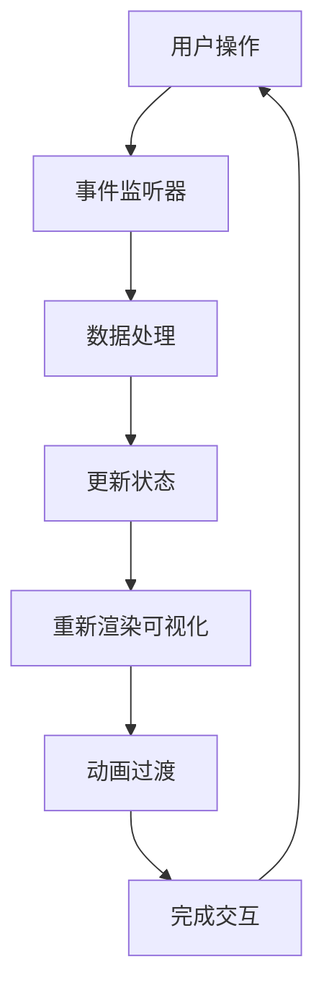

# JavaScript 交互式可视化

## 什么是交互式可视化？

交互式可视化是指允许用户与数据展示进行交互的可视化表现形式。不同于静态图表，交互式可视化使用户能够通过点击、悬停、拖拽等操作来探索数据，获得更深入的数据洞察。JavaScript作为Web前端的核心语言，提供了强大的工具和库来创建这些动态、响应式的数据可视化。

:::tip
交互式可视化的优势在于它能让复杂数据变得更易理解，并允许用户根据自己的兴趣探索数据的不同方面。
:::

## 交互式可视化的基本元素

一个成功的交互式可视化通常包含以下元素：

1. **数据绑定**：将数据源连接到视觉元素
2. **事件监听**：捕捉用户操作
3. **状态管理**：跟踪和更新可视化状态
4. **动画过渡**：平滑地展示数据变化
5. **用户控件**：如滑块、按钮、下拉菜单等

## 开始使用JavaScript创建交互式可视化

### 基础HTML结构

首先，我们需要创建一个基础的HTML结构来容纳我们的可视化：

```html
<!DOCTYPE html>
<html>
<head>
    <title>交互式可视化示例</title>
    <style>
        #chart {
            width: 600px;
            height: 400px;
            margin: 0 auto;
        }
        .bar {
            fill: steelblue;
            transition: fill 0.3s;
        }
        .bar:hover {
            fill: orange;
        }
    </style>
</head>
<body>
    <div id="chart"></div>
    <div id="controls">
        <button id="update">更新数据</button>
    </div>
    
    <script src="https://d3js.org/d3.v7.min.js"></script>
    <script src="visualization.js"></script>
</body>
</html>
```

### 使用D3.js创建交互式柱状图

D3.js是创建交互式数据可视化最流行的JavaScript库之一。下面是一个简单的交互式柱状图示例：

```javascript
// visualization.js
document.addEventListener('DOMContentLoaded', function() {
    // 设置图表尺寸
    const margin = {top: 20, right: 20, bottom: 30, left: 40};
    const width = 600 - margin.left - margin.right;
    const height = 400 - margin.top - margin.bottom;
    
    // 初始数据
    let data = [
        {name: "A", value: 5},
        {name: "B", value: 10},
        {name: "C", value: 15},
        {name: "D", value: 20},
        {name: "E", value: 25}
    ];
    
    // 创建SVG元素
    const svg = d3.select("#chart")
        .append("svg")
        .attr("width", width + margin.left + margin.right)
        .attr("height", height + margin.top + margin.bottom)
        .append("g")
        .attr("transform", `translate(${margin.left},${margin.top})`);
    
    // 创建比例尺
    const x = d3.scaleBand()
        .domain(data.map(d => d.name))
        .range([0, width])
        .padding(0.1);
    
    const y = d3.scaleLinear()
        .domain([0, d3.max(data, d => d.value)])
        .nice()
        .range([height, 0]);
    
    // 添加X轴
    svg.append("g")
        .attr("class", "x axis")
        .attr("transform", `translate(0,${height})`)
        .call(d3.axisBottom(x));
    
    // 添加Y轴
    svg.append("g")
        .attr("class", "y axis")
        .call(d3.axisLeft(y));
    
    // 创建并更新图表函数
    function updateChart() {
        // 更新比例尺
        y.domain([0, d3.max(data, d => d.value)]).nice();
        svg.select(".y.axis").transition().duration(500).call(d3.axisLeft(y));
        
        // 数据绑定
        const bars = svg.selectAll(".bar")
            .data(data, d => d.name);
        
        // 移除不再需要的元素
        bars.exit().remove();
        
        // 添加新元素
        bars.enter()
            .append("rect")
            .attr("class", "bar")
            .attr("x", d => x(d.name))
            .attr("width", x.bandwidth())
            .attr("y", height)
            .attr("height", 0)
            .merge(bars) // 合并现有元素
            .on("mouseover", function(event, d) {
                d3.select(this).attr("fill", "orange");
                
                // 显示工具提示
                svg.append("text")
                    .attr("class", "tooltip")
                    .attr("x", x(d.name) + x.bandwidth() / 2)
                    .attr("y", y(d.value) - 5)
                    .attr("text-anchor", "middle")
                    .text(d.value);
            })
            .on("mouseout", function() {
                d3.select(this).attr("fill", "steelblue");
                svg.selectAll(".tooltip").remove();
            })
            .transition() // 添加过渡动画
            .duration(500)
            .attr("y", d => y(d.value))
            .attr("height", d => height - y(d.value));
    }
    
    // 初始化图表
    updateChart();
    
    // 添加更新按钮事件
    document.getElementById("update").addEventListener("click", function() {
        // 随机更新数据
        data = data.map(d => ({
            name: d.name,
            value: Math.floor(Math.random() * 50)
        }));
        
        updateChart();
    });
});
```

### 图表交互效果解析

在上面的例子中，我们实现了以下交互效果：

1. **鼠标悬停效果**：当用户将鼠标悬停在柱子上时，柱子颜色会变为橙色，并显示数值提示
2. **数据更新**：点击"更新数据"按钮会随机生成新数据，并通过动画过渡更新可视化
3. **平滑过渡**：所有数据更新都使用动画过渡，使变化更加平滑

## 常见的交互式可视化类型

### 1. 工具提示与悬停效果

工具提示（Tooltip）是最基本的交互形式，当用户悬停在数据点上时显示详细信息：

```javascript
// 简化的工具提示实现
element.addEventListener('mouseover', function(event) {
    // 创建工具提示
    const tooltip = document.createElement('div');
    tooltip.className = 'tooltip';
    tooltip.innerHTML = `<strong>${data.name}</strong>: ${data.value}`;
    
    // 设置位置
    tooltip.style.left = (event.pageX + 10) + 'px';
    tooltip.style.top = (event.pageY - 10) + 'px';
    
    document.body.appendChild(tooltip);
});

element.addEventListener('mouseout', function() {
    // 移除工具提示
    const tooltip = document.querySelector('.tooltip');
    if (tooltip) {
        document.body.removeChild(tooltip);
    }
});
```

### 2. 缩放与平移

缩放和平移允许用户放大感兴趣的区域或导航大型数据集：

```javascript
// 使用D3.js实现缩放和平移
const zoom = d3.zoom()
    .scaleExtent([1, 10])
    .on('zoom', (event) => {
        svg.attr('transform', event.transform);
    });

svg.call(zoom);
```

### 3. 筛选与排序

允许用户根据特定标准筛选或排序数据：

```javascript
document.getElementById('sort').addEventListener('click', function() {
    // 对数据排序
    data.sort((a, b) => a.value - b.value);
    
    // 更新可视化
    updateChart();
});

document.getElementById('filter').addEventListener('change', function() {
    const minValue = this.value;
    
    // 筛选数据
    const filteredData = originalData.filter(d => d.value >= minValue);
    
    // 更新可视化
    updateChart(filteredData);
});
```

## 实际应用案例：交互式销售仪表板

下面是一个更复杂的实际应用案例 - 一个交互式销售仪表板。这个例子展示了如何结合多个交互元素创建功能全面的可视化：

```javascript
// 仪表板示例代码 (部分)

// 1. 加载数据
async function loadData() {
    // 在实际应用中，这通常是从API获取的
    return [
        { month: "Jan", sales: 1200, revenue: 45000, category: "Electronics" },
        { month: "Feb", sales: 800, revenue: 30000, category: "Electronics" },
        { month: "Mar", sales: 1500, revenue: 55000, category: "Electronics" },
        { month: "Jan", sales: 900, revenue: 25000, category: "Clothing" },
        { month: "Feb", sales: 1300, revenue: 35000, category: "Clothing" },
        { month: "Mar", sales: 1100, revenue: 32000, category: "Clothing" },
        // 更多数据...
    ];
}

// 2. 初始化仪表板
async function initDashboard() {
    const data = await loadData();
    
    // 创建图表
    createSalesChart(data);
    createRevenueChart(data);
    createCategoryPieChart(data);
    
    // 设置交互控件
    setupDateRangePicker(data);
    setupCategoryFilter(data);
    setupMetricsToggle(data);
}

// 3. 创建销售图表
function createSalesChart(data) {
    // 创建折线图代码...
    // 添加交互性：
    // - 悬停显示每月详细销售数据
    // - 点击月份显示该月详细明细
}

// 4. 设置类别筛选器
function setupCategoryFilter(data) {
    const categories = [...new Set(data.map(d => d.category))];
    
    const select = document.getElementById('category-filter');
    
    categories.forEach(category => {
        const option = document.createElement('option');
        option.value = category;
        option.textContent = category;
        select.appendChild(option);
    });
    
    select.addEventListener('change', function() {
        const selectedCategory = this.value;
        
        // 根据所选类别筛选数据
        let filteredData = data;
        if (selectedCategory !== 'all') {
            filteredData = data.filter(d => d.category === selectedCategory);
        }
        
        // 更新所有图表
        updateAllCharts(filteredData);
    });
}

// 更多函数...

// 初始化仪表板
document.addEventListener('DOMContentLoaded', initDashboard);
```

:::note
在实际应用中，这样的仪表板通常还会结合RESTful API获取实时数据，并根据用户权限和角色显示不同的可视化内容。
:::

## 交互式可视化的最佳实践

创建有效的交互式可视化需要遵循一些最佳实践：

1. **保持简单**：不要过度设计交互，确保用户能够直观地理解如何与可视化交互。
2. **提供视觉反馈**：当用户执行操作时，提供明确的视觉反馈。
3. **优化性能**：对于大型数据集，使用技术如防抖动、节流和数据采样来保持良好的性能。
4. **响应式设计**：确保可视化在不同屏幕尺寸上都能良好工作。
5. **提供重置选项**：允许用户轻松地重置为初始视图。
6. **考虑可访问性**：确保可视化对键盘导航和屏幕阅读器友好。



## 常见的JavaScript可视化库

以下是一些流行的JavaScript可视化库，各有其优缺点：

| 库名 | 优点 | 适用场景 |
|------|------|----------|
| D3.js | 强大灵活，完全控制 | 复杂自定义可视化 |
| Chart.js | 简单易用，响应式 | 简单图表，快速实现 |
| Highcharts | 功能丰富，兼容性好 | 企业级应用 |
| Plotly.js | 科学可视化，交互性强 | 数据科学应用 |
| Three.js | 3D可视化 | 3D数据展示 |
| ECharts | 丰富组件，中文支持好 | 复杂仪表盘 |

## 进阶技巧：动画与过渡

动画和过渡可以大大提升交互式可视化的用户体验。以下是使用JavaScript实现平滑过渡的例子：

```javascript
// 使用D3.js的过渡效果
function updateBars(data) {
    const bars = svg.selectAll(".bar")
        .data(data);
    
    // 添加新柱子
    bars.enter()
        .append("rect")
        .attr("class", "bar")
        .attr("x", d => x(d.name))
        .attr("width", x.bandwidth())
        // 从底部开始的动画
        .attr("y", height)
        .attr("height", 0)
        .merge(bars) // 合并新旧元素
        .transition() // 应用过渡
        .duration(750) // 持续750毫秒
        .attr("y", d => y(d.value))
        .attr("height", d => height - y(d.value));
    
    // 移除不再需要的柱子
    bars.exit()
        .transition()
        .duration(750)
        .attr("y", height)
        .attr("height", 0)
        .remove();
}
```

## 练习与挑战

为了巩固所学知识，尝试完成以下挑战：

1. **基础挑战**：创建一个简单的交互式柱状图，当用户悬停在柱子上时显示详细数据。
2. **中级挑战**：使用D3.js或Chart.js创建一个可以通过下拉菜单筛选不同类别数据的可视化。
3. **高级挑战**：创建一个包含多个图表的仪表板，这些图表可以相互交互（例如，点击一个图表上的数据点会过滤其他图表）。

:::tip 实践建议
从小处着手！先掌握基本的交互技术，然后逐步构建更复杂的可视化。使用真实数据进行练习，这样可以更好地理解数据可视化的实际应用价值。
:::

## 总结

JavaScript交互式可视化是数据呈现的强大方式，它允许用户通过交互来探索和理解复杂数据。本文介绍了创建交互式可视化的基本概念、工具和技术，从基础的悬停效果到复杂的多图表交互。

通过掌握这些技能，您可以创建既美观又实用的数据可视化，帮助用户更好地理解和利用数据。记住，优秀的交互式可视化应该是直观的、响应快速的，并且能够清晰地传达数据中的洞见。

## 附加资源

要继续深入学习JavaScript交互式可视化，可以参考以下资源：

- D3.js官方文档与示例集：[https://d3js.org](https://d3js.org)
- Observable - 交互式可视化笔记本：[https://observablehq.com](https://observablehq.com)
- "数据可视化实战"在线课程
- "交互式数据可视化：D3.js入门到精通"书籍
- FreeCodeCamp的数据可视化认证课程

继续练习和实验，很快你就能创建出令人印象深刻的交互式可视化！