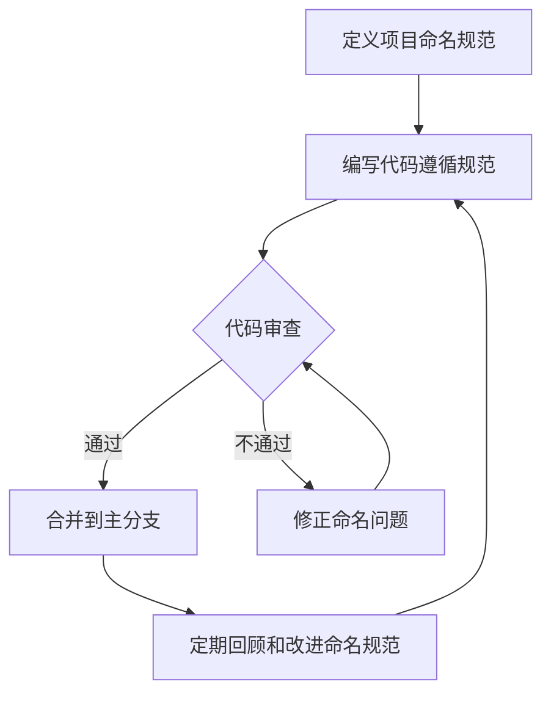

# JavaScript 命名约定

## 介绍

良好的命名约定是编写高质量JavaScript代码的基础。命名约定不仅使代码更具可读性，还能帮助团队成员更好地理解和维护代码。在本文中，我们将深入探讨JavaScript中的命名约定，从变量、函数到类和常量，为你提供全面的指导。

:::tip 提示
优秀的代码就像一本好书——不需要额外的注释就能被理解。良好的命名习惯是实现这一目标的关键。
:::

## 为什么命名约定很重要？

命名约定的重要性体现在以下几个方面：

1. **可读性** - 良好的命名使代码自解释，减少阅读和理解的时间
2. **可维护性** - 清晰的命名有助于日后维护代码
3. **团队协作** - 统一的命名规则提高团队协作效率
4. **减少错误** - 明确的名称可以避免许多常见错误
5. **代码质量** - 良好的命名是高质量代码的标志之一

## JavaScript 命名约定规则

### 1. 驼峰命名法（Camel Case）

JavaScript中最常用的命名规则是驼峰命名法，适用于变量名和函数名。

```javascript
// 良好的命名示例
let firstName = "John";
let lastName = "Doe";
let userAge = 25;

// 不推荐的命名
let firstname = "John";
let last_name = "Doe"; // 下划线形式在JavaScript中不常用
let UserAge = 25; // 首字母大写通常用于类名
```

### 2. 帕斯卡命名法（Pascal Case）

类名和构造函数名通常使用帕斯卡命名法，即每个单词的首字母都大写。

```javascript
// 良好的类命名示例
class UserProfile {
  constructor(name, age) {
    this.name = name;
    this.age = age;
  }
}

// 构造函数示例
function Person(firstName, lastName) {
  this.firstName = firstName;
  this.lastName = lastName;
}
```

### 3. 全大写命名法

常量通常使用全大写字母加下划线分隔的方式命名。

```javascript
// 良好的常量命名
const MAX_USERS = 50;
const API_KEY = "abc123xyz";
const DEFAULT_TIMEOUT = 3000;

// 不推荐的常量命名
const maxUsers = 50; // 看起来像普通变量
```

### 4. 私有属性和方法的命名

在ES6之前，私有属性和方法通常使用下划线（_）前缀表示。在现代JavaScript中，我们有了更好的方式（例如#符号），但下划线前缀仍然被广泛使用。

```javascript
class BankAccount {
  constructor(owner) {
    this.owner = owner;
    // 以下划线开头，表明是私有属性
    this._balance = 0;
  }
  
  // 私有方法
  _calculateInterest() {
    return this._balance * 0.01;
  }
  
  deposit(amount) {
    this._balance += amount;
  }
  
  getBalance() {
    return this._balance;
  }
}
```

在现代JavaScript中，可以使用真正的私有字段：

```javascript
class BankAccount {
  #balance = 0; // 真正的私有字段
  
  constructor(owner) {
    this.owner = owner;
  }
  
  #calculateInterest() { // 私有方法
    return this.#balance * 0.01;
  }
  
  deposit(amount) {
    this.#balance += amount;
  }
  
  getBalance() {
    return this.#balance;
  }
}
```

### 5. 布尔变量命名

布尔变量或返回布尔值的函数应该以 `is`, `has`, `can` 或 `should` 等为前缀。

```javascript
// 良好的布尔变量命名
let isActive = true;
let hasPermission = false;
let canEdit = true;
let shouldRefresh = false;

// 函数命名
function isAdult(age) {
  return age >= 18;
}

function hasAccess(user) {
  return user.accessLevel > 2;
}
```

### 6. 函数命名

函数名应该是动词或动词短语，准确描述函数的操作。

```javascript
// 良好的函数命名
function getUserData() { /* ... */ }
function calculateTotal() { /* ... */ }
function validateInput() { /* ... */ }

// 不推荐的函数命名
function data() { /* ... */ } // 不明确
function process() { /* ... */ } // 太宽泛
```

## 命名约定的应用案例

### 案例1: 用户管理功能

以下是一个用户管理功能的代码片段，展示了良好的命名约定：

```javascript
// 常量定义
const MAX_LOGIN_ATTEMPTS = 3;
const DEFAULT_USER_ROLE = "member";

// 类定义
class User {
  #password; // 私有属性
  
  constructor(firstName, lastName, email) {
    this.firstName = firstName;
    this.lastName = lastName;
    this.email = email;
    this.role = DEFAULT_USER_ROLE;
    this.isActive = true;
    this.loginAttempts = 0;
  }
  
  getFullName() {
    return `${this.firstName} ${this.lastName}`;
  }
  
  setPassword(newPassword) {
    // 密码应至少8个字符
    if (newPassword.length < 8) {
      throw new Error("密码太短");
    }
    this.#password = newPassword;
  }
  
  #encryptPassword(password) {
    // 加密密码的私有方法
    return `encrypted_${password}`;
  }
  
  verifyPassword(inputPassword) {
    return this.#encryptPassword(inputPassword) === this.#password;
  }
  
  incrementLoginAttempts() {
    this.loginAttempts++;
    if (this.loginAttempts >= MAX_LOGIN_ATTEMPTS) {
      this.lockAccount();
    }
  }
  
  lockAccount() {
    this.isActive = false;
  }
}

// 函数定义
function createUserAccount(userData) {
  const { firstName, lastName, email, password } = userData;
  const newUser = new User(firstName, lastName, email);
  newUser.setPassword(password);
  return newUser;
}

// 使用示例
const userData = {
  firstName: "张",
  lastName: "三",
  email: "zhangsan@example.com",
  password: "secure_password_123"
};

const user = createUserAccount(userData);
console.log(user.getFullName()); // 输出: 张 三
console.log(user.isActive); // 输出: true
```

### 案例2: 电子商务购物车功能

```javascript
class ShoppingCart {
  constructor(customer) {
    this.customer = customer;
    this.items = [];
    this.#discountRate = 0;
  }
  
  #discountRate; // 私有属性
  
  addItem(product, quantity = 1) {
    this.items.push({ product, quantity });
  }
  
  removeItem(productId) {
    this.items = this.items.filter(item => item.product.id !== productId);
  }
  
  updateQuantity(productId, newQuantity) {
    const itemIndex = this.items.findIndex(item => item.product.id === productId);
    
    if (itemIndex !== -1) {
      this.items[itemIndex].quantity = newQuantity;
    }
  }
  
  getItemCount() {
    return this.items.reduce((total, item) => total + item.quantity, 0);
  }
  
  hasItems() {
    return this.items.length > 0;
  }
  
  #calculateItemsTotal() {
    return this.items.reduce((total, item) => {
      return total + (item.product.price * item.quantity);
    }, 0);
  }
  
  setDiscountRate(rate) {
    if (rate >= 0 && rate <= 1) {
      this.#discountRate = rate;
    } else {
      throw new Error("折扣率必须在0到1之间");
    }
  }
  
  getTotal() {
    const subtotal = this.#calculateItemsTotal();
    const discountAmount = subtotal * this.#discountRate;
    return subtotal - discountAmount;
  }
}

// 使用示例
const customer = { id: 101, name: "李四" };
const cart = new ShoppingCart(customer);

// 添加商品
cart.addItem({ id: 1, name: "手机", price: 1999 }, 1);
cart.addItem({ id: 2, name: "耳机", price: 199 }, 2);

console.log(cart.getItemCount()); // 输出: 3
console.log(cart.hasItems()); // 输出: true

// 应用10%折扣
cart.setDiscountRate(0.1);

console.log(`总金额: ¥${cart.getTotal()}`); // 输出: 总金额: ¥2156.7
```

## 避免的命名模式

### 1. 单字母命名

除了极少数情况（如循环中的索引变量`i, j, k`），尽量避免使用单字母变量名。

```javascript
// 不推荐
let d = new Date(); // d表示什么？

// 推荐
let currentDate = new Date();
```

### 2. 使用缩写

除非缩写非常常见和明确，否则避免在命名中使用缩写。

```javascript
// 不推荐
let fName = "张"; // fName是什么的缩写？
let lName = "三";

// 推荐
let firstName = "张";
let lastName = "三";
```

### 3. 无意义的命名

避免使用对变量内容没有描述意义的名称。

```javascript
// 不推荐
let stuff = ["苹果", "香蕉", "橙子"];
let data = { name: "张三", age: 30 };

// 推荐
let fruits = ["苹果", "香蕉", "橙子"];
let userData = { name: "张三", age: 30 };
```

### 4. 混合命名风格

在同一项目中保持一致的命名风格非常重要。

```javascript
// 不一致的命名风格（不推荐）
let user_name = "张三";
let userAge = 30;
let UserAddress = "北京";

// 一致的风格（推荐）
let userName = "张三";
let userAge = 30;
let userAddress = "北京";
```

## 命名约定在团队协作中的应用

团队协作中保持一致的命名约定至关重要。以下是一些建议：

1. **制定团队风格指南** - 团队应该有一个明确的JavaScript风格指南，包括命名约定
2. **使用自动化工具** - 使用ESLint等工具强制执行命名规则
3. **代码审查** - 在代码审查过程中关注命名约定
4. **定期回顾** - 定期回顾和更新团队的命名约定



## JavaScript 命名约定和性能

需要注意的是，虽然命名约定主要影响代码的可读性和可维护性，但在某些情况下也可能对性能产生轻微影响。例如，压缩工具会将长变量名转换为短名称以减小文件大小。不过，这不应该成为使用不良命名约定的理由。

:::note
现代JavaScript压缩工具（如Terser）在生产环境下会将你的变量名缩短，所以在源代码中使用描述性的长变量名不会影响最终的生产代码大小。
:::

## 总结

良好的JavaScript命名约定是编写高质量代码的基础。本文我们介绍了：

1. **变量命名** - 使用驼峰命名法（camelCase）
2. **类命名** - 使用帕斯卡命名法（PascalCase）
3. **常量命名** - 使用全大写和下划线（UPPER_SNAKE_CASE）
4. **私有成员命名** - 使用下划线前缀或#符号
5. **布尔值命名** - 使用is, has, can等前缀
6. **函数命名** - 使用动词或动词短语

遵循这些约定将帮助你编写更清晰、更易于维护的代码，并提高团队协作效率。

## 练习

1. 重构以下变量和函数名，使其遵循良好的命名约定：
   ```javascript
   let n = "张三";
   let a = 25;
   const max = 100;
   function calc(x, y) { return x + y; }
   class user { constructor(name) { this.name = name; } }
   ```

2. 为一个图书管理系统编写示例代码，确保所有的变量名、函数名和类名都遵循本文介绍的命名约定。

## 附加资源

- [Google JavaScript风格指南](https://google.github.io/styleguide/jsguide.html)
- [Airbnb JavaScript风格指南](https://github.com/airbnb/javascript)
- [JavaScript Standard Style](https://standardjs.com/)
- [Clean Code: JavaScript](https://github.com/ryanmcdermott/clean-code-javascript)

遵循良好的命名约定不仅会使你的代码更加专业，还会让你在团队中脱颖而出成为一名优秀的JavaScript开发者。