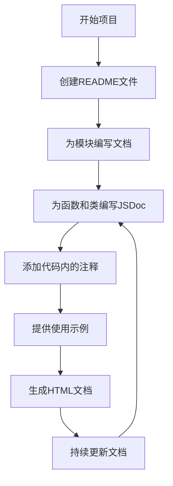

# JavaScript 文档编写

在专业的JavaScript开发中，编写良好的文档与编写高质量的代码同等重要。无论是为自己还是为团队创建代码，文档都是确保代码可维护性、可读性和长期价值的关键要素。本文将介绍JavaScript文档编写的最佳实践，帮助你养成良好的文档习惯。

## 为什么文档很重要？

良好的文档能带来以下好处：

- 帮助新开发者更快理解代码
- 减少沟通成本和知识传递障碍
- 提高代码的可维护性
- 降低技术债务
- 记录设计决策和代码意图

:::tip
优秀的文档不仅仅是告诉人们"怎么做"，更是解释"为什么这么做"。
:::

## JavaScript 文档的类型

在JavaScript项目中，文档通常包括以下几类：

1. **代码内注释** - 直接在源代码中添加的解释性文字
2. **API文档** - 详细描述函数、类和模块的用途和用法
3. **README文件** - 项目概览、安装和使用说明
4. **架构文档** - 系统设计和组件关系的高级描述
5. **教程和示例** - 展示如何使用代码的实际案例

## JSDoc：JavaScript标准文档格式

JSDoc是JavaScript中最广泛使用的文档标准，它使用特殊格式的注释来生成HTML文档。

### JSDoc基础语法

JSDoc注释以`/**`开始，以`*/`结束：

```javascript
/**
 * 计算两个数字的和
 * @param {number} a - 第一个数字
 * @param {number} b - 第二个数字
 * @returns {number} 两个数字的和
 */
function add(a, b) {
  return a + b;
}

// 使用示例
const result = add(5, 3); // 返回 8
```

### 常用JSDoc标签

以下是一些常见的JSDoc标签：

- `@param` - 描述函数参数
- `@returns` - 描述函数返回值
- `@example` - 提供使用示例
- `@throws` - 描述可能抛出的异常
- `@deprecated` - 表明该功能已过时
- `@see` - 提供相关资源的参考链接
- `@todo` - 标记需要完成的工作

## 为类和对象编写文档

使用JSDoc为类和对象提供清晰的文档：

```javascript
/**
 * 表示用户的类
 * @class
 */
class User {
  /**
   * 创建一个用户
   * @param {string} name - 用户名
   * @param {number} age - 用户年龄
   */
  constructor(name, age) {
    this.name = name;
    this.age = age;
  }

  /**
   * 获取用户的问候语
   * @returns {string} 包含用户名的问候语
   */
  getGreeting() {
    return `你好，我是${this.name}，今年${this.age}岁`;
  }
}

// 使用示例
const user = new User('小明', 25);
console.log(user.getGreeting()); // 输出: 你好，我是小明，今年25岁
```

## 为异步函数编写文档

异步函数（Promise、async/await）需要特别注明返回类型：

```javascript
/**
 * 从API获取用户数据
 * @param {number} userId - 要获取的用户ID
 * @returns {Promise<object>} 包含用户数据的Promise对象
 * @throws {Error} 如果请求失败
 */
async function fetchUserData(userId) {
  try {
    const response = await fetch(`https://api.example.com/users/${userId}`);
    if (!response.ok) {
      throw new Error('获取用户数据失败');
    }
    return await response.json();
  } catch (error) {
    throw error;
  }
}
```

## 模块文档

为整个JavaScript模块编写文档：

```javascript
/**
 * 用户管理模块
 * @module UserManager
 * @description 处理用户账户的创建、验证和管理
 * @author 你的名字
 * @version 1.0.0
 */

// 模块代码...
```

## README文件编写

项目的README.md是项目的门面，应包含以下内容：

```markdown
# 项目名称

简短的项目描述，解释项目的目的和解决的问题。

## 安装

```bash
npm install your-package-name
```

## 使用方法

```javascript
const yourPackage = require('your-package-name');
// 使用示例
```

## API文档

详细的API文档或链接。

## 贡献指南

说明如何贡献代码。

## 许可证

MIT License 或其他许可证信息。
```

## 实际案例：文档驱动开发

考虑以下实际开发场景：你正在创建一个计算器库。

### 1. 首先编写模块文档

```javascript
/**
 * @module advancedCalculator
 * @description 提供高级数学计算功能的JavaScript库
 */
```

### 2. 然后为主要函数编写文档

```javascript
/**
 * 计算给定数字数组的统计数据
 * @param {number[]} numbers - 要分析的数字数组
 * @returns {Object} 包含统计信息的对象（最小值、最大值、平均值、中位数）
 * @throws {TypeError} 如果输入不是数组或包含非数字值
 * @example
 * const stats = calculateStatistics([1, 2, 3, 4, 5]);
 * // 返回: { min: 1, max: 5, average: 3, median: 3 }
 */
function calculateStatistics(numbers) {
  // 验证输入
  if (!Array.isArray(numbers)) {
    throw new TypeError('输入必须是一个数组');
  }
  
  if (numbers.some(n => typeof n !== 'number')) {
    throw new TypeError('数组中所有元素必须是数字');
  }
  
  // 实现计算逻辑
  const sorted = [...numbers].sort((a, b) => a - b);
  const min = sorted[0];
  const max = sorted[sorted.length - 1];
  const sum = sorted.reduce((acc, val) => acc + val, 0);
  const average = sum / sorted.length;
  
  // 计算中位数
  let median;
  const middle = Math.floor(sorted.length / 2);
  if (sorted.length % 2 === 0) {
    median = (sorted[middle - 1] + sorted[middle]) / 2;
  } else {
    median = sorted[middle];
  }
  
  return { min, max, average, median };
}
```

### 3. 实际使用示例

```javascript
// 导入库
const calculator = require('./advancedCalculator');

// 使用库功能
try {
  const data = [4, 7, 2, 9, 3];
  const results = calculator.calculateStatistics(data);
  console.log('统计结果:', results);
  // 输出: 统计结果: { min: 2, max: 9, average: 5, median: 4 }
} catch (error) {
  console.error('计算错误:', error.message);
}
```

## 自动化文档工具

可以使用以下工具自动从JSDoc注释生成HTML文档：

1. **JSDoc** - 官方工具，从注释生成HTML文档
2. **ESDoc** - 更现代的JavaScript文档工具
3. **Documentation.js** - 轻量级文档生成器
4. **Docusaurus** - 为开源项目创建文档网站

使用命令行生成文档通常很简单：

```bash
# 使用JSDoc
npx jsdoc yourFile.js -d docs
```

## 文档风格指南

为确保文档一致性，请遵循这些原则：

1. **使用清晰简洁的语言** - 避免晦涩难懂的术语
2. **保持一致的格式** - 在整个项目中使用相同的注释风格
3. **更新文档以反映代码变化** - 过时的文档比没有文档更糟糕
4. **使用代码示例** - 实际例子比抽象描述更清晰
5. **解释"为什么"而不仅仅是"如何"** - 说明设计决策的理由

:::caution
文档和代码不同步是危险的！每当修改代码时，请确保同时更新相关文档。
:::

## 文档编写流程图

下面是一个建议的文档编写流程：



## 总结

良好的JavaScript文档是优秀开发实践的核心部分。通过使用JSDoc、编写清晰的README文件和遵循一致的文档风格，你可以确保你的代码不仅运行良好，还能被团队成员理解和维护。记住，编写文档不仅仅是为了他人，也是为了未来的自己。

## 练习

1. 为一个简单的待办事项管理器应用编写完整的JSDoc文档
2. 为已有项目添加或改进README文件
3. 使用JSDoc生成工具为一个现有项目生成HTML文档
4. 审查团队项目中的文档，并提出改进建议

## 附加资源

- [JSDoc官方文档](https://jsdoc.app/)
- [Clean Code: A Handbook of Agile Software Craftsmanship](https://www.amazon.com/Clean-Code-Handbook-Software-Craftsmanship/dp/0132350882)
- [Google JavaScript风格指南](https://google.github.io/styleguide/jsguide.html)
- [Mozilla开发者网络：JavaScript文档](https://developer.mozilla.org/zh-CN/docs/Web/JavaScript)

良好的文档习惯需要时间培养，但这是成为专业JavaScript开发者的重要一步。从今天开始，将文档视为代码的一部分，而不是额外的负担。