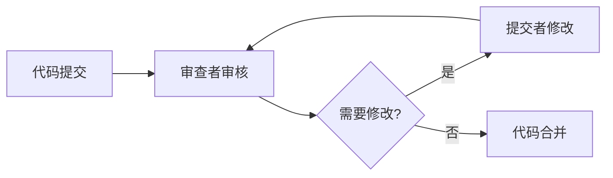

# JavaScript 代码审查

## 什么是代码审查？

代码审查是一个系统性检查源代码的过程，目的是找出错误、改进代码质量，并确保代码遵循团队或项目的编码标准。在JavaScript开发中，代码审查特别重要，因为JavaScript是一种灵活但也容易出错的语言。

:::tip
有效的代码审查不仅可以提高代码质量，还能促进团队成员之间的知识共享和技能提升。
:::

## 为什么需要代码审查？

代码审查在JavaScript开发中带来多种好处：

1. **提高代码质量** - 发现潜在bug和逻辑问题
2. **保持一致性** - 确保代码风格和结构统一
3. **知识分享** - 帮助团队成员互相学习最佳实践
4. **提高可维护性** - 确保代码易于理解和修改
5. **安全性增强** - 发现可能的安全漏洞

## 代码审查的基本流程



### 1. 准备代码提交

开发者完成功能开发后，准备提交代码进行审查：

```javascript
// 示例：准备提交的代码
function calculateTotal(items) {
  let total = 0;
  for (let i = 0; i < items.length; i++) {
    total += items[i].price;
  }
  return total;
}
```

### 2. 审查者检查代码

审查者检查代码，标记问题并提供建议：

```javascript
// 审查者可能提出的改进建议
function calculateTotal(items) {
  // 使用reduce方法更简洁
  return items.reduce((total, item) => total + item.price, 0);
}
```

### 3. 讨论和修改

基于审查意见，开发者修改代码并再次提交，直到代码符合要求。

### 4. 最终合并

代码审查通过后，可以合并到主分支。

## JavaScript 代码审查的关键检查点

### 1. 代码风格和格式

确保代码遵循一致的格式化规则：

```javascript
// 不良实践
function addNumbers(a,b){return a+b;}

// 良好实践
function addNumbers(a, b) {
  return a + b;
}
```

### 2. 命名约定

变量、函数和类名应当清晰且有描述性：

```javascript
// 不良实践
const x = document.getElementById('mainBtn');
function fn(a, b) { /* ... */ }

// 良好实践
const mainButton = document.getElementById('mainBtn');
function calculateDiscount(price, percentage) { /* ... */ }
```

### 3. 函数长度和复杂度

函数应当简短且专注于单一任务：

```javascript
// 复杂度过高的函数
function processUserData(user) {
  // 100行代码处理多种不同逻辑...
}

// 重构为多个专注的函数
function validateUserInput(user) { /* ... */ }
function formatUserData(user) { /* ... */ }
function saveUserToDatabase(formattedData) { /* ... */ }

function processUserData(user) {
  const isValid = validateUserInput(user);
  if (!isValid) return false;
  
  const formattedData = formatUserData(user);
  return saveUserToDatabase(formattedData);
}
```

### 4. 错误处理

检查是否有适当的错误处理机制：

```javascript
// 缺少错误处理
function fetchUserData(userId) {
  const response = fetch(`/api/users/${userId}`);
  const data = response.json();
  return data;
}

// 适当的错误处理
async function fetchUserData(userId) {
  try {
    const response = await fetch(`/api/users/${userId}`);
    if (!response.ok) {
      throw new Error(`HTTP error! Status: ${response.status}`);
    }
    return await response.json();
  } catch (error) {
    console.error('Failed to fetch user data:', error);
    throw error; // 或者返回一个默认值
  }
}
```

### 5. 性能考量

检查代码是否有性能瓶颈：

```javascript
// 性能问题
function findUsers(users, criteria) {
  // 在每次循环中重新计算数组长度
  for (let i = 0; i < users.length; i++) {
    // 多次DOM操作
    document.getElementById('results').innerHTML += renderUser(users[i]);
  }
}

// 性能优化
function findUsers(users, criteria) {
  const length = users.length; // 缓存数组长度
  const resultsHtml = [];
  
  for (let i = 0; i < length; i++) {
    if (matchesCriteria(users[i], criteria)) {
      resultsHtml.push(renderUser(users[i]));
    }
  }
  
  // 一次性DOM操作
  document.getElementById('results').innerHTML = resultsHtml.join('');
}
```

### 6. 安全性问题

检查是否存在潜在的安全漏洞：

```javascript
// 安全风险
function displayUserInput(input) {
  document.getElementById('output').innerHTML = input; // 可能导致XSS攻击
}

// 安全处理
function displayUserInput(input) {
  const sanitizedInput = DOMPurify.sanitize(input); // 使用库过滤危险内容
  document.getElementById('output').textContent = sanitizedInput; // 或使用textContent
}
```

## 代码审查工具

利用自动化工具可以提高代码审查效率：

1. **ESLint** - 静态代码分析工具，可检查语法错误和强制代码风格
   ```bash
   npm install eslint --save-dev
   npx eslint --init
   ```

2. **Prettier** - 代码格式化工具
   ```bash
   npm install prettier --save-dev
   ```

3. **SonarQube/SonarJS** - 检测代码质量和安全问题

4. **GitHub/GitLab代码审查功能** - 提供在线代码审查和讨论

## 实际案例：一个完整的代码审查流程

### 原始代码

```javascript
// user-service.js
function getUsers() {
  var xhr = new XMLHttpRequest();
  xhr.open('GET', '/api/users', false);
  xhr.send();
  
  if(xhr.status == 200) {
    var users = JSON.parse(xhr.responseText);
    var result = [];
    
    for(var i=0; i<users.length; i++) {
      var u = users[i];
      if(u.active == true) {
        result.push({name: u.name, email: u.email});
      }
    }
    
    return result;
  } else {
    alert('Error fetching users: ' + xhr.status);
    return [];
  }
}

function displayUsers() {
  var users = getUsers();
  var html = '';
  
  for(var i=0; i<users.length; i++) {
    html += '<div>' + users[i].name + ' (' + users[i].email + ')</div>';
  }
  
  document.getElementById('userList').innerHTML = html;
}
```

### 代码审查意见

1. 使用同步XHR请求可能阻塞UI线程
2. 缺少错误处理和用户反馈机制
3. 使用var而不是let/const
4. 直接将用户输入插入HTML可能导致XSS攻击
5. 函数做了太多事情，违反单一职责原则
6. 硬编码DOM选择器限制了代码复用性

### 改进后的代码

```javascript
// user-service.js
// 获取用户数据的服务函数
async function fetchUsers() {
  try {
    const response = await fetch('/api/users');
    
    if (!response.ok) {
      throw new Error(`HTTP error! Status: ${response.status}`);
    }
    
    const users = await response.json();
    return users.filter(user => user.active).map(user => ({
      name: user.name,
      email: user.email
    }));
  } catch (error) {
    console.error('Error fetching users:', error);
    // 使用更友好的UI反馈而不是alert
    showErrorMessage(`无法获取用户列表: ${error.message}`);
    return [];
  }
}

// 显示错误消息
function showErrorMessage(message) {
  const errorElement = document.getElementById('error-container');
  if (errorElement) {
    errorElement.textContent = message;
    errorElement.style.display = 'block';
  }
}

// 渲染单个用户
function renderUserItem(user) {
  const userDiv = document.createElement('div');
  userDiv.className = 'user-item';
  
  const nameSpan = document.createElement('span');
  nameSpan.textContent = user.name;
  
  const emailSpan = document.createElement('span');
  emailSpan.textContent = ` (${user.email})`;
  
  userDiv.appendChild(nameSpan);
  userDiv.appendChild(emailSpan);
  
  return userDiv;
}

// 显示用户列表
async function displayUsers(containerId = 'userList') {
  const containerElement = document.getElementById(containerId);
  if (!containerElement) {
    console.error(`Container element with id "${containerId}" not found`);
    return;
  }
  
  // 显示加载状态
  containerElement.textContent = '加载中...';
  
  try {
    const users = await fetchUsers();
    
    // 清空容器
    containerElement.innerHTML = '';
    
    if (users.length === 0) {
      containerElement.textContent = '没有找到活跃用户';
      return;
    }
    
    // 使用DocumentFragment提高性能
    const fragment = document.createDocumentFragment();
    users.forEach(user => {
      fragment.appendChild(renderUserItem(user));
    });
    
    containerElement.appendChild(fragment);
  } catch (error) {
    containerElement.textContent = '加载用户数据时出错';
    console.error('Error displaying users:', error);
  }
}
```

## 代码审查清单

以下是一个简单的JavaScript代码审查清单，可用于审查过程中：

- [ ] 代码是否遵循项目的编码规范？
- [ ] 变量和函数名是否清晰且有描述性？
- [ ] 是否有适当的注释和文档？
- [ ] 代码是否有重复部分可以重构？
- [ ] 是否有适当的错误处理机制？
- [ ] 是否考虑了边缘情况？
- [ ] 代码是否有潜在的性能问题？
- [ ] 是否存在安全风险？
- [ ] 单元测试是否覆盖主要功能？
- [ ] 代码是否易于理解和维护？

## 总结

代码审查是提高JavaScript代码质量的重要环节。通过系统性地检查代码，可以发现潜在问题，提高代码可维护性，并帮助团队建立一致的编码标准。有效的代码审查不仅关注代码的功能正确性，还应考虑代码风格、架构设计、性能优化和安全性等方面。

结合自动化工具和人工审查，可以大大提高代码审查的效率和有效性。记住，代码审查的最终目标不是批评代码或开发者，而是共同提高团队的代码质量和技术水平。

## 延伸学习

- 尝试为一个小项目建立代码审查流程和规范
- 学习使用ESLint和Prettier等工具自动化代码检查
- 参与开源项目的代码审查，学习他人的审查方法
- 阅读更多关于JavaScript最佳实践的资料

:::caution
记住，代码审查应该关注代码而非开发者个人。保持建设性的反馈，避免使用否定性语言，这样可以创造一个积极健康的团队环境。
:::