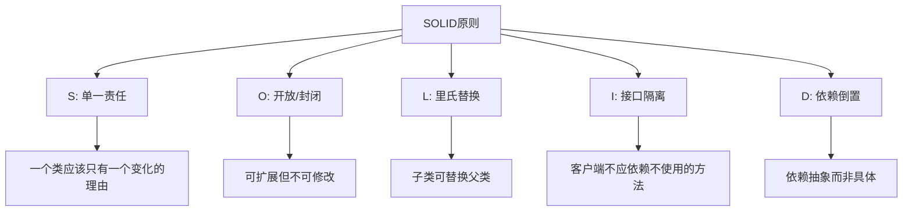

# JavaScript 设计原则

## 介绍

JavaScript设计原则是指在编写JavaScript代码时应该遵循的一系列最佳实践和规范。掌握这些原则不仅能帮助你编写出更加健壮、可维护和高效的代码，还能提高代码的可读性和可扩展性。对于初学者来说，尽早了解这些原则将奠定良好的编程习惯基础。

:::tip
良好的设计原则不仅仅是规则的集合，更是一种思维方式，能帮助你在编写代码时做出更好的决策。
:::

## 关键设计原则

### 1. 单一责任原则 (SRP)

**原则**: 一个函数或模块应该只有一个改变的理由，即只负责一项功能。

**示例**:

```javascript
// 不好的实践 - 一个函数做了多件事
function processUser(user) {
  // 验证用户
  if (!user.name || !user.email) {
    console.error('Invalid user data');
    return false;
  }
  
  // 保存用户到数据库
  saveToDatabase(user);
  
  // 发送欢迎邮件
  sendWelcomeEmail(user.email);
  
  return true;
}

// 好的实践 - 职责分离
function validateUser(user) {
  return user.name && user.email;
}

function saveUser(user) {
  return saveToDatabase(user);
}

function welcomeUser(user) {
  return sendWelcomeEmail(user.email);
}

function processUser(user) {
  if (!validateUser(user)) {
    console.error('Invalid user data');
    return false;
  }
  
  saveUser(user);
  welcomeUser(user);
  
  return true;
}
```

### 2. 开放/封闭原则 (OCP)

**原则**: 代码应该对扩展开放，对修改封闭。换句话说，你应该能够添加功能而不必修改现有代码。

**示例**:

```javascript
// 不好的实践
function calculateArea(shapes) {
  let area = 0;
  for (let shape of shapes) {
    if (shape.type === 'circle') {
      area += Math.PI * shape.radius ** 2;
    } else if (shape.type === 'rectangle') {
      area += shape.width * shape.height;
    }
    // 如果添加新形状，需要修改此函数
  }
  return area;
}

// 好的实践
class Circle {
  constructor(radius) {
    this.radius = radius;
  }
  
  getArea() {
    return Math.PI * this.radius ** 2;
  }
}

class Rectangle {
  constructor(width, height) {
    this.width = width;
    this.height = height;
  }
  
  getArea() {
    return this.width * this.height;
  }
}

// 添加新形状不需要修改calculateArea函数
function calculateArea(shapes) {
  return shapes.reduce((sum, shape) => sum + shape.getArea(), 0);
}
```

### 3. 依赖倒置原则 (DIP)

**原则**: 高层模块不应该依赖于低层模块，二者都应该依赖于抽象。抽象不应该依赖于细节，细节应该依赖于抽象。

**示例**:

```javascript
// 不好的实践 - 直接依赖具体实现
class UserService {
  constructor() {
    this.mysqlDatabase = new MySQLDatabase();
  }
  
  saveUser(user) {
    this.mysqlDatabase.save(user);
  }
}

// 好的实践 - 依赖抽象接口
class UserService {
  constructor(database) {
    this.database = database;
  }
  
  saveUser(user) {
    this.database.save(user);
  }
}

// 使用时注入具体实现
const userService = new UserService(new MySQLDatabase());
// 或者
const userService2 = new UserService(new MongoDatabase());
```

### 4. DRY原则 (Don't Repeat Yourself)

**原则**: 避免代码重复，每一块逻辑应该只在代码库中出现一次。

**示例**:

```javascript
// 不好的实践 - 重复代码
function validateEmail(email) {
  const regex = /^[^\s@]+@[^\s@]+\.[^\s@]+$/;
  return regex.test(email);
}

function registerUser(user) {
  // 这里重复了验证邮箱的逻辑
  const regex = /^[^\s@]+@[^\s@]+\.[^\s@]+$/;
  if (!regex.test(user.email)) {
    throw new Error('Invalid email');
  }
  // 注册用户...
}

// 好的实践 - 抽取共用函数
function validateEmail(email) {
  const regex = /^[^\s@]+@[^\s@]+\.[^\s@]+$/;
  return regex.test(email);
}

function registerUser(user) {
  if (!validateEmail(user.email)) {
    throw new Error('Invalid email');
  }
  // 注册用户...
}
```

### 5. KISS原则 (Keep It Simple, Stupid)

**原则**: 保持代码简单明了，避免不必要的复杂性。

**示例**:

```javascript
// 不好的实践 - 过度复杂
function getDayName(date) {
  const dayNumber = date.getDay();
  switch (dayNumber) {
    case 0:
      return 'Sunday';
    case 1:
      return 'Monday';
    case 2:
      return 'Tuesday';
    case 3:
      return 'Wednesday';
    case 4:
      return 'Thursday';
    case 5:
      return 'Friday';
    case 6:
      return 'Saturday';
    default:
      throw new Error('Invalid day number');
  }
}

// 好的实践 - 简单直接
function getDayName(date) {
  const days = ['Sunday', 'Monday', 'Tuesday', 'Wednesday', 'Thursday', 'Friday', 'Saturday'];
  return days[date.getDay()];
}
```

## 实际应用案例

让我们通过一个简单的待办事项应用来展示这些设计原则如何应用于实际项目：

```javascript
// 定义待办事项模型
class TodoItem {
  constructor(id, title, completed = false) {
    this.id = id;
    this.title = title;
    this.completed = completed;
  }

  toggleComplete() {
    this.completed = !this.completed;
    return this;
  }
}

// 存储接口（抽象）
class TodoStorage {
  saveTodos(todos) {
    throw new Error("Must implement saveTodos");
  }
  
  loadTodos() {
    throw new Error("Must implement loadTodos");
  }
}

// 具体存储实现 - LocalStorage
class LocalTodoStorage extends TodoStorage {
  constructor(key = 'todos') {
    super();
    this.key = key;
  }
  
  saveTodos(todos) {
    localStorage.setItem(this.key, JSON.stringify(todos));
  }
  
  loadTodos() {
    const data = localStorage.getItem(this.key);
    const items = data ? JSON.parse(data) : [];
    // 将普通对象转换回TodoItem实例
    return items.map(item => new TodoItem(item.id, item.title, item.completed));
  }
}

// 待办事项管理服务
class TodoService {
  constructor(storage) {
    this.storage = storage;
    this.todos = [];
    this.loadTodos();
  }
  
  loadTodos() {
    this.todos = this.storage.loadTodos();
  }
  
  saveTodos() {
    this.storage.saveTodos(this.todos);
  }
  
  addTodo(title) {
    const id = Date.now().toString();
    const todo = new TodoItem(id, title);
    this.todos.push(todo);
    this.saveTodos();
    return todo;
  }
  
  removeTodo(id) {
    this.todos = this.todos.filter(todo => todo.id !== id);
    this.saveTodos();
  }
  
  toggleTodo(id) {
    const todo = this.todos.find(todo => todo.id === id);
    if (todo) {
      todo.toggleComplete();
      this.saveTodos();
    }
    return todo;
  }
  
  getTodos() {
    return [...this.todos]; // 返回副本避免直接修改
  }
}

// 使用示例
const todoStorage = new LocalTodoStorage('my-todos');
const todoService = new TodoService(todoStorage);

// 添加待办事项
const newTodo = todoService.addTodo('学习JavaScript设计原则');
console.log('添加新待办事项:', newTodo);

// 显示所有待办事项
console.log('所有待办事项:', todoService.getTodos());

// 完成待办事项
const updatedTodo = todoService.toggleTodo(newTodo.id);
console.log('完成待办事项:', updatedTodo);
```

在这个案例中：

- **单一责任原则**: `TodoItem`、`TodoStorage` 和 `TodoService` 各自负责不同的功能。
- **开放/封闭原则**: 可以轻松添加新的存储实现，如 `RemoteTodoStorage`，而不需要修改已有代码。
- **依赖倒置原则**: `TodoService` 依赖于抽象的 `TodoStorage` 接口，而非具体实现。
- **DRY原则**: 通用功能如保存和加载被抽象到可复用的方法中。
- **KISS原则**: 各个类和方法保持简单明确的职责。

## JavaScript 中的设计模式

设计原则是指导思想，而设计模式是具体的实现方案。以下是JavaScript中常用的几种设计模式：

### 1. 模块模式

```javascript
const counterModule = (function() {
  // 私有变量
  let count = 0;
  
  // 返回公共API
  return {
    increment() {
      count += 1;
      return count;
    },
    decrement() {
      count -= 1;
      return count;
    },
    getCount() {
      return count;
    }
  };
})();

console.log(counterModule.getCount()); // 0
console.log(counterModule.increment()); // 1
console.log(counterModule.increment()); // 2
console.log(counterModule.decrement()); // 1
```

### 2. 观察者模式

```javascript
class EventEmitter {
  constructor() {
    this.events = {};
  }
  
  on(event, listener) {
    if (!this.events[event]) {
      this.events[event] = [];
    }
    this.events[event].push(listener);
  }
  
  emit(event, ...args) {
    if (this.events[event]) {
      this.events[event].forEach(listener => listener(...args));
    }
  }
}

// 使用示例
const emitter = new EventEmitter();

emitter.on('userCreated', user => {
  console.log(`User created: ${user.name}`);
});

emitter.on('userCreated', user => {
  sendWelcomeEmail(user.email);
});

// 触发事件
emitter.emit('userCreated', { name: 'John', email: 'john@example.com' });
```

### 3. 工厂模式

```javascript
function createButton(type) {
  const buttonTypes = {
    submit: {
      text: 'Submit',
      color: 'green',
      action: () => console.log('Form submitted')
    },
    cancel: {
      text: 'Cancel',
      color: 'red',
      action: () => console.log('Action cancelled')
    },
    reset: {
      text: 'Reset',
      color: 'yellow',
      action: () => console.log('Form reset')
    }
  };
  
  return buttonTypes[type];
}

const submitButton = createButton('submit');
submitButton.action(); // 输出: Form submitted
```

## 实现SOLID原则的现代JavaScript示例

SOLID是面向对象设计的五个重要原则的首字母缩写：

- **S**: 单一责任原则 (Single Responsibility Principle)
- **O**: 开放/封闭原则 (Open/Closed Principle)
- **L**: 里氏替换原则 (Liskov Substitution Principle)
- **I**: 接口隔离原则 (Interface Segregation Principle)
- **D**: 依赖倒置原则 (Dependency Inversion Principle)

以下是一个实现SOLID原则的现代JavaScript示例：

```javascript
// 使用ES6类和模块实现SOLID原则

// 单一责任原则 - 每个类只负责一项功能
class User {
  constructor(name, email) {
    this.name = name;
    this.email = email;
  }
}

class UserValidator {
  static validate(user) {
    if (!user.name || !user.email) {
      throw new Error('Invalid user data');
    }
    
    if (!UserValidator.isValidEmail(user.email)) {
      throw new Error('Invalid email format');
    }
    
    return true;
  }
  
  static isValidEmail(email) {
    return /^[^\s@]+@[^\s@]+\.[^\s@]+$/.test(email);
  }
}

// 依赖倒置原则 - 依赖抽象接口
class UserRepository {
  save(user) {
    throw new Error('Method not implemented');
  }
  
  findById(id) {
    throw new Error('Method not implemented');
  }
}

class MySQLUserRepository extends UserRepository {
  save(user) {
    console.log(`Saving user ${user.name} to MySQL`);
    // 实际保存逻辑
  }
  
  findById(id) {
    console.log(`Finding user with id ${id} in MySQL`);
    // 实际查询逻辑
    return new User('John', 'john@example.com');
  }
}

class UserService {
  constructor(userRepository) {
    this.userRepository = userRepository;
  }
  
  createUser(userData) {
    const user = new User(userData.name, userData.email);
    UserValidator.validate(user);
    return this.userRepository.save(user);
  }
}

// 使用示例
const userRepo = new MySQLUserRepository();
const userService = new UserService(userRepo);

try {
  const newUser = userService.createUser({
    name: 'Alice',
    email: 'alice@example.com'
  });
} catch (error) {
  console.error(error.message);
}
```

## 设计原则图示

以下是SOLID原则的简要图示：



## 总结

JavaScript设计原则是提高代码质量和可维护性的基础。遵循这些原则可以帮助你：

1. 编写更加模块化和可维护的代码
2. 降低代码的耦合度
3. 提高代码的可读性和可扩展性
4. 减少bug和技术债务
5. 使代码更容易测试和调试

作为初学者，不必一次掌握所有原则。从最基本的开始，如单一责任原则和DRY原则，随着经验的增长，逐渐应用更多高级原则。记住，编写良好的代码是一个持续学习和改进的过程。

:::caution
设计原则是指导性的，而非教条。在实际应用中，需要根据具体情况灵活运用，有时甚至需要在原则之间做出平衡。
:::

## 练习与延伸阅读

### 练习

1. 识别一段违反单一责任原则的代码，并重构它。
2. 使用工厂模式创建一个生成不同类型表单元素（输入框、按钮、复选框等）的系统。
3. 实现一个遵循观察者模式的简单事件系统。

### 延伸阅读

- 《Clean Code: A Handbook of Agile Software Craftsmanship》 by Robert C. Martin
- 《Design Patterns: Elements of Reusable Object-Oriented Software》 by Gamma, Helm, Johnson, and Vlissides
- 《JavaScript Patterns》 by Stoyan Stefanov
- MDN Web文档: JavaScript指南

掌握这些设计原则将帮助你从初学者过渡到熟练的JavaScript开发者，为你编写高质量、可维护的代码打下坚实的基础。