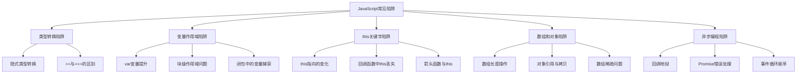

# JavaScript 常见陷阱

JavaScript作为一种灵活而强大的编程语言，有着自己独特的行为特点。对于初学者来说，这些特点有时会成为令人困惑的陷阱。本文将介绍一些常见的JavaScript陷阱，帮助你避免在编程过程中踩坑，提升代码质量。

## 类型转换的陷阱

JavaScript是一种弱类型语言，它会在运算时自动进行类型转换，这有时会导致令人意外的结果。

### 隐式类型转换

```javascript
console.log(1 + "2"); // 输出: "12" (数字与字符串相加，数字被转换为字符串)
console.log("2" - 1); // 输出: 1 (字符串与数字相减，字符串被转换为数字)
console.log(true + 1); // 输出: 2 (布尔值true转换为数字1)
console.log(false + 1); // 输出: 1 (布尔值false转换为数字0)
```

### 相等运算符(==)与严格相等运算符(===)

```javascript
console.log(1 == "1"); // 输出: true (会进行类型转换)
console.log(1 === "1"); // 输出: false (不会进行类型转换)

console.log(0 == false); // 输出: true
console.log(0 === false); // 输出: false

console.log(null == undefined); // 输出: true
console.log(null === undefined); // 输出: false
```

:::tip 最佳实践
总是使用严格相等运算符（===）进行比较，避免意外的类型转换。
:::

## 变量作用域的陷阱

JavaScript中变量的作用域规则可能会让初学者感到困惑，特别是在使用`var`关键字时。

### var、let和const的区别

```javascript
// 使用var的变量提升
console.log(x); // 输出: undefined (而不是报错)
var x = 10;

// 相当于:
// var x;
// console.log(x);
// x = 10;

// 使用let会报错
// console.log(y); // 报错: ReferenceError: y is not defined
let y = 10;

// 块级作用域
if (true) {
  var a = 1; // 在函数作用域中
  let b = 2; // 在块级作用域中
}
console.log(a); // 输出: 1
// console.log(b); // 报错: ReferenceError: b is not defined
```

### 闭包中的常见错误

```javascript
var funcs = [];
for (var i = 0; i < 3; i++) {
  funcs.push(function() {
    console.log(i);
  });
}
funcs[0](); // 输出: 3
funcs[1](); // 输出: 3
funcs[2](); // 输出: 3
```

修正后的代码：

```javascript
var funcs = [];
for (let i = 0; i < 3; i++) {
  funcs.push(function() {
    console.log(i);
  });
}
funcs[0](); // 输出: 0
funcs[1](); // 输出: 1
funcs[2](); // 输出: 2
```

:::caution 陷阱警告
在循环中使用`var`声明变量，并在闭包中使用这些变量时，常常会导致意外的行为。最好使用`let`来确保每次迭代都创建一个新的变量绑定。
:::

## this关键字的陷阱

JavaScript中的`this`关键字根据函数的调用方式不同，其指向也会有所不同，这常常令初学者感到困惑。

### this的不同指向

```javascript
// 在全局作用域中
console.log(this); // 输出: Window对象(浏览器) 或 global对象(Node.js)

// 在对象方法中
const user = {
  name: 'Alice',
  greet() {
    console.log(`你好，我是${this.name}`);
  }
};
user.greet(); // 输出: 你好，我是Alice

// 作为事件处理程序
const button = document.createElement('button');
button.textContent = '点击我';
button.addEventListener('click', function() {
  console.log(this); // 输出: button元素
});

// 作为构造函数
function User(name) {
  this.name = name;
  this.sayHi = function() {
    console.log(`Hi, I'm ${this.name}`);
  }
}
const bob = new User('Bob');
bob.sayHi(); // 输出: Hi, I'm Bob
```

### 丢失this引用

```javascript
const user = {
  name: 'Alice',
  greet() {
    console.log(`你好，我是${this.name}`);
  },
  greetLater() {
    // this在setTimeout回调中丢失
    setTimeout(function() {
      console.log(`你好，我是${this.name}`); // this指向window或global
    }, 1000);
  }
};

user.greetLater(); // 输出: 你好，我是undefined（因为window/global.name通常是undefined）
```

解决方案：

```javascript
const user = {
  name: 'Alice',
  greetLater() {
    // 方法1: 使用箭头函数
    setTimeout(() => {
      console.log(`你好，我是${this.name}`); // 能正确输出
    }, 1000);
    
    // 方法2: 使用bind
    setTimeout(function() {
      console.log(`你好，我是${this.name}`);
    }.bind(this), 1000);
    
    // 方法3: 保存this引用
    const self = this;
    setTimeout(function() {
      console.log(`你好，我是${self.name}`);
    }, 1000);
  }
};

user.greetLater(); // 输出: 你好，我是Alice
```

## 数组和对象的陷阱

JavaScript中的数组和对象操作也有一些需要特别注意的地方。

### 数组长度的行为

```javascript
const arr = [1, 2, 3];
arr.length = 2;
console.log(arr); // 输出: [1, 2]

const arr2 = [1];
arr2[5] = 6;
console.log(arr2); // 输出: [1, empty × 4, 6]
console.log(arr2.length); // 输出: 6
```

### 对象引用与浅拷贝

```javascript
// 对象引用
const person = { name: 'Alice', age: 30 };
const personRef = person;
personRef.age = 31;
console.log(person.age); // 输出: 31

// 浅拷贝
const person2 = { name: 'Bob', address: { city: 'Beijing' } };
const personCopy = { ...person2 };
personCopy.name = 'Charlie';
personCopy.address.city = 'Shanghai';

console.log(person2.name); // 输出: Bob (未被修改)
console.log(person2.address.city); // 输出: Shanghai (被修改了!)
```

## 异步编程的陷阱

异步编程是JavaScript的重要特性，但也是初学者容易遇到困难的地方。

### 回调地狱

```javascript
getData(function(data) {
  getMoreData(data, function(moreData) {
    getEvenMoreData(moreData, function(evenMoreData) {
      // 回调地狱，代码变得难以维护
      console.log(evenMoreData);
    }, errorCallback);
  }, errorCallback);
}, errorCallback);
```

通过Promise改进：

```javascript
getData()
  .then(data => getMoreData(data))
  .then(moreData => getEvenMoreData(moreData))
  .then(evenMoreData => {
    console.log(evenMoreData);
  })
  .catch(error => {
    console.error(error);
  });
```

通过async/await进一步改进：

```javascript
async function fetchAllData() {
  try {
    const data = await getData();
    const moreData = await getMoreData(data);
    const evenMoreData = await getEvenMoreData(moreData);
    console.log(evenMoreData);
  } catch (error) {
    console.error(error);
  }
}

fetchAllData();
```

### 异步操作的执行顺序

```javascript
console.log('开始');

setTimeout(() => {
  console.log('定时器回调');
}, 0);

Promise.resolve().then(() => {
  console.log('Promise回调');
});

console.log('结束');

// 输出顺序:
// 开始
// 结束
// Promise回调
// 定时器回调
```

:::note 事件循环
JavaScript的事件循环会先处理同步代码，然后是微任务（如Promise），最后才是宏任务（如setTimeout）。
:::

## 实际案例：用户表单提交

让我们来看一个结合了多个陷阱的实际案例：用户表单提交功能。

```javascript
// 不良实践版本
function submitForm() {
  var username = document.getElementById('username').value;
  var email = document.getElementById('email').value;
  
  // 类型转换陷阱
  if (username == false) { // 空字符串会被转换为false
    alert('请输入用户名');
    return;
  }
  
  // 作用域陷阱
  for (var i = 0; i < validators.length; i++) {
    // 假设validators是一个验证函数数组
    setTimeout(function() {
      console.log('验证器 ' + i + ' 已执行'); // i总是validators.length
    }, 100);
  }
  
  // this陷阱
  const user = {
    data: { username, email },
    validate: function() {
      return this.validateEmail(this.data.email);
    },
    validateEmail: function(email) {
      return email.includes('@');
    }
  };
  
  // 将方法作为回调传递时this丢失
  document.getElementById('submit-btn').onclick = user.validate; // this将指向按钮而非user
  
  // 异步陷阱
  $.ajax({
    url: '/api/users',
    data: { username, email },
    success: function(response) {
      this.showSuccess(); // 这里的this不是指向我们期望的对象
    }
  });
}
```

改进后的版本：

```javascript
// 最佳实践版本
function submitForm() {
  // 使用const/let避免作用域问题
  const username = document.getElementById('username').value;
  const email = document.getElementById('email').value;
  
  // 使用严格相等和明确的条件
  if (username === '' || username === null) {
    alert('请输入用户名');
    return;
  }
  
  // 使用let在循环中创建块级作用域
  for (let i = 0; i < validators.length; i++) {
    setTimeout(() => {
      console.log(`验证器 ${i} 已执行`); // 正确捕获i的值
    }, 100);
  }
  
  const user = {
    data: { username, email },
    validate() {
      return this.validateEmail(this.data.email);
    },
    validateEmail(email) {
      return email.includes('@');
    }
  };
  
  // 使用绑定this的方法
  document.getElementById('submit-btn').onclick = user.validate.bind(user);
  
  // 使用Promise或async/await处理异步
  fetch('/api/users', {
    method: 'POST',
    headers: {
      'Content-Type': 'application/json',
    },
    body: JSON.stringify({ username, email }),
  })
  .then(response => response.json())
  .then(data => {
    showSuccess(data);
  })
  .catch(error => {
    showError(error);
  });
}

function showSuccess(data) {
  console.log('提交成功:', data);
}

function showError(error) {
  console.error('提交失败:', error);
}
```

## JavaScript 常见陷阱流程图

以下是JavaScript中常见陷阱的简要概述：



## 总结

JavaScript有许多独特的行为特点，这些特点如果不了解，很容易成为编程过程中的陷阱。本文介绍了以下几类常见陷阱：

1. **类型转换陷阱**：理解隐式类型转换，并始终使用严格相等运算符（===）进行比较。
2. **变量作用域陷阱**：了解`var`、`let`和`const`的区别，注意闭包中的变量捕获。
3. **this关键字陷阱**：根据函数调用方式的不同，`this`指向会发生变化，可以使用箭头函数、`bind`方法或保存`this`引用来解决问题。
4. **数组和对象陷阱**：注意数组长度的特殊行为，以及对象引用和浅拷贝的区别。
5. **异步编程陷阱**：避免回调地狱，理解Promise和async/await的使用，了解事件循环的执行顺序。

通过深入理解这些陷阱并学会如何避免它们，你可以编写出更可靠、更易于维护的JavaScript代码。

## 练习

1. 写出以下代码的输出结果，并解释原因：
   ```javascript
   console.log(1 + '2' + 3);
   console.log(1 + 2 + '3');
   ```

2. 如何修复以下代码中的this指向问题？
   ```javascript
   const counter = {
     count: 0,
     increment: function() {
       setTimeout(function() {
         this.count++;
         console.log(this.count);
       }, 1000);
     }
   };
   counter.increment();
   ```

3. 解释以下代码的输出，并提供一个能按顺序输出0,1,2的解决方案：
   ```javascript
   for (var i = 0; i < 3; i++) {
     setTimeout(function() {
       console.log(i);
     }, 100);
   }
   ```

## 附加资源

- [MDN Web文档](https://developer.mozilla.org/zh-CN/docs/Web/JavaScript) - JavaScript权威参考
- [JavaScript: The Good Parts](https://www.oreilly.com/library/view/javascript-the-good/9780596517748/) - Douglas Crockford的经典著作
- [You Don't Know JS](https://github.com/getify/You-Dont-Know-JS) - 深入探讨JavaScript的系列书籍
- [JavaScript忍者秘籍](https://www.manning.com/books/secrets-of-the-javascript-ninja-second-edition) - John Resig的JavaScript进阶书籍

通过学习这些资源并不断实践，你将能够更好地理解JavaScript的各种特性，避免常见陷阱，成为一名更优秀的JavaScript开发者。