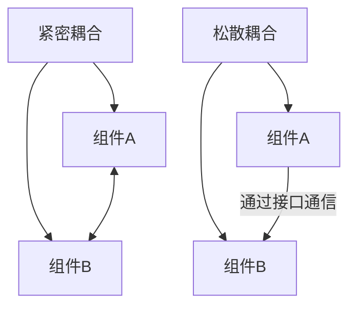

# JavaScript 可扩展性

## 什么是JavaScript可扩展性？

可扩展性是指软件应对增长的能力——无论是用户数量的增加、功能的扩展，还是代码库的扩大，一个可扩展的系统都能平稳地适应这些变化而不会崩溃或需要完全重写。在JavaScript中，可扩展性尤为重要，因为Web应用程序往往会随着时间推移而增长和演变。

:::tip 可扩展性的核心
可扩展性不仅关乎性能，还涉及代码组织、架构设计和维护效率。一个可扩展的JavaScript应用能够轻松添加新功能而不破坏现有功能。
:::

## 为什么可扩展性很重要？

想象一下你正在开发一个简单的待办事项应用。最初，它可能只需要添加、删除和标记完成任务。但随着时间的推移，你可能需要添加：

- 用户认证
- 任务分类和标签
- 任务共享和协作
- 提醒和通知
- 数据同步和离线功能

如果你的代码没有为这种增长做好准备，添加这些功能可能会导致：
- 代码混乱
- 难以调试的bug
- 性能问题
- 开发效率低下

## 构建可扩展JavaScript的核心原则

### 1. 模块化设计

将代码分解为独立、可复用的模块是可扩展性的基础。

#### ES6模块示例

```javascript
// math.js - 一个简单的数学函数模块
export const add = (a, b) => a + b;
export const subtract = (a, b) => a - b;
export const multiply = (a, b) => a * b;

// 在另一个文件中导入
import { add, multiply } from './math.js';

console.log(add(5, 3)); // 输出: 8
console.log(multiply(4, 2)); // 输出: 8
```

### 2. 单一职责原则

每个模块、类或函数应该只有一个职责或改变的理由。

```javascript
// 不好的例子 - 一个函数做太多事情
function processUser(userData) {
  // 验证用户数据
  if (!userData.name || !userData.email) {
    throw new Error('Invalid user data');
  }
  
  // 保存到数据库
  database.save(userData);
  
  // 发送欢迎邮件
  emailService.sendWelcome(userData.email);
  
  return true;
}

// 好的例子 - 职责分离
function validateUser(userData) {
  if (!userData.name || !userData.email) {
    throw new Error('Invalid user data');
  }
  return userData;
}

function saveUser(userData) {
  return database.save(userData);
}

function welcomeUser(email) {
  return emailService.sendWelcome(email);
}

// 使用这些功能
function processUser(userData) {
  const validatedData = validateUser(userData);
  saveUser(validatedData);
  welcomeUser(validatedData.email);
  return true;
}
```

### 3. 松散耦合

组件之间应该尽可能减少依赖，这样一个组件的变化不会影响其他组件。



### 4. 使用设计模式

#### 观察者模式示例

```javascript
class EventEmitter {
  constructor() {
    this.events = {};
  }

  on(eventName, callback) {
    if (!this.events[eventName]) {
      this.events[eventName] = [];
    }
    this.events[eventName].push(callback);
  }

  emit(eventName, data) {
    const eventCallbacks = this.events[eventName];
    if (eventCallbacks) {
      eventCallbacks.forEach(callback => callback(data));
    }
  }
}

// 使用示例
const userEvents = new EventEmitter();

// 添加监听器
userEvents.on('userLoggedIn', user => {
  console.log(`${user.name} 已登录！`);
  updateUI(user);
});

userEvents.on('userLoggedIn', user => {
  trackAnalytics('login', user.id);
});

// 触发事件
function login(username, password) {
  // 登录逻辑...
  const user = { id: 123, name: username };
  userEvents.emit('userLoggedIn', user);
}

// 调用登录
login('张三', 'password123');
// 输出: 张三 已登录!
// 然后执行 updateUI 和 trackAnalytics
```

### 5. 懒加载和代码分割

只在需要时加载代码，可以改善初始加载性能。

```javascript
// 使用动态导入实现懒加载
button.addEventListener('click', async () => {
  // 只有当用户点击按钮时才加载这个模块
  const { default: ComplexChart } = await import('./chart-library.js');
  
  // 使用导入的模块
  const chart = new ComplexChart();
  chart.render('#chart-container');
});
```

## 实际案例分析：可扩展的电子商务应用

让我们看一个简单的电子商务应用，展示如何随着功能增加保持可扩展性：

### 第一阶段：基本产品列表

```javascript
// 初始简单实现
const app = {
  products: [],
  
  init: function() {
    this.fetchProducts();
    this.bindEvents();
  },
  
  fetchProducts: function() {
    // 假设从API获取产品
    this.products = [
      { id: 1, name: 'T恤', price: 29.99 },
      { id: 2, name: '牛仔裤', price: 49.99 }
    ];
    this.renderProducts();
  },
  
  renderProducts: function() {
    const container = document.getElementById('product-list');
    container.innerHTML = this.products.map(product => `
      <div class="product">
        <h3>${product.name}</h3>
        <p>¥${product.price}</p>
        <button data-id="${product.id}">加入购物车</button>
      </div>
    `).join('');
  },
  
  bindEvents: function() {
    document.getElementById('product-list').addEventListener('click', (e) => {
      if (e.target.tagName === 'BUTTON') {
        const productId = parseInt(e.target.dataset.id);
        alert(`产品 ${productId} 已添加到购物车`);
      }
    });
  }
};

app.init();
```

### 第二阶段：重构为更可扩展的版本

```javascript
// 使用模块化方法重构
// productService.js
export const productService = {
  async getProducts() {
    // 在实际应用中，这会是一个API调用
    return [
      { id: 1, name: 'T恤', price: 29.99 },
      { id: 2, name: '牛仔裤', price: 49.99 }
    ];
  }
};

// cartService.js
export const cartService = {
  items: [],
  
  addItem(product) {
    this.items.push(product);
    this.updateCartUI();
    
    // 触发事件，以便其他模块可以响应
    const event = new CustomEvent('cartUpdated', { detail: this.items });
    document.dispatchEvent(event);
  },
  
  updateCartUI() {
    const cartCount = document.getElementById('cart-count');
    if (cartCount) {
      cartCount.textContent = this.items.length;
    }
  }
};

// productList.js
import { productService } from './productService.js';
import { cartService } from './cartService.js';

export const productList = {
  products: [],
  
  async init() {
    await this.loadProducts();
    this.render();
    this.bindEvents();
  },
  
  async loadProducts() {
    this.products = await productService.getProducts();
  },
  
  render() {
    const container = document.getElementById('product-list');
    container.innerHTML = this.products.map(product => `
      <div class="product">
        <h3>${product.name}</h3>
        <p>¥${product.price}</p>
        <button data-id="${product.id}">加入购物车</button>
      </div>
    `).join('');
  },
  
  bindEvents() {
    document.getElementById('product-list').addEventListener('click', (e) => {
      if (e.target.tagName === 'BUTTON') {
        const productId = parseInt(e.target.dataset.id);
        const product = this.products.find(p => p.id === productId);
        if (product) {
          cartService.addItem(product);
        }
      }
    });
  }
};

// app.js - 主入口
import { productList } from './productList.js';

document.addEventListener('DOMContentLoaded', () => {
  productList.init();
});

// 可以添加更多功能模块，如:
// - userAuth.js
// - checkout.js
// - analytics.js
```

:::note
注意模块化设计如何使代码更清晰、更易于维护。每个模块都有明确的职责，使添加新功能变得简单。
:::

## 实现可扩展性的最佳实践

1. **计划未来增长**：在设计应用程序时，考虑它可能如何发展，并为此设计架构。

2. **优先考虑明确的接口**：为模块和组件定义清晰的公共接口，隐藏实现细节。

3. **使用配置对象**：使用配置对象而非多个参数，使函数更灵活：

   ```javascript
   // 不太灵活
   function createUser(name, email, age, isAdmin, preferences) {
     // ...
   }

   // 更灵活
   function createUser(userConfig) {
     const { name, email, age, isAdmin = false, preferences = {} } = userConfig;
     // ...
   }
   ```

4. **采用事件驱动架构**：组件通过事件而非直接方法调用进行通信，降低耦合度。

5. **性能考虑**：
   - 实施延迟加载
   - 使用Web Workers处理计算密集型任务
   - 考虑内存使用和垃圾回收

6. **编写可测试的代码**：可测试的代码通常也是可扩展的代码。

7. **记录良好**：为模块和函数编写清晰的文档，使未来的开发人员（包括你自己）更容易理解和扩展代码。

## 可扩展性常见陷阱

:::caution
避免这些常见的可扩展性陷阱：
- **过度工程化**：不要为可能永远不会需要的扩展情况设计
- **过早优化**：先让代码正确运行，然后再优化性能
- **忽视测试**：缺乏测试会使扩展代码库变得困难和危险
- **深度嵌套依赖**：创建依赖链会使系统难以维护
:::

## 实践练习

**练习1**: 重构一个简单的函数，使它更具可扩展性
```javascript
// 原始函数
function calculateTotal(items) {
  let total = 0;
  for (let i = 0; i < items.length; i++) {
    total += items[i].price;
  }
  return total * 1.1; // 添加10%税
}

// 重构这个函数，使其更可扩展
// 提示：考虑如何灵活处理不同的税率、折扣等
```

**练习2**: 设计一个模块化的小应用程序，如待办事项列表，使其可以轻松添加新功能（如过滤、排序、导出等）。

## 总结

构建可扩展的JavaScript应用程序是一项需要深思熟虑的设计和良好习惯的技能。通过采用模块化设计、松散耦合、单一职责原则以及正确的设计模式，你可以创建能够随着需求增长而发展的代码库。

记住，可扩展性是一个持续的过程，而非一次性的目标。不断反思和重构你的代码，以确保它能够适应新需求和不断变化的环境。

## 进一步阅读资源

- 《JavaScript设计模式》 - Addy Osmani
- 《Clean Code: A Handbook of Agile Software Craftsmanship》 - Robert C. Martin
- MDN Web文档关于JavaScript模块
- 探索流行的JavaScript框架（React、Vue、Angular）如何实现可扩展性

现在，开始重新审视你的项目，看看它们如何更好地为增长和变化做好准备！