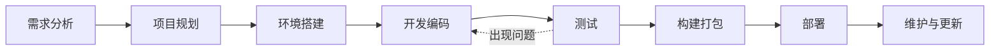

# JavaScript 开发流程

## 引言

无论你是在构建一个简单的交互式网页还是复杂的Web应用，遵循一个结构化的开发流程都能帮助你更高效地工作，减少错误，并产出更高质量的代码。本文将介绍一个完整的JavaScript开发流程，从项目规划到部署维护，帮助初学者建立起专业的开发习惯。

## 开发流程概述

一个标准的JavaScript开发流程通常包含以下几个阶段：



让我们详细了解每个阶段的具体内容和最佳实践。

## 1. 需求分析

### 什么是需求分析？

需求分析是确定你的JavaScript项目需要实现什么功能，解决什么问题的过程。

### 如何进行需求分析？

1. **明确目标**：你的应用要解决什么问题？
2. **用户故事**：描述用户如何与你的应用交互
3. **功能列表**：列出所有必要的功能
4. **非功能需求**：性能、安全性、可访问性等要求

:::tip 初学者建议
即使是个人项目，也建议写下需求文档。这会帮助你更清晰地思考项目目标，并在开发过程中保持专注。
:::

## 2. 项目规划

有了明确的需求后，需要进行项目规划：

### 技术栈选择

根据项目需求选择合适的技术：

- 纯JavaScript还是使用框架（React、Vue、Angular等）
- 是否需要后端支持（Node.js、Express等）
- 数据存储方案（本地存储、数据库等）

### 项目结构规划

```
project-name/
├── src/                # 源代码
│   ├── assets/         # 静态资源
│   ├── components/     # UI组件
│   ├── utils/          # 工具函数
│   └── app.js          # 主入口
├── public/             # 公共资源
├── tests/              # 测试文件
├── package.json        # 项目配置
└── README.md           # 项目说明
```

### 制定时间表

划分任务优先级，制定开发时间表，包括里程碑和截止日期。

## 3. 环境搭建

### 开发工具选择

- **编辑器/IDE**：VS Code、WebStorm等
- **版本控制**：Git（GitHub、GitLab等）
- **包管理器**：npm或yarn

### 项目初始化

```bash
# 创建新项目目录
mkdir my-js-project
cd my-js-project

# 初始化npm项目
npm init -y

# 安装必要的开发依赖
npm install eslint prettier --save-dev

# 创建基础项目结构
mkdir -p src/assets src/components src/utils public tests
touch src/app.js README.md
```

### 配置开发工具

#### ESLint配置示例

```js
// .eslintrc.js
module.exports = {
  env: {
    browser: true,
    es2021: true,
  },
  extends: 'eslint:recommended',
  parserOptions: {
    ecmaVersion: 12,
    sourceType: 'module',
  },
  rules: {
    indent: ['error', 2],
    quotes: ['error', 'single'],
    semi: ['error', 'always'],
  },
};
```

#### 配置Git忽略文件

```
# .gitignore
node_modules/
dist/
.env
.DS_Store
```

## 4. 开发编码

### 编码规范

建立并遵循一致的编码规范：

- 命名约定（camelCase、PascalCase等）
- 代码缩进和格式化
- 注释规范
- 模块化组织代码

### JavaScript 最佳实践

```js
// 不好的实践
var x = 5;
var y = "Hello";
if(x == "5") console.log(y);

// 好的实践
const number = 5;
const greeting = 'Hello';
if (number === 5) {
  console.log(greeting);
}
```

### 代码审查清单

- 使用`const`和`let`代替`var`
- 使用严格比较（`===`而非`==`）
- 避免全局变量
- 适当处理错误
- 编写可测试的代码

### 版本控制工作流

```bash
# 创建并切换到新分支
git checkout -b feature/login-form

# 开发功能后提交
git add .
git commit -m "Add login form with validation"

# 将功能分支合并到主分支
git checkout main
git merge feature/login-form
```

:::caution 注意
定期提交代码，每次提交应该专注于一个任务或修复，并附有清晰的提交信息。
:::

## 5. 测试

### 测试类型

- **单元测试**：测试单个函数或组件
- **集成测试**：测试多个组件的协作
- **端到端测试**：模拟用户行为测试整个应用

### 使用Jest进行单元测试示例

```js
// utils/calculator.js
export function add(a, b) {
  return a + b;
}

// tests/calculator.test.js
import { add } from '../src/utils/calculator';

test('adds 1 + 2 to equal 3', () => {
  expect(add(1, 2)).toBe(3);
});
```

### 测试驱动开发(TDD)

1. 编写测试
2. 运行测试（失败）
3. 编写代码使测试通过
4. 重构代码
5. 重复

## 6. 构建打包

### 什么是构建流程？

构建流程是将源代码转换为可部署的生产代码的过程，包括：

- 代码压缩（minification）
- 资源优化
- 文件打包
- 编译（如ES6+到ES5）

### Webpack基础配置

```js
// webpack.config.js
const path = require('path');

module.exports = {
  entry: './src/app.js',
  output: {
    filename: 'bundle.js',
    path: path.resolve(__dirname, 'dist'),
  },
  module: {
    rules: [
      {
        test: /\.js$/,
        exclude: /node_modules/,
        use: {
          loader: 'babel-loader',
        },
      },
      {
        test: /\.css$/,
        use: ['style-loader', 'css-loader'],
      },
    ],
  },
};
```

### 运行构建

```bash
# 安装依赖
npm install webpack webpack-cli --save-dev

# 运行构建
npx webpack --mode production
```

## 7. 部署

### 部署前检查清单

- 所有测试通过
- 性能指标达标
- 浏览器兼容性检查
- 安全漏洞检查

### 常见部署选项

- 静态网站托管（GitHub Pages、Netlify等）
- 云服务（AWS、Azure、Google Cloud等）
- 虚拟私有服务器（VPS）

### 静态网站部署示例（GitHub Pages）

```bash
# 构建项目
npm run build

# 将dist目录部署到gh-pages分支
git subtree push --prefix dist origin gh-pages
```

## 8. 维护与更新

### 监控与反馈

- 使用性能监控工具（Lighthouse、PageSpeed Insights）
- 收集用户反馈
- 错误跟踪（Sentry、LogRocket等）

### 迭代开发

根据反馈和监控数据，计划下一个迭代的改进和新功能。

### 代码维护

- 定期更新依赖
- 重构复杂或过时的代码
- 补充文档和注释

## 实际案例：构建一个待办事项应用

让我们通过一个简单的待办事项应用来演示完整的开发流程：

### 1. 需求分析

**功能需求**：
- 添加新任务
- 标记任务为完成/未完成
- 删除任务
- 保存任务到本地存储

### 2. 项目规划

**技术选择**：
- 纯JavaScript（不使用框架）
- HTML/CSS进行界面设计
- localStorage进行数据持久化

### 3. 开发示例

创建基础HTML结构：

```html
<!DOCTYPE html>
<html lang="en">
<head>
  <meta charset="UTF-8">
  <meta name="viewport" content="width=device-width, initial-scale=1.0">
  <title>Todo App</title>
  <link rel="stylesheet" href="styles.css">
</head>
<body>
  <div class="container">
    <h1>我的待办事项</h1>
    
    <form id="todo-form">
      <input type="text" id="todo-input" placeholder="添加新任务..." required>
      <button type="submit">添加</button>
    </form>
    
    <ul id="todo-list"></ul>
  </div>
  
  <script src="app.js"></script>
</body>
</html>
```

实现核心JavaScript功能：

```js
// app.js
document.addEventListener('DOMContentLoaded', () => {
  const todoForm = document.getElementById('todo-form');
  const todoInput = document.getElementById('todo-input');
  const todoList = document.getElementById('todo-list');
  
  // 从本地存储加载任务
  let todos = JSON.parse(localStorage.getItem('todos')) || [];
  
  // 渲染任务列表
  function renderTodos() {
    todoList.innerHTML = '';
    
    todos.forEach((todo, index) => {
      const li = document.createElement('li');
      li.innerHTML = `
        <span class="${todo.completed ? 'completed' : ''}">${todo.text}</span>
        <div class="actions">
          <button class="toggle-btn">${todo.completed ? '✓' : '○'}</button>
          <button class="delete-btn">×</button>
        </div>
      `;
      
      // 添加事件监听器
      const toggleBtn = li.querySelector('.toggle-btn');
      toggleBtn.addEventListener('click', () => {
        toggleTodo(index);
      });
      
      const deleteBtn = li.querySelector('.delete-btn');
      deleteBtn.addEventListener('click', () => {
        deleteTodo(index);
      });
      
      todoList.appendChild(li);
    });
    
    // 更新本地存储
    localStorage.setItem('todos', JSON.stringify(todos));
  }
  
  // 添加新任务
  function addTodo(text) {
    todos.push({
      text,
      completed: false
    });
    renderTodos();
  }
  
  // 切换任务状态
  function toggleTodo(index) {
    todos[index].completed = !todos[index].completed;
    renderTodos();
  }
  
  // 删除任务
  function deleteTodo(index) {
    todos.splice(index, 1);
    renderTodos();
  }
  
  // 表单提交事件
  todoForm.addEventListener('submit', (e) => {
    e.preventDefault();
    const todoText = todoInput.value.trim();
    
    if (todoText) {
      addTodo(todoText);
      todoInput.value = '';
    }
  });
  
  // 初始渲染
  renderTodos();
});
```

### 4. 测试

为核心功能编写单元测试：

```js
// tests/app.test.js
describe('Todo App', () => {
  beforeEach(() => {
    // 设置测试DOM
    document.body.innerHTML = `
      <form id="todo-form">
        <input type="text" id="todo-input">
        <button type="submit">Add</button>
      </form>
      <ul id="todo-list"></ul>
    `;
    
    // 清空localStorage模拟
    localStorage.clear();
    
    // 加载app.js (在实际测试中需要使用模块导入)
    require('../app.js');
  });
  
  test('adds a new todo when form is submitted', () => {
    const input = document.getElementById('todo-input');
    const form = document.getElementById('todo-form');
    
    input.value = 'Test todo';
    form.dispatchEvent(new Event('submit'));
    
    const todoItems = document.querySelectorAll('#todo-list li');
    expect(todoItems.length).toBe(1);
    expect(todoItems[0].querySelector('span').textContent).toBe('Test todo');
  });
  
  // 更多测试...
});
```

## 总结

一个良好的JavaScript开发流程不仅能提高开发效率，还能保证代码质量和项目可维护性。对于初学者来说，建立这样的开发习惯可能看起来繁琐，但随着经验的积累，这些步骤将成为自然而然的工作方式，帮助你从初学者迈向专业开发者。

记住，开发流程不是一成不变的，应该根据项目特点和团队需求进行适当调整。最重要的是，找到适合自己或团队的工作方式，并持续改进优化。

## 练习与资源

### 练习

1. **练习1**：创建一个简单的计算器应用，并应用本文介绍的开发流程。
2. **练习2**：为你现有的JavaScript项目添加ESLint和自动化测试。
3. **练习3**：尝试使用Webpack打包一个简单的项目并部署到GitHub Pages。

### 进一步学习的资源

- [MDN Web Docs - JavaScript](https://developer.mozilla.org/zh-CN/docs/Web/JavaScript)
- [现代JavaScript教程](https://zh.javascript.info/)
- [JavaScript测试实践](https://jestjs.io/zh-Hans/docs/getting-started)
- [Webpack官方文档](https://webpack.js.org/concepts/)

祝你的JavaScript开发之旅顺利！