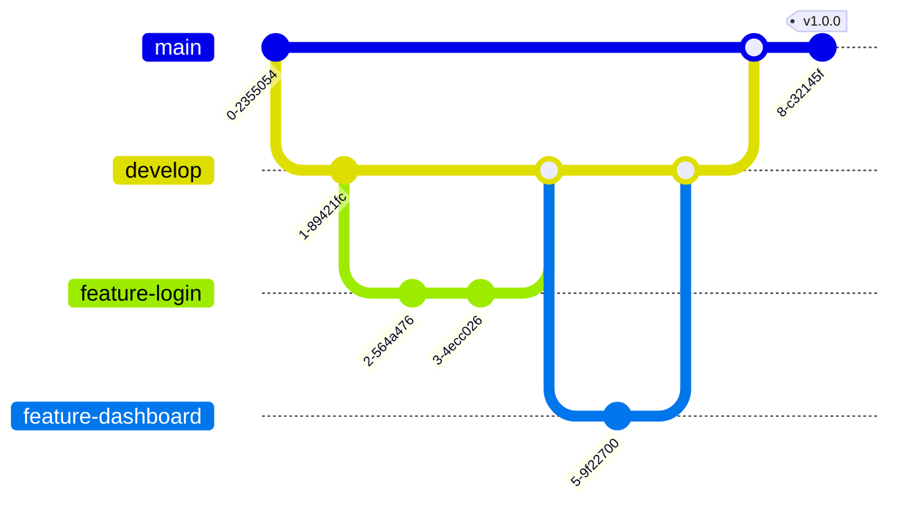

# JavaScript 团队协作

## 引言

在现代Web开发环境中，JavaScript项目很少是由单个开发者完成的。随着项目规模的扩大，团队协作变得尤为重要。良好的团队协作不仅能提高开发效率，还能确保代码质量和项目可维护性。本文将介绍JavaScript开发中的团队协作最佳实践，帮助初学者了解如何在团队环境中高效工作。

## 代码规范与一致性

### 为什么需要代码规范？

当多人在同一个项目中工作时，如果每个人都按自己的习惯编写代码，会导致代码风格不一致，增加代码审查和维护的难度。

:::tip
统一的代码规范可以：
- 提高代码可读性
- 减少错误
- 简化代码审查过程
- 降低维护成本
:::

### JavaScript 代码规范示例

以下是一些常见的JavaScript代码规范：

```javascript
// 不推荐
function calculate_sum(x,y) {
  var result=x+y;
  return result
}

// 推荐
function calculateSum(x, y) {
  const result = x + y;
  return result;
}
```

### 使用ESLint进行代码规范检查

ESLint是一个强大的静态代码分析工具，可以帮助团队自动化代码规范检查：

```javascript
// .eslintrc.js示例
module.exports = {
  "extends": "airbnb-base",
  "rules": {
    "no-console": "off",
    "indent": ["error", 2],
    "quotes": ["error", "single"]
  }
};
```

使用ESLint检查代码：

```bash
npx eslint yourfile.js
```

### 使用Prettier进行代码格式化

Prettier是一个代码格式化工具，可以与ESLint结合使用：

```bash
npm install --save-dev prettier eslint-config-prettier eslint-plugin-prettier
```

配置文件`.prettierrc.js`示例：

```javascript
module.exports = {
  semi: true,
  singleQuote: true,
  printWidth: 80,
  tabWidth: 2,
};
```

## 版本控制与协作流程

### Git基础操作

在团队协作中，Git是最常用的版本控制工具：

```bash
# 克隆仓库
git clone https://github.com/username/repository.git

# 创建新分支
git checkout -b feature-login

# 提交更改
git add .
git commit -m "Implement login functionality"

# 推送到远程仓库
git push origin feature-login
```

### Git分支管理策略



### GitHub Flow工作流

1. 从`main`分支创建功能分支
2. 在功能分支上进行开发
3. 提交Pull Request
4. 代码审查
5. 合并到`main`分支

### 冲突处理

当多人修改同一文件时，可能会产生冲突：

```bash
<<<<<<< HEAD
const greeting = 'Hello World';
=======
const greeting = 'Welcome';
>>>>>>> feature-branch
```

冲突解决步骤：
1. 识别冲突部分
2. 与团队成员讨论解决方案
3. 修改冲突代码
4. 提交解决冲突的更改

## 文档编写

### JSDoc注释

使用JSDoc为函数和类添加注释：

```javascript
/**
 * 计算两个数的和
 * @param {number} a - 第一个数
 * @param {number} b - 第二个数
 * @returns {number} 两个数的和
 */
function add(a, b) {
  return a + b;
}
```

### README文件

一个好的README文件应包含：

- 项目介绍
- 安装说明
- 使用示例
- API文档
- 贡献指南

示例：

```markdown
# 项目名称

简短描述项目功能和目的。

## 安装

```bash
npm install your-project-name
```

## 使用方法

```javascript
import { feature } from 'your-project-name';

// 使用示例
feature.doSomething();
```

## API文档

...

## 贡献指南

...
```

## 协作工具与技术

### 1. 项目管理工具

- **Jira**: 适合敏捷开发团队
- **Trello**: 轻量级项目管理
- **GitHub Projects**: 与代码库紧密集成

### 2. 代码审查

代码审查是团队协作中的重要环节：


代码审查的关键点：
- 功能是否按要求实现
- 代码质量和性能
- 是否符合团队代码规范
- 测试覆盖率

### 3. 持续集成/持续部署(CI/CD)


常用CI/CD工具：
- GitHub Actions
- Jenkins
- CircleCI
- Travis CI

GitHub Actions配置示例：

```yaml
name: CI

on:
  push:
    branches: [ main ]
  pull_request:
    branches: [ main ]

jobs:
  build:
    runs-on: ubuntu-latest
    steps:
      - uses: actions/checkout@v2
      - name: Use Node.js
        uses: actions/setup-node@v1
        with:
          node-version: '14.x'
      - run: npm ci
      - run: npm test
      - run: npm run build
```

## 实际案例：团队协作开发一个Todo应用

### 场景描述

假设一个5人团队正在开发一个Todo应用，功能包括：
- 用户认证
- 创建/编辑/删除任务
- 任务分类
- 提醒功能

### 项目结构

```
todo-app/
├── .github/
│   └── workflows/
│       └── ci.yml
├── src/
│   ├── components/
│   ├── services/
│   ├── utils/
│   └── App.js
├── tests/
├── .eslintrc.js
├── .prettierrc.js
├── package.json
└── README.md
```

### 协作流程

1. **项目启动**：
   - 团队讨论并明确需求
   - 设计技术架构
   - 分配任务

2. **开发阶段**：
   - 开发者A负责用户认证
   - 开发者B负责任务CRUD操作
   - 开发者C负责UI组件
   - 开发者D负责测试
   - 开发者E负责CI/CD配置

3. **版本控制**：
   - 每个功能在单独的分支开发
   - 功能完成后提交PR
   - 至少一名团队成员审查代码
   - 通过审查后合并到开发分支

4. **测试和部署**：
   - 自动化测试确保代码质量
   - 部署到测试环境
   - 用户验收测试
   - 部署到生产环境

### 代码示例：任务服务模块

```javascript
/**
 * 任务服务模块
 * @module TaskService
 */
class TaskService {
  /**
   * 创建新任务
   * @param {Object} taskData - 任务数据
   * @param {string} taskData.title - 任务标题
   * @param {string} taskData.description - 任务描述
   * @param {Date} taskData.dueDate - 截止日期
   * @returns {Promise<Object>} 创建的任务对象
   */
  static async createTask(taskData) {
    try {
      // 调用API创建任务
      const response = await api.post('/tasks', taskData);
      return response.data;
    } catch (error) {
      console.error('创建任务失败:', error);
      throw error;
    }
  }
  
  // 其他方法...
}

export default TaskService;
```

### 代码审查示例

```
PR: 实现任务创建功能 #42
---------------------------

审查意见:
- TaskService.createTask方法缺少输入验证
- 建议添加单元测试覆盖边界情况
- 使用async/await时请添加适当的错误处理

回应:
- 已添加输入验证和错误处理
- 添加了单元测试，覆盖率达到90%
```

## 常见挑战与解决方案

### 挑战1：代码质量不一致

**解决方案**：
- 实施严格的代码规范
- 使用自动化工具（ESLint, Prettier）
- 代码审查时关注质量问题

### 挑战2：知识孤岛

**解决方案**：
- 定期技术分享会议
- 结对编程
- 文档化重要决策和设计
- 轮换任务

### 挑战3：合并冲突频繁

**解决方案**：
- 更小、更频繁的提交
- 合理划分模块减少重叠
- 定期从主分支同步更新

### 挑战4：技术债务堆积

**解决方案**：
- 定期分配时间处理技术债务
- 建立质量指标监控
- "童子军规则"：离开时让代码比你发现它时更干净

## 总结

JavaScript团队协作是一项复杂但重要的技能。通过建立统一的代码规范、使用适当的版本控制策略、编写清晰的文档、利用自动化工具，团队可以显著提高开发效率和代码质量。记住，良好的协作不仅仅是技术问题，也是沟通和信任的问题。

## 练习

1. 使用ESLint和Prettier设置一个简单的JavaScript项目。
2. 使用Git创建一个新分支，添加功能，然后提交一个Pull Request。
3. 为一个JavaScript函数编写JSDoc注释。
4. 与同学合作开发一个简单的Todo应用，实践本文中的协作技巧。
5. 设置GitHub Actions进行自动化测试。

## 进一步学习资源

- [JavaScript风格指南 - Airbnb](https://github.com/airbnb/javascript)
- [Pro Git书籍](https://git-scm.com/book)
- [GitHub流程指南](https://guides.github.com/introduction/flow/)
- [ESLint文档](https://eslint.org/)
- [现代JavaScript教程](https://javascript.info/)