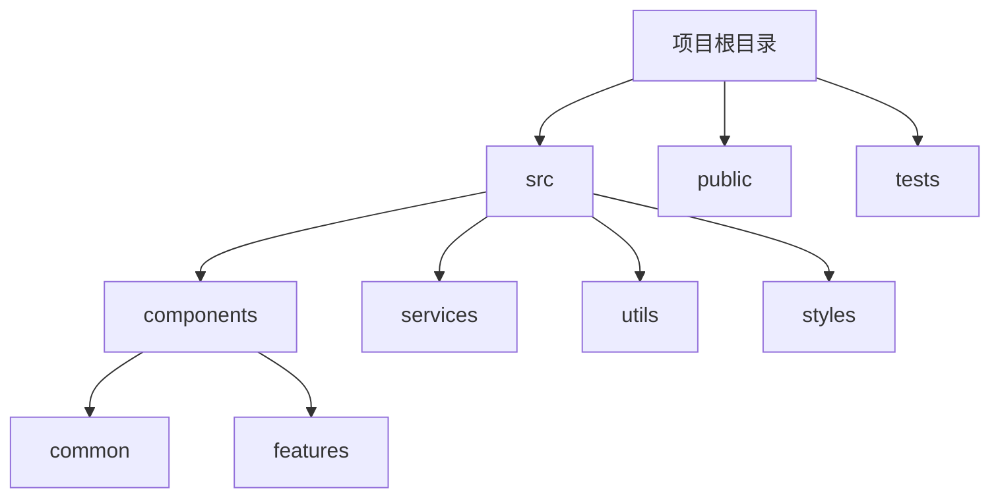

# JavaScript 代码组织

JavaScript代码组织是指如何结构化和安排代码，使其更易于理解、维护和扩展。良好的代码组织不仅可以提高开发效率，还能减少bug的产生，使代码更加健壮。本文将介绍JavaScript代码组织的核心概念和最佳实践。

## 为什么代码组织很重要？

在编写小型脚本或简单程序时，代码组织可能看起来不那么重要。但随着项目规模的增长，良好的代码组织变得至关重要：

- **可读性**：结构良好的代码更容易被其他开发者（包括未来的自己）理解
- **可维护性**：当需要修改或扩展功能时，组织良好的代码更容易更新
- **可重用性**：模块化的代码可以在不同项目中重复使用
- **协作**：在团队环境中，清晰的代码结构使多人同时工作更加顺畅

## 基本代码组织原则

### 1. 使用有意义的变量和函数命名

变量和函数名应该清晰地表达其用途或行为。

```javascript
// 不好的命名
const x = 42;
function doStuff() { /* ... */ }

// 好的命名
const userAge = 42;
function calculateTotalPrice() { /* ... */ }
```

### 2. 代码分组与注释

将相关的代码块分组放在一起，并使用注释说明各部分的功能。

```javascript
// 用户认证相关代码
function login(username, password) {
  // 验证凭据
  // ...
}

function logout() {
  // 清除会话
  // ...
}

// 购物车功能相关代码
function addToCart(product) {
  // 添加产品到购物车
  // ...
}
```

### 3. 避免过长的函数和文件

一个函数应该只做一件事，文件不应过长。如果函数超过50行或文件超过几百行，考虑拆分它们。

## 中级代码组织技术

### 1. 使用立即执行函数表达式(IIFE)

IIFE可以创建私有作用域，避免全局命名空间污染。

```javascript
// 不好的实践 - 变量泄露到全局作用域
let counter = 0;
function incrementCounter() {
  counter++;
}

// 好的实践 - 使用IIFE封装变量
const counter = (function() {
  let count = 0;
  return {
    increment: function() {
      count++;
      return count;
    },
    getValue: function() {
      return count;
    }
  };
})();

console.log(counter.increment()); // 输出: 1
console.log(counter.increment()); // 输出: 2
console.log(counter.getValue());  // 输出: 2
```

### 2. 模块模式

使用模块模式可以将相关功能组织在一起，同时提供公共和私有接口。

```javascript
const userModule = (function() {
  // 私有变量和函数
  let currentUser = null;
  
  function validateUsername(username) {
    return username.length >= 3;
  }
  
  // 公共接口
  return {
    login: function(username) {
      if (validateUsername(username)) {
        currentUser = username;
        console.log(`用户 ${username} 已登录`);
        return true;
      }
      return false;
    },
    
    logout: function() {
      console.log(`用户 ${currentUser} 已登出`);
      currentUser = null;
    },
    
    getCurrentUser: function() {
      return currentUser;
    }
  };
})();

userModule.login("Alice"); // 输出: 用户 Alice 已登录
console.log(userModule.getCurrentUser()); // 输出: Alice
userModule.logout(); // 输出: 用户 Alice 已登出
```

### 3. 使用ES6模块

ES6引入了原生模块系统，使代码组织更加简洁和标准化。

**文件: math.js**
```javascript
export function add(a, b) {
  return a + b;
}

export function subtract(a, b) {
  return a - b;
}
```

**文件: app.js**
```javascript
import { add, subtract } from './math.js';

console.log(add(5, 3));      // 输出: 8
console.log(subtract(5, 3)); // 输出: 2
```

## 高级代码组织策略

### 1. 文件和目录结构

在大型项目中，良好的文件和目录结构至关重要。一个常见的项目结构可能如下：



### 2. 设计模式

使用设计模式可以解决常见的代码组织问题：

#### 单例模式

确保一个类只有一个实例。

```javascript
class Database {
  constructor() {
    if (Database.instance) {
      return Database.instance;
    }
    
    this.connectionString = "mongodb://localhost:27017";
    Database.instance = this;
  }
  
  connect() {
    console.log(`连接到数据库: ${this.connectionString}`);
  }
}

const db1 = new Database();
const db2 = new Database();

console.log(db1 === db2); // 输出: true
```

#### 观察者模式

允许对象在状态变化时通知其依赖者。

```javascript
class EventEmitter {
  constructor() {
    this.events = {};
  }
  
  on(event, listener) {
    if (!this.events[event]) {
      this.events[event] = [];
    }
    this.events[event].push(listener);
  }
  
  emit(event, ...args) {
    if (!this.events[event]) return;
    this.events[event].forEach(listener => {
      listener(...args);
    });
  }
}

const emitter = new EventEmitter();
emitter.on('userLoggedIn', username => {
  console.log(`用户${username}已登录`);
});

emitter.emit('userLoggedIn', 'Alice'); // 输出: 用户Alice已登录
```

### 3. 组件化思想

将UI和功能分解成独立的、可复用的组件。这在现代前端框架（如React、Vue）中特别常见。

```javascript
// 一个简单的React组件示例
function UserCard({ user }) {
  return (
    <div className="user-card">
      <h3>{user.name}</h3>
      <p>Email: {user.email}</p>
      <p>Role: {user.role}</p>
    </div>
  );
}

// 使用该组件
function App() {
  const user = {
    name: "Alice Smith",
    email: "alice@example.com",
    role: "Administrator"
  };
  
  return (
    <div>
      <h1>用户信息</h1>
      <UserCard user={user} />
    </div>
  );
}
```

## 实际案例：ToDo应用程序

让我们通过一个简单的ToDo应用示例，展示如何组织JavaScript代码。

:::note
以下是一个简化版本，实际应用可能需要更多功能和错误处理。
:::

**文件结构:**
```
todo-app/
├── index.html
├── css/
│   └── style.css
└── js/
    ├── app.js         # 主应用入口
    ├── models/
    │   └── todo.js    # 数据模型
    ├── views/
    │   └── todoView.js # 视图渲染
    └── controllers/
        └── todoController.js # 业务逻辑
```

**models/todo.js**
```javascript
export class TodoModel {
  constructor() {
    this.todos = JSON.parse(localStorage.getItem('todos')) || [];
  }
  
  addTodo(text) {
    const todo = {
      id: Date.now(),
      text,
      completed: false
    };
    this.todos.push(todo);
    this._commit();
    return todo;
  }
  
  deleteTodo(id) {
    this.todos = this.todos.filter(todo => todo.id !== id);
    this._commit();
  }
  
  toggleTodo(id) {
    this.todos = this.todos.map(todo =>
      todo.id === id ? { ...todo, completed: !todo.completed } : todo
    );
    this._commit();
  }
  
  _commit() {
    localStorage.setItem('todos', JSON.stringify(this.todos));
  }
}
```

**views/todoView.js**
```javascript
export class TodoView {
  constructor() {
    this.app = document.getElementById('app');
    this.todoList = document.createElement('ul');
    this.todoList.className = 'todo-list';
    this.app.appendChild(this.todoList);
    
    this.form = document.createElement('form');
    this.input = document.createElement('input');
    this.input.type = 'text';
    this.input.placeholder = '添加新任务...';
    this.submitButton = document.createElement('button');
    this.submitButton.textContent = '添加';
    
    this.form.append(this.input, this.submitButton);
    this.app.appendChild(this.form);
  }
  
  displayTodos(todos) {
    while (this.todoList.firstChild) {
      this.todoList.removeChild(this.todoList.firstChild);
    }
    
    if (todos.length === 0) {
      const p = document.createElement('p');
      p.textContent = '没有待办事项！添加一个吧。';
      this.todoList.appendChild(p);
    } else {
      todos.forEach(todo => {
        const li = document.createElement('li');
        li.id = todo.id;
        
        const checkbox = document.createElement('input');
        checkbox.type = 'checkbox';
        checkbox.checked = todo.completed;
        
        const span = document.createElement('span');
        span.textContent = todo.text;
        if (todo.completed) {
          span.style.textDecoration = 'line-through';
        }
        
        const deleteButton = document.createElement('button');
        deleteButton.textContent = '删除';
        deleteButton.className = 'delete';
        
        li.append(checkbox, span, deleteButton);
        this.todoList.appendChild(li);
      });
    }
  }
  
  bindAddTodo(handler) {
    this.form.addEventListener('submit', event => {
      event.preventDefault();
      const text = this.input.value.trim();
      if (text) {
        handler(text);
        this.input.value = '';
      }
    });
  }
  
  bindDeleteTodo(handler) {
    this.todoList.addEventListener('click', event => {
      if (event.target.className === 'delete') {
        const id = parseInt(event.target.parentElement.id);
        handler(id);
      }
    });
  }
  
  bindToggleTodo(handler) {
    this.todoList.addEventListener('change', event => {
      if (event.target.type === 'checkbox') {
        const id = parseInt(event.target.parentElement.id);
        handler(id);
      }
    });
  }
}
```

**controllers/todoController.js**
```javascript
export class TodoController {
  constructor(model, view) {
    this.model = model;
    this.view = view;
    
    // 绑定事件处理
    this.view.bindAddTodo(this.handleAddTodo.bind(this));
    this.view.bindDeleteTodo(this.handleDeleteTodo.bind(this));
    this.view.bindToggleTodo(this.handleToggleTodo.bind(this));
    
    // 初始化显示
    this.refresh();
  }
  
  refresh() {
    this.view.displayTodos(this.model.todos);
  }
  
  handleAddTodo(text) {
    this.model.addTodo(text);
    this.refresh();
  }
  
  handleDeleteTodo(id) {
    this.model.deleteTodo(id);
    this.refresh();
  }
  
  handleToggleTodo(id) {
    this.model.toggleTodo(id);
    this.refresh();
  }
}
```

**app.js**
```javascript
import { TodoModel } from './models/todo.js';
import { TodoView } from './views/todoView.js';
import { TodoController } from './controllers/todoController.js';

document.addEventListener('DOMContentLoaded', () => {
  const app = new TodoController(new TodoModel(), new TodoView());
});
```

这个ToDo应用采用了MVC（Model-View-Controller）设计模式，将数据、视图和业务逻辑分离，使代码更加模块化和可维护。

## 总结

良好的JavaScript代码组织是开发高质量应用程序的基础。随着你的编程经验增长，你将慢慢发展出自己的代码组织风格，但以下核心原则值得始终牢记：

1. **关注点分离**：将不同功能的代码分开
2. **单一责任原则**：每个模块或函数只做一件事
3. **模块化**：将代码分割成独立、可复用的部分
4. **可维护性**：编写代码时考虑未来的维护需求
5. **一致性**：在整个项目中保持一致的编码风格和组织结构

随着项目规模的增长，合适的代码组织将帮助你的代码库保持整洁和高效，同时也使团队协作更加顺畅。

## 练习与资源

### 练习

1. 重构一个现有的JavaScript项目，使用模块模式组织代码
2. 实现一个简单的购物车系统，使用ES6模块和MVC架构
3. 分析一个开源项目的代码组织结构，了解它如何管理复杂度

### 推荐资源

- **Clean Code: A Handbook of Agile Software Craftsmanship** by Robert C. Martin
- **Learning JavaScript Design Patterns** by Addy Osmani
- MDN Web Docs: [JavaScript Modules](https://developer.mozilla.org/en-US/docs/Web/JavaScript/Guide/Modules)
- 探索流行框架（如React、Vue、Angular）的项目结构，学习它们如何组织代码

:::tip
记住，好的代码组织不仅仅是为了现在，更是为了未来。投资时间在良好的代码结构上，将为你和你的团队节省大量未来的时间和困扰。
:::