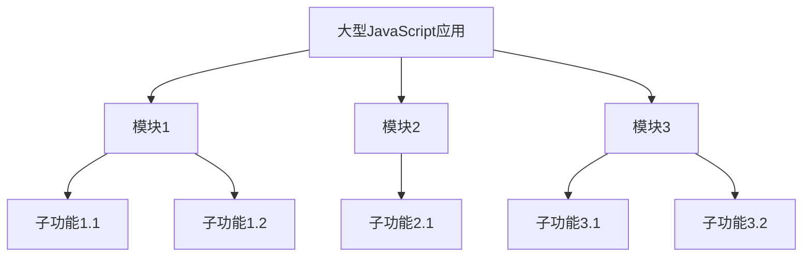

# JavaScript 模块化策略

## 什么是JavaScript模块化？

JavaScript模块化是将代码分割成独立的、可重用的单元（称为模块）的过程。每个模块专注于一个特定的功能，并通过明确定义的接口与其他模块交互。

:::note
模块化是大型JavaScript应用程序开发的基石，它帮助我们避免全局作用域污染、提高代码维护性和可重用性。
:::



## 为什么需要模块化？

在深入了解各种模块化策略之前，让我们先理解为什么模块化如此重要：

1. **避免命名冲突** - 在大型应用中，避免全局变量污染
2. **代码组织** - 更好地组织和管理代码结构
3. **依赖管理** - 清晰地表明代码单元之间的依赖关系
4. **可重用性** - 编写可复用的代码块
5. **可维护性** - 更容易维护和更新代码

## JavaScript 模块化的发展历程

### 1. 早期的模块化方法

#### 立即执行函数表达式（IIFE）

最早的模块化模式之一是使用IIFE来创建私有作用域：

```javascript
// 定义模块
var myModule = (function() {
  // 私有变量
  var privateVar = 'I am private';
  
  // 私有方法
  function privateMethod() {
    console.log(privateVar);
  }
  
  // 返回公共API
  return {
    publicMethod: function() {
      privateMethod();
      console.log('I can access private stuff!');
    }
  };
})();

// 使用模块
myModule.publicMethod(); // 输出: "I am private" 和 "I can access private stuff!"
// myModule.privateMethod(); // 错误: privateMethod 不可访问
```

#### 命名空间模式

```javascript
// 创建命名空间
var APP = APP || {};

// 添加模块到命名空间
APP.module1 = {
  name: 'Module 1',
  init: function() {
    console.log(this.name + ' initialized');
  }
};

APP.module2 = {
  name: 'Module 2',
  init: function() {
    console.log(this.name + ' initialized');
  }
};

// 使用模块
APP.module1.init(); // 输出: "Module 1 initialized"
APP.module2.init(); // 输出: "Module 2 initialized"
```

### 2. CommonJS

Node.js采用的模块系统，使用`require`导入模块，`module.exports`或`exports`导出模块：

```javascript
// math.js - 定义模块
function add(a, b) {
  return a + b;
}

function subtract(a, b) {
  return a - b;
}

// 导出模块功能
module.exports = {
  add: add,
  subtract: subtract
};

// 在另一个文件中使用该模块
// main.js
const math = require('./math.js');
console.log(math.add(5, 3)); // 输出: 8
console.log(math.subtract(5, 3)); // 输出: 2
```

### 3. AMD (Asynchronous Module Definition)

专为浏览器环境设计，支持异步加载模块。RequireJS是实现AMD规范的流行库：

```javascript
// 定义名为'math'的模块
define('math', [], function() {
  return {
    add: function(a, b) {
      return a + b;
    },
    subtract: function(a, b) {
      return a - b;
    }
  };
});

// 使用该模块
require(['math'], function(math) {
  console.log(math.add(5, 3)); // 输出: 8
});
```

### 4. UMD (Universal Module Definition)

UMD尝试提供一个同时兼容AMD和CommonJS的解决方案：

```javascript
(function(root, factory) {
  if (typeof define === 'function' && define.amd) {
    // AMD
    define(['jquery'], factory);
  } else if (typeof module === 'object' && module.exports) {
    // CommonJS
    module.exports = factory(require('jquery'));
  } else {
    // 浏览器全局变量 (root 是 window)
    root.myModule = factory(root.jQuery);
  }
}(typeof self !== 'undefined' ? self : this, function($) {
  // 模块代码
  return {
    name: 'My Module',
    doSomething: function() {
      return 'Module using jQuery v' + $.fn.jquery;
    }
  };
}));
```

### 5. ES Modules (ESM)

ES6引入的官方JavaScript模块系统，使用`import`和`export`语句：

```javascript
// math.js - 定义模块
export function add(a, b) {
  return a + b;
}

export function subtract(a, b) {
  return a - b;
}

// 或者导出默认值
export default {
  add,
  subtract
};

// main.js - 使用模块
// 方式1: 导入指定函数
import { add, subtract } from './math.js';
console.log(add(5, 3)); // 输出: 8

// 方式2: 导入所有并命名
import * as math from './math.js';
console.log(math.subtract(5, 3)); // 输出: 2

// 方式3: 导入默认导出
import mathUtils from './math.js';
console.log(mathUtils.add(5, 3)); // 输出: 8
```

## 现代JavaScript模块化最佳实践

### 1. 优先使用ES Modules

现代浏览器和Node.js 13+都支持ES Modules，它是JavaScript的官方模块系统：

```javascript
// 导出单个功能
export function helper() { /* ... */ }

// 导出多个内容
export const PI = 3.14159;
export class User { /* ... */ }

// 默认导出
export default class API { /* ... */ }
```

### 2. 保持模块专注

每个模块应该专注于单一功能或相关功能组：

```javascript
// userAuth.js - 处理用户认证
export function login() { /* ... */ }
export function logout() { /* ... */ }
export function validateSession() { /* ... */ }

// dataProcessing.js - 处理数据
export function sortData() { /* ... */ }
export function filterData() { /* ... */ }
```

### 3. 合理使用模块路径别名

在大型项目中，使用工具如Webpack配置路径别名，避免复杂的相对路径：

```javascript
// webpack.config.js示例
module.exports = {
  resolve: {
    alias: {
      '@services': path.resolve(__dirname, 'src/services/'),
      '@utils': path.resolve(__dirname, 'src/utils/'),
    }
  }
};

// 在代码中使用
import { apiClient } from '@services/api';
import { formatDate } from '@utils/dateHelpers';
```

### 4. 适当拆分模块

避免过大的模块文件，合理拆分：

```
src/
├── components/
│   ├── Button/
│   │   ├── Button.js        // 主组件
│   │   ├── ButtonGroup.js   // 相关组件
│   │   ├── styles.js        // 样式
│   │   └── index.js         // 导出文件
```

`index.js`文件作为导出点：

```javascript
// components/Button/index.js
export { default } from './Button';
export { ButtonGroup } from './ButtonGroup';
```

### 5. 懒加载模块

对于大型应用，使用动态导入实现按需加载：

```javascript
// 静态导入（始终加载）
import HomeComponent from './Home';

// 动态导入（按需加载）
const loadAdminPanel = async () => {
  if (userIsAdmin) {
    const { default: AdminPanel } = await import('./AdminPanel');
    return <AdminPanel />;
  }
  return null;
};
```

## 实际案例：构建模块化计算器应用

让我们通过构建一个简单的计算器应用来展示模块化的实际应用：

### 项目结构

```
calculator-app/
├── src/
│   ├── index.js            // 应用入口
│   ├── calculator.js       // 主计算器模块
│   ├── operations/
│   │   ├── basic.js        // 基本数学运算
│   │   ├── scientific.js   // 科学计算功能
│   │   └── index.js        // 操作导出点
│   ├── utils/
│   │   ├── validation.js   // 输入验证
│   │   └── formatting.js   // 数字格式化
│   └── ui/
│       ├── display.js      // 显示相关功能
│       └── buttons.js      // 按钮相关功能
```

### 模块实现

```javascript
// operations/basic.js
export function add(a, b) {
  return a + b;
}

export function subtract(a, b) {
  return a - b;
}

export function multiply(a, b) {
  return a * b;
}

export function divide(a, b) {
  if (b === 0) throw new Error('Division by zero');
  return a / b;
}
```

```javascript
// operations/scientific.js
export function square(x) {
  return x * x;
}

export function sqrt(x) {
  if (x < 0) throw new Error('Cannot calculate square root of negative number');
  return Math.sqrt(x);
}

export function power(base, exponent) {
  return Math.pow(base, exponent);
}
```

```javascript
// operations/index.js
export * from './basic.js';
export * from './scientific.js';
```

```javascript
// utils/validation.js
export function isValidNumber(input) {
  return !isNaN(parseFloat(input)) && isFinite(input);
}

export function validateOperation(op, ...args) {
  if (args.some(arg => !isValidNumber(arg))) {
    throw new Error('Invalid number input');
  }
}
```

```javascript
// utils/formatting.js
export function formatResult(result) {
  // 处理小数位数等格式化逻辑
  if (Number.isInteger(result)) {
    return result.toString();
  }
  return result.toFixed(4).replace(/\.?0+$/, '');
}
```

```javascript
// calculator.js
import * as operations from './operations/index.js';
import { validateOperation } from './utils/validation.js';
import { formatResult } from './utils/formatting.js';

export default class Calculator {
  constructor() {
    this.history = [];
  }

  calculate(operation, ...args) {
    try {
      validateOperation(operation, ...args);
      
      if (!operations[operation]) {
        throw new Error(`Operation ${operation} not supported`);
      }
      
      const result = operations[operation](...args);
      
      // 记录操作到历史
      this.history.push({
        operation,
        args,
        result,
        timestamp: new Date()
      });
      
      return formatResult(result);
    } catch (error) {
      console.error('Calculation error:', error.message);
      throw error;
    }
  }
  
  getHistory() {
    return [...this.history];
  }
  
  clearHistory() {
    this.history = [];
  }
}
```

```javascript
// index.js - 应用入口
import Calculator from './calculator.js';

// 创建计算器实例
const calc = new Calculator();

// 执行一些操作
try {
  console.log('5 + 3 =', calc.calculate('add', 5, 3));
  console.log('10 - 4 =', calc.calculate('subtract', 10, 4));
  console.log('Square of 4 =', calc.calculate('square', 4));
  console.log('2^8 =', calc.calculate('power', 2, 8));
  
  // 显示历史记录
  console.log('Calculation history:', calc.getHistory());
} catch (error) {
  console.error('Error using calculator:', error.message);
}
```

### 这个例子展示了模块化的几个关键优势：

1. **关注点分离** - 基本运算、科学计算、工具函数和主计算器逻辑各自独立
2. **代码组织** - 清晰的项目结构使代码易于导航和理解
3. **可重用性** - 运算函数可以在其他项目中复用
4. **可维护性** - 可以单独更新或扩展每个模块而不影响其他部分
5. **可测试性** - 每个模块可以独立测试

## 总结

JavaScript模块化策略帮助我们组织和管理代码，从早期的IIFE和命名空间模式，到CommonJS和AMD，再到现代的ES Modules，模块化已经成为JavaScript开发的标准实践。

在现代开发中：

- 优先使用ES Modules (import/export)
- 保持模块专注于单一功能
- 合理组织项目结构和导出
- 为大型应用考虑动态导入和代码分割

通过采用这些最佳实践，你可以编写更易于维护、更可靠、更高效的JavaScript应用程序。

## 练习与挑战

1. **基础练习**: 将现有的非模块化JavaScript代码重构为使用ES Modules
2. **中级挑战**: 创建一个具有多个功能模块的待办事项应用
3. **高级项目**: 使用模块化方法设计一个单页应用程序，包括路由、状态管理和UI组件

## 扩展资源

:::tip 进一步学习
- [MDN Web Docs: JavaScript Modules](https://developer.mozilla.org/en-US/docs/Web/JavaScript/Guide/Modules)
- [JavaScript.info: Modules](https://javascript.info/modules)
- [Exploring ES6: Modules](https://exploringjs.com/es6/ch_modules.html)
:::

掌握模块化是成为高级JavaScript开发者的重要一步。从简单的应用开始实践这些概念，随着你的项目规模增长，你将更加欣赏模块化所带来的好处！