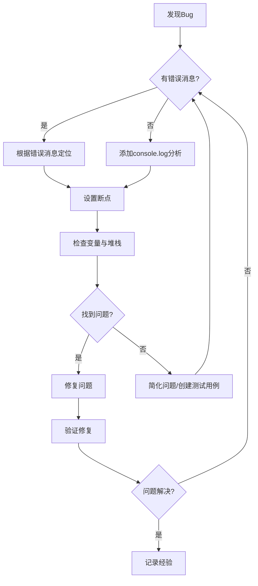

# JavaScript 调试策略

## 什么是调试？

调试是程序开发过程中不可避免的一部分，它指的是发现并解决代码中错误的过程。无论你是初学者还是专业开发者，调试都是编程技能中最重要的一项。有效的调试策略不仅能帮助你解决当前问题，还能提高你的编程能力，减少未来出错的可能性。

:::note 思考
想象一下，调试就像是成为一名代码侦探，你需要收集线索，分析问题，最终找到"罪魁祸首"。
:::

## 常见的JavaScript错误类型

在开始学习调试策略前，让我们先了解JavaScript中常见的错误类型：

1. **语法错误**：代码不符合JavaScript语法规则
2. **引用错误**：尝试引用不存在的变量
3. **类型错误**：对不兼容的数据类型执行操作
4. **逻辑错误**：代码语法正确但结果不符合预期

## 基础调试技巧

### 使用console方法

`console`对象提供了多种调试方法，最常用的是`console.log()`：

```javascript
// 基本使用
let name = "JavaScript初学者";
console.log("当前用户:", name);  // 输出: 当前用户: JavaScript初学者

// 调试复杂对象
const user = {
  name: "张三",
  age: 25,
  skills: ["HTML", "CSS", "JavaScript"]
};
console.log(user);  // 输出整个用户对象
```

除了`console.log()`，还有其他实用的console方法：

```javascript
// 显示错误信息
console.error("这是一个错误!");  // 红色错误消息

// 显示警告信息
console.warn("这是一个警告!");  // 黄色警告消息

// 创建分组
console.group("用户信息");
console.log("姓名: 张三");
console.log("年龄: 25");
console.groupEnd();

// 计时操作
console.time("循环计时");
for(let i = 0; i < 1000000; i++) {
  // 一些操作
}
console.timeEnd("循环计时");  // 输出: 循环计时: 10.123ms
```

### 使用debugger语句

`debugger`语句是一种强大的内置调试工具，它会在执行到该语句时暂停代码执行，让你能够检查变量和步进执行：

```javascript
function calculateTotal(items) {
  let total = 0;
  
  for(let i = 0; i < items.length; i++) {
    debugger; // 代码会在这里暂停执行
    total += items[i].price * items[i].quantity;
  }
  
  return total;
}

const cart = [
  { name: "笔记本", price: 10, quantity: 2 },
  { name: "钢笔", price: 5, quantity: 1 }
];

const total = calculateTotal(cart);
```

## 使用浏览器开发者工具

现代浏览器提供了强大的开发者工具，可以显著提高调试效率。

### Chrome DevTools的主要功能

1. **源代码面板**：查看、设置断点并调试JavaScript代码
2. **控制台面板**：查看日志、错误和警告，执行JavaScript命令
3. **网络面板**：监控网络请求和响应
4. **元素面板**：检查和修改HTML和CSS

### 设置断点

断点是调试过程中最有用的工具之一：

1. **在源代码面板中设置断点**：
   - 打开开发者工具（F12或右键"检查"）
   - 导航到"源代码"面板
   - 找到要调试的JavaScript文件
   - 点击行号创建断点

2. **条件断点**：只在特定条件满足时暂停执行
   ```javascript
   // 假设我们想知道何时i等于5
   for(let i = 0; i < 10; i++) {
     // 可以设置条件断点: i === 5
     console.log(i);
   }
   ```

3. **DOM断点**：当特定DOM元素变化时暂停执行

### 调用堆栈和变量观察

在断点处暂停执行后，可以：
- 检查当前变量的值
- 查看调用堆栈（函数调用的顺序）
- 使用控制按钮（继续、单步执行、步入、步出）控制执行流程

## 处理异步代码调试

异步JavaScript的调试一直是挑战，这里有一些技巧：

### Promise和async/await调试

```javascript
async function fetchUserData() {
  try {
    console.log("开始获取用户数据");
    const response = await fetch('https://api.example.com/users');
    
    // 调试点1: 检查响应状态
    console.log("响应状态:", response.status);
    
    const data = await response.json();
    
    // 调试点2: 检查获取的数据
    console.log("用户数据:", data);
    
    return data;
  } catch (error) {
    console.error("获取数据时出错:", error);
  }
}
```

### setTimeout和事件处理器调试

```javascript
function delayedAction() {
  console.log("准备执行延迟操作");
  
  setTimeout(() => {
    debugger; // 将在定时器回调执行时暂停
    console.log("延迟操作执行了");
  }, 2000);
}
```

## 常见调试案例

### 案例1：修复计算错误

**问题代码**：
```javascript
function calculateDiscount(price, discount) {
  // 错误的计算
  return price - price * discount;
}

const originalPrice = 100;
const discountRate = 0.2;
console.log(calculateDiscount(originalPrice, discountRate)); // 输出: -80
```

**调试步骤**：

1. 观察输出结果（-80），明显不正确
2. 分析函数逻辑，发现计算错误
3. 修复代码：

```javascript
function calculateDiscount(price, discount) {
  // 正确的计算
  return price * (1 - discount);
}

const originalPrice = 100;
const discountRate = 0.2;
console.log(calculateDiscount(originalPrice, discountRate)); // 输出: 80
```

### 案例2：修复事件监听器

**问题代码**：
```javascript
// HTML: <button id="myButton">点击我</button>

// 错误的事件监听器代码
document.getElementById("mybutton").addEventListener("click", function() {
  console.log("按钮被点击了!");
});
```

**调试步骤**：

1. 点击按钮，没有响应
2. 在控制台检查错误信息（可能是"无法读取xxx的属性'addEventListener'"）
3. 发现ID名称写错了（mybutton vs myButton）
4. 修复代码：

```javascript
// 正确的事件监听器代码
document.getElementById("myButton").addEventListener("click", function() {
  console.log("按钮被点击了!");
});
```

## 高级调试技巧

### 使用性能工具

Chrome DevTools的Performance面板可以帮助识别性能瓶颈：

```javascript
// 使用Performance API手动测量性能
performance.mark("开始操作");

// 执行需要测量的代码
for(let i = 0; i < 10000; i++) {
  // 一些操作
}

performance.mark("结束操作");
performance.measure("操作耗时", "开始操作", "结束操作");

// 在控制台查看结果
console.log(performance.getEntriesByName("操作耗时"));
```

### 跨浏览器调试

不同浏览器可能有不同的问题，使用各主流浏览器的开发工具：
- Chrome DevTools
- Firefox Developer Tools
- Safari Web Inspector
- Microsoft Edge DevTools

## 调试最佳实践

1. **系统化方法**：依据错误消息、控制台输出和预期行为进行系统分析
2. **二分法调试**：通过注释掉一半代码来缩小问题范围
3. **代码隔离**：创建最小可复现问题的代码示例
4. **防御式编程**：添加错误检查和数据验证
5. **保持版本控制**：使用Git等版本控制系统跟踪更改

```javascript
// 防御式编程示例
function divideNumbers(a, b) {
  // 参数验证
  if (typeof a !== 'number' || typeof b !== 'number') {
    throw new Error('两个参数都必须是数字');
  }
  
  // 除数为零检查
  if (b === 0) {
    throw new Error('除数不能为零');
  }
  
  return a / b;
}

// 使用try-catch捕获错误
try {
  const result = divideNumbers(10, "2");
  console.log(result);
} catch (error) {
  console.error("计算错误:", error.message);
}
```

## 调试工作流程图



## 总结与实践建议

有效的调试是编程能力中不可或缺的一部分，它需要实践和耐心。通过本文学习的技巧，你应该能够：

1. 使用console方法输出调试信息
2. 设置断点并使用浏览器开发者工具
3. 调试异步代码和处理复杂场景
4. 采用系统化的调试思路

:::tip 成长建议
开始时，将调试看作学习机会而非负担。每次调试都能帮你更深入地理解JavaScript的工作原理。记录你遇到的问题和解决方案，这将成为你宝贵的知识库。
:::

## 练习

1. 找出以下代码中的错误并修复：
   ```javascript
   function sumArray(arr) {
     let sum = 0;
     for(let i = 0; i <= arr.length; i++) {
       sum += arr[i];
     }
     return sum;
   }
   console.log(sumArray([1, 2, 3, 4, 5]));
   ```

2. 创建一个简单的网页，添加一个按钮，点击时触发一个包含错误的函数。使用开发者工具调试并修复这个错误。

3. 使用`console.time()`和`console.timeEnd()`比较两种不同实现求斐波那契数列的性能。

## 推荐资源

- MDN Web文档: [使用浏览器开发者工具](https://developer.mozilla.org/zh-CN/docs/Learn/Common_questions/Tools_and_setup/What_are_browser_developer_tools)
- Chrome开发者工具: [官方文档](https://developers.google.com/web/tools/chrome-devtools/)
- 《JavaScript权威指南》第七章: 调试JavaScript
- FreeCodeCamp: [JavaScript调试指南](https://www.freecodecamp.org/news/javascript-debugging-guide/)

记住，调试是一门艺术，它需要时间和经验才能掌握。随着你解决越来越多的Bug，你会发展出自己的调试风格和技巧。