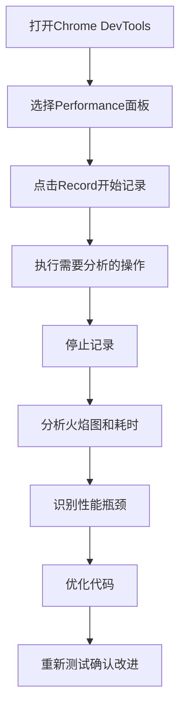

# JavaScript 性能优化策略

## 引言

在现代Web开发中，性能优化是一个不可忽视的关键因素。随着Web应用程序变得越来越复杂，如果不注重性能优化，用户体验将大打折扣。JavaScript作为Web开发的核心语言，其性能直接影响着网站的加载速度、响应时间和整体用户体验。

本文将介绍一系列JavaScript性能优化策略，帮助初学者编写出更高效、更流畅的代码，使网站或应用具有更好的性能表现。

## 为什么性能优化很重要？

在讨论具体策略之前，我们需要了解为什么JavaScript性能优化如此重要：

1. **提升用户体验**：更快的加载时间和响应速度能够显著改善用户体验
2. **降低用户流失率**：研究表明，如果页面加载时间超过3秒，超过40%的用户会离开
3. **改善SEO排名**：搜索引擎更青睐加载速度快的网站
4. **减少服务器负载**：优化的代码可以减少服务器资源消耗
5. **提高设备兼容性**：在性能较弱的设备上也能有良好表现

## 基本优化策略

### 1. 减少DOM操作

DOM操作是JavaScript中最昂贵的操作之一，应尽可能减少。

:::tip
DOM (Document Object Model) 操作之所以慢，是因为每次DOM更新，浏览器都需要重新计算布局、绘制页面。
:::

**不推荐的方式：**

```javascript
// 低效：在循环中多次操作DOM
for (let i = 0; i < 100; i++) {
  document.getElementById('result').innerHTML += `<li>Item ${i}</li>`;
}
```

**推荐的方式：**

```javascript
// 高效：使用文档片段一次性操作DOM
const fragment = document.createDocumentFragment();
for (let i = 0; i < 100; i++) {
  const li = document.createElement('li');
  li.textContent = `Item ${i}`;
  fragment.appendChild(li);
}
document.getElementById('result').appendChild(fragment);
```

### 2. 使用事件委托

事件委托利用了事件冒泡的原理，可以显著减少事件监听器的数量。

**不推荐的方式：**

```javascript
// 低效：为每个按钮添加单独的事件监听器
document.querySelectorAll('button').forEach(button => {
  button.addEventListener('click', function(e) {
    console.log('按钮被点击了:', this.id);
  });
});
```

**推荐的方式：**

```javascript
// 高效：使用事件委托
document.querySelector('.button-container').addEventListener('click', function(e) {
  if (e.target.tagName === 'BUTTON') {
    console.log('按钮被点击了:', e.target.id);
  }
});
```

### 3. 防抖(Debounce)与节流(Throttle)

当处理频繁触发的事件（如滚动、调整窗口大小、键盘输入）时，防抖和节流是两种重要的优化技术。

**防抖函数示例：**

```javascript
function debounce(func, delay) {
  let timeout;
  
  return function() {
    const context = this;
    const args = arguments;
    
    clearTimeout(timeout);
    timeout = setTimeout(() => func.apply(context, args), delay);
  };
}

// 使用防抖函数
const efficientSearch = debounce(function() {
  // 执行搜索操作
  console.log('执行搜索:', document.querySelector('#search-input').value);
}, 500);

document.querySelector('#search-input').addEventListener('input', efficientSearch);
```

**节流函数示例：**

```javascript
function throttle(func, limit) {
  let inThrottle;
  
  return function() {
    const context = this;
    const args = arguments;
    
    if (!inThrottle) {
      func.apply(context, args);
      inThrottle = true;
      setTimeout(() => inThrottle = false, limit);
    }
  };
}

// 使用节流函数
const efficientScroll = throttle(function() {
  console.log('滚动事件处理中...');
}, 300);

window.addEventListener('scroll', efficientScroll);
```

:::note
**防抖与节流的区别**：
- **防抖**：函数在最后一次调用后延迟指定时间才执行，适合搜索输入等场景。
- **节流**：函数在指定时间内最多执行一次，适合滚动事件等场景。
:::

## 中级优化策略

### 1. 优化循环

循环是程序中常见的结构，优化循环可以显著提高性能。

```javascript
const arr = new Array(10000).fill(1);

// 低效循环
console.time('低效循环');
for (let i = 0; i < arr.length; i++) {
  // 每次迭代都要计算 arr.length
}
console.timeEnd('低效循环');

// 高效循环
console.time('高效循环');
for (let i = 0, len = arr.length; i < len; i++) {
  // 缓存数组长度
}
console.timeEnd('高效循环');
```

### 2. 使用Web Workers处理密集计算

对于计算密集型任务，可以使用Web Workers将工作转移到后台线程，避免阻塞主线程。

**main.js:**

```javascript
// 创建一个Web Worker
const worker = new Worker('worker.js');

// 向Worker发送消息
worker.postMessage({numbers: Array.from({length: 10000000}, (_, i) => i + 1)});

// 接收Worker的计算结果
worker.onmessage = function(e) {
  console.log('计算结果:', e.data.result);
};
```

**worker.js:**

```javascript
// 在Worker中接收消息
self.onmessage = function(e) {
  const numbers = e.data.numbers;
  
  // 执行耗时计算（计算数组所有元素的平方和）
  let sum = 0;
  for (let i = 0; i < numbers.length; i++) {
    sum += numbers[i] * numbers[i];
  }
  
  // 将结果发送回主线程
  self.postMessage({result: sum});
};
```

### 3. 避免内存泄漏

内存泄漏会导致应用程序随着时间的推移变得越来越慢。下面是一些避免内存泄漏的建议：

**常见的内存泄漏问题：**

```javascript
// 不当的闭包使用可能导致内存泄漏
function createLeak() {
  const largeArray = new Array(1000000).fill('潜在的内存泄漏');
  
  return function() {
    // 这个函数持有对largeArray的引用
    console.log(largeArray[0]);
  };
}

// 即使不再需要largeArray，但它仍然被保留在内存中
const leak = createLeak();
```

**解决方法：**

```javascript
function avoidLeak() {
  const largeArray = new Array(1000000).fill('临时数据');
  
  const result = processArray(largeArray);
  
  // 当完成处理后，解除引用以允许垃圾回收
  return result;
}

function processArray(arr) {
  // 处理数组...
  return '处理结果';
}

const result = avoidLeak();
// 此时largeArray可以被垃圾回收
```

## 高级优化策略

### 1. 代码分割与懒加载

在现代JavaScript应用中，代码分割和懒加载是减少初始加载时间的重要技术。

**使用动态导入进行懒加载：**

```javascript
// 不立即加载大型库
document.getElementById('showChart').addEventListener('click', async () => {
  // 只有当用户点击按钮时才加载图表库
  const { Chart } = await import('./chart-library.js');
  
  // 使用导入的库创建图表
  const chart = new Chart(document.getElementById('chart-container'));
  chart.render(data);
});
```

### 2. 使用缓存

缓存计算结果可以避免重复计算，特别是对于耗时的操作。

**使用记忆化技术：**

```javascript
// 创建一个记忆化的斐波那契函数
function memoizedFibonacci() {
  const cache = {};
  
  function fib(n) {
    // 如果结果已经缓存，则直接返回
    if (n in cache) {
      return cache[n];
    }
    
    // 计算结果并缓存
    if (n <= 1) {
      cache[n] = n;
    } else {
      cache[n] = fib(n - 1) + fib(n - 2);
    }
    
    return cache[n];
  }
  
  return fib;
}

const fibonacci = memoizedFibonacci();

console.time('第一次计算 fib(40)');
console.log(fibonacci(40));
console.timeEnd('第一次计算 fib(40)');

console.time('第二次计算 fib(40)（使用缓存）');
console.log(fibonacci(40));
console.timeEnd('第二次计算 fib(40)（使用缓存）');
```

### 3. 使用适当的数据结构

选择合适的数据结构对性能有很大影响。

```javascript
// 使用对象进行快速查找
const userLookup = {};
const users = [
  { id: 1, name: 'Alice' },
  { id: 2, name: 'Bob' },
  { id: 3, name: 'Charlie' }
];

// 构建查找表
users.forEach(user => {
  userLookup[user.id] = user;
});

// O(1) 常量时间查找
console.log(userLookup[2]); // { id: 2, name: 'Bob' }

// 使用Set去重
const numbers = [1, 2, 3, 2, 4, 1];
const uniqueNumbers = [...new Set(numbers)];
console.log(uniqueNumbers); // [1, 2, 3, 4]
```

## 实际案例：优化网页滚动性能

让我们看一个实际的案例，如何优化网页滚动性能：

```javascript
// 原始代码（性能问题）
window.addEventListener('scroll', function() {
  // 获取所有元素并检查它们是否在视口中
  const elements = document.querySelectorAll('.animate-on-scroll');
  
  elements.forEach(element => {
    const position = element.getBoundingClientRect();
    
    // 检查元素是否在视口中
    if (position.top < window.innerHeight) {
      element.classList.add('visible');
    }
  });
});
```

**优化后的代码：**

```javascript
// 优化的滚动处理函数
function optimizedScrollHandler() {
  // 获取所有需要动画的元素
  const elements = document.querySelectorAll('.animate-on-scroll:not(.processed)');
  
  elements.forEach(element => {
    const position = element.getBoundingClientRect();
    
    // 检查元素是否在视口中
    if (position.top < window.innerHeight) {
      element.classList.add('visible');
      // 标记已处理，避免重复检查
      element.classList.add('processed');
    }
  });
}

// 使用节流函数来限制滚动事件的处理频率
const throttledScrollHandler = throttle(optimizedScrollHandler, 200);

// 添加滚动事件监听
window.addEventListener('scroll', throttledScrollHandler);

// 页面加载时也检查一次
window.addEventListener('load', optimizedScrollHandler);
```

## 性能测量与分析

优化之前需要先测量，以确定性能瓶颈和改进效果。

### 使用Performance API

```javascript
// 开始测量
performance.mark('myFunction-start');

// 执行要测量的函数
myFunction();

// 结束测量
performance.mark('myFunction-end');

// 创建测量结果
performance.measure(
  'myFunction execution time', 
  'myFunction-start', 
  'myFunction-end'
);

// 获取并输出测量结果
const measures = performance.getEntriesByName('myFunction execution time');
console.log(`函数执行时间: ${measures[0].duration} 毫秒`);
```

### 使用Chrome DevTools

Chrome DevTools提供了强大的性能分析工具：

1. 打开Chrome开发者工具 (F12)
2. 选择"Performance"面板
3. 点击"Record"按钮
4. 执行想要分析的操作
5. 停止记录并分析结果



## 总结

JavaScript性能优化是一项需要不断实践和学习的技能。本文介绍了从基础到高级的多种优化策略：

1. **基础优化**：减少DOM操作、事件委托、防抖与节流
2. **中级优化**：优化循环、使用Web Workers、避免内存泄漏
3. **高级优化**：代码分割与懒加载、使用缓存、选择合适的数据结构

记住，性能优化应该是有针对性的，而不是过早优化。始终先测量性能，找出瓶颈，再有的放矢地进行优化。

:::caution
过早优化是万恶之源！始终先确定代码是否真的存在性能问题，再进行优化。
:::

## 练习与进一步学习

### 练习任务

1. 创建一个包含1000个元素的列表，并使用上述优化策略实现高效渲染
2. 为一个搜索输入框实现防抖功能
3. 使用Web Workers实现一个计算密集型任务的网页应用
4. 优化一个包含大量事件监听器的页面，使用事件委托

### 进一步学习资源

- [MDN Web文档: JavaScript性能](https://developer.mozilla.org/zh-CN/docs/Web/Performance)
- [Google Web Fundamentals: 性能优化](https://developers.google.com/web/fundamentals/performance)
- [掘金社区: 前端性能优化](https://juejin.cn/tag/前端性能优化)
- [《高性能JavaScript》](https://www.oreilly.com/library/view/high-performance-javascript/9781449382308/) - Nicholas C. Zakas

通过系统地学习和实践这些优化策略，你将能够编写出更高效、响应更快的JavaScript代码，为用户提供更好的体验。