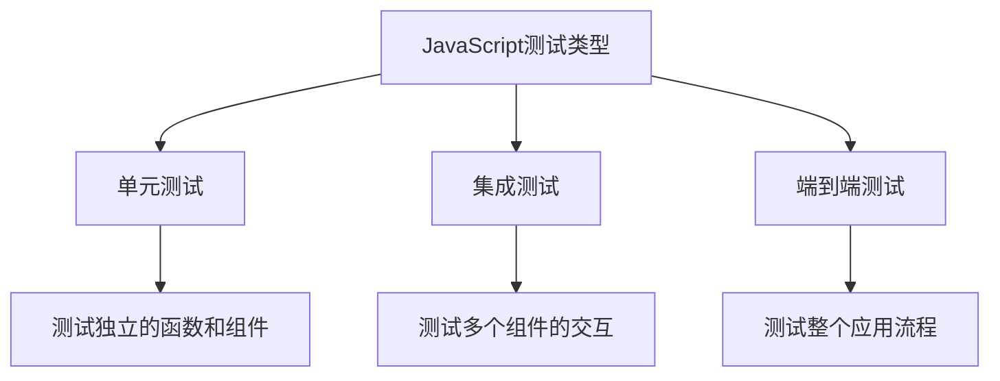

# JavaScript 测试策略

---
title: JavaScript 测试策略
description: 学习如何为JavaScript应用程序制定有效的测试策略，掌握单元测试、集成测试和端到端测试的基本概念和工具。
---

## 测试的重要性

在开发JavaScript应用程序时，测试是确保代码质量和可靠性的关键环节。一个完善的测试策略可以帮助你捕获错误，提高代码质量，并在进行代码重构或添加新功能时提供安全保障。

:::tip 测试的好处
- 提前发现并修复错误
- 增强代码的可维护性
- 为代码重构提供安全网
- 作为代码的文档
- 促进更好的代码设计
:::

## JavaScript 测试的类型

JavaScript测试通常分为以下几种主要类型：



### 单元测试

单元测试关注于测试代码中的最小单元（通常是函数或类的方法），确保它们按预期工作。

#### 使用Jest进行单元测试

[Jest](https://jestjs.io/) 是一个流行的JavaScript测试框架。下面是一个简单的单元测试示例：

```javascript
// math.js - 我们要测试的函数
function sum(a, b) {
  return a + b;
}

module.exports = { sum };
```

```javascript
// math.test.js - 测试文件
const { sum } = require('./math');

test('adds 1 + 2 to equal 3', () => {
  expect(sum(1, 2)).toBe(3);
});

test('adds -1 + 1 to equal 0', () => {
  expect(sum(-1, 1)).toBe(0);
});
```

在终端运行 `npx jest` 后，Jest 将执行测试并显示结果：

```
PASS ./math.test.js
  ✓ adds 1 + 2 to equal 3 (3ms)
  ✓ adds -1 + 1 to equal 0 (1ms)

Test Suites: 1 passed, 1 total
Tests:       2 passed, 2 total
```

### 集成测试

集成测试验证多个模块或组件是否能正确地一起工作。

#### 使用Testing Library进行集成测试

对于React应用，[React Testing Library](https://testing-library.com/docs/react-testing-library/intro/) 是一个很好的选择：

```javascript
// UserProfile.jsx
import React from 'react';

function UserProfile({ name, email }) {
  return (
    <div>
      <h2>User Profile</h2>
      <div data-testid="user-name">Name: {name}</div>
      <div data-testid="user-email">Email: {email}</div>
    </div>
  );
}

export default UserProfile;
```

```javascript
// UserProfile.test.jsx
import { render, screen } from '@testing-library/react';
import UserProfile from './UserProfile';

test('renders user profile correctly', () => {
  render(<UserProfile name="John Doe" email="john@example.com" />);
  
  expect(screen.getByTestId('user-name')).toHaveTextContent('Name: John Doe');
  expect(screen.getByTestId('user-email')).toHaveTextContent('Email: john@example.com');
});
```

### 端到端测试

端到端测试模拟真实用户的行为，测试整个应用程序的工作流程。

#### 使用Cypress进行端到端测试

[Cypress](https://www.cypress.io/) 是一个流行的端到端测试框架：

```javascript
// login.spec.js
describe('Login Form', () => {
  it('successfully logs in with valid credentials', () => {
    cy.visit('/login');
    
    cy.get('#username').type('testuser');
    cy.get('#password').type('password123');
    cy.get('#login-button').click();
    
    // 验证登录成功，跳转到首页
    cy.url().should('include', '/dashboard');
    cy.get('#welcome-message').should('contain', 'Welcome, testuser!');
  });
});
```

## 制定测试策略

### 测试金字塔

测试金字塔是一种常见的测试策略，它建议：

```mermaid
pyramid
    title 测试金字塔
    section 端到端测试
        少量: 10%
    section 集成测试
        适量: 30%
    section 单元测试
        大量: 60%
```

该策略强调要有大量的单元测试，适量的集成测试和较少的端到端测试，这是因为：

1. 单元测试执行快速、稳定，成本低
2. 集成测试帮助确保组件间协作正常
3. 端到端测试执行缓慢、复杂，但可以验证关键用户流程

### TDD (测试驱动开发)

测试驱动开发是一种开发方法，遵循以下流程：

1. 先编写测试，定义期望的行为（测试应该失败）
2. 编写最简单的代码使测试通过
3. 重构代码，使其更加优雅，同时确保测试仍然通过

```javascript
// 第一步：编写测试
test('findMax finds the maximum number in an array', () => {
  expect(findMax([1, 3, 2])).toBe(3);
  expect(findMax([-1, -5, -3])).toBe(-1);
  expect(findMax([7])).toBe(7);
});

// 第二步：编写实现代码
function findMax(numbers) {
  if (numbers.length === 0) return undefined;
  
  let max = numbers[0];
  for (let i = 1; i < numbers.length; i++) {
    if (numbers[i] > max) {
      max = numbers[i];
    }
  }
  return max;
}
```

## 实际案例：测试一个待办事项应用

让我们看一个完整的例子，演示如何为一个简单的待办事项应用实施测试策略。

### 单元测试：待办事项函数

```javascript
// todoFunctions.js
const todoFunctions = {
  addTodo: (todos, text) => {
    return [...todos, { id: Date.now(), text, completed: false }];
  },
  
  toggleTodo: (todos, id) => {
    return todos.map(todo => 
      todo.id === id ? { ...todo, completed: !todo.completed } : todo
    );
  },
  
  removeTodo: (todos, id) => {
    return todos.filter(todo => todo.id !== id);
  }
};

export default todoFunctions;
```

```javascript
// todoFunctions.test.js
import todoFunctions from './todoFunctions';

describe('Todo Functions', () => {
  test('addTodo adds a new todo to the list', () => {
    const startTodos = [{ id: 1, text: 'Buy milk', completed: false }];
    const newTodo = 'Learn JavaScript';
    const result = todoFunctions.addTodo(startTodos, newTodo);
    
    expect(result.length).toBe(2);
    expect(result[1].text).toBe('Learn JavaScript');
    expect(result[1].completed).toBe(false);
  });
  
  test('toggleTodo changes the completed status', () => {
    const startTodos = [
      { id: 1, text: 'Buy milk', completed: false },
      { id: 2, text: 'Learn JavaScript', completed: false }
    ];
    
    const result = todoFunctions.toggleTodo(startTodos, 2);
    
    expect(result[0].completed).toBe(false);
    expect(result[1].completed).toBe(true);
  });
  
  test('removeTodo removes a todo from the list', () => {
    const startTodos = [
      { id: 1, text: 'Buy milk', completed: false },
      { id: 2, text: 'Learn JavaScript', completed: false }
    ];
    
    const result = todoFunctions.removeTodo(startTodos, 1);
    
    expect(result.length).toBe(1);
    expect(result[0].id).toBe(2);
  });
});
```

### 集成测试：待办事项组件

假设我们有一个React组件用于展示待办事项列表：

```javascript
// TodoList.jsx
import React from 'react';

function TodoList({ todos, onToggle, onRemove }) {
  return (
    <ul data-testid="todo-list">
      {todos.map(todo => (
        <li 
          key={todo.id} 
          data-testid={`todo-item-${todo.id}`}
          className={todo.completed ? 'completed' : ''}
        >
          <span onClick={() => onToggle(todo.id)}>{todo.text}</span>
          <button onClick={() => onRemove(todo.id)}>Delete</button>
        </li>
      ))}
    </ul>
  );
}

export default TodoList;
```

```javascript
// TodoList.test.jsx
import { render, screen, fireEvent } from '@testing-library/react';
import TodoList from './TodoList';

describe('TodoList Component', () => {
  const mockTodos = [
    { id: 1, text: 'Buy milk', completed: false },
    { id: 2, text: 'Learn JavaScript', completed: true }
  ];
  
  test('renders all todos', () => {
    render(<TodoList todos={mockTodos} onToggle={() => {}} onRemove={() => {}} />);
    
    expect(screen.getByTestId('todo-list').children.length).toBe(2);
    expect(screen.getByTestId('todo-item-1')).toHaveTextContent('Buy milk');
    expect(screen.getByTestId('todo-item-2')).toHaveTextContent('Learn JavaScript');
    expect(screen.getByTestId('todo-item-2')).toHaveClass('completed');
  });
  
  test('calls onToggle when a todo is clicked', () => {
    const mockToggle = jest.fn();
    
    render(<TodoList todos={mockTodos} onToggle={mockToggle} onRemove={() => {}} />);
    
    fireEvent.click(screen.getByTestId('todo-item-1').querySelector('span'));
    
    expect(mockToggle).toHaveBeenCalledWith(1);
  });
  
  test('calls onRemove when delete button is clicked', () => {
    const mockRemove = jest.fn();
    
    render(<TodoList todos={mockTodos} onToggle={() => {}} onRemove={mockRemove} />);
    
    fireEvent.click(screen.getByTestId('todo-item-2').querySelector('button'));
    
    expect(mockRemove).toHaveBeenCalledWith(2);
  });
});
```

### 端到端测试：完整的待办事项应用

```javascript
// todoApp.spec.js (Cypress)
describe('Todo App', () => {
  beforeEach(() => {
    cy.visit('/');
  });

  it('allows adding a new todo', () => {
    cy.get('#new-todo').type('Learn Cypress');
    cy.get('#add-button').click();
    
    cy.get('.todo-item').should('have.length', 1);
    cy.contains('Learn Cypress');
  });

  it('allows marking a todo as completed', () => {
    // 添加一个待办事项
    cy.get('#new-todo').type('Test Todo');
    cy.get('#add-button').click();
    
    // 点击完成
    cy.get('.todo-item').first().click();
    
    // 验证样式已更改
    cy.get('.todo-item').first().should('have.class', 'completed');
  });

  it('allows deleting a todo', () => {
    // 添加一个待办事项
    cy.get('#new-todo').type('Temporary Todo');
    cy.get('#add-button').click();
    
    // 删除
    cy.get('.delete-button').first().click();
    
    // 验证列表为空
    cy.get('.todo-item').should('not.exist');
  });
});
```

## 常见的测试模式

### 使用 Mock 和 Spy

在测试中，我们经常需要模拟依赖项：

```javascript
// 使用Jest模拟fetch函数
global.fetch = jest.fn(() => 
  Promise.resolve({
    json: () => Promise.resolve({ data: 'mocked data' })
  })
);

test('fetchTodos gets data from API', async () => {
  const result = await fetchTodos();
  
  expect(global.fetch).toHaveBeenCalledWith('/api/todos');
  expect(result).toEqual({ data: 'mocked data' });
});
```

### 使用快照测试

快照测试可以确保UI组件的输出保持一致：

```javascript
import { render } from '@testing-library/react';
import TodoItem from './TodoItem';

test('renders correctly', () => {
  const { container } = render(
    <TodoItem 
      todo={{ id: 1, text: 'Test Todo', completed: false }}
      onToggle={() => {}}
      onRemove={() => {}}
    />
  );
  
  expect(container.firstChild).toMatchSnapshot();
});
```

## 测试最佳实践

1. **测试行为而不是实现** - 关注函数的输入和输出，而不是内部实现细节。
2. **保持测试独立** - 一个测试不应依赖于其他测试的结果。
3. **使用有意义的测试名称** - 清晰描述测试的内容和预期结果。
4. **避免测试逻辑** - 测试应该是简单的，不应包含复杂的条件逻辑。
5. **测试边缘情况** - 确保考虑到特殊情况，如空输入、无效输入等。

:::caution 常见测试陷阱
- 测试私有实现细节
- 过度模拟
- 不稳定的测试（不确定性）
- 不充分的测试覆盖率
:::

## 总结

建立一个完善的JavaScript测试策略对于开发稳健的应用程序至关重要。通过结合单元测试、集成测试和端到端测试，你可以确保你的代码按预期工作，并在未来的修改中保持稳定。

测试是一种投资 - 虽然开始时可能会花费额外的时间，但从长远来看，它将为你节省大量的调试和修复错误的时间。

### 学习资源和练习

- 创建一个简单的计算器函数库，并为其编写完整的测试套件。
- 将单元测试添加到你现有的项目中。
- 尝试实施测试驱动开发流程，先编写测试，再实现功能。

### 推荐学习资源

- Jest 文档：[https://jestjs.io/docs/getting-started](https://jestjs.io/docs/getting-started)
- React Testing Library：[https://testing-library.com/docs/react-testing-library/intro/](https://testing-library.com/docs/react-testing-library/intro/)
- Cypress 文档：[https://docs.cypress.io/guides/overview/why-cypress](https://docs.cypress.io/guides/overview/why-cypress)
- JavaScript 测试最佳实践：[https://github.com/goldbergyoni/javascript-testing-best-practices](https://github.com/goldbergyoni/javascript-testing-best-practices)

随着你的JavaScript技能的提升，持续改进你的测试策略将帮助你成为一名更全面、更专业的开发者。