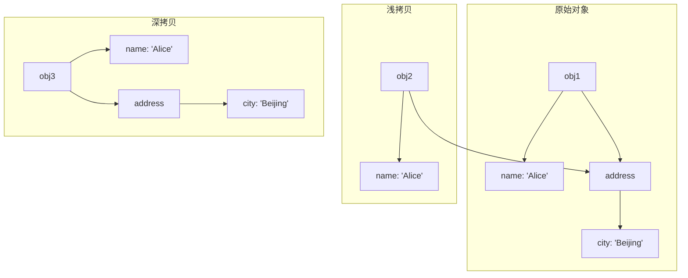

# JavaScript 深拷贝浅拷贝

在JavaScript的日常开发中，我们经常需要复制对象或数组。然而，由于JavaScript中的对象和数组是引用类型，简单的赋值操作可能会导致意外的结果。这就涉及到两个重要概念：浅拷贝和深拷贝。理解这两个概念对于编写健壮的JavaScript代码至关重要。

## 引用类型与基本类型

在探讨深浅拷贝之前，我们需要先了解JavaScript中的数据类型：

- **基本类型**：存储的是值本身，包括Number、String、Boolean、null、undefined、Symbol和BigInt。
- **引用类型**：存储的是内存地址的引用，包括Object、Array、Function等。

示例：

```javascript
// 基本类型
let a = 5;
let b = a;  // b复制了a的值
a = 10;
console.log(b);  // 5 (b不受a变化影响)

// 引用类型
let obj1 = { name: 'Alice' };
let obj2 = obj1;  // obj2引用了obj1的地址
obj1.name = 'Bob';
console.log(obj2.name);  // 'Bob' (obj2随obj1变化而变化)
```

正是这种引用类型的特性使得我们需要在复制对象时格外小心。

## 什么是浅拷贝？

**浅拷贝**只复制对象的第一层属性。如果属性是基本类型，则复制其值；如果属性是引用类型，则复制其引用地址。

### 常用的浅拷贝方法

#### 1. Object.assign()

```javascript
let original = { name: 'Alice', address: { city: 'Beijing' } };
let copy = Object.assign({}, original);

// 改变基本类型属性
original.name = 'Bob';
console.log(copy.name);  // 'Alice' (不受影响)

// 改变引用类型属性
original.address.city = 'Shanghai';
console.log(copy.address.city);  // 'Shanghai' (受影响)
```

#### 2. 展开运算符（Spread Operator）

```javascript
let original = { name: 'Alice', address: { city: 'Beijing' } };
let copy = { ...original };

original.name = 'Bob';
console.log(copy.name);  // 'Alice'

original.address.city = 'Shanghai';
console.log(copy.address.city);  // 'Shanghai' (受影响)
```

#### 3. 数组的浅拷贝方法

```javascript
// 使用slice()
let arr1 = [1, 2, { x: 10 }];
let arr2 = arr1.slice();

// 使用展开运算符
let arr3 = [...arr1];

arr1[0] = 100;
console.log(arr2[0], arr3[0]);  // 1 1 (不受影响)

arr1[2].x = 99;
console.log(arr2[2].x, arr3[2].x);  // 99 99 (受影响)
```

:::note
浅拷贝只解决了第一层属性的复制，对于多层嵌套的对象，内层对象仍然是共享的。
:::

## 什么是深拷贝？

**深拷贝**会复制对象的所有层级属性，创建一个完全独立的新对象。无论原对象有多少层嵌套，深拷贝后的对象都与原对象完全隔离，互不影响。

### 常用的深拷贝方法

#### 1. JSON转换法

最简单的深拷贝方法是通过JSON序列化和反序列化：

```javascript
let original = { name: 'Alice', address: { city: 'Beijing' } };
let copy = JSON.parse(JSON.stringify(original));

original.address.city = 'Shanghai';
console.log(copy.address.city);  // 'Beijing' (不受影响)
```

**局限性**：
- 无法复制函数、RegExp、Date等特殊对象
- 无法处理循环引用
- 丢失undefined值和symbol属性

```javascript
let obj = {
  func: function() { console.log('Hello'); },
  sym: Symbol('example'),
  undef: undefined,
  reg: /test/g,
  date: new Date()
};

let copy = JSON.parse(JSON.stringify(obj));
console.log(copy);  
// { reg: {}, date: "2023-11-10T12:00:00.000Z" }
// 函数、Symbol和undefined都丢失了，正则变成空对象，日期变成字符串
```

#### 2. 递归实现深拷贝

```javascript
function deepCopy(obj) {
  // 处理基本类型和null
  if (obj === null || typeof obj !== 'object') {
    return obj;
  }
  
  // 处理日期对象
  if (obj instanceof Date) {
    return new Date(obj);
  }
  
  // 处理正则对象
  if (obj instanceof RegExp) {
    return new RegExp(obj);
  }
  
  // 创建新对象/数组
  const copy = Array.isArray(obj) ? [] : {};
  
  // 递归复制所有属性
  for (let key in obj) {
    if (obj.hasOwnProperty(key)) {
      copy[key] = deepCopy(obj[key]);
    }
  }
  
  return copy;
}

// 使用示例
let original = {
  name: 'Alice',
  address: { city: 'Beijing' },
  hobbies: ['reading', 'swimming']
};

let copy = deepCopy(original);

original.address.city = 'Shanghai';
original.hobbies.push('running');

console.log(copy.address.city);  // 'Beijing'
console.log(copy.hobbies);  // ['reading', 'swimming']
```

:::tip
上面的递归实现没有处理循环引用的问题。在实际项目中，可以使用WeakMap来跟踪已复制的对象，避免无限递归。
:::

#### 3. 使用第三方库

在实际开发中，我们通常使用第三方库来进行深拷贝，如lodash的`_.cloneDeep()`方法：

```javascript
// 需要先引入lodash库
const _ = require('lodash');

let original = { name: 'Alice', address: { city: 'Beijing' } };
let copy = _.cloneDeep(original);

original.address.city = 'Shanghai';
console.log(copy.address.city);  // 'Beijing' (不受影响)
```

## 浅拷贝与深拷贝的图解

下面是浅拷贝和深拷贝的图解对比：



从上图可以看出：
- 浅拷贝时，`address`属性依然指向原对象中的同一对象
- 深拷贝时，`address`属性指向一个全新的对象

## 实际应用场景

### 场景1：表单数据编辑

当我们有一个表单需要编辑用户数据时，通常会先展示原始数据，然后用户进行修改。为了避免在用户取消编辑时影响原始数据，我们需要使用深拷贝：

```javascript
// 原始用户数据
const originalUser = {
  name: 'Alice',
  contact: {
    email: 'alice@example.com',
    phone: '123-456-7890'
  },
  preferences: {
    theme: 'dark',
    notifications: true
  }
};

function editUser() {
  // 深拷贝用户数据以供编辑
  const userCopy = JSON.parse(JSON.stringify(originalUser));
  
  // 假设用户编辑了数据
  userCopy.contact.email = 'newalice@example.com';
  
  // 如果用户点击"保存"，则更新原始数据
  // saveChanges(userCopy);
  
  // 如果用户点击"取消"，则不做任何处理，原始数据不受影响
  console.log(originalUser.contact.email);  // 还是 'alice@example.com'
}

editUser();
```

### 场景2：状态管理

在React或Redux等状态管理场景中，我们经常需要保持状态的不可变性(Immutability)。深拷贝和浅拷贝在这里有重要应用：

```javascript
// Redux reducer示例
function todoReducer(state = [], action) {
  switch (action.type) {
    case 'ADD_TODO':
      // 浅拷贝数组，添加新项
      return [...state, { 
        id: Date.now(), 
        text: action.text, 
        completed: false 
      }];
      
    case 'TOGGLE_TODO':
      // 浅拷贝数组，但需要创建新对象来替换被修改的项
      return state.map(todo => 
        todo.id === action.id 
          ? { ...todo, completed: !todo.completed } 
          : todo
      );
      
    default:
      return state;
  }
}
```

### 场景3：缓存原始数据

当需要对大型对象进行多次操作，但同时又想保留原始数据时，深拷贝非常有用：

```javascript
function analyzeData(data) {
  // 深拷贝保留原始数据
  const workingCopy = deepCopy(data);
  
  // 在工作副本上进行多次转换操作
  workingCopy.sort();
  workingCopy.filter();
  workingCopy.transform();
  
  // 计算结果但原始数据保持不变
  return {
    result: workingCopy,
    originalData: data // 原始数据未被修改
  };
}
```

## 性能考虑

深拷贝通常比浅拷贝更消耗资源，特别是对于大型嵌套对象。在实际应用中，要根据具体需求选择合适的拷贝方式：

1. 如果仅需要复制对象的第一层属性，选择浅拷贝。
2. 如果需要完全独立的对象副本，选择深拷贝。
3. 对于性能敏感的场景，可以考虑使用"按需深拷贝"——只对需要独立副本的属性进行深拷贝。

:::caution
在处理大型数据结构时，过度使用深拷贝可能导致性能问题。必须在数据独立性和性能之间找到平衡。
:::

## 总结

- **浅拷贝**：只复制对象的第一层属性，内部的引用类型属性仍然共享一个内存地址。
  - 实现方法：Object.assign()、对象展开运算符、Array.slice()等。
  
- **深拷贝**：递归复制对象的所有层级属性，创建一个完全独立的新对象。
  - 实现方法：JSON序列化/反序列化、递归复制、第三方库(如lodash)等。

- 选择合适的拷贝方式取决于具体需求和性能考量。

理解JavaScript中的深浅拷贝不仅能帮助你避免由对象引用带来的bug，还能帮助你编写更高效、更可靠的代码。

## 练习题

1. 编写一个函数，实现对象的浅拷贝（不使用Object.assign或展开运算符）。

2. 修改上面提供的deepCopy函数，使其能够处理循环引用的问题。

3. 给定以下对象，请分别使用浅拷贝和深拷贝复制它，并说明当修改其中的嵌套属性时两种拷贝方式有何不同表现：
```javascript
const person = {
  name: 'Tom',
  age: 28,
  skills: ['JavaScript', 'CSS', 'HTML'],
  address: {
    city: 'Shanghai',
    district: 'Pudong'
  }
};
```

## 延伸阅读

- [MDN Web Docs: Object.assign()](https://developer.mozilla.org/en-US/docs/Web/JavaScript/Reference/Global_Objects/Object/assign)
- [MDN Web Docs: 展开语法](https://developer.mozilla.org/en-US/docs/Web/JavaScript/Reference/Operators/Spread_syntax)
- [Lodash 文档: _.cloneDeep()](https://lodash.com/docs/4.17.15#cloneDeep)
- [JavaScript 中的深拷贝与浅拷贝](https://juejin.cn/post/6844903584023183368)

通过掌握深拷贝和浅拷贝的概念与实现，你将能够更加自信地处理JavaScript中的复杂对象操作，避免由引用类型导致的常见陷阱。