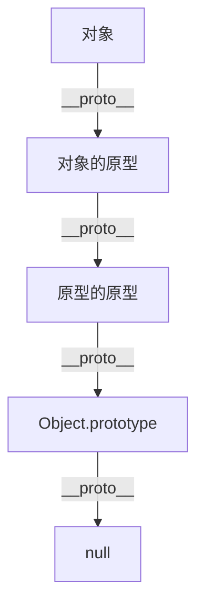

# JavaScript 原型链

## 什么是原型链？

在JavaScript中，原型链是一种实现对象之间继承的机制。不同于传统的基于类的继承，JavaScript使用原型继承模型，其中一个对象可以继承另一个对象的属性和方法。

原型链是连接对象与其原型的一系列链接，使得一个对象可以访问其原型对象上定义的属性和方法。当我们尝试访问一个对象的属性时，如果对象本身没有这个属性，JavaScript就会沿着原型链向上查找，直到找到该属性或到达原型链的末端（null）。

## 原型与__proto__

在JavaScript中，每个对象都有一个内部属性 `[[Prototype]]`（在大多数浏览器中可以通过 `__proto__` 访问）。这个属性指向对象的原型。

```javascript
const person = {
  name: 'Alice',
  age: 30
};

// 访问person的原型
console.log(person.__proto__); // 输出：Object.prototype
console.log(person.__proto__ === Object.prototype); // 输出：true
```

:::caution
`__proto__` 是一个非标准的属性，在实际开发中，推荐使用 `Object.getPrototypeOf()` 方法来获取对象的原型。
:::

## 构造函数与原型

当我们使用构造函数创建对象时，新创建的对象会将其 `[[Prototype]]` 链接到构造函数的 `prototype` 属性。

```javascript
// 定义一个构造函数
function Person(name, age) {
  this.name = name;
  this.age = age;
}

// 在构造函数的原型上添加方法
Person.prototype.greet = function() {
  return `Hello, my name is ${this.name}!`;
};

// 创建实例
const alice = new Person('Alice', 30);
const bob = new Person('Bob', 25);

// 实例可以访问原型上的方法
console.log(alice.greet()); // 输出：Hello, my name is Alice!
console.log(bob.greet());   // 输出：Hello, my name is Bob!

// 验证原型关系
console.log(alice.__proto__ === Person.prototype); // 输出：true
console.log(bob.__proto__ === Person.prototype);   // 输出：true
```

## 原型链的工作原理

当我们尝试访问一个对象的属性或方法时，JavaScript引擎会执行以下步骤：

1. 首先检查对象自身是否有该属性/方法
2. 如果没有，则检查对象的原型（`__proto__`）
3. 如果原型也没有，则检查原型的原型
4. 这个过程会一直持续，直到找到该属性/方法或到达原型链的末端（`null`）
5. 如果到达末端仍未找到，则返回 `undefined`



## 实际示例：原型链查找

```javascript
function Animal(name) {
  this.name = name;
}

Animal.prototype.eat = function() {
  return `${this.name} is eating.`;
};

function Dog(name, breed) {
  Animal.call(this, name);
  this.breed = breed;
}

// 设置Dog的原型为Animal的实例
Dog.prototype = Object.create(Animal.prototype);
Dog.prototype.constructor = Dog;

// 在Dog原型上添加方法
Dog.prototype.bark = function() {
  return `${this.name} says woof!`;
};

// 创建Dog实例
const rex = new Dog('Rex', 'German Shepherd');

console.log(rex.name);      // 输出：Rex
console.log(rex.breed);     // 输出：German Shepherd
console.log(rex.bark());    // 输出：Rex says woof!
console.log(rex.eat());     // 输出：Rex is eating.

// 属性查找过程
console.log(rex.hasOwnProperty('name'));        // 输出：true（在对象自身上找到）
console.log(rex.hasOwnProperty('bark'));        // 输出：false（在原型上找到）
console.log(rex.hasOwnProperty('eat'));         // 输出：false（在原型的原型上找到）
```

在上面的例子中，当我们调用 `rex.eat()` 时，JavaScript引擎会：
1. 检查 `rex` 对象是否有 `eat` 方法 → 没有
2. 检查 `rex.__proto__`（即 `Dog.prototype`）是否有 `eat` 方法 → 没有
3. 检查 `rex.__proto__.__proto__`（即 `Animal.prototype`）是否有 `eat` 方法 → 有
4. 找到方法并执行

## 修改原型对象

我们可以在运行时动态修改原型对象，这些更改会立即反映在所有引用该原型的对象上。

```javascript
function Person(name) {
  this.name = name;
}

const alice = new Person('Alice');
const bob = new Person('Bob');

// 初始没有greet方法
console.log(alice.greet); // 输出：undefined

// 添加方法到原型
Person.prototype.greet = function() {
  return `Hello, I'm ${this.name}!`;
};

// 所有实例都能访问新增的方法
console.log(alice.greet()); // 输出：Hello, I'm Alice!
console.log(bob.greet());   // 输出：Hello, I'm Bob!
```

## 实际应用场景

### 1. 扩展内置对象的功能

原型链允许我们扩展JavaScript内置对象的功能：

```javascript
// 为字符串添加一个新方法
String.prototype.capitalize = function() {
  return this.charAt(0).toUpperCase() + this.slice(1);
};

const name = "alice";
console.log(name.capitalize()); // 输出：Alice
```

:::warning
修改内置对象的原型可能导致代码不可预测，尤其是在大型项目或团队项目中。应谨慎使用这种技术。
:::

### 2. 实现继承

原型链是JavaScript中实现继承的基础机制：

```javascript
// 父类
function Shape(color) {
  this.color = color;
}

Shape.prototype.getColor = function() {
  return this.color;
};

// 子类
function Circle(color, radius) {
  Shape.call(this, color); // 调用父类构造函数
  this.radius = radius;
}

// 继承Shape的原型
Circle.prototype = Object.create(Shape.prototype);
Circle.prototype.constructor = Circle;

// 添加子类自己的方法
Circle.prototype.getArea = function() {
  return Math.PI * this.radius * this.radius;
};

// 创建实例
const redCircle = new Circle('red', 5);
console.log(redCircle.getColor()); // 输出：red
console.log(redCircle.getArea());  // 输出：78.53981633974483
```

### 3. 创建可重用的组件

```javascript
// 基础UI组件
function UIComponent(id) {
  this.element = document.getElementById(id);
}

UIComponent.prototype.hide = function() {
  this.element.style.display = 'none';
};

UIComponent.prototype.show = function() {
  this.element.style.display = 'block';
};

// 特定组件
function Button(id) {
  UIComponent.call(this, id);
}

Button.prototype = Object.create(UIComponent.prototype);
Button.prototype.constructor = Button;

Button.prototype.disable = function() {
  this.element.disabled = true;
};

Button.prototype.enable = function() {
  this.element.disabled = false;
};

// 使用示例
// const submitBtn = new Button('submit');
// submitBtn.show();    // 显示按钮
// submitBtn.disable(); // 禁用按钮
```

## 原型链与性能

理解原型链对于编写高效的JavaScript代码非常重要：

1. **属性查找效率**：属性在原型链中的位置越深，访问速度越慢
2. **共享vs复制**：使用原型链共享方法比每个实例都复制一份方法更节省内存
3. **原型链长度**：过长的原型链会影响性能，一般不超过2-3层

## 总结

JavaScript的原型链是一种强大而灵活的机制，允许对象继承其他对象的属性和方法。理解原型链的工作原理对于掌握JavaScript的对象系统和继承模式至关重要。

关键要点：
- 每个JavaScript对象都有一个指向其原型的内部链接
- 原型链是JavaScript中实现继承的基础
- 属性和方法查找会沿着原型链向上进行，直到找到或到达null
- 可以通过修改构造函数的prototype属性来为所有实例添加共享功能

## 练习

1. 创建一个`Vehicle`构造函数，添加`start`方法到原型上
2. 创建一个`Car`构造函数，继承自`Vehicle`，添加`drive`方法
3. 创建一个Car实例并调用这两个方法
4. 尝试绘制该例子中的原型链关系图

## 进一步学习资源

- MDN文档：[继承与原型链](https://developer.mozilla.org/zh-CN/docs/Web/JavaScript/Inheritance_and_the_prototype_chain)
- JavaScript高级程序设计（第4版）第8章：对象、类与面向对象编程
- 《你不知道的JavaScript》（中卷）第5章：原型