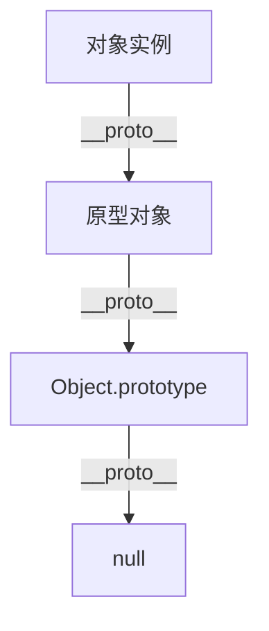

# JavaScript 对象继承

在JavaScript的世界中，继承是一个核心概念，它允许我们基于现有的对象创建新的对象，从而实现代码的重用和层次化组织。本文将带你深入了解JavaScript中的对象继承机制。

## 什么是继承？

继承是面向对象编程的一个重要特性，它允许一个对象获取另一个对象的属性和方法。在JavaScript中，继承通过原型链（prototype chain）来实现。

:::note
与传统的基于类的继承不同，JavaScript使用的是基于原型的继承，这是JavaScript独特的特性之一。
:::

## JavaScript 中的原型继承

JavaScript中的每个对象都有一个内部链接指向另一个对象，称为它的原型（prototype）。当我们尝试访问对象的属性或方法时，如果对象本身没有这个属性或方法，JavaScript会尝试在对象的原型上查找。

### 原型链



### 使用`Object.create()`实现继承

`Object.create()`方法创建一个新对象，使用现有的对象作为新创建对象的原型。

```javascript
// 创建一个父对象
const person = {
  isHuman: true,
  introduce: function() {
    console.log(`我是${this.name}，我是一个${this.isHuman ? '人类' : '非人类'}`);
  }
};

// 通过Object.create()创建一个子对象
const student = Object.create(person);
student.name = '小明'; // 添加特有属性
student.study = function() {
  console.log('我正在学习JavaScript');
}; 

student.introduce(); // 调用继承的方法
// 输出: 我是小明，我是一个人类

student.study(); // 调用自己的方法
// 输出: 我正在学习JavaScript
```

## 构造函数继承

在ES6之前，JavaScript通过构造函数模拟类的行为，通过原型链实现继承。

```javascript
// 父构造函数
function Animal(name) {
  this.name = name;
}

// 在原型上添加方法
Animal.prototype.makeSound = function() {
  console.log(`${this.name}发出声音`);
};

// 子构造函数
function Dog(name, breed) {
  // 调用父构造函数
  Animal.call(this, name);
  this.breed = breed;
}

// 设置原型链，建立继承关系
Dog.prototype = Object.create(Animal.prototype);
// 修复constructor指向
Dog.prototype.constructor = Dog;

// 子类独有方法
Dog.prototype.bark = function() {
  console.log(`${this.name} (${this.breed}) 汪汪叫！`);
};

// 实例化
const myDog = new Dog('旺财', '金毛');
myDog.makeSound(); // 输出: 旺财发出声音
myDog.bark(); // 输出: 旺财 (金毛) 汪汪叫！
```

## ES6类继承

ES6引入了`class`语法，使JavaScript的继承变得更加清晰和易于理解。

```javascript
// 定义父类
class Animal {
  constructor(name) {
    this.name = name;
  }
  
  makeSound() {
    console.log(`${this.name}发出声音`);
  }
}

// 定义子类，继承父类
class Dog extends Animal {
  constructor(name, breed) {
    // 调用父类构造函数
    super(name);
    this.breed = breed;
  }
  
  bark() {
    console.log(`${this.name} (${this.breed}) 汪汪叫！`);
  }
}

// 实例化
const myDog = new Dog('旺财', '金毛');
myDog.makeSound(); // 输出: 旺财发出声音
myDog.bark(); // 输出: 旺财 (金毛) 汪汪叫！
```

:::tip
尽管ES6引入了类的语法糖，但底层仍然是基于原型的继承机制。理解原型继承对于深入掌握JavaScript非常重要。
:::

## 多层继承

JavaScript支持多层继承，即一个类可以继承另一个类，而这个类又继承自其他类。

```javascript
class Animal {
  constructor(name) {
    this.name = name;
  }
  
  eat() {
    console.log(`${this.name}正在吃东西`);
  }
}

class Dog extends Animal {
  bark() {
    console.log(`${this.name}汪汪叫`);
  }
}

class Husky extends Dog {
  constructor(name, color) {
    super(name);
    this.color = color;
  }
  
  pull() {
    console.log(`${this.color}色的${this.name}正在拉雪橇`);
  }
}

const myHusky = new Husky('雪球', '灰');
myHusky.eat(); // 继承自Animal
myHusky.bark(); // 继承自Dog
myHusky.pull(); // Husky自己的方法
```

## 实际应用场景

### 1. UI组件库

在开发UI组件库时，通常会创建基础组件，然后派生出特定功能的子组件。

```javascript
// 基础Button组件
class Button {
  constructor(text, color) {
    this.text = text;
    this.color = color;
  }
  
  render() {
    console.log(`渲染一个${this.color}的按钮，文字是：${this.text}`);
  }
}

// 特殊功能的SubmitButton
class SubmitButton extends Button {
  constructor(text, color = 'green') {
    super(text, color);
    this.type = 'submit';
  }
  
  onClick() {
    console.log('表单提交中...');
    // 提交表单逻辑
  }
}

const loginButton = new SubmitButton('登录');
loginButton.render(); // 输出: 渲染一个green的按钮，文字是：登录
loginButton.onClick(); // 输出: 表单提交中...
```

### 2. 游戏开发

在游戏开发中，常常需要基于基础角色创建具有特定能力的角色。

```javascript
class GameCharacter {
  constructor(name, health, power) {
    this.name = name;
    this.health = health;
    this.power = power;
  }
  
  attack(target) {
    console.log(`${this.name}攻击了${target.name}，造成${this.power}点伤害`);
    target.health -= this.power;
  }
}

class Warrior extends GameCharacter {
  constructor(name) {
    super(name, 100, 15);
    this.armor = 10;
  }
  
  defend() {
    console.log(`${this.name}进入防御姿态，增加${this.armor}点护甲`);
    // 防御逻辑
  }
}

class Mage extends GameCharacter {
  constructor(name) {
    super(name, 80, 20);
    this.mana = 100;
  }
  
  castSpell(spellName, target) {
    console.log(`${this.name}对${target.name}施放了${spellName}`);
    this.mana -= 10;
    // 施法逻辑
  }
}

const warrior = new Warrior('亚瑟');
const mage = new Mage('甘道夫');

warrior.attack(mage); // 输出: 亚瑟攻击了甘道夫，造成15点伤害
mage.castSpell('火球术', warrior); // 输出: 甘道夫对亚瑟施放了火球术
```

## 继承的最佳实践

1. **不要过度使用继承**：继承增加了代码的耦合性，可能导致难以维护的"继承地狱"。
2. **组合优于继承**：考虑使用组合模式而不是复杂的继承层次结构。
3. **保持继承层次简单**：尽量不要创建太深的继承链。
4. **使用ES6类语法**：除非有特殊需求，建议使用ES6的类语法来实现继承，因为它更易读也更易维护。

:::caution
过深的原型链会影响性能，因为属性查找需要遍历整个原型链。
:::

## 总结

JavaScript的对象继承是一个强大的特性，通过原型链机制实现。从原始的原型继承，到构造函数模式，再到现代的ES6类语法，JavaScript提供了多种方式来实现继承。

理解这些不同的继承方式及其底层原理，对于编写高质量的JavaScript代码至关重要。继承帮助我们组织代码，提高代码复用率，创建层次分明的对象结构。

## 练习

1. 创建一个`Vehicle`基类，包含品牌、型号和启动方法。
2. 创建`Car`和`Motorcycle`两个子类，分别添加特有属性和方法。
3. 实例化不同的交通工具对象，并测试它们的方法。
4. 尝试使用不同的继承方式（原型继承、ES6类继承）实现相同的功能。

## 进一步学习资源

- MDN Web Docs: [对象原型](https://developer.mozilla.org/zh-CN/docs/Learn/JavaScript/Objects/Object_prototypes)
- MDN Web Docs: [类](https://developer.mozilla.org/zh-CN/docs/Web/JavaScript/Reference/Classes)
- JavaScript.info: [原型继承](https://zh.javascript.info/prototype-inheritance)