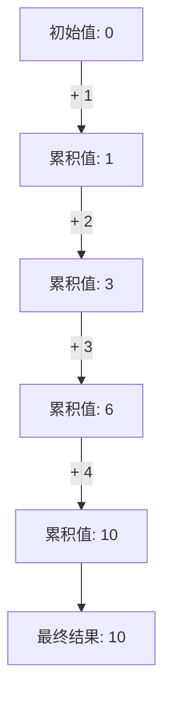

# JavaScript 数组归约

在JavaScript中，数组归约（Array Reduction）是指将数组中的所有元素通过某种计算方式"归约"成单个值的过程。这是处理数组数据的强大技术，让我们能够从一组值中提取出汇总信息、统计数据或转换为其他数据结构。

## 什么是数组归约？

归约操作接收一个数组，并通过迭代的方式将其转换为单个输出值。这个过程中，每次迭代都会考虑当前累积值和下一个数组元素，最终生成最终结果。

JavaScript提供了两个内置的归约方法：

- **`reduce()`**：从左到右归约数组
- **`reduceRight()`**：从右到左归约数组

## reduce() 方法基础

### 语法

```javascript
array.reduce(callback[, initialValue])
```

参数说明：
- **callback**：执行归约操作的函数，接收四个参数：
  - **accumulator**：累积值（上一次回调的返回值）
  - **currentValue**：当前处理的数组元素
  - **currentIndex**：当前元素的索引（可选）
  - **array**：调用reduce的原数组（可选）
- **initialValue**：（可选）作为第一次调用callback的第一个参数

### 工作流程

1. 如果提供了initialValue，则accumulator初始值为initialValue，currentValue为数组第一个元素
2. 如果没有提供initialValue，则accumulator初始值为数组第一个元素，currentValue为数组第二个元素
3. 回调函数执行后的返回值会成为下一次迭代的accumulator值
4. 这个过程一直持续到数组的最后一个元素
5. 最后一次回调的返回值即为reduce()的返回结果

## 基础示例

### 数组求和

```javascript
const numbers = [1, 2, 3, 4, 5];

const sum = numbers.reduce((accumulator, currentValue) => {
  return accumulator + currentValue;
}, 0);

console.log(sum); // 输出: 15
```

在这个例子中：
- 初始值设置为0
- 第一次迭代：accumulator = 0, currentValue = 1, 返回 1
- 第二次迭代：accumulator = 1, currentValue = 2, 返回 3
- 第三次迭代：accumulator = 3, currentValue = 3, 返回 6
- 第四次迭代：accumulator = 6, currentValue = 4, 返回 10
- 第五次迭代：accumulator = 10, currentValue = 5, 返回 15

### 没有初始值的情况

```javascript
const numbers = [1, 2, 3, 4, 5];

const sum = numbers.reduce((accumulator, currentValue) => {
  return accumulator + currentValue;
});

console.log(sum); // 输出: 15
```

在这个例子中：
- 没有设置初始值
- 第一次迭代：accumulator = 1, currentValue = 2, 返回 3
- 第二次迭代：accumulator = 3, currentValue = 3, 返回 6
- 第三次迭代：accumulator = 6, currentValue = 4, 返回 10
- 第四次迭代：accumulator = 10, currentValue = 5, 返回 15

:::caution 注意
当数组为空且没有提供initialValue时，会抛出TypeError错误。因此，建议总是提供初始值以避免潜在错误。
:::

## reduceRight() 方法

`reduceRight()`方法与`reduce()`功能相同，但它从右到左处理数组元素。

```javascript
const numbers = [1, 2, 3, 4, 5];

const rightToLeftConcat = numbers.reduceRight((acc, curr) => acc + curr, '');

console.log(rightToLeftConcat); // 输出: "54321"
```

## 实用案例

### 1. 计算数组中元素出现次数

```javascript
const fruits = ['apple', 'banana', 'apple', 'orange', 'banana', 'apple'];

const fruitCount = fruits.reduce((count, fruit) => {
  count[fruit] = (count[fruit] || 0) + 1;
  return count;
}, {});

console.log(fruitCount); 
// 输出: { apple: 3, banana: 2, orange: 1 }
```

### 2. 数组扁平化（展平嵌套数组）

```javascript
const nestedArray = [[1, 2], [3, 4], [5, 6]];

const flattened = nestedArray.reduce((acc, curr) => {
  return acc.concat(curr);
}, []);

console.log(flattened); // 输出: [1, 2, 3, 4, 5, 6]
```

### 3. 按属性对对象数组分组

```javascript
const people = [
  { name: 'Alice', age: 25 },
  { name: 'Bob', age: 30 },
  { name: 'Charlie', age: 25 },
  { name: 'Dave', age: 30 }
];

const groupedByAge = people.reduce((groups, person) => {
  const age = person.age;
  if (!groups[age]) {
    groups[age] = [];
  }
  groups[age].push(person);
  return groups;
}, {});

console.log(groupedByAge);
/* 输出:
{
  "25": [
    { name: "Alice", age: 25 },
    { name: "Charlie", age: 25 }
  ],
  "30": [
    { name: "Bob", age: 30 },
    { name: "Dave", age: 30 }
  ]
}
*/
```

### 4. 链式操作的替代品

使用reduce代替多个链式数组方法（map、filter等）可以提高性能，因为它只需要遍历数组一次：

```javascript
const numbers = [1, 2, 3, 4, 5, 6, 7, 8, 9, 10];

// 使用链式方法：先过滤偶数，再将它们翻倍
const doubledEvens1 = numbers
  .filter(num => num % 2 === 0)
  .map(num => num * 2);

// 使用reduce的替代方式
const doubledEvens2 = numbers.reduce((acc, num) => {
  if (num % 2 === 0) {
    acc.push(num * 2);
  }
  return acc;
}, []);

console.log(doubledEvens1); // 输出: [4, 8, 12, 16, 20]
console.log(doubledEvens2); // 输出: [4, 8, 12, 16, 20]
```

## 使用归约方法的最佳实践

1. **总是提供初始值**：这样可以避免空数组导致的错误，并让代码意图更明确。

2. **保持回调函数简洁**：如果逻辑复杂，考虑将其分离为命名函数。

3. **选择合适的初始值类型**：初始值的类型应与预期的返回值类型相同。

4. **注意可读性**：有时，即使reduce更高效，但多个单独的数组方法可能更易于理解。

```javascript
// 好的实践 - 简洁且有初始值
const sum = numbers.reduce((sum, num) => sum + num, 0);

// 好的实践 - 复杂逻辑分离成命名函数
function sumReducer(sum, num) {
  return sum + num;
}
const total = numbers.reduce(sumReducer, 0);
```

## 实际应用场景

### 购物车总价计算

```javascript
const cart = [
  { name: '笔记本电脑', price: 5999, quantity: 1 },
  { name: '鼠标', price: 99, quantity: 2 },
  { name: '键盘', price: 299, quantity: 1 }
];

const totalPrice = cart.reduce((total, item) => {
  return total + (item.price * item.quantity);
}, 0);

console.log(`购物车总价: ¥${totalPrice}`); // 输出: 购物车总价: ¥6496
```

### 数据转换：从数组到对象

```javascript
const users = [
  { id: 1, name: '张三' },
  { id: 2, name: '李四' },
  { id: 3, name: '王五' }
];

const userMap = users.reduce((map, user) => {
  map[user.id] = user;
  return map;
}, {});

console.log(userMap);
/* 输出:
{
  "1": { id: 1, name: "张三" },
  "2": { id: 2, name: "李四" },
  "3": { id: 3, name: "王五" }
}
*/

// 现在可以通过ID快速访问用户
console.log(userMap[2]); // 输出: { id: 2, name: "李四" }
```

## 理解归约流程

下面的例子展示了reduce执行过程中每一步的状态：

```javascript
const numbers = [1, 2, 3, 4];

const sum = numbers.reduce((accumulator, currentValue, index) => {
  console.log(`第${index}次迭代:`);
  console.log(`  累积值: ${accumulator}`);
  console.log(`  当前值: ${currentValue}`);
  
  const result = accumulator + currentValue;
  console.log(`  返回值: ${result}`);
  return result;
}, 0);

console.log(`最终结果: ${sum}`);
```

输出：
```
第0次迭代:
  累积值: 0
  当前值: 1
  返回值: 1
第1次迭代:
  累积值: 1
  当前值: 2
  返回值: 3
第2次迭代:
  累积值: 3
  当前值: 3
  返回值: 6
第3次迭代:
  累积值: 6
  当前值: 4
  返回值: 10
最终结果: 10
```

## 归约步骤可视化



## 总结

数组归约是JavaScript中处理数组的强大工具，可以用来：

- 将数组元素合并为单个值（如求和、求积）
- 转换数据结构（如数组到对象）
- 分组和统计数据
- 替代多个链式数组方法以提高性能

`reduce()`和`reduceRight()`方法允许我们以一种声明式且高效的方式处理复杂的数据转换。掌握这些方法可以大大提高你处理数组数据的能力和代码的简洁性。

## 练习题

1. 使用`reduce()`计算数组中所有数字的乘积。
2. 使用`reduce()`找出数组中的最大值。
3. 使用`reduce()`将数组中的所有字符串连接起来，并用逗号分隔。
4. 使用`reduce()`实现一个`map()`方法的功能。

:::tip 扩展阅读
如果你想进一步了解数组归约，可以查看：
- MDN关于[Array.prototype.reduce()](https://developer.mozilla.org/zh-CN/docs/Web/JavaScript/Reference/Global_Objects/Array/reduce)的文档
- [JavaScript函数式编程](https://developer.mozilla.org/zh-CN/docs/Web/JavaScript/Guide/Functional_programming)
:::