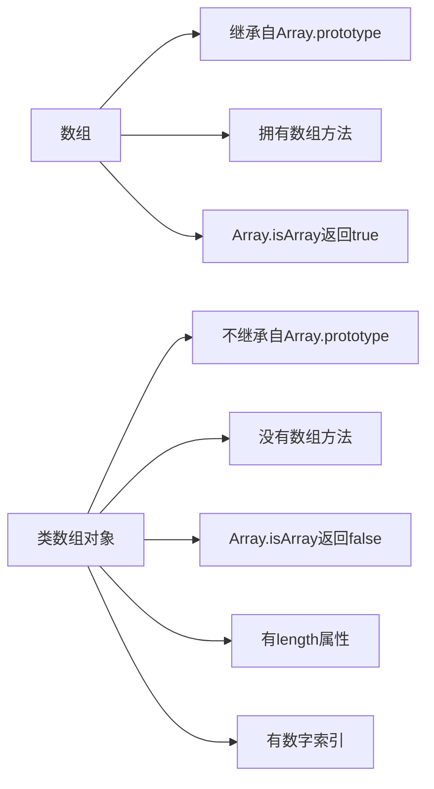

# JavaScript 类数组对象

在JavaScript中，你可能已经熟悉了数组这一数据结构。然而，有时候你会遇到一些对象，它们看起来像数组，有类似数组的索引和length属性，但却不是真正的数组。这些对象被称为"类数组对象"（Array-like Objects）。

## 什么是类数组对象？

类数组对象是指那些具有以下特征的对象：

1. 拥有length属性
2. 拥有以数字为索引的属性（如0, 1, 2...）
3. 不具备数组原型上的方法（如push, pop, forEach等）

简单来说，类数组对象长得像数组，但不是真正的数组实例，所以不能直接使用Array.prototype上的方法。

:::note
最常见的类数组对象包括函数的arguments对象、DOM方法返回的NodeList对象（如document.querySelectorAll()的结果）以及字符串。
:::

## 常见的类数组对象

### 1. arguments对象

在函数内部，`arguments`对象包含了传递给函数的所有参数。

```javascript
function showArgs() {
  console.log(arguments);
  console.log(Array.isArray(arguments)); // false
  console.log(arguments.length); // 3
  console.log(arguments[0]); // "Hello"
}

showArgs("Hello", "World", "!");
```

输出：
```
{ '0': 'Hello', '1': 'World', '2': '!', length: 3 }
false
3
Hello
```

### 2. DOM元素集合

当使用DOM API获取元素时，常常会返回类数组对象：

```javascript
// 假设HTML中有多个段落元素
const paragraphs = document.querySelectorAll('p');
console.log(Array.isArray(paragraphs)); // false
console.log(paragraphs.length); // 返回段落数量
console.log(paragraphs[0]); // 返回第一个段落元素
```

### 3. 字符串

字符串也是类数组对象，它们有length属性和可索引的字符：

```javascript
const str = "Hello";
console.log(str.length); // 5
console.log(str[0]); // "H"
console.log(Array.isArray(str)); // false
```

## 类数组对象的局限性

类数组对象不能直接使用数组的方法：

```javascript
function example() {
  // 下面这行会报错
  arguments.forEach(arg => console.log(arg)); // TypeError: arguments.forEach is not a function
}
```

## 将类数组对象转换为数组

有几种方法可以将类数组对象转换为真正的数组，从而使用数组方法：

### 1. Array.from()

ES6引入的`Array.from()`方法可以从类数组对象创建一个新数组：

```javascript
function convertWithArrayFrom() {
  const args = Array.from(arguments);
  console.log(Array.isArray(args)); // true
  args.forEach(arg => console.log(arg));
}

convertWithArrayFrom("Hello", "World");
```

输出：
```
true
Hello
World
```

### 2. 展开运算符（...）

ES6的展开运算符也可以将大部分类数组对象转换为数组：

```javascript
function convertWithSpread() {
  const args = [...arguments];
  console.log(Array.isArray(args)); // true
  args.map(arg => arg.toUpperCase()).forEach(arg => console.log(arg));
}

convertWithSpread("Hello", "World");
```

输出：
```
true
HELLO
WORLD
```

### 3. Array.prototype.slice.call()

在ES6之前，常用的方法是借用数组的slice方法：

```javascript
function convertWithSlice() {
  const args = Array.prototype.slice.call(arguments);
  console.log(Array.isArray(args)); // true
  console.log(args.join(' - ')); // "Hello - World"
}

convertWithSlice("Hello", "World");
```

输出：
```
true
Hello - World
```

## 实际应用场景

### 场景1：处理不定数量的函数参数

```javascript
function sum() {
  // 将arguments转换为数组后使用reduce方法
  return Array.from(arguments).reduce((acc, val) => acc + val, 0);
}

console.log(sum(1, 2, 3, 4, 5)); // 15
console.log(sum(10, 20, 30)); // 60
```

### 场景2：批量操作DOM元素

```javascript
// 假设有多个需要隐藏的段落
const paragraphs = document.querySelectorAll('p');

// 转换为数组后使用数组方法
Array.from(paragraphs).forEach(p => {
  p.style.display = 'none';
});

// 或者使用展开运算符
[...paragraphs].filter(p => p.classList.contains('highlight'))
  .forEach(p => p.style.color = 'red');
```

### 场景3：创建工具函数处理类数组对象

```javascript
function processElements(elements, processor) {
  const elemArray = Array.from(elements);
  return elemArray.map(processor);
}

// 在DOM操作中使用
const divs = document.querySelectorAll('div');
const divContents = processElements(divs, div => div.textContent);
```

## 类数组对象和真实数组的区别



## 注意事项和最佳实践

:::caution
不是所有的类数组对象都可以使用展开运算符转换。例如，某些旧版本浏览器中的NodeList不支持迭代器协议。
:::

- 尽量使用`Array.from()`进行转换，它具有最好的兼容性
- 如果需要在转换的同时执行映射操作，可以使用`Array.from()`的第二个参数：

```javascript
const elemTexts = Array.from(document.querySelectorAll('p'), p => p.textContent);
```

- 在ES6环境中，尽量使用箭头函数和展开运算符，使代码更简洁
- 对于性能敏感的场景，预先将类数组对象转换为数组可能更高效

## 总结

JavaScript类数组对象是一类特殊的对象，它们具有数组的一些表面特征（如length属性和数字索引），但不具备数组的方法。常见的类数组对象包括函数的arguments对象、DOM查询结果和字符串。

通过`Array.from()`、展开运算符或`Array.prototype.slice.call()`等方法，我们可以将类数组对象转换为真正的数组，从而使用数组的各种便捷方法。

在实际开发中，理解和正确处理类数组对象可以让你的代码更加灵活和强大。

## 练习

1. 创建一个函数，接收任意数量的字符串参数，并返回所有字符串连接后的大写形式
2. 编写代码选择页面上所有带有特定类名的元素，并将它们的文本内容收集到一个数组中
3. 实现一个函数，将任意类数组对象转换为数组，并过滤掉其中的假值(falsy values)

## 进一步学习资源

- MDN文档：[Array.from()](https://developer.mozilla.org/zh-CN/docs/Web/JavaScript/Reference/Global_Objects/Array/from)
- MDN文档：[arguments对象](https://developer.mozilla.org/zh-CN/docs/Web/JavaScript/Reference/Functions/arguments)
- ES6规范中关于迭代器和可迭代对象的内容

通过掌握类数组对象，你将能更好地理解JavaScript中的数据类型和对象特性，为更高级的JavaScript编程打下坚实基础。