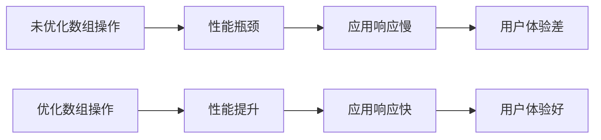

# JavaScript 数组性能优化

在JavaScript应用程序中，数组操作是最常见的编程任务之一。当你的应用需要处理大量数据时，数组操作的性能会直接影响整个程序的响应速度和用户体验。本文将介绍一系列优化JavaScript数组操作的技巧，帮助你编写高效的代码。

## 为什么需要关注数组性能？

在处理大型数据集或者频繁操作数组时，性能问题会变得尤为突出。一个微小的性能优化可能会在大规模操作中节省大量时间。



## 数组创建和初始化优化

### 指定数组长度

当你知道数组的大致长度时，预先指定数组长度可以避免多次重新分配内存。

```javascript
// 低效方式
const arr1 = [];
for (let i = 0; i < 10000; i++) {
  arr1.push(i);
}

// 优化方式
const arr2 = new Array(10000);
for (let i = 0; i < 10000; i++) {
  arr2[i] = i;
}
```

### 使用数组字面量

使用数组字面量比调用`Array`构造函数更高效。

```javascript
// 低效方式
const arr1 = new Array('a', 'b', 'c');

// 优化方式
const arr2 = ['a', 'b', 'c'];
```

## 数组访问和遍历优化

### 缓存数组长度

在循环中反复获取数组长度会导致额外的性能开销，特别是在处理大型数组时。

```javascript
// 低效方式
const arr = [1, 2, 3, 4, 5, /* ...可能有成千上万个元素 */];
for (let i = 0; i < arr.length; i++) {
  // 每次迭代都会重新计算arr.length
  console.log(arr[i]);
}

// 优化方式
const arr = [1, 2, 3, 4, 5, /* ...可能有成千上万个元素 */];
const len = arr.length;
for (let i = 0; i < len; i++) {
  // 长度只计算一次
  console.log(arr[i]);
}
```

### 选择合适的循环方式

JavaScript提供了多种遍历数组的方法，不同情况下性能表现各异。

```javascript
const arr = [1, 2, 3, 4, 5, /* ...大量元素 */];

// 1. 基本for循环 - 通常性能最好
for (let i = 0; i < arr.length; i++) {
  // 操作arr[i]
}

// 2. for...of循环 - 简洁但比基本for循环慢一点
for (const item of arr) {
  // 操作item
}

// 3. forEach方法 - 函数调用开销较大
arr.forEach(item => {
  // 操作item
});

// 4. map/filter等 - 创建新数组，适用于需要转换数据的场景
const newArr = arr.map(item => item * 2);
```

:::tip
当性能至关重要时，传统的`for`循环通常是最快的选择，尤其是对大型数组。但在大多数情况下，选择可读性更好的方法（如`forEach`、`map`）是更明智的，除非你已经通过性能测试确认它们是瓶颈。
:::

## 数组修改操作的优化

### 减少数组大小调整

每次调整数组大小（添加或删除元素）都可能导致内存重新分配，这是很耗费性能的。

```javascript
// 低效方式：频繁改变数组大小
const arr = [];
for (let i = 0; i < 10000; i++) {
  arr.push(i); // 每次push都可能导致数组大小调整
}

// 优化方式：一次性分配足够空间
const arr = new Array(10000);
for (let i = 0; i < 10000; i++) {
  arr[i] = i;
}
```

### 优化splice操作

`splice()`方法可以添加/删除数组中的元素，但它需要移动数组中的元素，在大型数组上可能非常慢。

```javascript
const arr = [1, 2, 3, 4, 5, /* ...大量元素 */];

// 低效方式：频繁使用splice
for (let i = 0; i < arr.length; i++) {
  if (someCondition(arr[i])) {
    arr.splice(i, 1); // 每次splice都会移动后面的所有元素
    i--; // 需要调整索引
  }
}

// 优化方式1：从后向前遍历
for (let i = arr.length - 1; i >= 0; i--) {
  if (someCondition(arr[i])) {
    arr.splice(i, 1); // 仍然使用splice，但从后向前可以减少元素移动
  }
}

// 优化方式2：创建新数组（适用于过滤场景）
const newArr = arr.filter(item => !someCondition(item));
```

## 避免数组空位

JavaScript数组可以有"空位"（holes），但它们会导致一些意外的行为和性能问题。

```javascript
// 创建有空位的数组
const sparseArray = [1, , 3];
console.log(sparseArray.length); // 输出: 3
console.log(sparseArray); // 输出: [1, empty, 3]

// 空位与undefined不同
console.log(sparseArray[1]); // 输出: undefined
console.log(1 in sparseArray); // 输出: true
console.log(2 in sparseArray); // 输出: true
console.log(3 in sparseArray); // 输出: false

// 方法处理空位的方式不一致
sparseArray.forEach(item => console.log(item)); // 跳过空位，只输出1和3
console.log(sparseArray.map(x => x * 2)); // [2, empty, 6]
```

最好避免创建有空位的数组，如果需要表示"无值"，请使用`undefined`或`null`。

## 使用类型化数组（TypedArrays）

当处理大量数值数据时，类型化数组比普通数组更高效。

```javascript
// 普通数组
const regularArray = new Array(10000).fill(0);

// 类型化数组 - 适合处理大量数值数据
const typedArray = new Int32Array(10000); // 创建包含10000个32位整数的数组
```

类型化数组的优点：
- 内存占用更小（因为元素类型固定）
- 处理速度更快（因为JavaScript引擎可以做更多优化）
- 与WebGL等API更好地集成

:::caution
类型化数组只能存储特定类型的数据（如整数、浮点数），不能像普通数组那样存储混合类型的数据。
:::

## 减少创建中间数组

链式调用`map()`、`filter()`等方法会创建多个中间数组，这在处理大数据时会消耗大量内存。

```javascript
// 低效方式：创建多个中间数组
const result = data
  .filter(item => item.active)
  .map(item => item.value)
  .reduce((sum, value) => sum + value, 0);

// 优化方式：使用一个循环完成，不创建中间数组
let sum = 0;
for (const item of data) {
  if (item.active) {
    sum += item.value;
  }
}
```

## 实际案例：优化数据处理

假设我们需要从一个大型用户数组中筛选出成年用户，并计算他们的平均年龄：

```javascript
// 原始数据
const users = [
  { id: 1, name: "Alice", age: 25 },
  { id: 2, name: "Bob", age: 17 },
  // ... 假设这里有成千上万的用户
  { id: 10000, name: "Zack", age: 30 }
];

// 低效方式
function getAverageAgeOfAdults_Inefficient(users) {
  const adults = users.filter(user => user.age >= 18);
  const ages = adults.map(adult => adult.age);
  const sum = ages.reduce((total, age) => total + age, 0);
  return sum / ages.length;
}

// 优化方式
function getAverageAgeOfAdults_Efficient(users) {
  let sum = 0;
  let count = 0;
  
  // 一次遍历完成所有操作，不创建中间数组
  for (let i = 0, len = users.length; i < len; i++) {
    const user = users[i];
    if (user.age >= 18) {
      sum += user.age;
      count++;
    }
  }
  
  return count > 0 ? sum / count : 0;
}

// 性能比较
console.time('Inefficient');
const avg1 = getAverageAgeOfAdults_Inefficient(users);
console.timeEnd('Inefficient');

console.time('Efficient');
const avg2 = getAverageAgeOfAdults_Efficient(users);
console.timeEnd('Efficient');

console.log(`Average age (inefficient): ${avg1}`);
console.log(`Average age (efficient): ${avg2}`);
```

在大型数组上，优化版本的性能会明显优于链式方法调用的版本。

## 总结

优化JavaScript数组操作是提高应用性能的重要一环。关键点包括：

1. 预分配数组大小，避免频繁改变数组大小
2. 选择合适的遍历方法，并缓存数组长度
3. 谨慎使用会创建新数组的方法（map、filter等）
4. 考虑使用类型化数组处理大量数值数据
5. 尽量减少中间数组的创建
6. 从后向前遍历可以优化某些删除操作

记住：过早优化是万恶之源。在确认性能问题之前，应该先编写清晰可读的代码。只有当性能确实成为问题时，才应该应用这些优化技巧。

:::tip
使用浏览器的性能分析工具（如Chrome DevTools的Performance面板）可以帮助你确定代码中的性能瓶颈。
:::

## 练习

1. 编写一个函数，找出一个大型数组中的所有质数，比较使用`filter`和直接遍历的性能差异。

2. 优化以下代码，使其在处理大型数组时更高效：
   ```javascript
   function processData(data) {
     return data
       .filter(item => item.value > 10)
       .map(item => item.value * 2)
       .filter(value => value % 3 === 0)
       .reduce((sum, value) => sum + value, 0);
   }
   ```

3. 创建一个函数，比较普通数组和类型化数组在存储和处理10000个随机数时的性能差异。

## 额外资源

1. [MDN Web Docs: Array](https://developer.mozilla.org/en-US/docs/Web/JavaScript/Reference/Global_Objects/Array)
2. [MDN Web Docs: TypedArray](https://developer.mozilla.org/en-US/docs/Web/JavaScript/Reference/Global_Objects/TypedArray)
3. [V8 Blog: Fast Properties in V8](https://v8.dev/blog/fast-properties)
4. [High Performance JavaScript by Nicholas Zakas](http://shop.oreilly.com/product/9780596802806.do)

通过使用本文介绍的技巧，你可以显著提高JavaScript应用中的数组操作性能，为用户提供更流畅的体验。