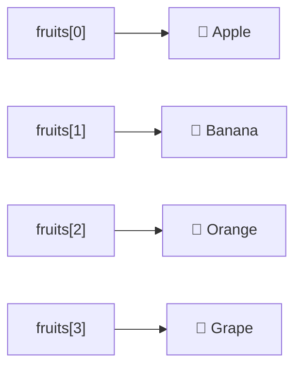

# JavaScript 数组索引

在JavaScript中，数组是一种特殊的对象，用于存储多个值。而数组索引是我们访问这些值的关键。本文将详细介绍JavaScript数组索引的概念和使用方法，帮助你更好地理解和操作数组。

## 什么是数组索引？

数组索引是用来标识数组中元素位置的数字。在JavaScript中，数组索引**从0开始**，这意味着：
- 第一个元素的索引是0
- 第二个元素的索引是1
- 第三个元素的索引是2
- 以此类推...



## 访问数组元素

通过方括号 `[]` 和索引，我们可以访问数组中的特定元素：

```javascript
const fruits = ["Apple", "Banana", "Orange", "Grape"];

console.log(fruits[0]); // 输出: Apple
console.log(fruits[1]); // 输出: Banana
console.log(fruits[2]); // 输出: Orange
console.log(fruits[3]); // 输出: Grape
```

:::note
请记住：JavaScript数组索引总是从0开始，而不是从1开始！
:::

## 修改数组元素

我们可以使用索引来修改数组中的元素：

```javascript
const colors = ["Red", "Green", "Blue"];
console.log(colors); // 输出: ["Red", "Green", "Blue"]

// 修改第二个元素
colors[1] = "Yellow";
console.log(colors); // 输出: ["Red", "Yellow", "Blue"]
```

## 添加新元素

你可以使用索引向数组添加新元素。如果索引超出当前数组长度，JavaScript会自动扩展数组：

```javascript
const numbers = [1, 2, 3];
console.log(numbers); // 输出: [1, 2, 3]

// 添加新元素
numbers[3] = 4;
console.log(numbers); // 输出: [1, 2, 3, 4]

// 跳过索引添加元素
numbers[5] = 6;
console.log(numbers); // 输出: [1, 2, 3, 4, empty, 6]
```

:::caution
当你跳过索引添加元素时，中间的位置会被填充为`empty`(空槽)，这可能会导致意外的行为！
:::

## 数组长度与索引的关系

数组的`length`属性返回数组中元素的数量。了解索引与长度的关系很重要：

```javascript
const fruits = ["Apple", "Banana", "Orange"];
console.log(fruits.length); // 输出: 3

// 最后一个元素的索引始终是 length - 1
const lastIndex = fruits.length - 1;
console.log(fruits[lastIndex]); // 输出: Orange
```

## 使用循环遍历数组索引

我们可以使用循环来遍历数组的所有元素：

```javascript
const pets = ["Dog", "Cat", "Rabbit", "Hamster"];

// 使用for循环遍历
for (let i = 0; i < pets.length; i++) {
    console.log(`Pet at index ${i}: ${pets[i]}`);
}

// 输出:
// Pet at index 0: Dog
// Pet at index 1: Cat
// Pet at index 2: Rabbit
// Pet at index 3: Hamster
```

## 负数索引

与一些其他编程语言不同，JavaScript不支持负数索引。如果你使用负数作为索引，不会从数组末尾开始计数，而是返回`undefined`：

```javascript
const fruits = ["Apple", "Banana", "Orange"];
console.log(fruits[-1]); // 输出: undefined
```

:::tip
如果你需要从数组末尾访问元素，可以使用`array.length - n`的形式，其中n是从末尾开始计数的位置。
:::

## 检查索引是否存在

有时我们需要检查特定索引的元素是否存在。有几种方法可以做到这一点：

```javascript
const scores = [85, 90, undefined, 75];

// 方法1: 直接比较
console.log(scores[2] === undefined); // 输出: true

// 方法2: 使用 in 运算符检查索引
console.log(2 in scores); // 输出: true
console.log(5 in scores); // 输出: false

// 注意: undefined值和不存在的索引是不同的
console.log(scores[2]); // 输出: undefined (元素值为undefined)
console.log(scores[5]); // 输出: undefined (索引不存在)
```

## 实际应用案例

### 案例1: 计算学生成绩平均分

```javascript
function calculateAverage(scores) {
    let sum = 0;
    for (let i = 0; i < scores.length; i++) {
        sum += scores[i];
    }
    return sum / scores.length;
}

const studentScores = [78, 82, 91, 85, 76];
const average = calculateAverage(studentScores);
console.log(`平均成绩: ${average}`); // 输出: 平均成绩: 82.4
```

### 案例2: 查找数组中的最大值

```javascript
function findMax(numbers) {
    if (numbers.length === 0) return null;
    
    let max = numbers[0];
    for (let i = 1; i < numbers.length; i++) {
        if (numbers[i] > max) {
            max = numbers[i];
        }
    }
    return max;
}

const temperatures = [23, 28, 25, 32, 27, 30];
console.log(`最高温度: ${findMax(temperatures)}°C`); // 输出: 最高温度: 32°C
```

### 案例3: 查找特定元素的索引

```javascript
function findIndexOf(array, element) {
    for (let i = 0; i < array.length; i++) {
        if (array[i] === element) {
            return i;
        }
    }
    return -1; // 如果未找到，返回-1
}

const fruits = ["Apple", "Banana", "Orange", "Grape"];
console.log(`Banana的索引: ${findIndexOf(fruits, "Banana")}`); // 输出: Banana的索引: 1
console.log(`Mango的索引: ${findIndexOf(fruits, "Mango")}`);   // 输出: Mango的索引: -1
```

## 总结

JavaScript数组索引是操作数组不可或缺的基础知识：

1. 索引从0开始，最后一个元素的索引是`length - 1`
2. 使用方括号`[]`和索引来访问和修改数组元素
3. 可以通过索引直接添加新元素，甚至扩展数组
4. JavaScript不支持负数索引
5. 通过循环和索引可以遍历整个数组

掌握数组索引的使用对于有效操作JavaScript数组至关重要，它是进一步学习更复杂数组方法和操作的基础。

## 练习题

为了巩固所学知识，尝试完成以下练习：

1. 创建一个包含5个数字的数组，然后使用索引交换第一个和最后一个元素的位置。
2. 编写一个函数，接收一个数组和一个索引，返回该索引之前所有元素的和。
3. 创建一个函数，反转一个数组中的元素顺序（不使用内置的`reverse`方法）。
4. 编写代码检测一个数组是否是回文（正序和倒序读取内容相同）。

:::tip 进阶学习
学完数组索引后，建议继续学习JavaScript的数组方法，如`push()`、`pop()`、`shift()`、`unshift()`等，它们可以帮助你更有效地操作数组。
:::